# Awesome Omni Architectures 

<!-- Generated by scripts/catalog.py from data/models.json and data/figures.json. Edit the JSON, then regenerate. -->

A visual catalog of omni and speech language models. Every model below has a diagram, primary sources and a short architecture summary.

**356 models + 12 related entries · Reviewed 2026-09-12**

[Model list](#models) · [All diagrams](#model-figures) · [Collections](#architectures) · [Timeline](docs/timeline.md) · [Methodology](docs/methodology.md) · [Contribute](CONTRIBUTING.md)

## Architectures

| Collection | Models |
| --- | ---: |
| [Omni and audio-visual language models](models/omni.md) | 131 |
| [Spoken dialogue models](models/speech-dialogue.md) | 54 |
| [Speech and audio language-model foundations](models/speech-foundations.md) | 35 |
| [Audio and speech understanding](models/audio-understanding.md) | 44 |
| [LLM-based speech recognition and translation](models/llm-asr.md) | 28 |
| [Speech generation and language-model-based TTS](models/speech-generation.md) | 64 |
| [Related omni models and speech systems](models/related.md) | 12 |

Figures are credited to their sources. Editorial input/output diagrams are labeled. [Credits](assets/architectures/CREDITS.md).

## Models

T: text · I: image · V: video · A: audio · S: speech · M: music · X: other. [Scope and labels](docs/methodology.md#modalities-and-interaction).

Alphabetical model list · 368 entries

| Model | Group | Input → output |
| --- | --- | --- |
| [AGAV-Rater](#agav-rater) | Omni | T, V, A → T, X |
| [Amazon Nova 2 Omni](#amazon-nova-2-omni) | Omni | T, I, V, S → T, I |
| [Amazon Nova 2 Sonic](#amazon-nova-2-sonic) | Dialogue | T, S → T, S |
| [Amazon Nova Sonic](#amazon-nova-sonic) | Dialogue | T, S → T, S |
| [AnyGPT](#anygpt) | Omni | T, I, S, M → T, I, S, M |
| [AnyMAL](#anymal) | Omni | T, I, V, A, X → T |
| [ARC-Hunyuan-Video](#arc-hunyuan-video) | Omni | T, V, A → T |
| [Audio Flamingo](#audio-flamingo) | Understanding | T, A → T |
| [Audio Flamingo 2](#audio-flamingo-2) | Understanding | T, A → T |
| [Audio Flamingo 3](#audio-flamingo-3) | Dialogue | T, A → T, S |
| [Audio Flamingo Next](#audio-flamingo-next) | Understanding | T, A → T |
| [Audio-Cogito](#audio-cogito) | Understanding | T, A → T |
| [Audio-DeepThinker](#audio-deepthinker) | Understanding | T, A → T |
| [Audio-Reasoner](#audio-reasoner) | Understanding | T, A → T |
| [Audio-Visual LLM](#audio-visual-llm) | Omni | T, V, A → T |
| [AudioChatLlama](#audiochatllama) | Understanding | T, S → T |
| [AudioLM](#audiolm) | Foundations | A → A |
| [AudioPaLM](#audiopalm) | Foundations | T, S → T, S |
| [AURORA](#aurora) | Omni | T, V, A → T, X |
| [AV-Reasoner](#av-reasoner) | Omni | T, V, A → T |
| [AVicuna](#avicuna) | Omni | T, V, A → T |
| [Baichuan-Audio](#baichuan-audio) | Dialogue | T, A → T, S |
| [Baichuan-Omni](#baichuan-omni) | Omni | T, I, V, A → T |
| [Baichuan-Omni-1.5](#baichuan-omni-1-5) | Omni | T, I, V, A → T, S |
| [Bark](#bark) | Generation | T → A |
| [BASE TTS](#base-tts) | Generation | T, S → S |
| [BLSP](#blsp) | Understanding | T, S → T |
| [BLSP-Emo](#blsp-emo) | Understanding | T, S → T |
| [BuboGPT](#bubogpt) | Omni | T, I, A → T, X |
| [CALM](#calm) | Foundations | A → A |
| [Canary-Qwen](#canary-qwen) | ASR | T, S → T |
| [Capybara-OMNI](#capybara-omni) | Omni | T, I, V, A → T |
| [CAT](#cat) | Omni | T, V, A → T |
| [ChatBridge](#chatbridge) | Omni | T, I, V, A → T |
| [Chatterbox](#chatterbox) | Generation | T, S → S |
| [ChatTTS](#chattts) | Generation | T → S |
| [ChronusOmni](#chronusomni) | Omni | T, V, A → T |
| [CLaM-TTS](#clam-tts) | Generation | T, S → S |
| [CoDi](#codi) | Related | T, I, V, A → T, I, V, A |
| [CoDi-2](#codi-2) | Omni | T, I, A → T, I, A |
| [CosyVoice](#cosyvoice) | Generation | T, S → S |
| [CosyVoice 2](#cosyvoice-2) | Generation | T, S → S |
| [CosyVoice 3](#cosyvoice-3) | Generation | T, S → S |
| [Covo-Audio](#covo-audio) | Dialogue | T, A → T, S |
| [Crab](#crab) | Omni | T, V, A → T, X |
| [CREMA](#crema) | Omni | T, V, A, X → T |
| [CSM](#csm) | Generation | T, S → S |
| [DeepSound-V1](#deepsound-v1) | Omni | T, V → T, A |
| [DeSTA](#desta) | Understanding | T, S → T |
| [DeSTA2](#desta2) | Understanding | T, S → T |
| [DeSTA2.5-Audio](#desta2-5-audio) | Understanding | T, A → T |
| [dGSLM](#dgslm) | Foundations | S → S |
| [Dia](#dia) | Generation | T, S → S |
| [Dia2](#dia2) | Generation | T, S → S |
| [DIFFA](#diffa) | Understanding | T, S → T |
| [DIFFA-2](#diffa-2) | Understanding | T, A → T |
| [Doubao Realtime Voice](#doubao-realtime-voice) | Dialogue | T, S → T, S |
| [Duplex Model](#duplex-model) | Related | T, S → T, S |
| [DuplexMamba](#duplexmamba) | Understanding | T, S → T |
| [DuplexOmni](#duplexomni) | Omni | T, V, A → T, S |
| [DuplexSLA](#duplexsla) | Dialogue | T, S → T, S, X |
| [EchoInk-R1](#echoink-r1) | Omni | T, I, A → T |
| [EgoGPT](#egogpt) | Omni | T, V, A → T |
| [ELLA-V](#ella-v) | Generation | T, S → S |
| [ELLSA](#ellsa) | Omni | T, V, S, X → T, S, X |
| [Emotion-LLaMA](#emotion-llama) | Omni | T, I, V, A → T |
| [EMOVA](#emova) | Omni | T, I, S → T, S |
| [Empatheia](#empatheia) | Omni | T, V, S → T, V, S |
| [EmpathyEar](#empathyear) | Omni | T, I, S → T, V, S |
| [eP-ALM](#ep-alm) | Omni | T, I, V, A → T |
| [F-Actor](#f-actor) | Dialogue | T, S → S |
| [FAVOR](#favor) | Omni | T, I, V, A → T |
| [FireRedASR-LLM](#fireredasr-llm) | ASR | T, S → T |
| [FireRedASR2-LLM](#fireredasr2-llm) | ASR | T, S → T |
| [FireRedChat](#fireredchat) | Related | T, S → T, S |
| [FireRedTTS](#fireredtts) | Generation | T, S → S |
| [FireRedTTS-2](#fireredtts-2) | Generation | T, S → S |
| [Fish Audio S1 / OpenAudio S1](#openaudio-s1) | Generation | T, S → S |
| [Fish Audio S2](#fish-audio-s2) | Generation | T, S → S |
| [Fish Speech](#fish-speech) | Generation | T, S → S |
| [Flow-Omni](#flow-omni) | Dialogue | T, S → T, S |
| [Flow-SLM](#flow-slm) | Foundations | S → S |
| [Freeze-Omni](#freeze-omni) | Dialogue | T, S → T, S |
| [Fun-ASR](#fun-asr) | ASR | T, S → T |
| [Fun-Audio-Chat](#fun-audio-chat) | Dialogue | T, A → T, S |
| [GAMA](#gama) | Understanding | T, A → T |
| [Gemini 1.0](#gemini-1-0) | Omni | T, I, V, A → T |
| [Gemini 1.5](#gemini-1-5) | Omni | T, I, V, A → T |
| [Gemini 2.0](#gemini-2-0) | Omni | T, I, V, A → T |
| [Gemini 2.5](#gemini-2-5) | Omni | T, I, V, A → T |
| [Gemini 2.5 Flash Live](#gemini-2-5-flash-live) | Omni | T, I, V, A → S |
| [Gemini 2.5 TTS](#gemini-2-5-tts) | Generation | T → S |
| [Gemini 3](#gemini-3) | Omni | T, I, V, A → T |
| [Gemini 3.1](#gemini-3-1) | Omni | T, I, V, A → T |
| [Gemini 3.1 Flash Live](#gemini-3-1-flash-live) | Omni | T, I, V, A → T, S |
| [Gemini 3.1 Flash TTS](#gemini-3-1-flash-tts) | Generation | T → S |
| [Gemini 3.5](#gemini-3-5) | Omni | T, I, V, A → T |
| [Gemini 3.5 Live Translate](#gemini-3-5-live-translate) | Foundations | S → T, S |
| [Gemini 3.5 Transcribe](#gemini-3-5-transcribe) | ASR | S → T |
| [Gemini 3.6 Flash](#gemini-3-6-flash) | Omni | T, I, V, A → T |
| [Gemini 3.7 Flash](#gemini-3-7-flash) | Omni | T, I, V, A → T |
| [Gemini 3.8 Flash](#gemini-3-8-flash) | Omni | T, I, V, A → T |
| [Gemini Omni Flash](#gemini-omni-flash) | Related | T, I, V → V, A |
| [Gemma 3n](#gemma-3n) | Omni | T, I, V, A → T |
| [Gemma 4 (audio-capable variants)](#gemma-4-audio-capable-variants) | Omni | T, I, V, A → T |
| [GLM-4-Voice](#glm-4-voice) | Dialogue | T, S → T, S |
| [GLM-ASR-Nano](#glm-asr-nano) | ASR | S → T |
| [GLM-TTS](#glm-tts) | Generation | T, S → S |
| [GPST](#gpst) | Foundations | S → S |
| [GPT-4o (reported model)](#gpt-4o-reported-model) | Omni | T, I, V, A → T, I, S |
| [GPT-4o Audio](#gpt-4o-audio) | Dialogue | T, A → T, S |
| [GPT-4o Mini Audio](#gpt-4o-mini-audio) | Dialogue | T, A → T, S |
| [GPT-4o Mini Realtime](#gpt-4o-mini-realtime) | Dialogue | T, A → T, S |
| [GPT-4o Mini Transcribe](#gpt-4o-mini-transcribe) | ASR | T, A → T |
| [GPT-4o Mini TTS](#gpt-4o-mini-tts) | Generation | T → S |
| [GPT-4o Realtime](#gpt-4o-realtime) | Dialogue | T, A → T, S |
| [GPT-4o Transcribe](#gpt-4o-transcribe) | ASR | T, A → T |
| [GPT-4o Transcribe Diarize](#gpt-4o-transcribe-diarize) | ASR | T, A → T |
| [GPT-Audio](#gpt-audio) | Dialogue | T, A → T, S |
| [GPT-Audio Mini](#gpt-audio-mini) | Dialogue | T, A → T, S |
| [GPT-Audio-1.5](#gpt-audio-1-5) | Dialogue | T, A → T, S |
| [GPT-Live-1](#gpt-live-1) | Dialogue | T, A → T, S |
| [GPT-Live-Transcribe](#gpt-live-transcribe) | ASR | T, A → T |
| [GPT-Realtime](#gpt-realtime) | Omni | T, I, A → T, S |
| [GPT-Realtime Mini](#gpt-realtime-mini) | Omni | T, I, A → T, S |
| [GPT-Realtime-1.5](#gpt-realtime-1-5) | Omni | T, I, A → T, S |
| [GPT-Realtime-2](#gpt-realtime-2) | Omni | T, I, A → T, S |
| [GPT-Realtime-2.1](#gpt-realtime-2-1) | Omni | T, I, A → T, S |
| [GPT-Realtime-2.1 Mini](#gpt-realtime-2-1-mini) | Omni | T, I, A → T, S |
| [GPT-Realtime-Translate](#gpt-realtime-translate) | Foundations | S → T, S |
| [GPT-SoVITS](#gpt-sovits) | Generation | T, S → S |
| [GPT-Transcribe](#gpt-transcribe) | ASR | T, A → T |
| [Granite Speech 3.3](#granite-speech-3-3) | ASR | T, S → T |
| [Granite Speech 4.0](#granite-speech-4-0) | ASR | T, S → T |
| [Granite Speech 4.1](#granite-speech-4-1) | ASR | T, S → T |
| [Grok Voice Think Fast](#grok-voice-think-fast) | Dialogue | T, S → T, S |
| [GroundingGPT](#groundinggpt) | Omni | T, I, V, A → T, X |
| [GSLM](#gslm) | Foundations | S → S |
| [Hibiki](#hibiki) | Foundations | S → T, S |
| [Higgs Audio v2](#higgs-audio-v2) | Generation | T, S → S |
| [Higgs Audio v2.5](#higgs-audio-v2-5) | Generation | T, S → S |
| [Higgs Audio v3 TTS](#higgs-audio-v3-tts) | Generation | T, S → S |
| [HumanOmni](#humanomni) | Omni | T, V, A → T |
| [HumanOmniV2](#humanomniv2) | Omni | T, V, A → T |
| [Hume EVI 2](#hume-evi-2) | Dialogue | T, S → T, S |
| [Hume EVI 3](#hume-evi-3) | Dialogue | T, S → T, S |
| [Hume EVI 4-mini](#hume-evi-4-mini) | Related | T, S → T, S |
| [Hume OCTAVE (research model)](#hume-octave-research-model) | Dialogue | T, S → T, S |
| [Hume Octave TTS](#hume-octave-tts) | Generation | T, S → S |
| [ImageBind-LLM](#imagebind-llm) | Omni | T, I, V, A, X → T |
| [IndexTTS](#indextts) | Generation | T, S → S |
| [IndexTTS 2.5](#indextts-2-5) | Generation | T, S → S |
| [IndexTTS2](#indextts2) | Generation | T, S → S |
| [InteractiveOmni](#interactiveomni) | Omni | T, I, V, A → T, S |
| [InternOmni](#internomni) | Omni | T, I, V, A → T |
| [IntrinsicVoice](#intrinsicvoice) | Dialogue | T, S → S |
| [Kimi-Audio](#kimi-audio) | Dialogue | T, A → T, S |
| [Kyutai STT (DSM)](#kyutai-stt-dsm) | ASR | T, S → T |
| [Kyutai TTS (DSM)](#kyutai-tts-dsm) | Generation | T, S → S |
| [LauraGPT](#lauragpt) | Foundations | T, A → T, A |
| [LFM2-Audio](#lfm2-audio) | Dialogue | T, S → T, S |
| [Llama-AVSR](#llama-avsr) | ASR | T, V, S → T |
| [Llama-MTSK](#llama-mtsk) | ASR | T, V, S → T |
| [LLaMA-Omni](#llama-omni) | Dialogue | S → T, S |
| [LLaMA-Omni 2](#llama-omni-2) | Dialogue | S → T, S |
| [LLark](#llark) | Understanding | T, M → T |
| [Llasa](#llasa) | Generation | T, S → S |
| [Llasa+](#llasa-plus) | Generation | T, S → S |
| [LLaSM](#llasm) | Understanding | T, S → T |
| [LongCat-Flash-Omni](#longcat-flash-omni) | Omni | T, I, V, A → T, S |
| [LongCat-Next](#longcat-next) | Omni | T, I, A → T, I, A |
| [LSLM](#lslm) | Dialogue | T, S → S |
| [LTU](#ltu) | Understanding | T, A → T |
| [LTU-AS](#ltu-as) | Understanding | T, A → T |
| [LUCY](#lucy) | Dialogue | T, S → T, S |
| [Lychee-FD](#lychee-fd) | Dialogue | T, S → T, S |
| [Lyra](#lyra) | Omni | T, I, V, A → T, S |
| [M2-omni](#m2-omni) | Omni | T, I, V, A → T, I, S |
| [Macaw-LLM](#macaw-llm) | Omni | T, I, V, A → T |
| [MaskGCT](#maskgct) | Generation | T, S → S |
| [Meerkat](#meerkat) | Omni | T, I, V, A → T, X |
| [Mega-TTS](#mega-tts) | Generation | T, S → S |
| [Mega-TTS 2](#mega-tts-2) | Generation | T, S → S |
| [Megrez-Omni](#megrez-omni) | Omni | T, I, A → T |
| [Mellow](#mellow) | Understanding | T, A → T |
| [MERaLiON-AudioLLM](#meralion-audiollm) | Understanding | T, S → T |
| [MiDashengLM](#midashenglm) | Understanding | T, A → T |
| [MiMo-Audio](#mimo-audio) | Dialogue | T, A → T, S |
| [MiMo-V2-Omni](#mimo-v2-omni) | Omni | T, I, V, A → T, X |
| [MiMo-V2.5](#mimo-v2-5) | Omni | T, I, V, A → T |
| [MiMo-V2.5-ASR](#mimo-v2-5-asr) | ASR | S → T |
| [Ming-Flash-Omni](#ming-flash-omni) | Omni | T, I, V, A → T, I, A |
| [Ming-Flash-Omni 2.0](#ming-flash-omni-2-0) | Omni | T, I, V, A → T, I, A |
| [Ming-Omni](#ming-omni) | Omni | T, I, V, A → T, I, S |
| [Mini-Omni](#mini-omni) | Dialogue | T, S → T, S |
| [Mini-Omni2](#mini-omni2) | Omni | T, I, S → T, S |
| [MiniCPM-o 2.6](#minicpm-o-2-6) | Omni | T, I, V, A → T, S |
| [MiniCPM-o 4.5](#minicpm-o-4-5) | Omni | T, I, V, A → T, S |
| [MiniMax-Speech](#minimax-speech) | Generation | T, S → S |
| [MiniMind-O](#minimind-o) | Omni | T, I, S → T, S |
| [MinMo](#minmo) | Dialogue | T, S → T, S |
| [MIO](#mio) | Omni | T, I, V, S → T, I, V, S |
| [MLLM-Tool](#mllm-tool) | Omni | T, I, A → T, X |
| [MMS-LLaMA](#mms-llama) | ASR | T, V, S → T |
| [ModaVerse](#modaverse) | Omni | T, I, V, A → T, I, V, A |
| [ModelCompose](#modelcompose) | Omni | T, I, V, A, X → T |
| [MoME](#mome) | ASR | T, V, S → T |
| [Moshi](#moshi) | Dialogue | T, S → T, S |
| [MoshiVis](#moshivis) | Omni | T, I, S → T, S |
| [MOSS-Audio](#moss-audio) | Understanding | T, A → T |
| [MOSS-Speech](#moss-speech) | Dialogue | T, S → T, S |
| [MOSS-TTS](#moss-tts) | Generation | T, S → S |
| [MOSS-TTS-Nano](#moss-tts-nano) | Generation | T, S → S |
| [MOSS-TTS-Realtime](#moss-tts-realtime) | Generation | T, S → S |
| [MOSS-TTSD](#moss-ttsd) | Generation | T, S → S |
| [MOSS-VoiceGenerator](#moss-voicegenerator) | Generation | T → S |
| [mSLAM](#mslam) | Foundations | T, S → T |
| [MU-LLaMA](#mu-llama) | Understanding | T, M → T |
| [MultiPLY](#multiply) | Omni | T, I, A, X → T, X |
| [MuMu-LLaMA](#mumu-llama) | Omni | T, I, V, M → T, M |
| [Music Flamingo](#music-flamingo) | Understanding | T, M → T |
| [MusiLingo](#musilingo) | Understanding | T, M → T |
| [NExT-GPT](#next-gpt) | Omni | T, I, V, A → T, I, V, A |
| [NExT-OMNI](#next-omni) | Omni | T, I, V, A → T, I, V, A |
| [Nexus](#nexus) | Omni | T, I, V, S → T, S |
| [OISA](#oisa) | Omni | T, I, V, A → T, X |
| [Ola](#ola) | Omni | T, I, V, A → T |
| [OMCAT](#omcat) | Omni | T, V, A → T |
| [Omni-AutoThink](#omni-autothink) | Omni | T, I, V, A → T |
| [Omni-AVSR](#omni-avsr) | ASR | T, V, S → T |
| [Omni-R1 (audio reasoning)](#omni-r1-audio-reasoning) | Understanding | T, A → T |
| [Omni-R1 (two-system collaboration)](#omni-r1-two-system-collaboration) | Omni | T, V, A → T, X |
| [Omni-RewardModel](#omni-rewardmodel) | Omni | T, I, V, A, X → T, X |
| [OmniAtlas](#omniatlas) | Omni | T, I, V, A → T, X |
| [OmniFlatten](#omniflatten) | Dialogue | T, S → T, S |
| [OmniVideo-R1](#omnivideo-r1) | Omni | T, V, A → T |
| [OmniVinci](#omnivinci) | Omni | T, I, V, A → T |
| [OmniVoice](#omnivoice) | Generation | T, S → S |
| [OneLLM](#onellm) | Omni | T, I, V, A, X → T |
| [OpenOmni](#openomni) | Omni | T, I, S → T, S |
| [OpenS2S](#opens2s) | Dialogue | T, S → T, S |
| [Orpheus TTS](#orpheus-tts) | Generation | T, S → S |
| [OSUM](#osum) | Understanding | T, S → T |
| [OuteTTS](#outetts) | Generation | T, S → S |
| [PandaGPT](#pandagpt) | Omni | T, I, V, A, X → T |
| [Parler-TTS](#parler-tts) | Generation | T → S |
| [Parrot / NTPP](#parrot-ntpp) | Foundations | S → S |
| [PathWeave](#pathweave) | Omni | T, I, V, A, X → T |
| [Pengi](#pengi) | Understanding | T, A → T |
| [PersonaPlex](#personaplex) | Dialogue | T, S → S |
| [pGSLM](#pgslm) | Foundations | S → S |
| [Phi-4-multimodal](#phi-4-multimodal) | Omni | T, I, A → T |
| [Pocket TTS](#pocket-tts) | Generation | T, S → S |
| [Qwen-Audio](#qwen-audio) | Understanding | T, A → T |
| [Qwen-Audio-3.0-Gen-Preview](#qwen-audio-3-0-gen-preview) | Related | T, A → A |
| [Qwen2-Audio](#qwen2-audio) | Understanding | T, A → T |
| [Qwen2.5-Omni](#qwen2-5-omni) | Omni | T, I, V, A → T, S |
| [Qwen3-ASR](#qwen3-asr) | ASR | S → T |
| [Qwen3-Omni](#qwen3-omni) | Omni | T, I, V, A → T, S |
| [Qwen3-TTS](#qwen3-tts) | Generation | T, S → S |
| [Qwen3.5-Omni](#qwen3-5-omni) | Omni | T, I, V, A → T, S |
| [R1-Omni](#r1-omni) | Omni | T, V, A → T |
| [RALL-E](#rall-e) | Generation | T, S → S |
| [Ref-Thinker / TGS-Agent](#ref-thinker-tgs-agent) | Omni | T, V, A → T, X |
| [RoboEgo](#roboego) | Omni | T, V, A → T, S |
| [RoboOmni](#roboomni) | Omni | T, I, V, A → T, S, X |
| [SALM](#salm) | Understanding | T, S → T |
| [SALMONN](#salmonn) | Understanding | T, A → T |
| [SALMONN-2](#salmonn-2) | Understanding | T, A → T |
| [SALMONN-omni](#salmonn-omni) | Dialogue | T, S → T, S |
| [SAVEnVideo](#savenvideo) | Omni | T, V, A → T |
| [SeamlessExpressive](#seamlessexpressive) | Foundations | S → S |
| [SeamlessM4T](#seamlessm4t) | Foundations | T, S → T, S |
| [SeamlessM4T v2](#seamlessm4t-v2) | Foundations | T, S → T, S |
| [SeamlessStreaming](#seamlessstreaming) | Foundations | S → T, S |
| [Seed Audio 1.0](#seed-audio-1-0) | Related | T, S → A |
| [Seed Omni (Context Unrolling)](#seed-omni-context-unrolling) | Related | T, I, V, X → T, I, V, X |
| [Seed-ASR](#seed-asr) | ASR | T, S → T |
| [Seed-LiveInterpret 2.0](#seed-liveinterpret-2-0) | Foundations | S → T, S |
| [Seed-TTS](#seed-tts) | Generation | T, S → S |
| [Seed2.0 Lite (audio update)](#seed2-0-lite-audio-update) | Omni | T, I, V, A → T |
| [SeedRealtime](#seedrealtime) | Omni | T, V, A → T, S |
| [Seeduplex](#seeduplex) | Dialogue | T, S → T, S |
| [ShapeLLM-Omni](#shapellm-omni) | Related | T, I, X → T, X |
| [ShizhenGPT](#shizhengpt) | Omni | T, I, A, X → T |
| [SLAM-Omni](#slam-omni) | Dialogue | T, S → T, S |
| [Slamming / Slam](#slamming-slam) | Dialogue | S → S |
| [SLM (Google)](#slm-google) | Understanding | T, S → T |
| [SOLAMI](#solami) | Omni | T, V, S, X → S, X |
| [SoulX-Duplug](#soulx-duplug) | Related | T, S → T, S |
| [SoundStorm](#soundstorm) | Foundations | S → S |
| [Soundwave](#soundwave) | Understanding | T, S → T |
| [Spark-TTS](#spark-tts) | Generation | T, S → S |
| [SPEAR-TTS](#spear-tts) | Generation | T, S → S |
| [Spectron](#spectron) | Dialogue | S → T, S |
| [Speech-LLaMA](#speech-llama) | ASR | T, S → T |
| [SpeechGPT](#speechgpt) | Dialogue | T, S → T, S |
| [SpeechGPT 2.0 Preview](#speechgpt-2-0-preview) | Dialogue | T, S → T, S |
| [SpeechGPT-Gen](#speechgpt-gen) | Foundations | T, S → S |
| [SpeechLM (synthetic interleaved pretraining)](#speechlm-synthetic-interleaved-pretraining) | Foundations | T, S → T, S |
| [SpeechT5](#speecht5) | Foundations | T, S → T, S |
| [SpeechUT](#speechut) | Foundations | T, S → T |
| [SpeechVerse](#speechverse) | Understanding | T, S → T |
| [SpeechX](#speechx) | Foundations | T, S → S |
| [Spider](#spider) | Omni | T, I, V, A → T, I, V, A |
| [Spirit LM](#spirit-lm) | Foundations | T, S → T, S |
| [ST-Omni-R1](#st-omni-r1) | Omni | T, V, A → T, X |
| [Step-Audio](#step-audio) | Dialogue | T, A → T, S |
| [Step-Audio 2](#step-audio-2) | Dialogue | T, A → T, S |
| [Step-Audio-R1](#step-audio-r1) | Understanding | T, A → T |
| [Step-Audio-R1.1](#step-audio-r1-1) | Dialogue | T, A → T, S |
| [Step-Audio-R1.5](#step-audio-r1-5) | Understanding | T, A → T |
| [Step-Audio-TTS](#step-audio-tts) | Generation | T, S → S |
| [Stream-Omni](#stream-omni) | Omni | T, I, V, S → T, S |
| [SUTLM](#sutlm) | Foundations | T, S → T, S |
| [SyllableLM](#syllablelm) | Foundations | S → S |
| [SyncLLM](#syncllm) | Dialogue | T, S → T, S |
| [TADA](#tada) | Foundations | T, S → T, S |
| [TDC-Video](#tdc-video) | Omni | T, V, A → T |
| [TEAL](#teal) | Omni | T, I, S → T, I, S |
| [TextPro-SLM](#textpro-slm) | Understanding | T, S → T |
| [tGSLM](#tgslm) | Foundations | S → S |
| [ThinkOmni](#thinkomni) | Related | T, I, V, A → T |
| [Tortoise TTS](#tortoise-tts) | Generation | T, S → S |
| [TriSense](#trisense) | Omni | T, V, A → T, X |
| [TurnGuide](#turnguide) | Dialogue | T, S → T, S |
| [TWIST](#twist) | Foundations | S → S |
| [Ultravox](#ultravox) | Understanding | T, S → T |
| [Uni-MoE](#uni-moe) | Omni | T, I, V, A → T |
| [Uni-MoE 2.0 Omni](#uni-moe-2-0-omni) | Omni | T, I, V, A, X → T, I, S |
| [UniAudio](#uniaudio) | Foundations | T, A → A |
| [Unified-IO 2](#unified-io-2) | Omni | T, I, V, A, X → T, I, A, X |
| [UnifiedMLLM](#unifiedmllm) | Omni | T, I, V, A → T, X |
| [UnitY](#unity) | Foundations | S → T, S |
| [VALL-E](#vall-e) | Generation | T, S → S |
| [VALL-E 2](#vall-e-2) | Generation | T, S → S |
| [VALL-E X](#vall-e-x) | Generation | T, S → S |
| [VALL-T](#vall-t) | Generation | T, S → S |
| [VibeVoice](#vibevoice) | Generation | T, S → S |
| [VibeVoice-ASR](#vibevoice-asr) | ASR | S → T |
| [VibeVoice-ASR-Streaming](#vibevoice-asr-streaming) | ASR | S → T |
| [VibeVoice-Realtime](#vibevoice-realtime) | Generation | T → S |
| [Video-LLaMA](#video-llama) | Omni | T, V, A → T |
| [video-SALMONN](#video-salmonn) | Omni | T, V, A → T |
| [video-SALMONN 2](#video-salmonn-2) | Omni | T, V, A → T |
| [video-SALMONN-o1](#video-salmonn-o1) | Omni | T, V, A → T |
| [VideoLLaMA 2](#videollama-2) | Omni | T, I, V, A → T |
| [VideoPoet](#videopoet) | Omni | T, I, V, A → V, A |
| [VioLA](#viola) | Foundations | T, S → T, S |
| [VITA](#vita) | Omni | T, I, V, A → T |
| [VITA-1.5](#vita-1-5) | Omni | T, I, V, A → T, S |
| [VITA-Audio](#vita-audio) | Dialogue | T, A → T, S |
| [VoiceCraft](#voicecraft) | Generation | T, S → S |
| [Voila](#voila) | Dialogue | T, S → T, S |
| [VoxCPM](#voxcpm) | Generation | T, S → S |
| [VoxCPM2](#voxcpm2) | Generation | T, S → S |
| [VoxtLM](#voxtlm) | Foundations | T, S → T, S |
| [Voxtral](#voxtral) | Understanding | T, A → T |
| [Voxtral Mini Transcribe V2](#voxtral-mini-transcribe-v2) | ASR | S → T |
| [Voxtral Realtime](#voxtral-realtime) | ASR | S → T |
| [WavLLM](#wavllm) | Understanding | T, S → T |
| [WorldGPT](#worldgpt) | Omni | T, I, V, A → T, I, A |
| [X-InstructBLIP](#x-instructblip) | Omni | T, I, V, A, X → T |
| [X-LLM](#x-llm) | Omni | T, I, V, S → T |
| [X-Talk](#x-talk) | Related | T, S → T, S |
| [X-VILA](#x-vila) | Omni | T, I, V, A → T, I, V, A |
| [XTTS](#xtts) | Generation | T, S → S |
| [Zonos](#zonos) | Generation | T, S → S |

## Model figures

### AGAV-Rater

Multimodal quality-rating LLM.

[Paper](https://arxiv.org/abs/2501.18314) · [Details](models/omni.md#agav-rater)

*Figure 3 · [Source](https://arxiv.org/abs/2501.18314)*

### Amazon Nova 2 Omni

Multimodal reasoning and image generation.

[Announcement](https://aws.amazon.com/about-aws/whats-new/2025/12/amazon-nova-2-omni-preview) · [Details](models/omni.md#amazon-nova-2-omni)

*Input/output diagram · [Source](https://aws.amazon.com/about-aws/whats-new/2025/12/amazon-nova-2-omni-preview)*

### Amazon Nova 2 Sonic

Unified speech-to-speech foundation model.

[Announcement 1](https://aws.amazon.com/about-aws/whats-new/2025/12/amazon-nova-2-sonic-real-time-conversational-ai) · [Announcement 2](https://aws.amazon.com/blogs/aws/introducing-amazon-nova-2-sonic-next-generation-speech-to-speech-model-for-conversational-ai) · [Details](models/speech-dialogue.md#amazon-nova-2-sonic)

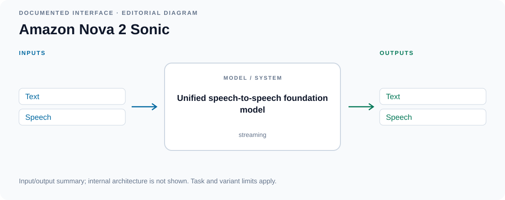

*Input/output diagram · [Source](https://aws.amazon.com/about-aws/whats-new/2025/12/amazon-nova-2-sonic-real-time-conversational-ai)*

### Amazon Nova Sonic

Unified speech-understanding/generation model.

[Announcement](https://press.aboutamazon.com/2025/4/introducing-amazon-nova-sonic-a-new-gen-ai-model-for-building-voice-applications-and-agents) · [Details](models/speech-dialogue.md#amazon-nova-sonic)

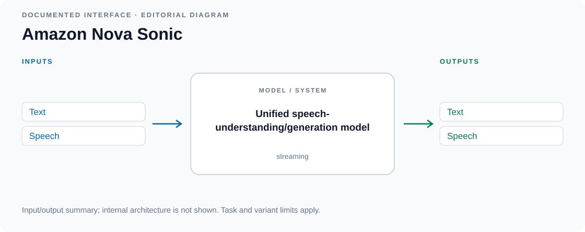

*Input/output diagram · [Source](https://press.aboutamazon.com/2025/4/introducing-amazon-nova-sonic-a-new-gen-ai-model-for-building-voice-applications-and-agents)*

### AnyGPT

Discrete multimodal tokens.

[Paper](https://arxiv.org/abs/2402.12226) · [Details](models/omni.md#anygpt)

*Figure 1 · [Source](https://arxiv.org/abs/2402.12226)*

### AnyMAL

Modality encoders and adapters.

[Paper](https://arxiv.org/abs/2309.16058) · [Details](models/omni.md#anymal)

*Figure 2 · [Source](https://arxiv.org/abs/2309.16058)*

### ARC-Hunyuan-Video

Audio-visual LLM.

[Paper](https://arxiv.org/abs/2507.20939) · [Details](models/omni.md#arc-hunyuan-video)

*Figure 2 · [Source](https://arxiv.org/abs/2507.20939)*

### Audio Flamingo

Audio encoder and language model.

[Paper](https://arxiv.org/abs/2402.01831) · [Repository](https://github.com/NVIDIA/audio-flamingo) · [Details](models/audio-understanding.md#audio-flamingo)

*Figure 2 · [Source](https://arxiv.org/abs/2402.01831)*

### Audio Flamingo 2

Custom CLAP and curriculum training.

[Paper](https://arxiv.org/abs/2503.03983) · [Details](models/audio-understanding.md#audio-flamingo-2)

*Figure 2 · [Source](https://arxiv.org/abs/2503.03983)*

### Audio Flamingo 3

Audio encoder, LLM and speech-generation path.

[Paper](https://arxiv.org/abs/2507.08128) · [Details](models/speech-dialogue.md#audio-flamingo-3)

*Figure 2 · [Source](https://arxiv.org/abs/2507.08128)*

### Audio Flamingo Next

Temporal audio chain-of-thought.

[Paper](https://arxiv.org/abs/2604.10905) · [Details](models/audio-understanding.md#audio-flamingo-next)

*Figure 3 · [Source](https://arxiv.org/abs/2604.10905)*

### Audio-Cogito

Reasoning data and self-distillation.

[Paper](https://arxiv.org/abs/2604.12527) · [Details](models/audio-understanding.md#audio-cogito)

*Figure 1 · [Source](https://arxiv.org/abs/2604.12527)*

### Audio-DeepThinker

Progressive reasoning-aware RL.

[Paper](https://arxiv.org/abs/2604.18187) · [Details](models/audio-understanding.md#audio-deepthinker)

*Figure 2 · [Source](https://arxiv.org/abs/2604.18187)*

### Audio-Reasoner

Audio chain-of-thought training.

[Paper](https://arxiv.org/abs/2503.02318) · [Details](models/audio-understanding.md#audio-reasoner)

*Figure 3 · [Source](https://arxiv.org/abs/2503.02318)*

### Audio-Visual LLM

Modality-selective encoders and instruction tuning.

[Paper](https://arxiv.org/abs/2312.06720) · [Details](models/omni.md#audio-visual-llm)

*Figure 2 · [Source](https://arxiv.org/abs/2312.06720)*

### AudioChatLlama

Speech-conditioned Llama.

[Paper](https://arxiv.org/abs/2311.06753) · [Details](models/audio-understanding.md#audiochatllama)

*Figure 1 · [Source](https://arxiv.org/abs/2311.06753)*

### AudioLM

Hierarchical semantic/acoustic token LMs.

[Paper](https://arxiv.org/abs/2209.03143) · [Details](models/speech-foundations.md#audiolm)

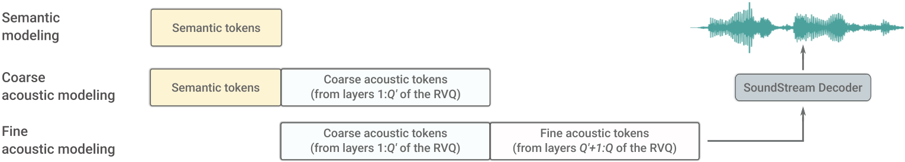

*Figure 2 · [Source](https://arxiv.org/abs/2209.03143)*

### AudioPaLM

Unified text/speech token LM.

[Paper](https://arxiv.org/abs/2306.12925) · [Details](models/speech-foundations.md#audiopalm)

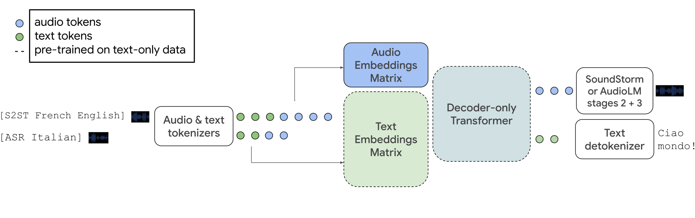

*Figure 1 · [Source](https://arxiv.org/abs/2306.12925)*

### AURORA

Structured reasoning and segmentation distillation.

[Paper](https://arxiv.org/abs/2508.02149) · [Details](models/omni.md#aurora)

*Figure 1 · [Source](https://arxiv.org/abs/2508.02149)*

### AV-Reasoner

GRPO and counting curriculum.

[Paper](https://arxiv.org/abs/2506.05328) · [Details](models/omni.md#av-reasoner)

*Figure 4 · [Source](https://arxiv.org/abs/2506.05328)*

### AVicuna

Temporal audio-visual instruction tuning.

[Paper](https://arxiv.org/abs/2403.16276) · [Details](models/omni.md#avicuna)

*Figure 3 · [Source](https://arxiv.org/abs/2403.16276)*

### Baichuan-Audio

Aligned text and multi-codebook speech.

[Paper](https://arxiv.org/abs/2502.17239) · [Details](models/speech-dialogue.md#baichuan-audio)

*Figure 1 · [Source](https://arxiv.org/abs/2502.17239)*

### Baichuan-Omni

Encoder–LLM alignment.

[Paper](https://arxiv.org/abs/2410.08565) · [Details](models/omni.md#baichuan-omni)

*Figure 2 · [Source](https://arxiv.org/abs/2410.08565)*

### Baichuan-Omni-1.5

Audio tokenizer and multimodal LLM.

[Paper](https://arxiv.org/abs/2501.15368) · [Details](models/omni.md#baichuan-omni-1-5)

*Figure 2 · [Source](https://arxiv.org/abs/2501.15368)*

### Bark

Hierarchical autoregressive audio tokens.

[Repository](https://github.com/suno-ai/bark) · [Details](models/speech-generation.md#bark)

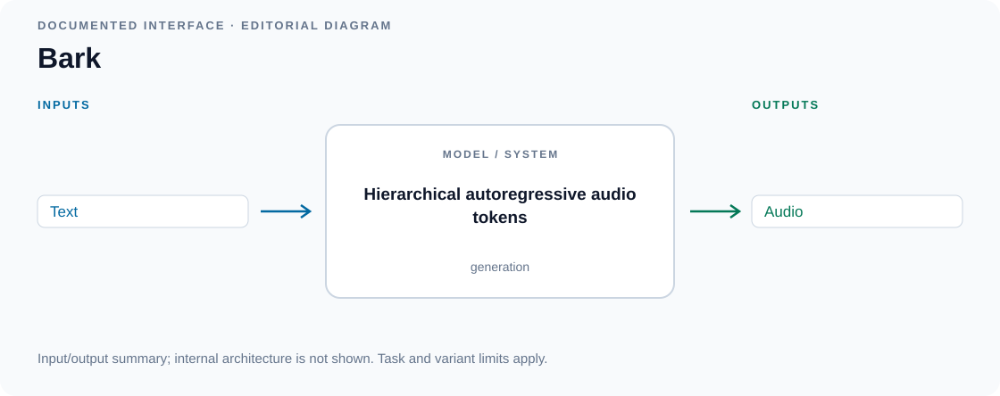

*Input/output diagram · [Source](https://github.com/suno-ai/bark)*

### BASE TTS

Autoregressive speechcodes and convolutional decoder.

[Paper](https://arxiv.org/abs/2402.08093) · [Details](models/speech-generation.md#base-tts)

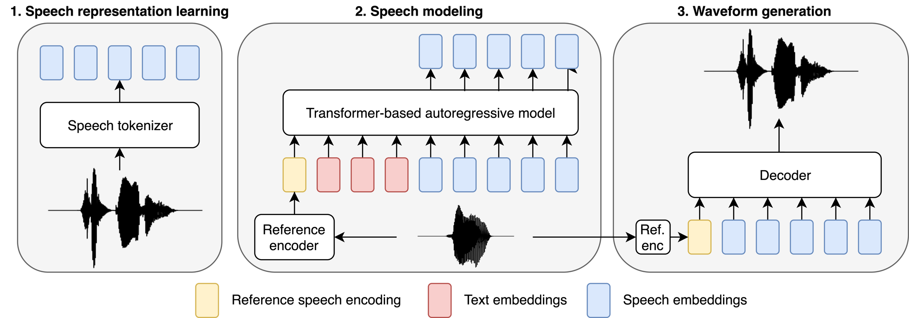

*Figure 1 · [Source](https://arxiv.org/abs/2402.08093)*

### BLSP

Frozen encoder/LLM with learned adapter.

[Paper](https://arxiv.org/abs/2309.00916) · [Details](models/audio-understanding.md#blsp)

*Figure 2 · [Source](https://arxiv.org/abs/2309.00916)*

### BLSP-Emo

Semantic and emotion-aware alignment.

[Paper](https://arxiv.org/abs/2406.03872) · [Details](models/audio-understanding.md#blsp-emo)

*Figure 2 · [Source](https://arxiv.org/abs/2406.03872)*

### BuboGPT

Encoder alignment and grounding module.

[Paper](https://arxiv.org/abs/2307.08581) · [Details](models/omni.md#bubogpt)

*Figure 1 · [Source](https://arxiv.org/abs/2307.08581)*

### CALM

Autoregressive continuous latents and consistency model.

[Paper](https://arxiv.org/abs/2509.06926) · [Details](models/speech-foundations.md#calm)

*Figure 1 · [Source](https://arxiv.org/abs/2509.06926)*

### Canary-Qwen

Canary encoder and Qwen language model.

[Model card](https://huggingface.co/nvidia/canary-qwen-2.5b) · [Details](models/llm-asr.md#canary-qwen)

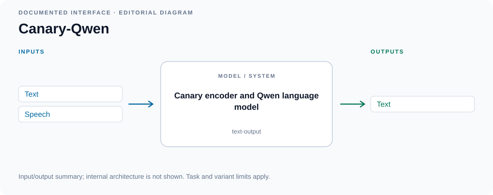

*Input/output diagram · [Source](https://huggingface.co/nvidia/canary-qwen-2.5b)*

### Capybara-OMNI

Progressive modality alignment.

[Paper](https://arxiv.org/abs/2504.12315) · [Details](models/omni.md#capybara-omni)

*Figure 1 · [Source](https://arxiv.org/abs/2504.12315)*

### CAT

Clue aggregation.

[Paper](https://arxiv.org/abs/2403.04640) · [Details](models/omni.md#cat)

*Figure 2, PDF p. 5 · [Source](https://arxiv.org/abs/2403.04640)*

### ChatBridge

Language-centered alignment.

[Paper](https://arxiv.org/abs/2305.16103) · [Details](models/omni.md#chatbridge)

*Figure 2 · [Source](https://arxiv.org/abs/2305.16103)*

### Chatterbox

Speech-token LM and acoustic decoder.

[Repository](https://github.com/resemble-ai/chatterbox) · [Details](models/speech-generation.md#chatterbox)

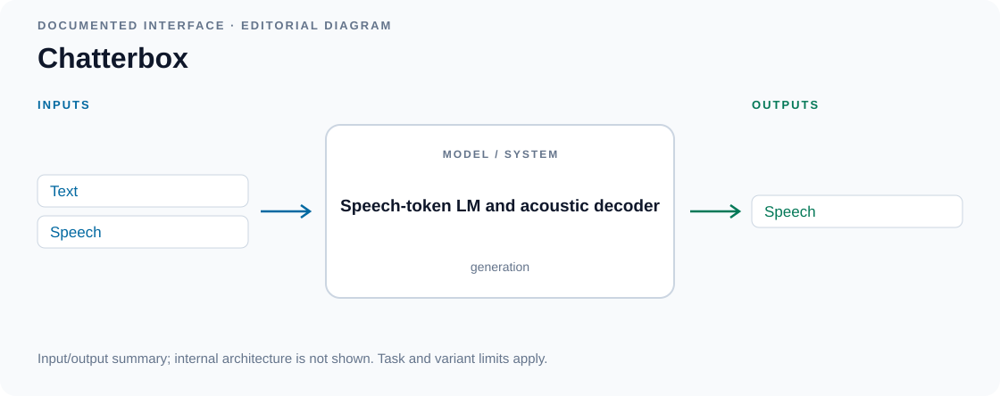

*Input/output diagram · [Source](https://github.com/resemble-ai/chatterbox)*

### ChatTTS

Autoregressive speech-token generation.

[Repository](https://github.com/2noise/ChatTTS) · [Details](models/speech-generation.md#chattts)

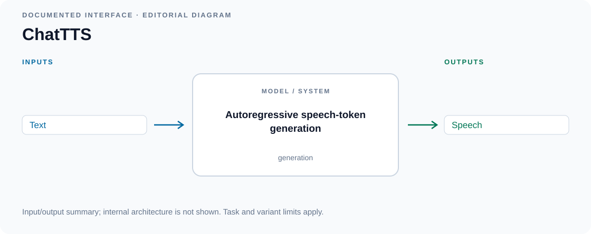

*Input/output diagram · [Source](https://github.com/2noise/ChatTTS)*

### ChronusOmni

Temporal interleaving and RL.

[Paper](https://arxiv.org/abs/2512.09841) · [Details](models/omni.md#chronusomni)

*Figure 2 · [Source](https://arxiv.org/abs/2512.09841)*

### CLaM-TTS

Probabilistic residual quantization and multi-token LM.

[Paper](https://arxiv.org/abs/2404.02781) · [Details](models/speech-generation.md#clam-tts)

*Figure 1 · [Source](https://arxiv.org/abs/2404.02781)*

### CoDi

Composable multimodal diffusion.

[Paper](https://arxiv.org/abs/2305.11846) · [Details](models/related.md#codi)

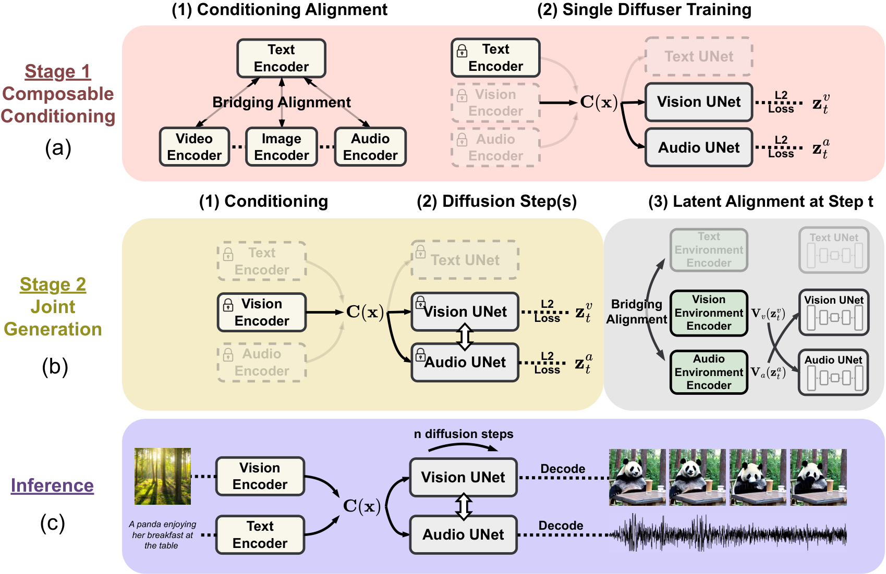

*Figure 2 · [Source](https://arxiv.org/abs/2305.11846)*

### CoDi-2

Multimodal LLM and generation modules.

[Paper](https://arxiv.org/abs/2311.18775) · [Details](models/omni.md#codi-2)

*Figure 2 · [Source](https://arxiv.org/abs/2311.18775)*

### CosyVoice

Supervised semantic tokens and flow decoder.

[Paper](https://arxiv.org/abs/2407.05407) · [Details](models/speech-generation.md#cosyvoice)

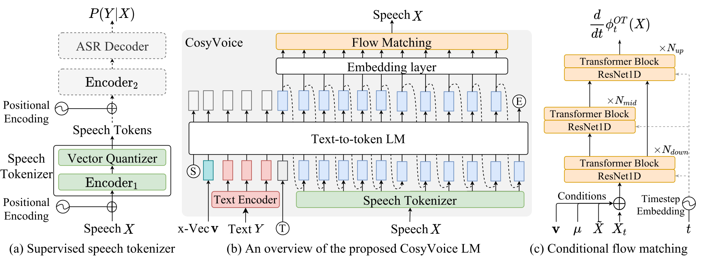

*Figure 1 · [Source](https://arxiv.org/abs/2407.05407)*

### CosyVoice 2

Text/speech LM and chunk-aware flow matching.

[Paper](https://arxiv.org/abs/2412.10117) · [Details](models/speech-generation.md#cosyvoice-2)

*Figure 1 · [Source](https://arxiv.org/abs/2412.10117)*

### CosyVoice 3

Scaled speech LM and post-training.

[Paper](https://arxiv.org/abs/2505.17589) · [Details](models/speech-generation.md#cosyvoice-3)

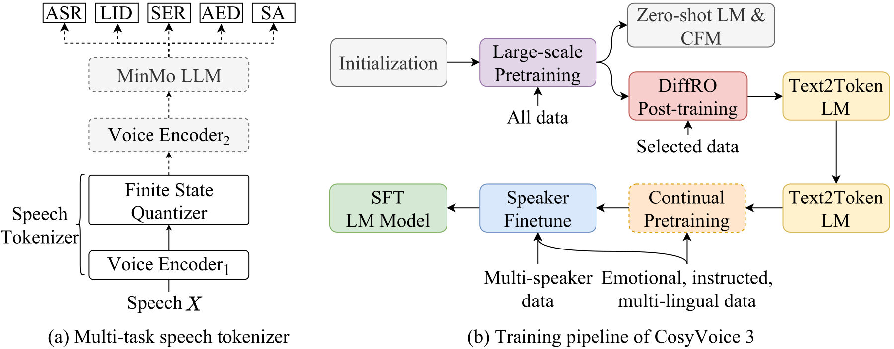

*Figure 2 · [Source](https://arxiv.org/abs/2505.17589)*

### Covo-Audio

Continuous input and unified speech output.

[Paper](https://arxiv.org/abs/2602.09823) · [Details](models/speech-dialogue.md#covo-audio)

*Figure 2, PDF p. 4 · [Source](https://arxiv.org/abs/2602.09823)*

### Crab

Cooperative audio-visual task modeling.

[Paper](https://arxiv.org/abs/2503.13068) · [Details](models/omni.md#crab)

*Figure 3 · [Source](https://arxiv.org/abs/2503.13068)*

### CREMA

Modular fusion.

[Paper](https://arxiv.org/abs/2402.05889) · [Details](models/omni.md#crema)

*Figure 1 · [Source](https://arxiv.org/abs/2402.05889)*

### CSM

Llama backbone and Mimi-code decoder.

[Repository](https://github.com/sesameailabs/csm) · [Details](models/speech-generation.md#csm)

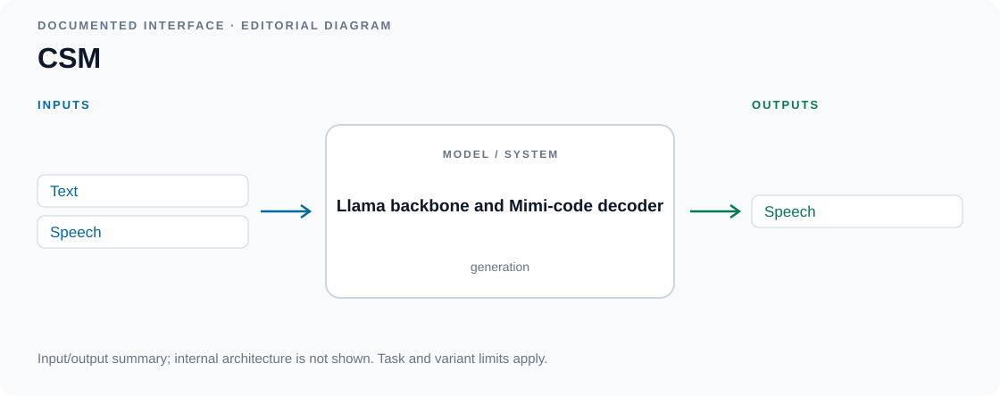

*Input/output diagram · [Source](https://github.com/sesameailabs/csm)*

### DeepSound-V1

Multimodal reasoning and audio generation.

[Paper](https://arxiv.org/abs/2503.22208) · [Details](models/omni.md#deepsound-v1)

*Figure 3 · [Source](https://arxiv.org/abs/2503.22208)*

### DeSTA

Descriptive speech-text alignment.

[Paper](https://arxiv.org/abs/2406.18871) · [Details](models/audio-understanding.md#desta)

*Figure 2 · [Source](https://arxiv.org/abs/2406.18871)*

### DeSTA2

Self-generated alignment data.

[Paper](https://arxiv.org/abs/2409.20007) · [Details](models/audio-understanding.md#desta2)

*Figure 1 · [Source](https://arxiv.org/abs/2409.20007)*

### DeSTA2.5-Audio

Self-generated cross-modal alignment.

[Paper](https://arxiv.org/abs/2507.02768) · [Details](models/audio-understanding.md#desta2-5-audio)

*Figure 2 · [Source](https://arxiv.org/abs/2507.02768)*

### dGSLM

Dual-channel spoken dialogue LM.

[Paper](https://arxiv.org/abs/2203.16502) · [Details](models/speech-foundations.md#dgslm)

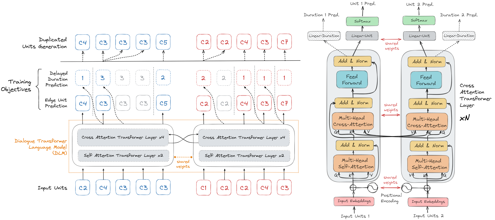

*Figure 2 · [Source](https://arxiv.org/abs/2203.16502)*

### Dia

Dialogue-conditioned codec generation.

[Repository](https://github.com/nari-labs/dia) · [Details](models/speech-generation.md#dia)

*Input/output diagram · [Source](https://github.com/nari-labs/dia)*

### Dia2

Streaming dialogue TTS.

[Repository](https://github.com/nari-labs/dia2) · [Details](models/speech-generation.md#dia2)

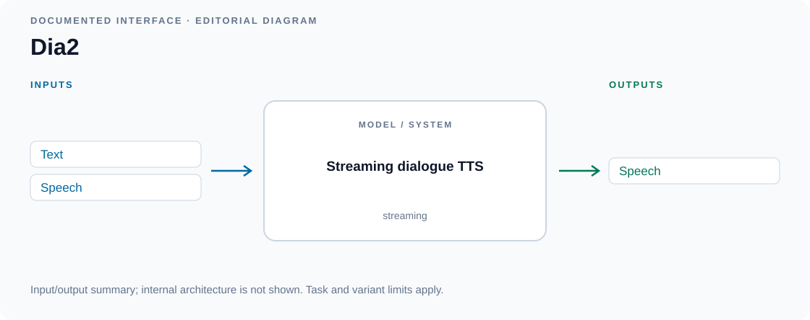

*Input/output diagram · [Source](https://github.com/nari-labs/dia2)*

### DIFFA

Diffusion language backbone and adapters.

[Paper](https://arxiv.org/abs/2507.18452) · [Details](models/audio-understanding.md#diffa)

*Figure 2 · [Source](https://arxiv.org/abs/2507.18452)*

### DIFFA-2

Diffusion LM and dual audio adapters.

[Paper](https://arxiv.org/abs/2601.23161) · [Details](models/audio-understanding.md#diffa-2)

*Figure 1 · [Source](https://arxiv.org/abs/2601.23161)*

### Doubao Realtime Voice

Joint speech-semantic modeling.

[Announcement](https://seed.bytedance.com/en/blog/doubao-realtime-voice-model-is-available-upon-release-high-eq-and-iq) · [Details](models/speech-dialogue.md#doubao-realtime-voice)

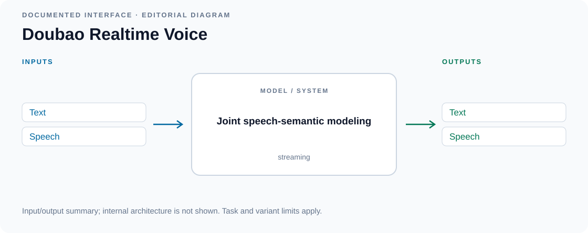

*Input/output diagram · [Source](https://seed.bytedance.com/en/blog/doubao-realtime-voice-model-is-available-upon-release-high-eq-and-iq)*

### Duplex Model

Duplex-adapted LLM and streaming speech modules.

[Paper](https://arxiv.org/abs/2406.15718) · [Details](models/related.md#duplex-model)

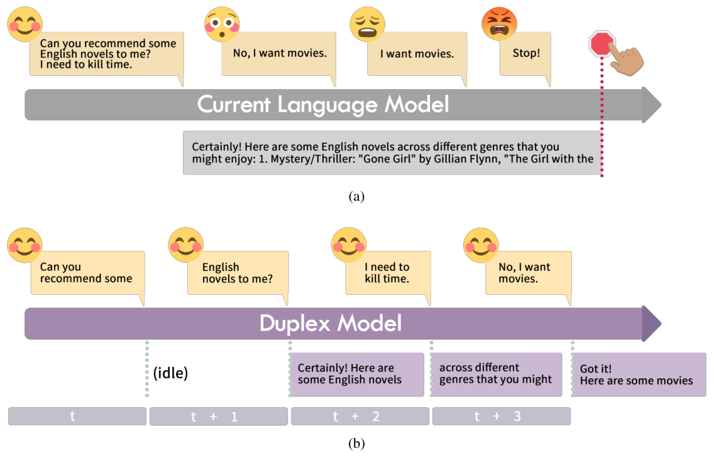

*Figure 1, PDF p. 3 · [Source](https://arxiv.org/abs/2406.15718)*

### DuplexMamba

Mamba speech-to-text backbone.

[Paper](https://arxiv.org/abs/2502.11123) · [Details](models/audio-understanding.md#duplexmamba)

*Figure 1 · [Source](https://arxiv.org/abs/2502.11123)*

### DuplexOmni

Asynchronous interaction and reasoning layers.

[Paper](https://arxiv.org/abs/2606.09186) · [Details](models/omni.md#duplexomni)

*Figure 2 · [Source](https://arxiv.org/abs/2606.09186)*

### DuplexSLA

Synchronized speech-language-action streams.

[Paper](https://arxiv.org/abs/2605.20755) · [Details](models/speech-dialogue.md#duplexsla)

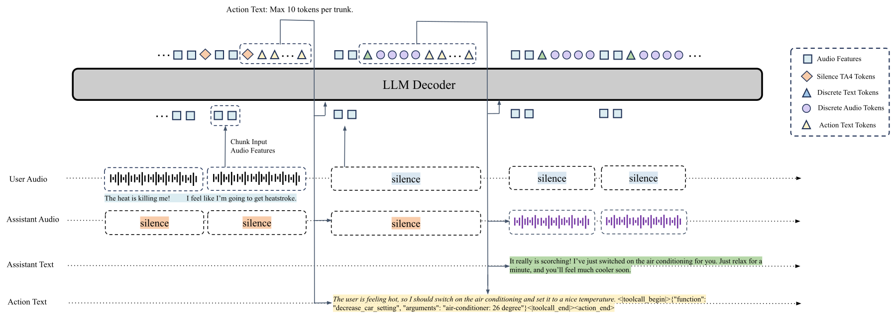

*Figure 1 · [Source](https://arxiv.org/abs/2605.20755)*

### EchoInk-R1

GRPO on Qwen2.5-Omni.

[Paper](https://arxiv.org/abs/2505.04623) · [Details](models/omni.md#echoink-r1)

*Input/output diagram · [Source](https://arxiv.org/abs/2505.04623)*

### EgoGPT

Egocentric multimodal LLM.

[Paper](https://arxiv.org/abs/2503.03803) · [Details](models/omni.md#egogpt)

*Figure 7 · [Source](https://arxiv.org/abs/2503.03803)*

### ELLA-V

Alignment-guided token reordering.

[Paper](https://arxiv.org/abs/2401.07333) · [Details](models/speech-generation.md#ella-v)

*Figure 1 · [Source](https://arxiv.org/abs/2401.07333)*

### ELLSA

Speech-Action MoE.

[Paper](https://arxiv.org/abs/2510.16756) · [Details](models/omni.md#ellsa)

*Figure 1 · [Source](https://arxiv.org/abs/2510.16756)*

### Emotion-LLaMA

Emotion-specific encoders.

[Paper](https://arxiv.org/abs/2406.11161) · [Details](models/omni.md#emotion-llama)

*Figure 2 · [Source](https://arxiv.org/abs/2406.11161)*

### EMOVA

Speech-vision-language alignment.

[Paper](https://arxiv.org/abs/2409.18042) · [Details](models/omni.md#emova)

*Figure 2 · [Source](https://arxiv.org/abs/2409.18042)*

### Empatheia

Multimodal LLM, speech and avatar generators.

[Paper](https://arxiv.org/abs/2502.04976) · [Details](models/omni.md#empatheia)

*Figure 3 · [Source](https://arxiv.org/abs/2502.04976)*

### EmpathyEar

Emotion-aware LLM and avatar generation.

[Paper](https://arxiv.org/abs/2406.15177) · [Details](models/omni.md#empathyear)

*Figure 1 · [Source](https://arxiv.org/abs/2406.15177)*

### eP-ALM

Efficient perception-to-language projections.

[Paper](https://arxiv.org/abs/2303.11403) · [Details](models/omni.md#ep-alm)

*Figure 1 · [Source](https://arxiv.org/abs/2303.11403)*

### F-Actor

Instruction-controlled duplex speech LM.

[Paper](https://arxiv.org/abs/2601.11329) · [Details](models/speech-dialogue.md#f-actor)

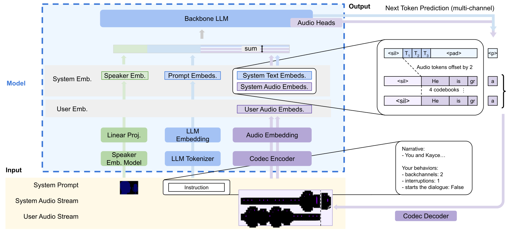

*Figure 1 · [Source](https://arxiv.org/abs/2601.11329)*

### FAVOR

Causal Q-Former.

[Paper](https://arxiv.org/abs/2310.05863) · [Details](models/omni.md#favor)

*Figure 1 · [Source](https://arxiv.org/abs/2310.05863)*

### FireRedASR-LLM

Encoder–adapter–LLM.

[Paper](https://arxiv.org/abs/2501.14350) · [Details](models/llm-asr.md#fireredasr-llm)

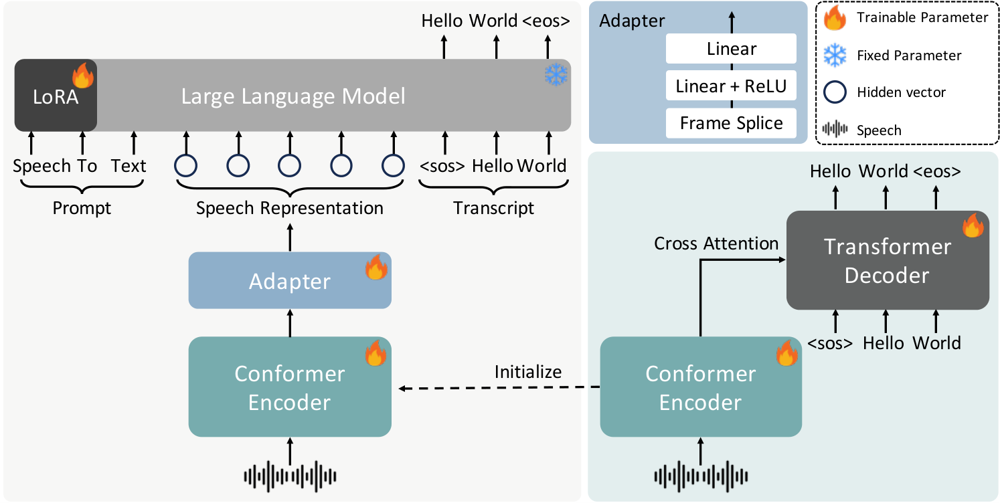

*Figure 1 · [Source](https://arxiv.org/abs/2501.14350)*

### FireRedASR2-LLM

LLM-based ASR.

[Paper](https://arxiv.org/abs/2603.10420) · [Details](models/llm-asr.md#fireredasr2-llm)

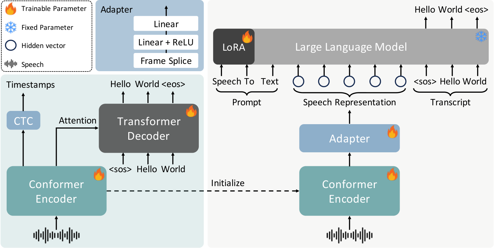

*Figure 2 · [Source](https://arxiv.org/abs/2603.10420)*

### FireRedChat

Streaming ASR, LLM, TTS and turn control.

[Paper](https://arxiv.org/abs/2509.06502) · [Details](models/related.md#fireredchat)

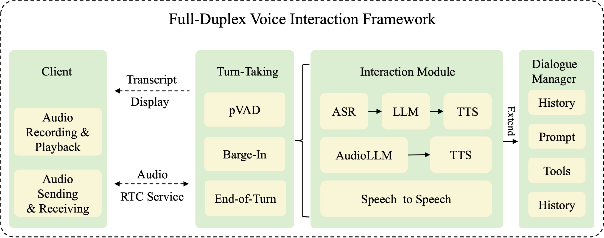

*Figure 1 · [Source](https://arxiv.org/abs/2509.06502)*

### FireRedTTS

Text-to-semantic LM and speech decoder.

[Paper](https://arxiv.org/abs/2409.03283) · [Details](models/speech-generation.md#fireredtts)

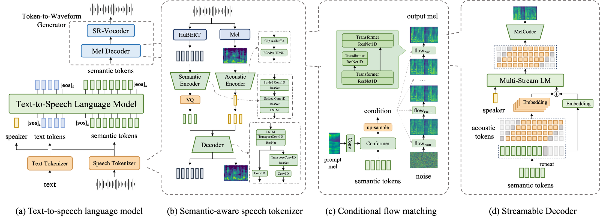

*Figure 3 · [Source](https://arxiv.org/abs/2409.03283)*

### FireRedTTS-2

Low-rate streaming codec and dialogue LM.

[Paper](https://arxiv.org/abs/2509.02020) · [Details](models/speech-generation.md#fireredtts-2)

*Figure 1 · [Source](https://arxiv.org/abs/2509.02020)*

### Fish Audio S1 / OpenAudio S1

Dual-autoregressive speech language model.

[Model card](https://huggingface.co/fishaudio/s1-mini) · [Details](models/speech-generation.md#openaudio-s1)

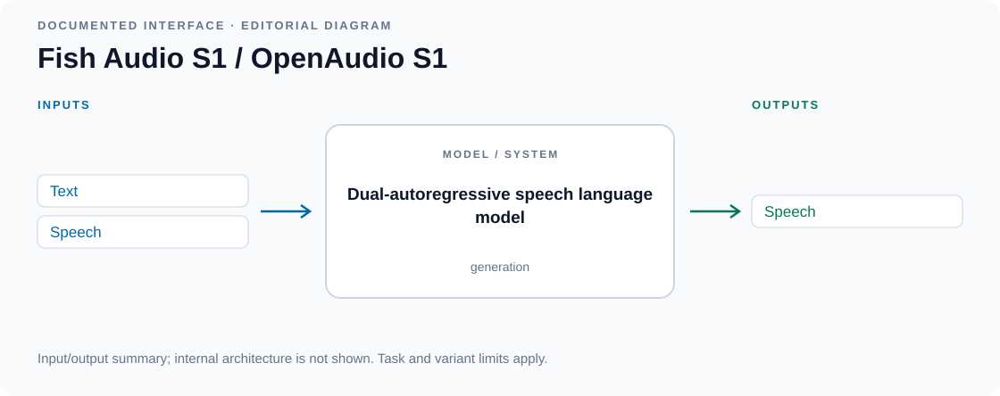

*Input/output diagram · [Source](https://huggingface.co/fishaudio/s1-mini)*

### Fish Audio S2

Dual-autoregressive speech modeling.

[Paper](https://arxiv.org/abs/2603.08823) · [Repository](https://github.com/fishaudio/fish-speech) · [Details](models/speech-generation.md#fish-audio-s2)

*Figure 2 · [Source](https://arxiv.org/abs/2603.08823)*

### Fish Speech

Dual-autoregressive slow/fast transformers.

[Paper](https://arxiv.org/abs/2411.01156) · [Repository](https://github.com/fishaudio/fish-speech) · [Details](models/speech-generation.md#fish-speech)

*Figure 2 · [Source](https://arxiv.org/abs/2411.01156)*

### Flow-Omni

Continuous speech tokens and flow matching.

[Paper](https://arxiv.org/abs/2412.04917) · [Details](models/speech-dialogue.md#flow-omni)

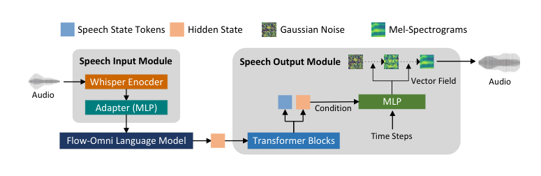

*Figure 2 · [Source](https://arxiv.org/abs/2412.04917)*

### Flow-SLM

Semantic prediction and flow-based acoustics.

[Paper](https://arxiv.org/abs/2508.09350) · [Details](models/speech-foundations.md#flow-slm)

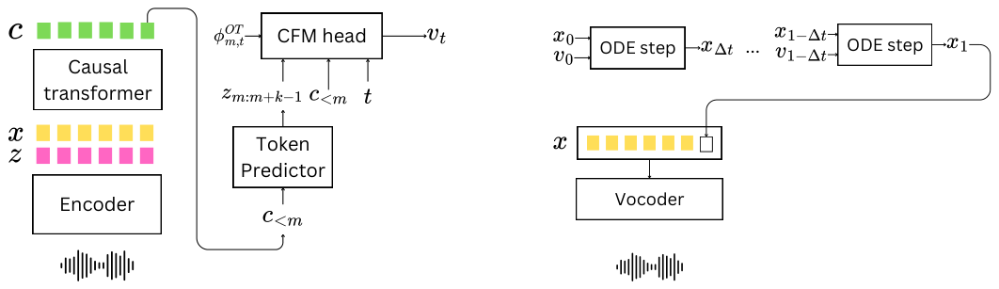

*Figure 1, PDF p. 2 · [Source](https://arxiv.org/abs/2508.09350)*

### Freeze-Omni

Frozen LLM and speech input/output adapters.

[Paper](https://arxiv.org/abs/2411.00774) · [Details](models/speech-dialogue.md#freeze-omni)

*Figure 1 · [Source](https://arxiv.org/abs/2411.00774)*

### Fun-ASR

Audio-conditioned LLM and RL.

[Paper](https://arxiv.org/abs/2509.12508) · [Details](models/llm-asr.md#fun-asr)

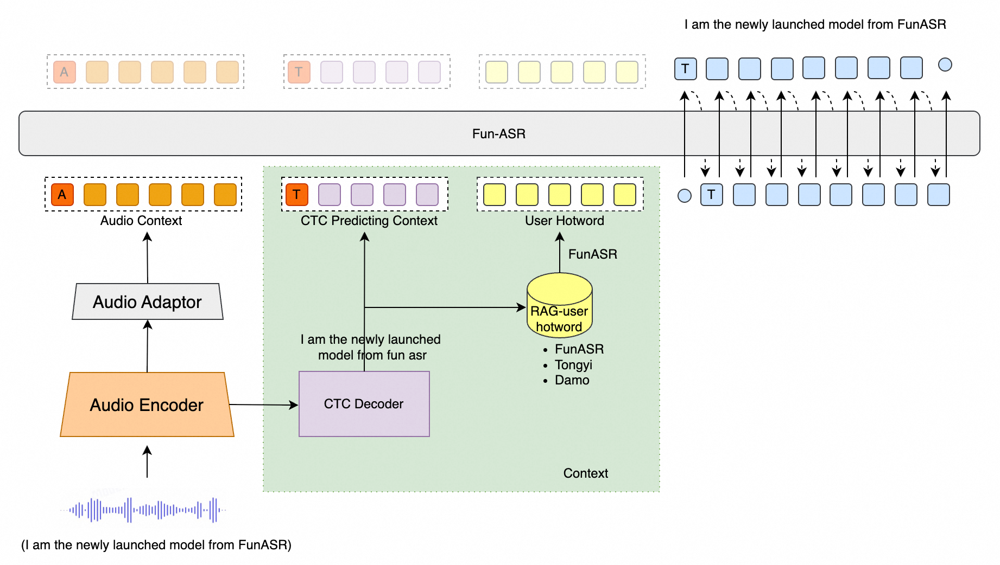

*Figure 2 · [Source](https://arxiv.org/abs/2509.12508)*

### Fun-Audio-Chat

Dual-resolution speech representations.

[Paper](https://arxiv.org/abs/2512.20156) · [Details](models/speech-dialogue.md#fun-audio-chat)

*Figure 2, PDF p. 4 · [Source](https://arxiv.org/abs/2512.20156)*

### GAMA

Audio Q-Former and multi-layer aggregation.

[Paper](https://arxiv.org/abs/2406.11768) · [Details](models/audio-understanding.md#gama)

*Figure 2, PDF p. 3 · [Source](https://arxiv.org/abs/2406.11768)*

### Gemini 1.0

Natively multimodal Transformer.

[Paper](https://arxiv.org/abs/2312.11805) · [Details](models/omni.md#gemini-1-0)

*Input/output diagram · [Source](https://arxiv.org/abs/2312.11805)*

### Gemini 1.5

Long-context multimodal MoE family.

[Paper](https://arxiv.org/abs/2403.05530) · [Details](models/omni.md#gemini-1-5)

*Input/output diagram · [Source](https://arxiv.org/abs/2403.05530)*

### Gemini 2.0

Multimodal model family.

[Paper](https://arxiv.org/abs/2507.06261) · [Details](models/omni.md#gemini-2-0)

*Input/output diagram · [Source](https://arxiv.org/abs/2507.06261)*

### Gemini 2.5

Reasoning-enabled multimodal family.

[Paper](https://arxiv.org/abs/2507.06261) · [Docs 1](https://ai.google.dev/gemini-api/docs/models/gemini-2.5-pro) · [Docs 2](https://ai.google.dev/gemini-api/docs/models/gemini-2.5-flash) · [Docs 3](https://ai.google.dev/gemini-api/docs/models/gemini-2.5-flash-lite) · [Details](models/omni.md#gemini-2-5)

*Input/output diagram · [Source](https://arxiv.org/abs/2507.06261)*

### Gemini 2.5 Flash Live

Native-audio Live API model.

[Docs](https://ai.google.dev/gemini-api/docs/models/gemini-2.5-flash-native-audio-preview-12-2025) · [Details](models/omni.md#gemini-2-5-flash-live)

*Input/output diagram · [Source](https://ai.google.dev/gemini-api/docs/models/gemini-2.5-flash-native-audio-preview-12-2025)*

### Gemini 2.5 TTS

Gemini-derived text-to-speech.

[Docs 1](https://ai.google.dev/gemini-api/docs/models/gemini-2.5-flash-preview-tts) · [Docs 2](https://ai.google.dev/gemini-api/docs/models/gemini-2.5-pro-preview-tts) · [Details](models/speech-generation.md#gemini-2-5-tts)

*Input/output diagram · [Source](https://ai.google.dev/gemini-api/docs/models/gemini-2.5-flash-preview-tts)*

### Gemini 3

Multimodal reasoning family.

[Docs 1](https://ai.google.dev/gemini-api/docs/models/gemini-3-pro-preview) · [Docs 2](https://ai.google.dev/gemini-api/docs/models/gemini-3-flash-preview) · [Details](models/omni.md#gemini-3)

*Input/output diagram · [Source](https://ai.google.dev/gemini-api/docs/models/gemini-3-pro-preview)*

### Gemini 3.1

Multimodal reasoning family.

[Docs 1](https://ai.google.dev/gemini-api/docs/models/gemini-3.1-pro-preview) · [Docs 2](https://ai.google.dev/gemini-api/docs/models/gemini-3.1-flash-lite) · [Details](models/omni.md#gemini-3-1)

*Input/output diagram · [Source](https://ai.google.dev/gemini-api/docs/models/gemini-3.1-pro-preview)*

### Gemini 3.1 Flash Live

Native audio-visual Live API model.

[Docs](https://ai.google.dev/gemini-api/docs/models/gemini-3.1-flash-live-preview) · [Details](models/omni.md#gemini-3-1-flash-live)

*Input/output diagram · [Source](https://ai.google.dev/gemini-api/docs/models/gemini-3.1-flash-live-preview)*

### Gemini 3.1 Flash TTS

Gemini-derived text-to-speech.

[Docs](https://ai.google.dev/gemini-api/docs/models/gemini-3.1-flash-tts-preview) · [Details](models/speech-generation.md#gemini-3-1-flash-tts)

*Input/output diagram · [Source](https://ai.google.dev/gemini-api/docs/models/gemini-3.1-flash-tts-preview)*

### Gemini 3.5

Multimodal Flash family.

[Docs 1](https://ai.google.dev/gemini-api/docs/models/gemini-3.5-flash) · [Docs 2](https://ai.google.dev/gemini-api/docs/models/gemini-3.5-flash-lite) · [Details](models/omni.md#gemini-3-5)

*Input/output diagram · [Source](https://ai.google.dev/gemini-api/docs/models/gemini-3.5-flash)*

### Gemini 3.5 Live Translate

Live speech translation.

[Docs](https://ai.google.dev/gemini-api/docs/models/gemini-3.5-live-translate-preview) · [Details](models/speech-foundations.md#gemini-3-5-live-translate)

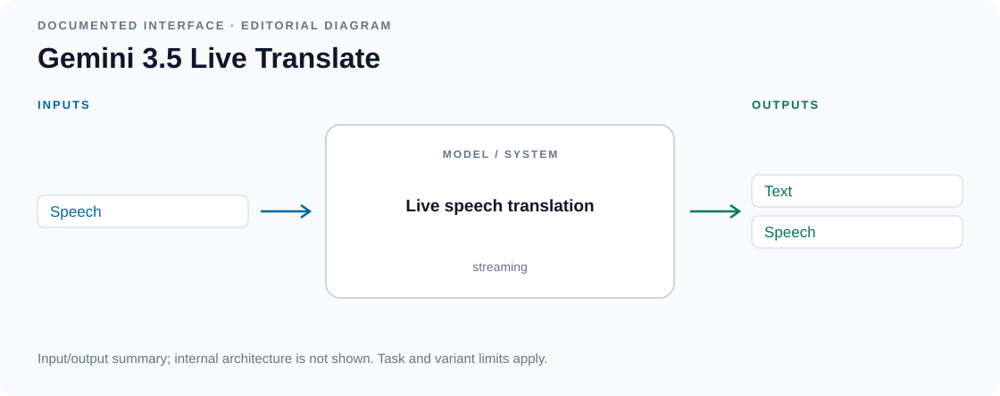

*Input/output diagram · [Source](https://ai.google.dev/gemini-api/docs/models/gemini-3.5-live-translate-preview)*

### Gemini 3.5 Transcribe

Specialized speech-to-text model family.

[Docs](https://ai.google.dev/gemini-api/docs/models/gemini-3.5-transcribe) · [Details](models/llm-asr.md#gemini-3-5-transcribe)

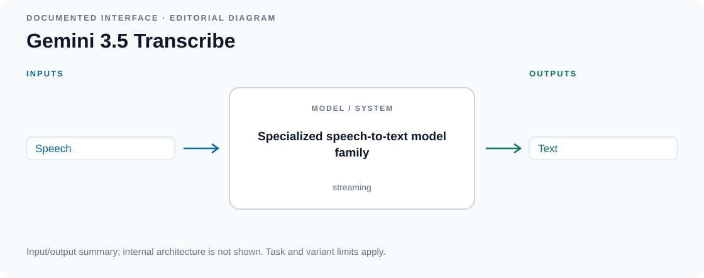

*Input/output diagram · [Source](https://ai.google.dev/gemini-api/docs/models/gemini-3.5-transcribe)*

### Gemini 3.6 Flash

Multimodal Flash API model.

[Docs](https://ai.google.dev/gemini-api/docs/models/gemini-3.6-flash) · [Details](models/omni.md#gemini-3-6-flash)

*Input/output diagram · [Source](https://ai.google.dev/gemini-api/docs/models/gemini-3.6-flash)*

### Gemini 3.7 Flash

Multimodal Flash API model.

[Docs](https://ai.google.dev/gemini-api/docs/models/gemini-3.7-flash) · [Details](models/omni.md#gemini-3-7-flash)

*Input/output diagram · [Source](https://ai.google.dev/gemini-api/docs/models/gemini-3.7-flash)*

### Gemini 3.8 Flash

Multimodal Flash API model.

[Docs](https://ai.google.dev/gemini-api/docs/models/gemini-3.8-flash) · [Details](models/omni.md#gemini-3-8-flash)

*Input/output diagram · [Source](https://ai.google.dev/gemini-api/docs/models/gemini-3.8-flash)*

### Gemini Omni Flash

Specialized multimodal video generator.

[Docs](https://ai.google.dev/gemini-api/docs/models/gemini-omni-flash) · [Details](models/related.md#gemini-omni-flash)

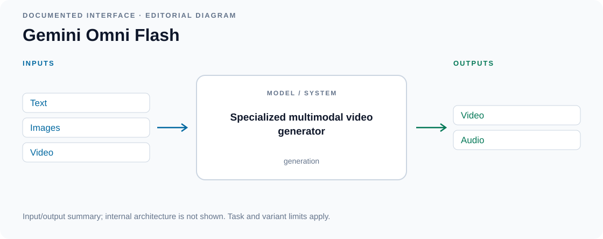

*Input/output diagram · [Source](https://ai.google.dev/gemini-api/docs/models/gemini-omni-flash)*

### Gemma 3n

Efficient multimodal backbone.

[Project](https://deepmind.google/models/gemma/gemma-3n) · [Details](models/omni.md#gemma-3n)

*Input/output diagram · [Source](https://deepmind.google/models/gemma/gemma-3n)*

### Gemma 4 (audio-capable variants)

Encoders for E2B/E4B; encoder-free 12B.

[Paper](https://arxiv.org/abs/2607.02770) · [Docs 1](https://ai.google.dev/gemma/docs/core) · [Docs 2](https://ai.google.dev/gemma/docs/capabilities/audio) · [Details](models/omni.md#gemma-4-audio-capable-variants)

*Input/output diagram · [Source](https://arxiv.org/abs/2607.02770)*

### GLM-4-Voice

Interleaved text and discrete speech tokens.

[Paper](https://arxiv.org/abs/2412.02612) · [Details](models/speech-dialogue.md#glm-4-voice)

*Figure 2 · [Source](https://arxiv.org/abs/2412.02612)*

### GLM-ASR-Nano

Speech recognition language model.

[Repository](https://github.com/zai-org/GLM-ASR) · [Details](models/llm-asr.md#glm-asr-nano)

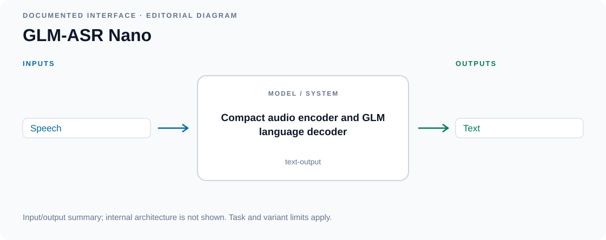

*Input/output diagram · [Source](https://github.com/zai-org/GLM-ASR)*

### GLM-TTS

Autoregressive token model and diffusion decoder.

[Paper](https://arxiv.org/abs/2512.14291) · [Repository](https://github.com/zai-org/GLM-TTS) · [Details](models/speech-generation.md#glm-tts)

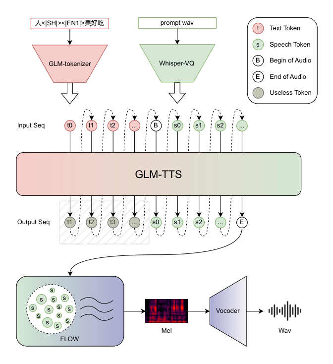

*Figure 1 · [Source](https://arxiv.org/abs/2512.14291)*

### GPST

Hierarchical transformer.

[Project](https://aclanthology.org/2024.acl-long.97) · [Details](models/speech-foundations.md#gpst)

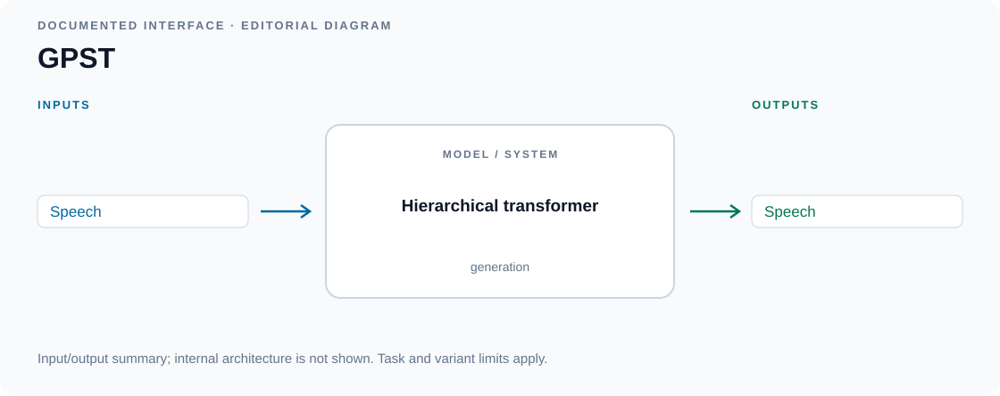

*Input/output diagram · [Source](https://aclanthology.org/2024.acl-long.97)*

### GPT-4o (reported model)

Native multimodal model; internals partly disclosed.

[Paper](https://arxiv.org/abs/2410.21276) · [Details](models/omni.md#gpt-4o-reported-model)

*Input/output diagram · [Source](https://arxiv.org/abs/2410.21276)*

### GPT-4o Audio

Audio-capable GPT-4o API variant.

[Docs](https://developers.openai.com/api/docs/models/gpt-4o-audio-preview) · [Details](models/speech-dialogue.md#gpt-4o-audio)

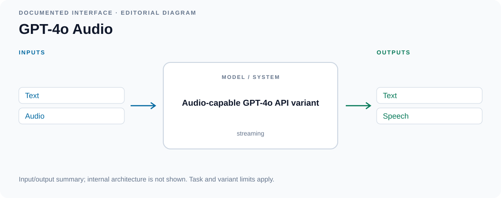

*Input/output diagram · [Source](https://developers.openai.com/api/docs/models/gpt-4o-audio-preview)*

### GPT-4o Mini Audio

Compact audio-capable GPT-4o variant.

[Docs](https://developers.openai.com/api/docs/models/gpt-4o-mini-audio-preview) · [Details](models/speech-dialogue.md#gpt-4o-mini-audio)

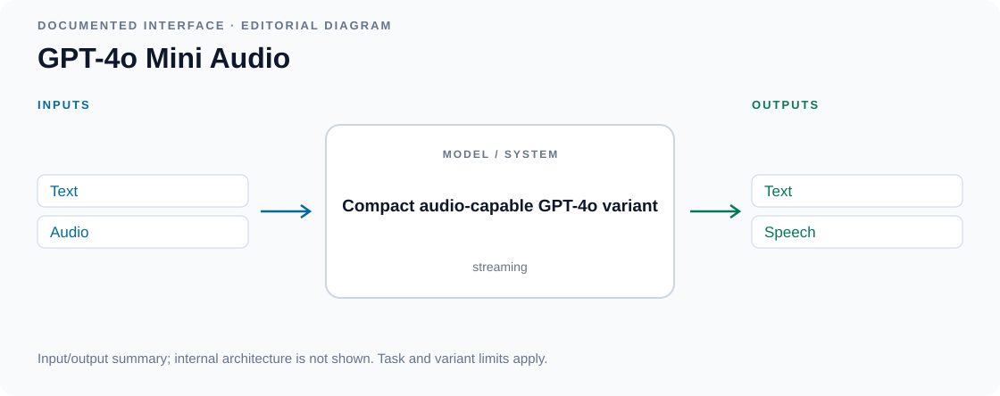

*Input/output diagram · [Source](https://developers.openai.com/api/docs/models/gpt-4o-mini-audio-preview)*

### GPT-4o Mini Realtime

Compact realtime speech model.

[Docs](https://developers.openai.com/api/docs/models/gpt-4o-mini-realtime-preview) · [Details](models/speech-dialogue.md#gpt-4o-mini-realtime)

*Input/output diagram · [Source](https://developers.openai.com/api/docs/models/gpt-4o-mini-realtime-preview)*

### GPT-4o Mini Transcribe

Compact GPT-derived speech recognition.

[Docs](https://developers.openai.com/api/docs/models/gpt-4o-mini-transcribe) · [Details](models/llm-asr.md#gpt-4o-mini-transcribe)

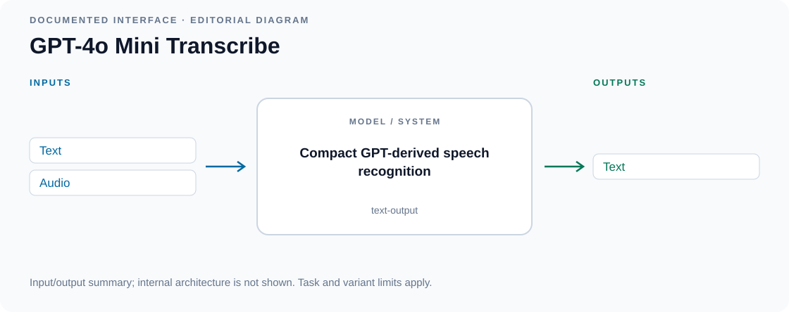

*Input/output diagram · [Source](https://developers.openai.com/api/docs/models/gpt-4o-mini-transcribe)*

### GPT-4o Mini TTS

GPT-derived speech synthesizer.

[Docs](https://developers.openai.com/api/docs/models/gpt-4o-mini-tts) · [Details](models/speech-generation.md#gpt-4o-mini-tts)

*Input/output diagram · [Source](https://developers.openai.com/api/docs/models/gpt-4o-mini-tts)*

### GPT-4o Realtime

Realtime speech API model.

[Docs](https://developers.openai.com/api/docs/models/gpt-4o-realtime-preview) · [Details](models/speech-dialogue.md#gpt-4o-realtime)

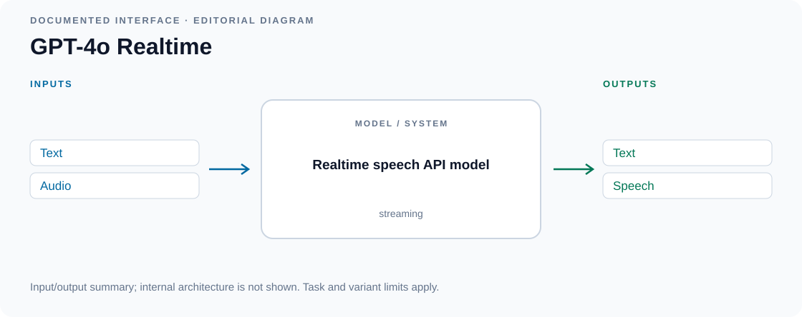

*Input/output diagram · [Source](https://developers.openai.com/api/docs/models/gpt-4o-realtime-preview)*

### GPT-4o Transcribe

GPT-4o-derived speech recognition.

[Docs](https://developers.openai.com/api/docs/models/gpt-4o-transcribe) · [Details](models/llm-asr.md#gpt-4o-transcribe)

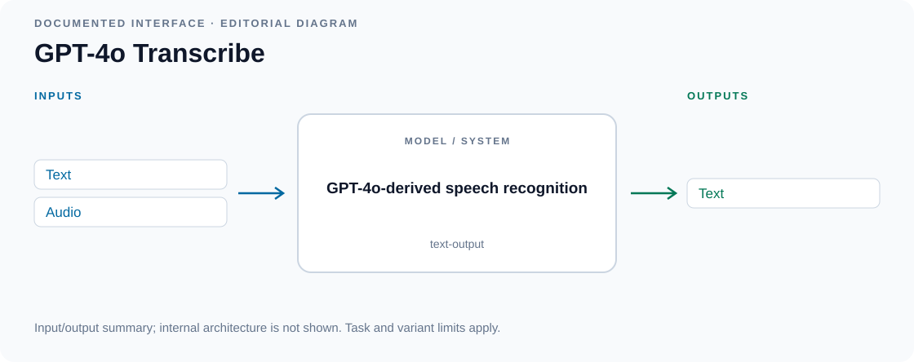

*Input/output diagram · [Source](https://developers.openai.com/api/docs/models/gpt-4o-transcribe)*

### GPT-4o Transcribe Diarize

Speaker-attributed transcription model.

[Docs](https://developers.openai.com/api/docs/models/gpt-4o-transcribe-diarize) · [Details](models/llm-asr.md#gpt-4o-transcribe-diarize)

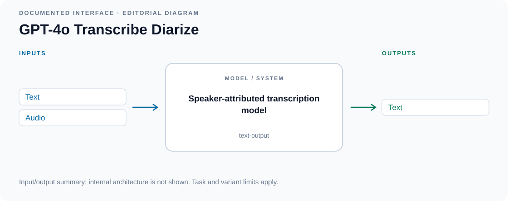

*Input/output diagram · [Source](https://developers.openai.com/api/docs/models/gpt-4o-transcribe-diarize)*

### GPT-Audio

Audio Chat Completions model.

[Docs](https://developers.openai.com/api/docs/models/gpt-audio) · [Details](models/speech-dialogue.md#gpt-audio)

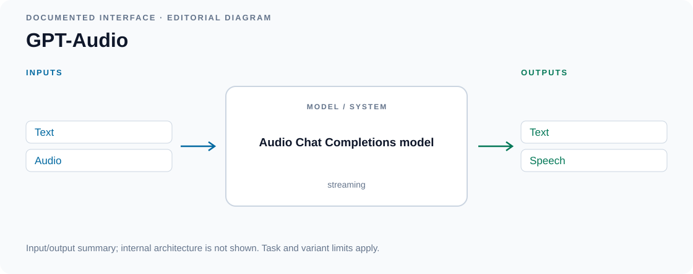

*Input/output diagram · [Source](https://developers.openai.com/api/docs/models/gpt-audio)*

### GPT-Audio Mini

Compact audio Chat Completions model.

[Docs](https://developers.openai.com/api/docs/models/gpt-audio-mini) · [Details](models/speech-dialogue.md#gpt-audio-mini)

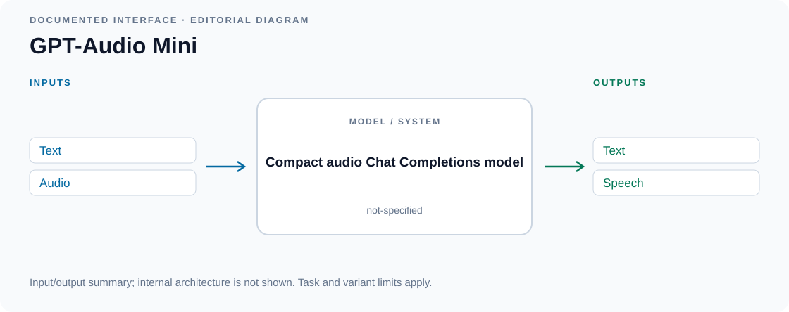

*Input/output diagram · [Source](https://developers.openai.com/api/docs/models/gpt-audio-mini)*

### GPT-Audio-1.5

Audio-language API model.

[Docs](https://developers.openai.com/api/docs/models/gpt-audio-1.5) · [Details](models/speech-dialogue.md#gpt-audio-1-5)

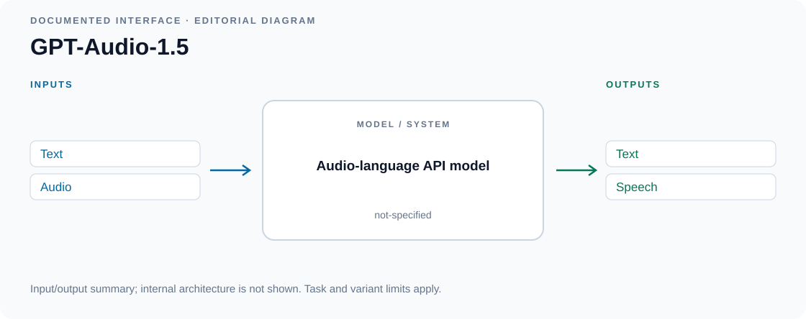

*Input/output diagram · [Source](https://developers.openai.com/api/docs/models/gpt-audio-1.5)*

### GPT-Live-1

Full-duplex voice model with backend delegation.

[Docs](https://developers.openai.com/api/docs/models/gpt-live-1) · [Details](models/speech-dialogue.md#gpt-live-1)

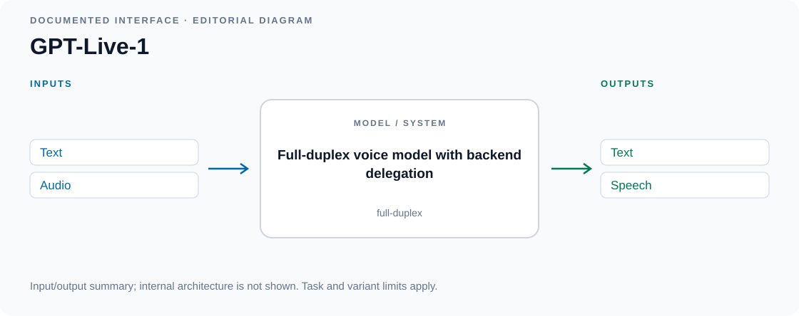

*Input/output diagram · [Source](https://developers.openai.com/api/docs/models/gpt-live-1)*

### GPT-Live-Transcribe

Continuous streaming transcription.

[Docs](https://developers.openai.com/api/docs/models/gpt-live-transcribe) · [Details](models/llm-asr.md#gpt-live-transcribe)

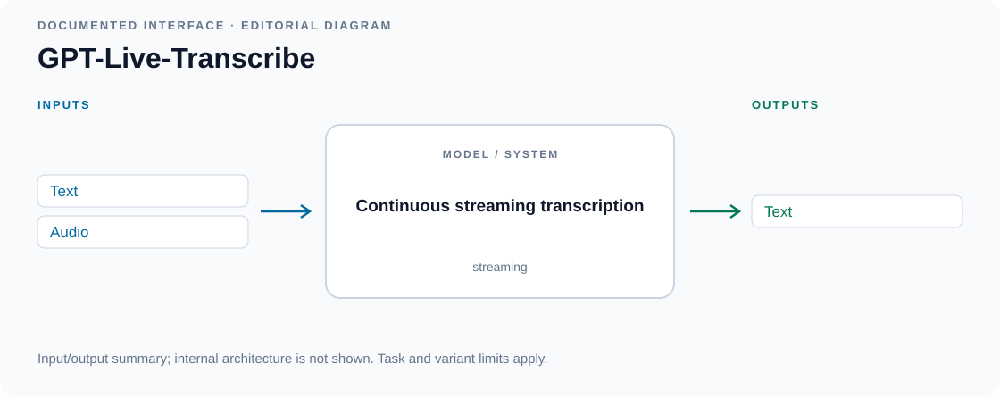

*Input/output diagram · [Source](https://developers.openai.com/api/docs/models/gpt-live-transcribe)*

### GPT-Realtime

Native audio API model; detailed architecture undisclosed.

[Docs](https://developers.openai.com/api/docs/models/gpt-realtime) · [Details](models/omni.md#gpt-realtime)

*Input/output diagram · [Source](https://developers.openai.com/api/docs/models/gpt-realtime)*

### GPT-Realtime Mini

Compact realtime audio model.

[Docs](https://developers.openai.com/api/docs/models/gpt-realtime-mini) · [Details](models/omni.md#gpt-realtime-mini)

*Input/output diagram · [Source](https://developers.openai.com/api/docs/models/gpt-realtime-mini)*

### GPT-Realtime-1.5

Realtime multimodal API model.

[Docs](https://developers.openai.com/api/docs/models/gpt-realtime-1.5) · [Details](models/omni.md#gpt-realtime-1-5)

*Input/output diagram · [Source](https://developers.openai.com/api/docs/models/gpt-realtime-1.5)*

### GPT-Realtime-2

Reasoning-enabled realtime audio model.

[Docs](https://developers.openai.com/api/docs/models/gpt-realtime-2) · [Details](models/omni.md#gpt-realtime-2)

*Input/output diagram · [Source](https://developers.openai.com/api/docs/models/gpt-realtime-2)*

### GPT-Realtime-2.1

Realtime reasoning model.

[Docs](https://developers.openai.com/api/docs/models/gpt-realtime-2.1) · [Details](models/omni.md#gpt-realtime-2-1)

*Input/output diagram · [Source](https://developers.openai.com/api/docs/models/gpt-realtime-2.1)*

### GPT-Realtime-2.1 Mini

Distilled realtime reasoning model.

[Docs](https://developers.openai.com/api/docs/models/gpt-realtime-2.1-mini) · [Details](models/omni.md#gpt-realtime-2-1-mini)

*Input/output diagram · [Source](https://developers.openai.com/api/docs/models/gpt-realtime-2.1-mini)*

### GPT-Realtime-Translate

Streaming speech-translation model.

[Docs](https://developers.openai.com/api/docs/models/gpt-realtime-translate) · [Details](models/speech-foundations.md#gpt-realtime-translate)

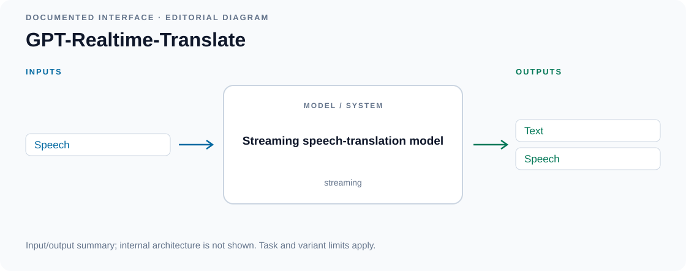

*Input/output diagram · [Source](https://developers.openai.com/api/docs/models/gpt-realtime-translate)*

### GPT-SoVITS

Text-to-semantic GPT and speech decoder.

[Repository](https://github.com/RVC-Boss/GPT-SoVITS) · [Details](models/speech-generation.md#gpt-sovits)

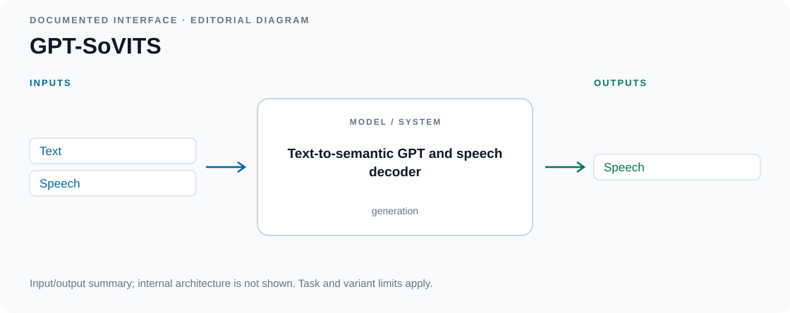

*Input/output diagram · [Source](https://github.com/RVC-Boss/GPT-SoVITS)*

### GPT-Transcribe

Speech-to-text API model.

[Docs](https://developers.openai.com/api/docs/models/gpt-transcribe) · [Details](models/llm-asr.md#gpt-transcribe)

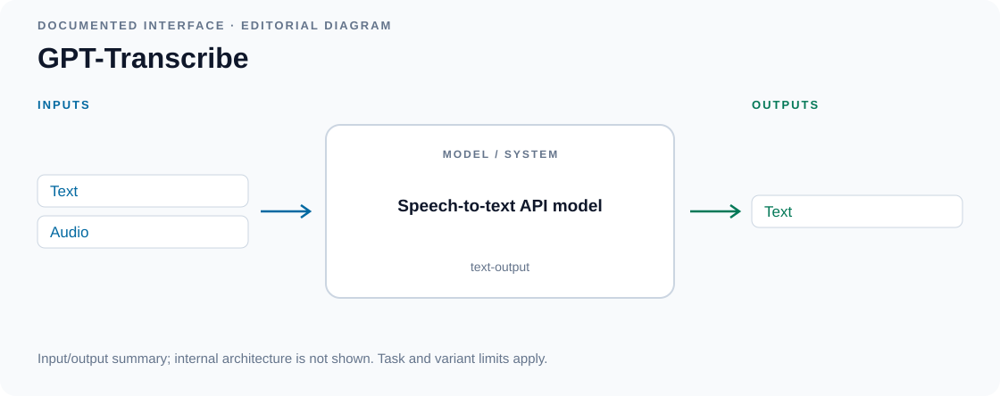

*Input/output diagram · [Source](https://developers.openai.com/api/docs/models/gpt-transcribe)*

### Granite Speech 3.3

Speech encoder, projector and LoRA.

[Paper](https://arxiv.org/abs/2505.08699) · [Details](models/llm-asr.md#granite-speech-3-3)

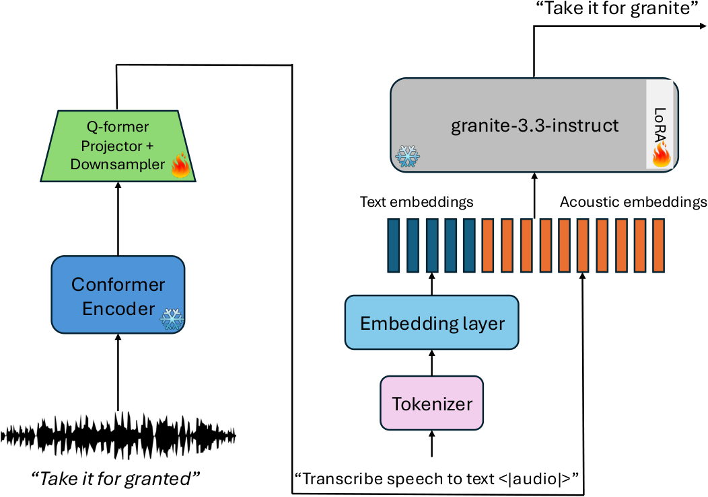

*Figure 1 · [Source](https://arxiv.org/abs/2505.08699)*

### Granite Speech 4.0

Speech-aligned Granite backbone.

[Model card](https://huggingface.co/ibm-granite/granite-4.0-1b-speech) · [Details](models/llm-asr.md#granite-speech-4-0)

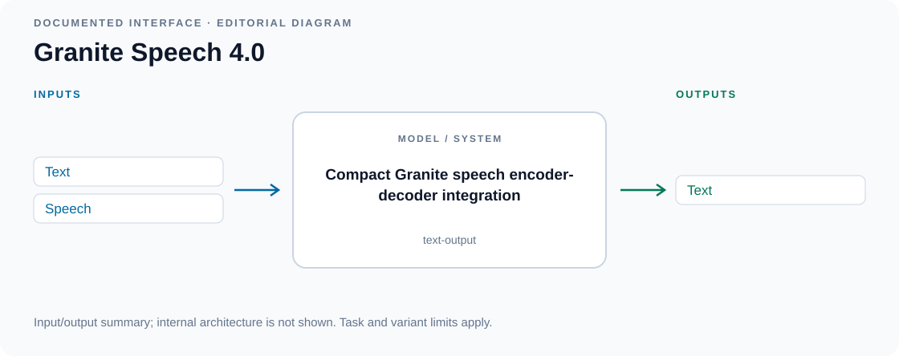

*Input/output diagram · [Source](https://huggingface.co/ibm-granite/granite-4.0-1b-speech)*

### Granite Speech 4.1

Dual-head CTC encoder and language decoder.

[Model card 1](https://huggingface.co/ibm-granite/granite-speech-4.1-2b) · [Model card 2](https://huggingface.co/ibm-granite/granite-speech-4.1-2b-plus) · [Details](models/llm-asr.md#granite-speech-4-1)

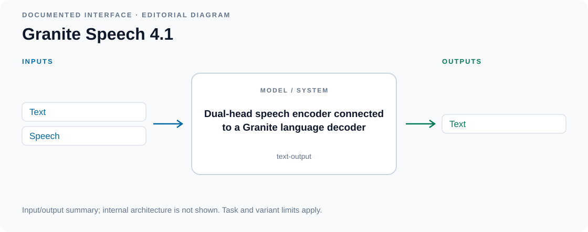

*Input/output diagram · [Source](https://huggingface.co/ibm-granite/granite-speech-4.1-2b)*

### Grok Voice Think Fast

Voice reasoning model; internals partly disclosed.

[Docs](https://docs.x.ai/developers/model-capabilities/audio/speech-to-speech) · [Announcement](https://x.ai/news/grok-voice-think-fast-2) · [Details](models/speech-dialogue.md#grok-voice-think-fast)

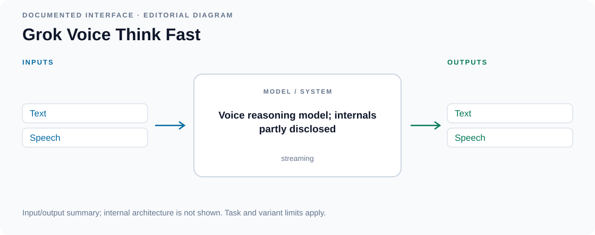

*Input/output diagram · [Source](https://docs.x.ai/developers/model-capabilities/audio/speech-to-speech)*

### GroundingGPT

Multimodal grounding.

[Paper](https://arxiv.org/abs/2401.06071) · [Details](models/omni.md#groundinggpt)

*Figure 1 · [Source](https://arxiv.org/abs/2401.06071)*

### GSLM

Discrete speech-unit LM.

[Paper](https://arxiv.org/abs/2102.01192) · [Details](models/speech-foundations.md#gslm)

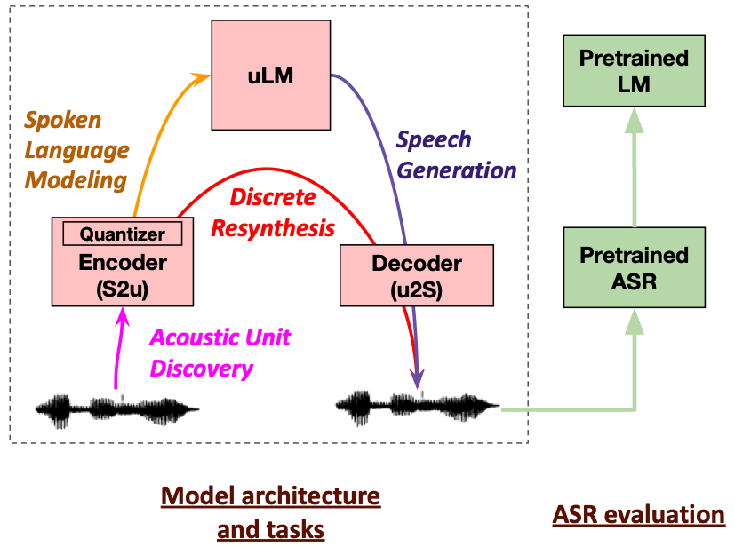

*Figure 1 · [Source](https://arxiv.org/abs/2102.01192)*

### Hibiki

Decoder-only multistream speech translation.

[Paper](https://arxiv.org/abs/2502.03382) · [Details](models/speech-foundations.md#hibiki)

*Figure 2 · [Source](https://arxiv.org/abs/2502.03382)*

### Higgs Audio v2

Text/audio language model with audio heads.

[Model card](https://huggingface.co/bosonai/higgs-audio-v2-generation-3B-base) · [Details](models/speech-generation.md#higgs-audio-v2)

*Official architecture diagram · [Source](https://huggingface.co/bosonai/higgs-audio-v2-generation-3B-base)*

### Higgs Audio v2.5

Higgs speech-generation family.

[Announcement](https://www.boson.ai/blog/higgs-audio-v2.5) · [Details](models/speech-generation.md#higgs-audio-v2-5)

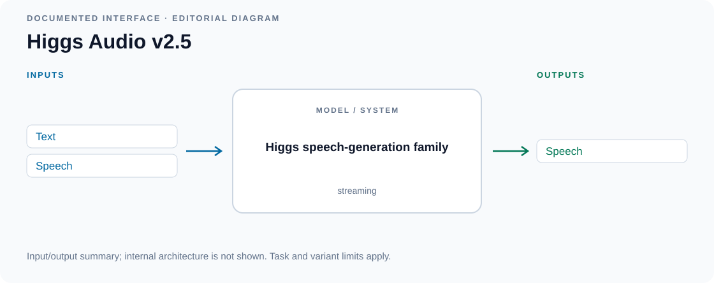

*Input/output diagram · [Source](https://www.boson.ai/blog/higgs-audio-v2.5)*

### Higgs Audio v3 TTS

Higgs speech-generation family; internals partly disclosed.

[Model card](https://huggingface.co/bosonai/higgs-tts-3-4b) · [Details](models/speech-generation.md#higgs-audio-v3-tts)

*Official architecture diagram · [Source](https://huggingface.co/bosonai/higgs-tts-3-4b)*

### HumanOmni

Human-centered visual branches and audio fusion.

[Paper](https://arxiv.org/abs/2501.15111) · [Details](models/omni.md#humanomni)

*Figure 1 · [Source](https://arxiv.org/abs/2501.15111)*

### HumanOmniV2

Context-aware reasoning and RL.

[Paper](https://arxiv.org/abs/2506.21277) · [Details](models/omni.md#humanomniv2)

*Figure 4 · [Source](https://arxiv.org/abs/2506.21277)*

### Hume EVI 2

Speech-language model.

[Announcement](https://www.hume.ai/blog/evi2-vs-gpt4ovoice) · [Details](models/speech-dialogue.md#hume-evi-2)

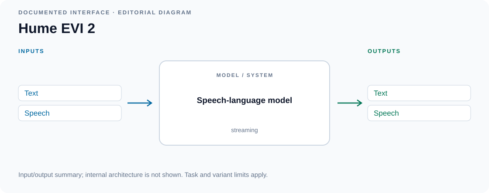

*Input/output diagram · [Source](https://www.hume.ai/blog/evi2-vs-gpt4ovoice)*

### Hume EVI 3

Expressive speech-language model.

[Announcement](https://www.hume.ai/blog/introducing-evi-3) · [Details](models/speech-dialogue.md#hume-evi-3)

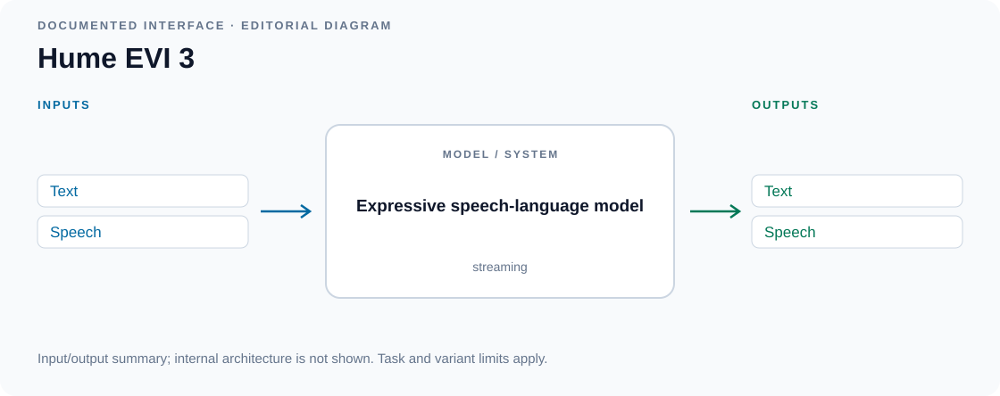

*Input/output diagram · [Source](https://www.hume.ai/blog/introducing-evi-3)*

### Hume EVI 4-mini

Octave 2 with a supplemental LLM.

[Docs](https://dev.hume.ai/changelog) · [Details](models/related.md#hume-evi-4-mini)

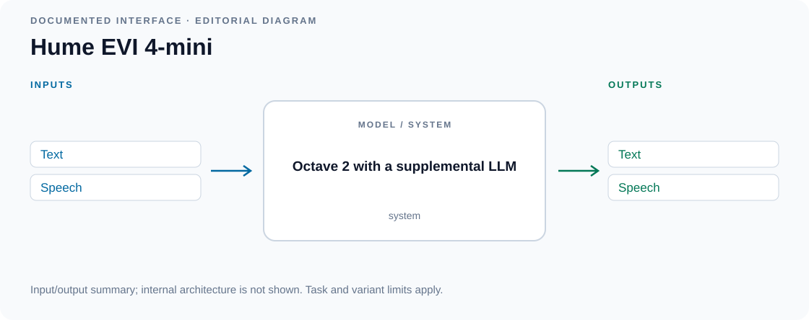

*Input/output diagram · [Source](https://dev.hume.ai/changelog)*

### Hume OCTAVE (research model)

Joint speech-language persona modeling.

[Announcement](https://www.hume.ai/blog/introducing-octave) · [Details](models/speech-dialogue.md#hume-octave-research-model)

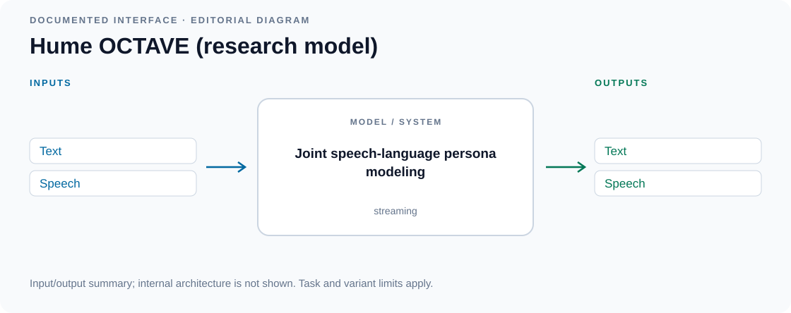

*Input/output diagram · [Source](https://www.hume.ai/blog/introducing-octave)*

### Hume Octave TTS

LLM-based expressive speech synthesis.

[Docs](https://dev.hume.ai/docs/text-to-speech-tts/overview) · [Details](models/speech-generation.md#hume-octave-tts)

*Input/output diagram · [Source](https://dev.hume.ai/docs/text-to-speech-tts/overview)*

### ImageBind-LLM

Shared embedding alignment.

[Paper](https://arxiv.org/abs/2309.03905) · [Details](models/omni.md#imagebind-llm)

*Figure 2 · [Source](https://arxiv.org/abs/2309.03905)*

### IndexTTS

Autoregressive acoustic generation.

[Paper](https://arxiv.org/abs/2502.05512) · [Details](models/speech-generation.md#indextts)

*Figure 1 · [Source](https://arxiv.org/abs/2502.05512)*

### IndexTTS 2.5

Text-to-semantic LM and non-AR acoustic decoder.

[Paper](https://arxiv.org/abs/2601.03888) · [Details](models/speech-generation.md#indextts-2-5)

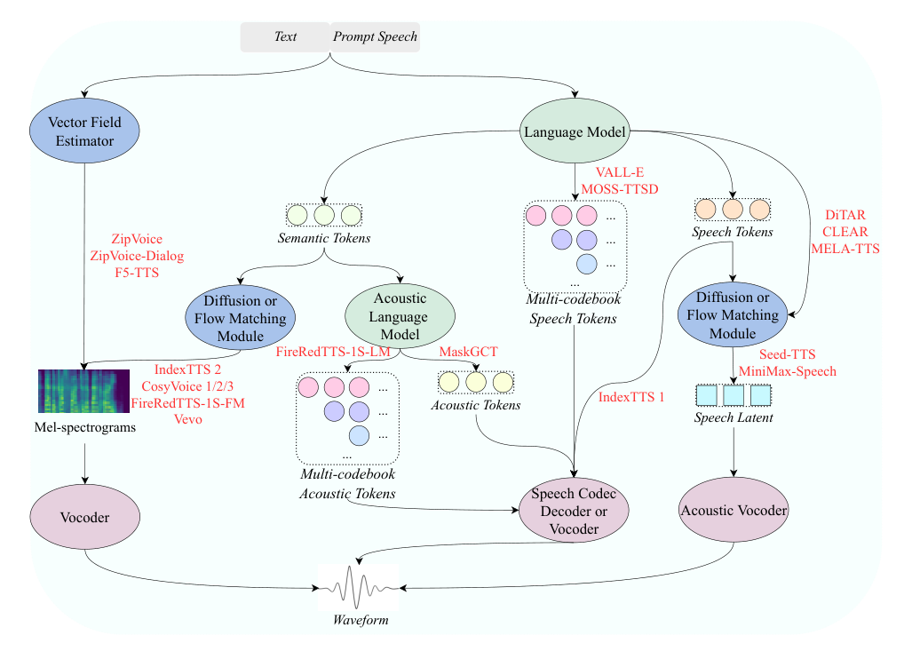

*Figure 1 · [Source](https://arxiv.org/abs/2601.03888)*

### IndexTTS2

Duration-controlled autoregressive synthesis.

[Paper](https://arxiv.org/abs/2506.21619) · [Details](models/speech-generation.md#indextts2)

*Figure 1 · [Source](https://arxiv.org/abs/2506.21619)*

### InteractiveOmni

Encoders, LLM and speech decoder.

[Paper](https://arxiv.org/abs/2510.13747) · [Details](models/omni.md#interactiveomni)

*Figure 3 · [Source](https://arxiv.org/abs/2510.13747)*

### InternOmni

InternVL extended with audio.

[Announcement](https://internvl.github.io/blog/2024-07-27-InternOmni) · [Details](models/omni.md#internomni)

*Input/output diagram · [Source](https://internvl.github.io/blog/2024-07-27-InternOmni)*

### IntrinsicVoice

GroupFormer.

[Paper](https://arxiv.org/abs/2410.08035) · [Details](models/speech-dialogue.md#intrinsicvoice)

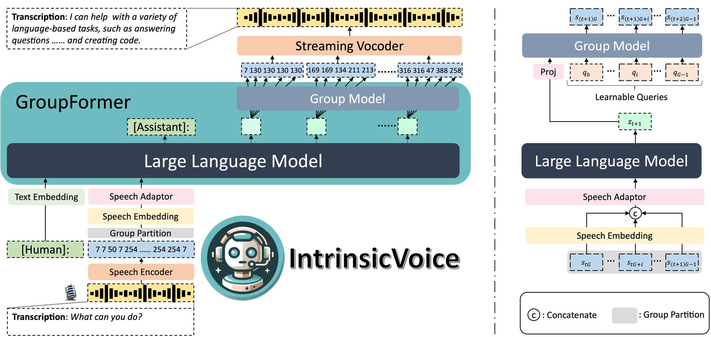

*Figure 1 · [Source](https://arxiv.org/abs/2410.08035)*

### Kimi-Audio

Continuous input and discrete output.

[Paper](https://arxiv.org/abs/2504.18425) · [Details](models/speech-dialogue.md#kimi-audio)

*Figure 2 · [Source](https://arxiv.org/abs/2504.18425)*

### Kyutai STT (DSM)

Delayed Streams Modeling.

[Paper](https://arxiv.org/abs/2509.08753) · [Repository](https://github.com/kyutai-labs/delayed-streams-modeling) · [Details](models/llm-asr.md#kyutai-stt-dsm)

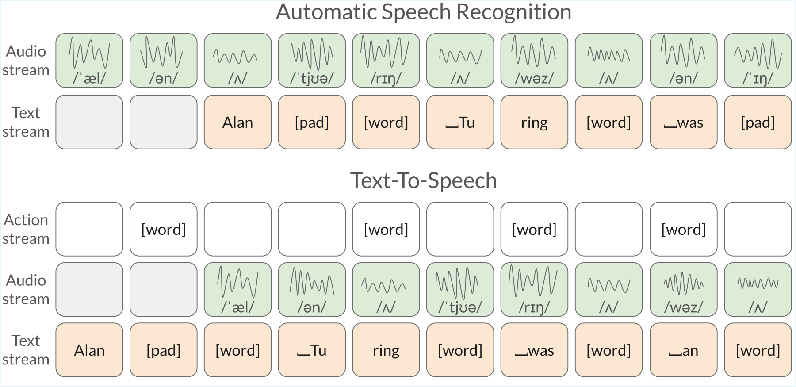

*Figure 1 · [Source](https://arxiv.org/abs/2509.08753)*

### Kyutai TTS (DSM)

Delayed Streams Modeling.

[Paper](https://arxiv.org/abs/2509.08753) · [Repository](https://github.com/kyutai-labs/delayed-streams-modeling) · [Details](models/speech-generation.md#kyutai-tts-dsm)

*Figure 1 · [Source](https://arxiv.org/abs/2509.08753)*

### LauraGPT

Continuous input and codec output.

[Paper](https://arxiv.org/abs/2310.04673) · [Details](models/speech-foundations.md#lauragpt)

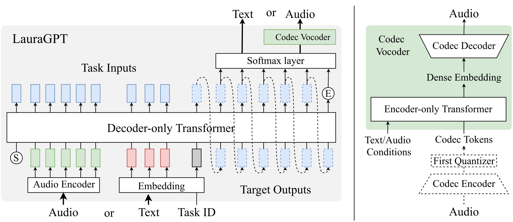

*Figure 1 · [Source](https://arxiv.org/abs/2310.04673)*

### LFM2-Audio

Hybrid backbone with audio modules.

[Repository](https://github.com/Liquid4All/liquid-audio) · [Paper](https://arxiv.org/abs/2511.23404) · [Details](models/speech-dialogue.md#lfm2-audio)

*Figure 7 · [Source](https://arxiv.org/abs/2511.23404)*

### Llama-AVSR

Audio/video encoders and LoRA.

[Paper](https://arxiv.org/abs/2409.12319) · [Details](models/llm-asr.md#llama-avsr)

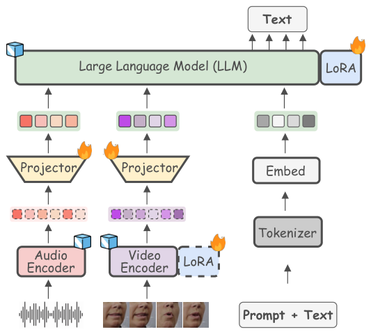

*Figure 1, PDF p. 2 · [Source](https://arxiv.org/abs/2409.12319)*

### Llama-MTSK

Matryoshka multimodal representations.

[Paper](https://arxiv.org/abs/2503.06362) · [Details](models/llm-asr.md#llama-mtsk)

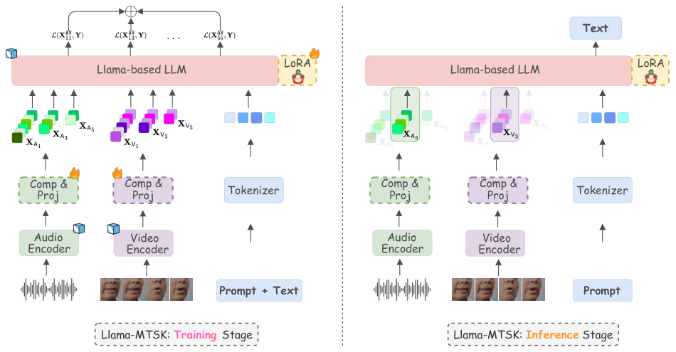

*Figure 1, PDF p. 3 · [Source](https://arxiv.org/abs/2503.06362)*

### LLaMA-Omni

Speech encoder and non-autoregressive speech decoder.

[Paper](https://arxiv.org/abs/2409.06666) · [Details](models/speech-dialogue.md#llama-omni)

*Figure 2 · [Source](https://arxiv.org/abs/2409.06666)*

### LLaMA-Omni 2

Qwen2.5 backbone and autoregressive speech decoder.

[Paper](https://arxiv.org/abs/2505.02625) · [Details](models/speech-dialogue.md#llama-omni-2)

*Figure 1 · [Source](https://arxiv.org/abs/2505.02625)*

### LLark

Music representations and text LLM.

[Paper](https://arxiv.org/abs/2310.07160) · [Details](models/audio-understanding.md#llark)

*Figure 1 · [Source](https://arxiv.org/abs/2310.07160)*

### Llasa

Single-codebook codec and Llama.

[Paper](https://arxiv.org/abs/2502.04128) · [Details](models/speech-generation.md#llasa)

*Input/output diagram · [Source](https://arxiv.org/abs/2502.04128)*

### Llasa+

Llasa with multi-token prediction.

[Paper](https://arxiv.org/abs/2508.06262) · [Details](models/speech-generation.md#llasa-plus)

*Figure 1 · [Source](https://arxiv.org/abs/2508.06262)*

### LLaSM

Speech-language instruction alignment.

[Paper](https://arxiv.org/abs/2308.15930) · [Details](models/audio-understanding.md#llasm)

*Figure 1 · [Source](https://arxiv.org/abs/2308.15930)*

### LongCat-Flash-Omni

MoE with perception and speech modules.

[Paper](https://arxiv.org/abs/2511.00279) · [Details](models/omni.md#longcat-flash-omni)

*Figure 2 · [Source](https://arxiv.org/abs/2511.00279)*

### LongCat-Next

Unified discrete tokens.

[Paper](https://arxiv.org/abs/2603.27538) · [Repository](https://github.com/meituan-longcat/LongCat-Next) · [Details](models/omni.md#longcat-next)

*Figure 2 · [Source](https://arxiv.org/abs/2603.27538)*

### LSLM

Listening and speaking channels.

[Paper](https://arxiv.org/abs/2408.02622) · [Details](models/speech-dialogue.md#lslm)

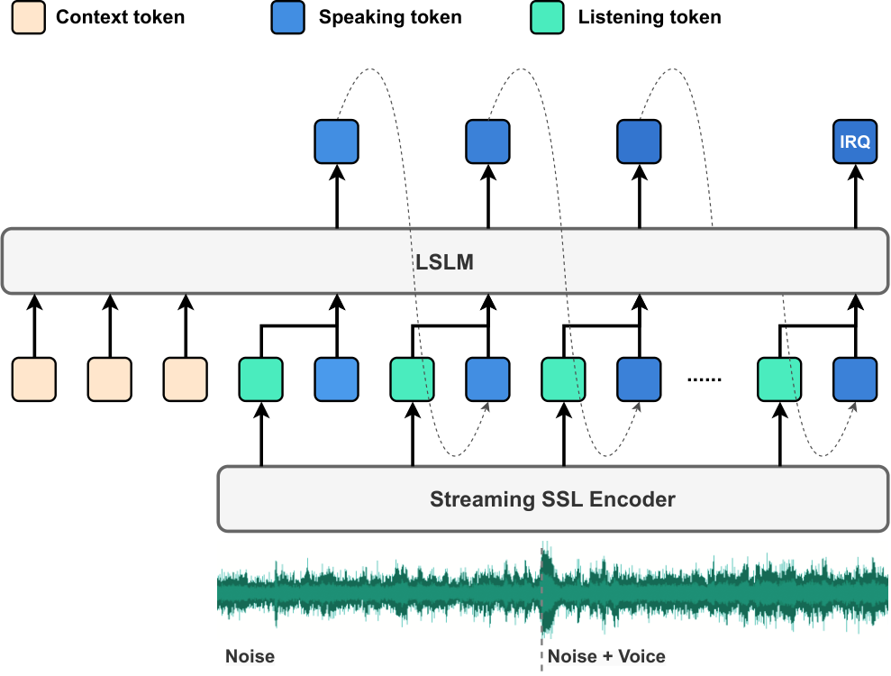

*Figure 2 · [Source](https://arxiv.org/abs/2408.02622)*

### LTU

Audio encoder and language model.

[Paper](https://arxiv.org/abs/2305.10790) · [Details](models/audio-understanding.md#ltu)

*Figure 1 · [Source](https://arxiv.org/abs/2305.10790)*

### LTU-AS

Whisper and LLaMA.

[Paper](https://arxiv.org/abs/2309.14405) · [Details](models/audio-understanding.md#ltu-as)

*Figure 1 · [Source](https://arxiv.org/abs/2309.14405)*

### LUCY

End-to-end expressive speech interaction.

[Paper](https://arxiv.org/abs/2501.16327) · [Details](models/speech-dialogue.md#lucy)

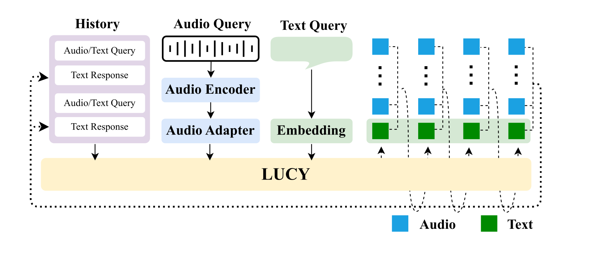

*Figure 1 · [Source](https://arxiv.org/abs/2501.16327)*

### Lychee-FD

Hierarchical semantic/acoustic modeling.

[Paper](https://arxiv.org/abs/2607.06540) · [Details](models/speech-dialogue.md#lychee-fd)

*Figure 3 · [Source](https://arxiv.org/abs/2607.06540)*

### Lyra

Multimodal adapters and speech decoder.

[Paper](https://arxiv.org/abs/2412.09501) · [Details](models/omni.md#lyra)

*Figure 2 · [Source](https://arxiv.org/abs/2412.09501)*

### M2-omni

Unified multimodal sequence modeling.

[Paper](https://arxiv.org/abs/2502.18778) · [Details](models/omni.md#m2-omni)

*Figure 2 · [Source](https://arxiv.org/abs/2502.18778)*

### Macaw-LLM

Modality, alignment and language modules.

[Paper](https://arxiv.org/abs/2306.09093) · [Details](models/omni.md#macaw-llm)

*Figure 1 · [Source](https://arxiv.org/abs/2306.09093)*

### MaskGCT

Masked generative codec transformers.

[Paper](https://arxiv.org/abs/2409.00750) · [Details](models/speech-generation.md#maskgct)

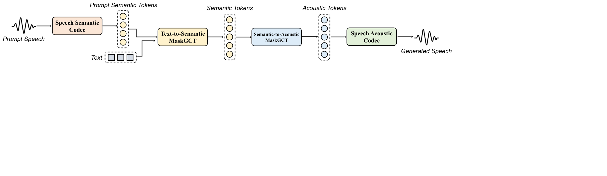

*Figure 1 · [Source](https://arxiv.org/abs/2409.00750)*

### Meerkat

Optimal-transport alignment and cross-attention.

[Paper](https://arxiv.org/abs/2407.01851) · [Details](models/omni.md#meerkat)

*Figure 2 · [Source](https://arxiv.org/abs/2407.01851)*

### Mega-TTS

Disentangled speech factors and prosody LM.

[Paper](https://arxiv.org/abs/2306.03509) · [Details](models/speech-generation.md#mega-tts)

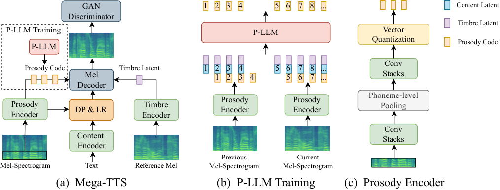

*Figure 1 · [Source](https://arxiv.org/abs/2306.03509)*

### Mega-TTS 2

Prosody language model and multi-sentence prompting.

[Paper](https://arxiv.org/abs/2307.07218) · [Details](models/speech-generation.md#mega-tts-2)

*Figure 1 · [Source](https://arxiv.org/abs/2307.07218)*

### Megrez-Omni

Compact multimodal understanding model.

[Paper](https://arxiv.org/abs/2502.15803) · [Details](models/omni.md#megrez-omni)

*Figure 2 · [Source](https://arxiv.org/abs/2502.15803)*

### Mellow

Compact audio-language model.

[Paper](https://arxiv.org/abs/2503.08540) · [Details](models/audio-understanding.md#mellow)

*Figure 2 · [Source](https://arxiv.org/abs/2503.08540)*

### MERaLiON-AudioLLM

Speech-text alignment.

[Paper](https://arxiv.org/abs/2412.09818) · [Details](models/audio-understanding.md#meralion-audiollm)

*Figure 1 · [Source](https://arxiv.org/abs/2412.09818)*

### MiDashengLM

Dasheng audio encoder and language model.

[Paper](https://arxiv.org/abs/2508.03983) · [Details](models/audio-understanding.md#midashenglm)

*Figure 2 · [Source](https://arxiv.org/abs/2508.03983)*

### MiMo-Audio

Large-scale audio language pretraining.

[Paper](https://arxiv.org/abs/2512.23808) · [Details](models/speech-dialogue.md#mimo-audio)

*Figure 3 · [Source](https://arxiv.org/abs/2512.23808)*

### MiMo-V2-Omni

Shared backbone and dedicated multimodal encoders.

[Project](https://mimo.xiaomi.com/mimo-v2-omni) · [Details](models/omni.md#mimo-v2-omni)

*Input/output diagram · [Source](https://mimo.xiaomi.com/mimo-v2-omni)*

### MiMo-V2.5

Hybrid-attention MoE with vision/audio encoders.

[Model card](https://huggingface.co/XiaomiMiMo/MiMo-V2.5) · [Details](models/omni.md#mimo-v2-5)

*Official architecture diagram · [Source](https://huggingface.co/XiaomiMiMo/MiMo-V2.5)*

### MiMo-V2.5-ASR

Audio encoder and language decoder.

[Repository](https://github.com/XiaomiMiMo/MiMo-V2.5-ASR) · [Details](models/llm-asr.md#mimo-v2-5-asr)

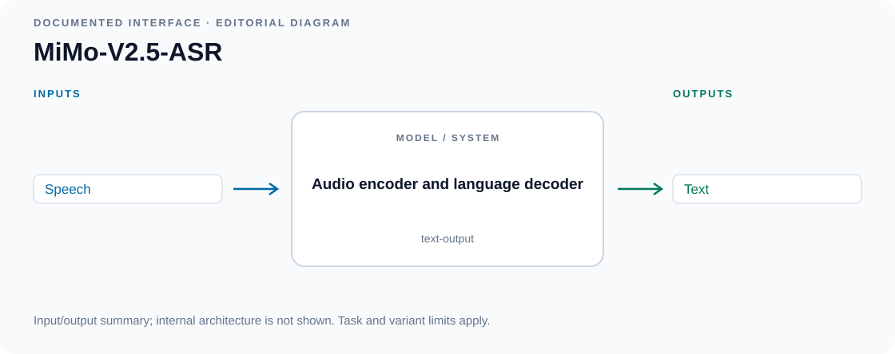

*Input/output diagram · [Source](https://github.com/XiaomiMiMo/MiMo-V2.5-ASR)*

### Ming-Flash-Omni

Sparse MoE and generative heads.

[Paper](https://arxiv.org/abs/2510.24821) · [Details](models/omni.md#ming-flash-omni)

*Figure 2 · [Source](https://arxiv.org/abs/2510.24821)*

### Ming-Flash-Omni 2.0

MoE with continuous autoregression.

[Repository](https://github.com/inclusionAI/Ming) · [Details](models/omni.md#ming-flash-omni-2-0)

*Official architecture diagram · [Source](https://github.com/inclusionAI/Ming)*

### Ming-Omni

Modality-routed MoE and output decoders.

[Paper](https://arxiv.org/abs/2506.09344) · [Details](models/omni.md#ming-omni)

*Figure 2 · [Source](https://arxiv.org/abs/2506.09344)*

### Mini-Omni

Parallel text/audio token generation.

[Paper](https://arxiv.org/abs/2408.16725) · [Details](models/speech-dialogue.md#mini-omni)

*Figure 1 · [Source](https://arxiv.org/abs/2408.16725)*

### Mini-Omni2

Parallel text/audio generation.

[Paper](https://arxiv.org/abs/2410.11190) · [Details](models/omni.md#mini-omni2)

*Figure 1 · [Source](https://arxiv.org/abs/2410.11190)*

### MiniCPM-o 2.6

Vision-language backbone and audio modules.

[Repository](https://github.com/OpenBMB/MiniCPM-o) · [Details](models/omni.md#minicpm-o-2-6)

*Official architecture diagram · [Source](https://github.com/OpenBMB/MiniCPM-o)*

### MiniCPM-o 4.5

Full-duplex multimodal interaction.

[Paper](https://arxiv.org/abs/2604.27393) · [Details](models/omni.md#minicpm-o-4-5)

*Figure 4 · [Source](https://arxiv.org/abs/2604.27393)*

### MiniMax-Speech

Autoregressive Transformer and Flow-VAE.

[Paper](https://arxiv.org/abs/2505.07916) · [Details](models/speech-generation.md#minimax-speech)

*Figure 1 · [Source](https://arxiv.org/abs/2505.07916)*

### MiniMind-O

Thinker–Talker.

[Paper](https://arxiv.org/abs/2605.03937) · [Repository](https://github.com/jingyaogong/minimind-o) · [Details](models/omni.md#minimind-o)

*Figure 1 · [Source](https://arxiv.org/abs/2605.03937)*

### MinMo

Staged speech and duplex alignment.

[Paper](https://arxiv.org/abs/2501.06282) · [Details](models/speech-dialogue.md#minmo)

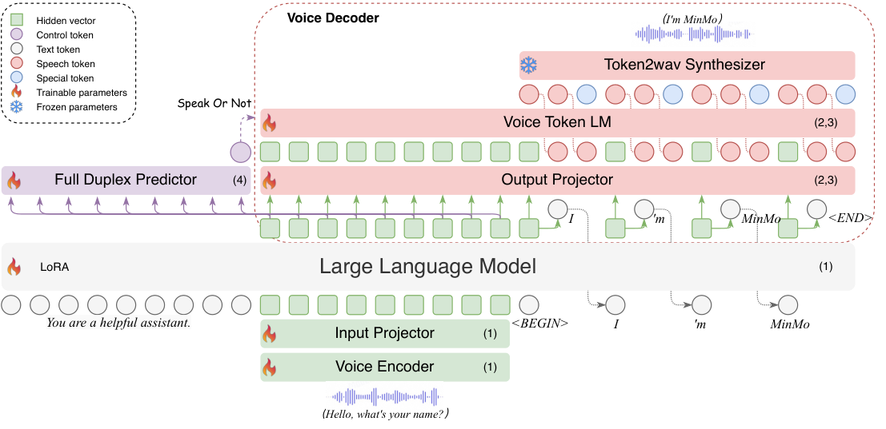

*Figure 3 · [Source](https://arxiv.org/abs/2501.06282)*

### MIO

Autoregressive multimodal tokens.

[Paper](https://arxiv.org/abs/2409.17692) · [Details](models/omni.md#mio)

*Figure 1 · [Source](https://arxiv.org/abs/2409.17692)*

### MLLM-Tool

Multimodal encoders and tool-selecting LLM.

[Paper](https://arxiv.org/abs/2401.10727) · [Details](models/omni.md#mllm-tool)

*Figure 4 · [Source](https://arxiv.org/abs/2401.10727)*

### MMS-LLaMA

Early fusion and speech Q-Former.

[Paper](https://arxiv.org/abs/2503.11315) · [Details](models/llm-asr.md#mms-llama)

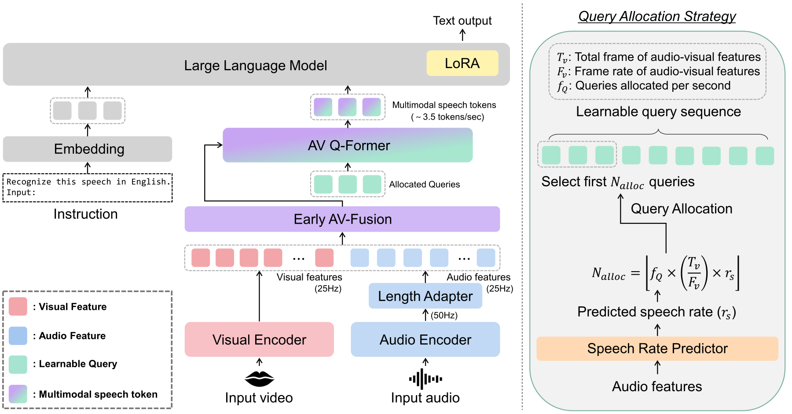

*Figure 1 · [Source](https://arxiv.org/abs/2503.11315)*

### ModaVerse

LLM-directed external generators.

[Paper](https://arxiv.org/abs/2401.06395) · [Details](models/omni.md#modaverse)

*Figure 3 · [Source](https://arxiv.org/abs/2401.06395)*

### ModelCompose

Composition of modality-specific models.

[Paper](https://arxiv.org/abs/2402.12750) · [Details](models/omni.md#modelcompose)

*Figure 2 · [Source](https://arxiv.org/abs/2402.12750)*

### MoME

Mixture of Matryoshka experts.

[Paper](https://arxiv.org/abs/2510.04136) · [Details](models/llm-asr.md#mome)

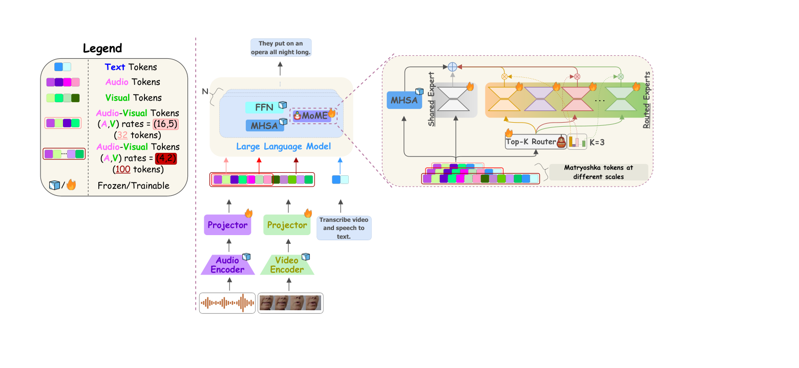

*Figure 2 · [Source](https://arxiv.org/abs/2510.04136)*

### Moshi

Temporal/depth transformers and Mimi.

[Paper](https://arxiv.org/abs/2410.00037) · [Details](models/speech-dialogue.md#moshi)

*Figure 1 · [Source](https://arxiv.org/abs/2410.00037)*

### MoshiVis

Visual adapters on Moshi.

[Paper](https://arxiv.org/abs/2503.15633) · [Details](models/omni.md#moshivis)

*Figure 3 · [Source](https://arxiv.org/abs/2503.15633)*

### MOSS-Audio

Audio encoder, adapter and DeepStack.

[Paper](https://arxiv.org/abs/2606.01802) · [Details](models/audio-understanding.md#moss-audio)

*Figure 2 · [Source](https://arxiv.org/abs/2606.01802)*

### MOSS-Speech

Modality-based layer splitting.

[Paper](https://arxiv.org/abs/2510.00499) · [Details](models/speech-dialogue.md#moss-speech)

*Figure 3 · [Source](https://arxiv.org/abs/2510.00499)*

### MOSS-TTS

Delay-pattern LM and local Transformer alternatives.

[Paper](https://arxiv.org/abs/2603.18090) · [Repository](https://github.com/OpenMOSS/MOSS-TTS) · [Details](models/speech-generation.md#moss-tts)

*Figure 2, PDF p. 8 · [Source](https://arxiv.org/abs/2603.18090)*

### MOSS-TTS-Nano

Compact speech language model.

[Repository](https://github.com/OpenMOSS/MOSS-TTS) · [Details](models/speech-generation.md#moss-tts-nano)

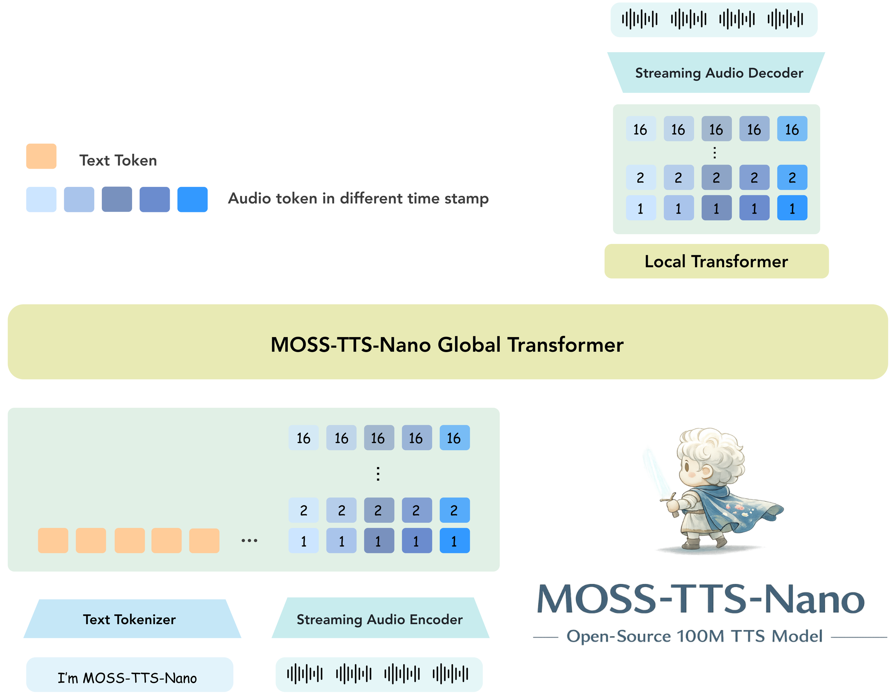

*Official architecture diagram · [Source](https://github.com/OpenMOSS/MOSS-TTS)*

### MOSS-TTS-Realtime

Streaming autoregressive speech generator.

[Repository](https://github.com/OpenMOSS/MOSS-TTS) · [Details](models/speech-generation.md#moss-tts-realtime)

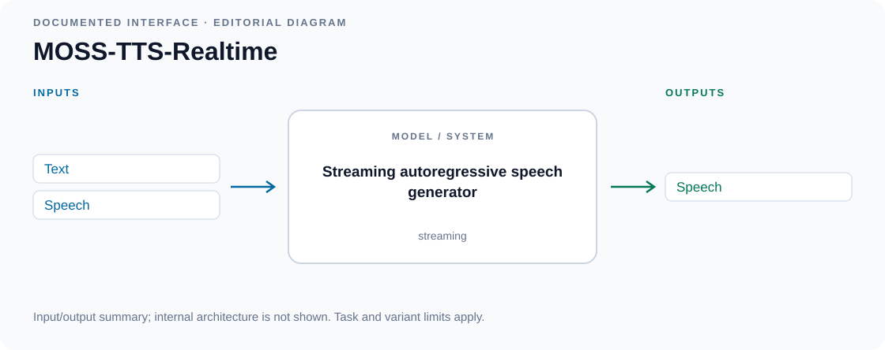

*Input/output diagram · [Source](https://github.com/OpenMOSS/MOSS-TTS)*

### MOSS-TTSD

Long-context dialogue speech LM.

[Paper](https://arxiv.org/abs/2603.19739) · [Details](models/speech-generation.md#moss-ttsd)

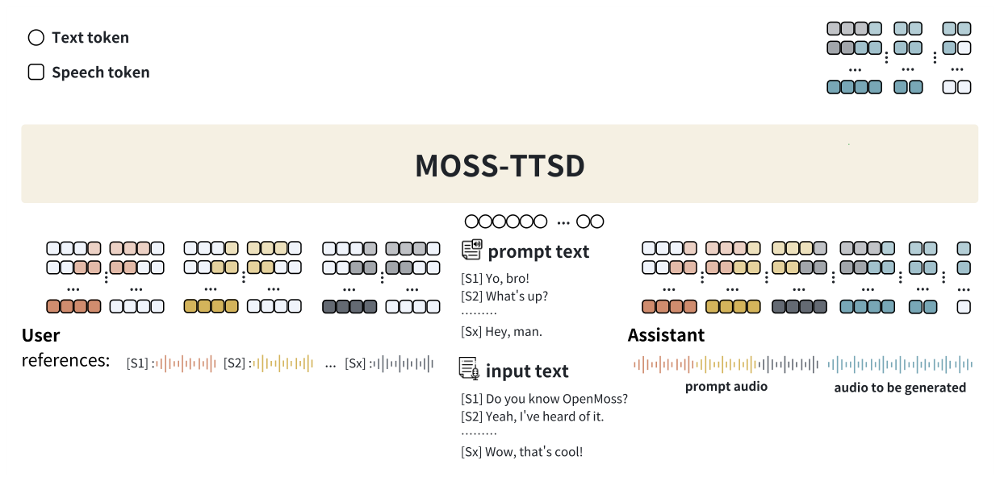

*Figure 2, PDF p. 4 · [Source](https://arxiv.org/abs/2603.19739)*

### MOSS-VoiceGenerator

Instruction-conditioned voice generation.

[Paper](https://arxiv.org/abs/2603.28086) · [Details](models/speech-generation.md#moss-voicegenerator)

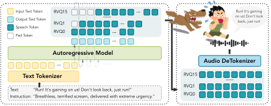

*Figure 1 · [Source](https://arxiv.org/abs/2603.28086)*

### mSLAM

Joint speech-text masked pretraining.

[Paper](https://arxiv.org/abs/2202.01374) · [Details](models/speech-foundations.md#mslam)

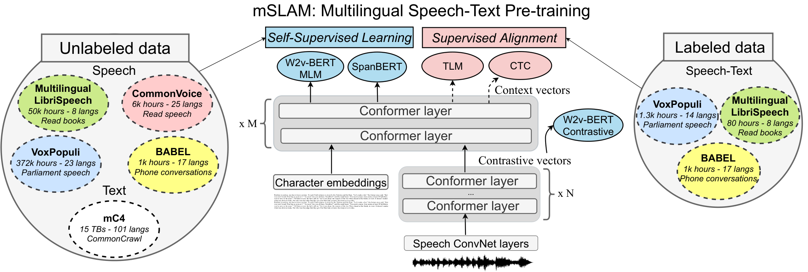

*Figure 1 · [Source](https://arxiv.org/abs/2202.01374)*

### MU-LLaMA

MERT and language model.

[Paper](https://arxiv.org/abs/2308.11276) · [Details](models/audio-understanding.md#mu-llama)

*Figure 1 · [Source](https://arxiv.org/abs/2308.11276)*

### MultiPLY

Multisensory embodied LLM.

[Paper](https://arxiv.org/abs/2401.08577) · [Details](models/omni.md#multiply)

*Figure 3 · [Source](https://arxiv.org/abs/2401.08577)*

### MuMu-LLaMA

Multimodal LLM and music generators.

[Paper](https://arxiv.org/abs/2412.06660) · [Details](models/omni.md#mumu-llama)

*Figure 2, PDF p. 3 · [Source](https://arxiv.org/abs/2412.06660)*

### Music Flamingo

Music-language reasoning model.

[Paper](https://arxiv.org/abs/2511.10289) · [Details](models/audio-understanding.md#music-flamingo)

*Figure 2 · [Source](https://arxiv.org/abs/2511.10289)*

### MusiLingo

MERT-to-LLM projection.

[Paper](https://arxiv.org/abs/2309.08730) · [Details](models/audio-understanding.md#musilingo)

*Figure 1 · [Source](https://arxiv.org/abs/2309.08730)*

### NExT-GPT

Multimodal adapters and diffusion decoders.

[Paper](https://arxiv.org/abs/2309.05519) · [Details](models/omni.md#next-gpt)

*Figure 1, PDF p. 2 · [Source](https://arxiv.org/abs/2309.05519)*

### NExT-OMNI

Discrete flow matching.

[Paper](https://arxiv.org/abs/2510.13721) · [Details](models/omni.md#next-omni)

*Figure 2 · [Source](https://arxiv.org/abs/2510.13721)*

### Nexus

Configurable encoder–LLM–decoder.

[Paper](https://arxiv.org/abs/2503.01879) · [Details](models/omni.md#nexus)

*Figure 1 · [Source](https://arxiv.org/abs/2503.01879)*

### OISA

Omnimodal instructed segmentation assistant.

[Paper](https://arxiv.org/abs/2507.22886) · [Details](models/omni.md#oisa)

*Figure 4 · [Source](https://arxiv.org/abs/2507.22886)*

### Ola

Progressive modality alignment.

[Paper](https://arxiv.org/abs/2502.04328) · [Details](models/omni.md#ola)

*Figure 3 · [Source](https://arxiv.org/abs/2502.04328)*

### OMCAT

Rotary time embeddings.

[Paper](https://arxiv.org/abs/2410.12109) · [Details](models/omni.md#omcat)

*Figure 2 · [Source](https://arxiv.org/abs/2410.12109)*

### Omni-AutoThink

Adaptive SFT and reinforcement learning.

[Paper](https://arxiv.org/abs/2512.03783) · [Details](models/omni.md#omni-autothink)

*Figure 1 · [Source](https://arxiv.org/abs/2512.03783)*

### Omni-AVSR

Multi-granularity training and LoRA.

[Paper](https://arxiv.org/abs/2511.07253) · [Details](models/llm-asr.md#omni-avsr)

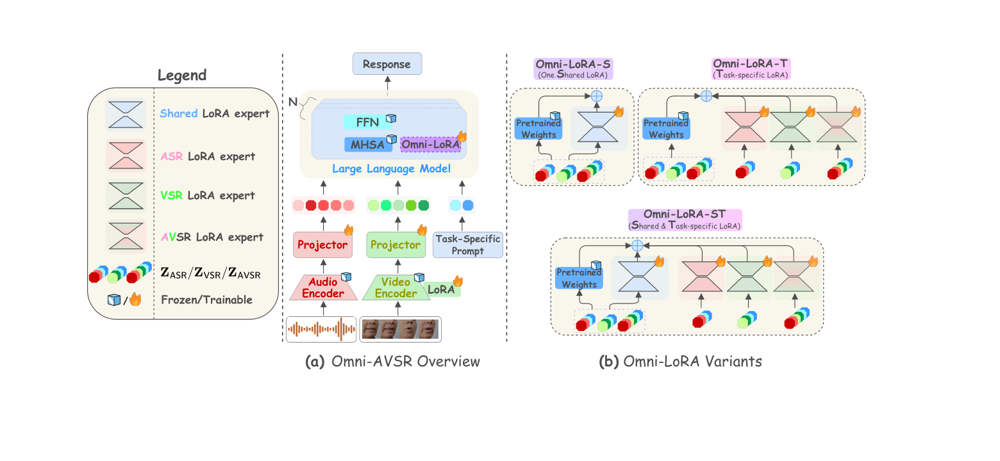

*Figure 1 · [Source](https://arxiv.org/abs/2511.07253)*

### Omni-R1 (audio reasoning)

GRPO on Qwen2.5-Omni.

[Paper](https://arxiv.org/abs/2505.09439) · [Details](models/audio-understanding.md#omni-r1-audio-reasoning)

*Input/output diagram · [Source](https://arxiv.org/abs/2505.09439)*

### Omni-R1 (two-system collaboration)

Global reasoning and detailed grounding.

[Paper](https://arxiv.org/abs/2505.20256) · [Details](models/omni.md#omni-r1-two-system-collaboration)

*Figure 1, PDF p. 2 · [Source](https://arxiv.org/abs/2505.20256)*

### Omni-RewardModel

Multimodal discriminative/generative reward models.

[Paper](https://arxiv.org/abs/2510.23451) · [Details](models/omni.md#omni-rewardmodel)

*Figure 2 · [Source](https://arxiv.org/abs/2510.23451)*

### OmniAtlas

Omni agent with tool-integrated reasoning.

[Paper](https://arxiv.org/abs/2602.22897) · [Details](models/omni.md#omniatlas)

*Figure 4 · [Source](https://arxiv.org/abs/2602.22897)*

### OmniFlatten

Flattened interleaved dialogue streams.

[Paper](https://arxiv.org/abs/2410.17799) · [Details](models/speech-dialogue.md#omniflatten)

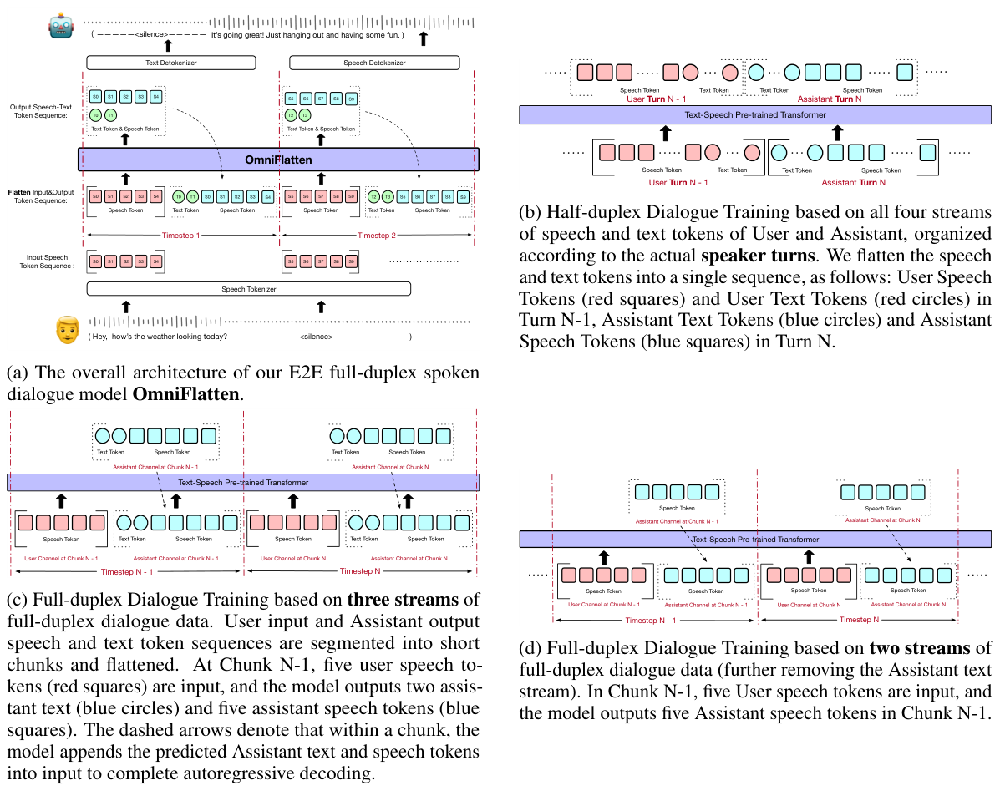

*Figure 1, PDF p. 3 · [Source](https://arxiv.org/abs/2410.17799)*

### OmniVideo-R1

Grounding and modality-aware RL.

[Paper](https://arxiv.org/abs/2602.05847) · [Details](models/omni.md#omnivideo-r1)

*Figure 2 · [Source](https://arxiv.org/abs/2602.05847)*

### OmniVinci

OmniAlignNet and temporal embeddings.

[Paper](https://arxiv.org/abs/2510.15870) · [Details](models/omni.md#omnivinci)

*Figure 2 · [Source](https://arxiv.org/abs/2510.15870)*

### OmniVoice

Discrete diffusion language model.

[Paper](https://arxiv.org/abs/2604.00688) · [Repository](https://github.com/k2-fsa/OmniVoice) · [Details](models/speech-generation.md#omnivoice)

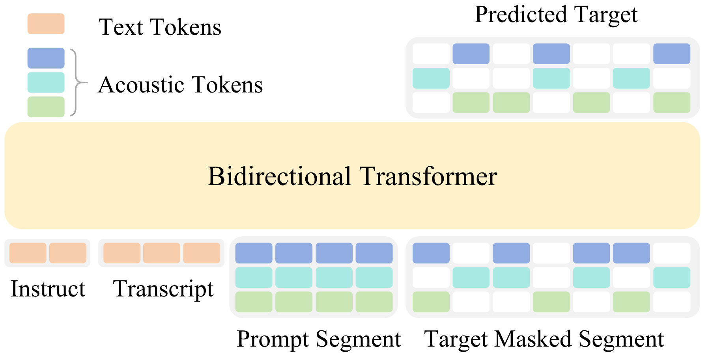

*Figure 1 · [Source](https://arxiv.org/abs/2604.00688)*

### OneLLM

Unified encoder and universal projection.

[Paper](https://arxiv.org/abs/2312.03700) · [Details](models/omni.md#onellm)

*Figure 2 · [Source](https://arxiv.org/abs/2312.03700)*

### OpenOmni

Progressive alignment and emotional speech decoder.

[Paper](https://arxiv.org/abs/2501.04561) · [Details](models/omni.md#openomni)

*Figure 1 · [Source](https://arxiv.org/abs/2501.04561)*

### OpenS2S

Interleaved streaming decoder.

[Paper](https://arxiv.org/abs/2507.05177) · [Details](models/speech-dialogue.md#opens2s)

*Figure 1 · [Source](https://arxiv.org/abs/2507.05177)*

### Orpheus TTS

Llama-based codec language model.

[Repository](https://github.com/canopyai/Orpheus-TTS) · [Details](models/speech-generation.md#orpheus-tts)

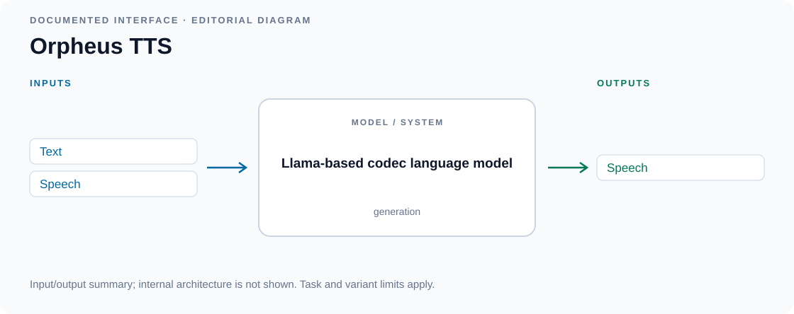

*Input/output diagram · [Source](https://github.com/canopyai/Orpheus-TTS)*

### OSUM

Whisper encoder and Qwen2.

[Paper](https://arxiv.org/abs/2501.13306) · [Details](models/audio-understanding.md#osum)

*Figure 2 · [Source](https://arxiv.org/abs/2501.13306)*

### OuteTTS

Decoder-only speech-token LM.

[Repository](https://github.com/edwko/OuteTTS) · [Details](models/speech-generation.md#outetts)

*Input/output diagram · [Source](https://github.com/edwko/OuteTTS)*

### PandaGPT

ImageBind and language adapters.

[Paper](https://arxiv.org/abs/2305.16355) · [Details](models/omni.md#pandagpt)

*Figure 1 · [Source](https://arxiv.org/abs/2305.16355)*

### Parler-TTS

Description-conditioned codec language model.

[Repository](https://github.com/huggingface/parler-tts) · [Paper](https://arxiv.org/abs/2402.01912) · [Details](models/speech-generation.md#parler-tts)

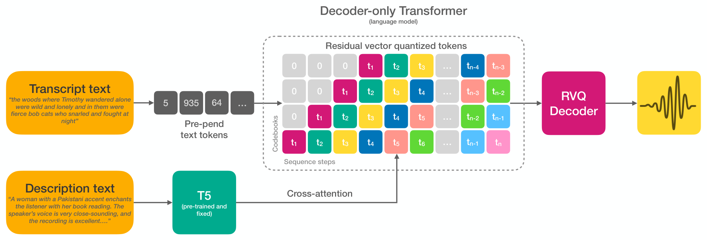

*Figure 1 · [Source](https://arxiv.org/abs/2402.01912)*

### Parrot / NTPP

Next-token-pair prediction.

[Paper](https://arxiv.org/abs/2506.00975) · [Details](models/speech-foundations.md#parrot-ntpp)

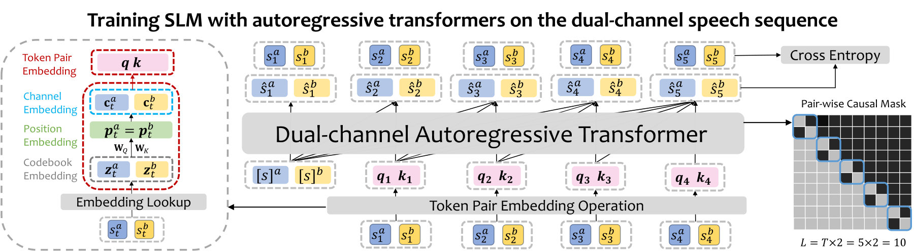

*Figure 3 · [Source](https://arxiv.org/abs/2506.00975)*

### PathWeave

Continual modality adapters and routing.

[Paper](https://arxiv.org/abs/2410.20178) · [Details](models/omni.md#pathweave)

*Figure 2 · [Source](https://arxiv.org/abs/2410.20178)*

### Pengi

Audio/text conditioning of an LM.

[Paper](https://arxiv.org/abs/2305.11834) · [Details](models/audio-understanding.md#pengi)

*Figure 2, PDF p. 3 · [Source](https://arxiv.org/abs/2305.11834)*

### PersonaPlex

Prompt-controlled duplex speech LM.

[Paper](https://arxiv.org/abs/2602.06053) · [Details](models/speech-dialogue.md#personaplex)

*Figure 1 · [Source](https://arxiv.org/abs/2602.06053)*

### pGSLM

Prosody-aware discrete speech LM.

[Paper](https://arxiv.org/abs/2109.03264) · [Details](models/speech-foundations.md#pgslm)

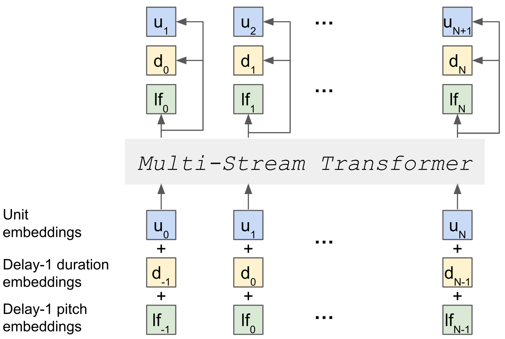

*Figure 1 · [Source](https://arxiv.org/abs/2109.03264)*

### Phi-4-multimodal

Mixture of LoRAs.

[Paper](https://arxiv.org/abs/2503.01743) · [Details](models/omni.md#phi-4-multimodal)

*Figure 1 · [Source](https://arxiv.org/abs/2503.01743)*

### Pocket TTS

Continuous autoregressive FlowLM.

[Repository](https://github.com/kyutai-labs/pocket-tts) · [Paper](https://arxiv.org/abs/2509.06926) · [Details](models/speech-generation.md#pocket-tts)

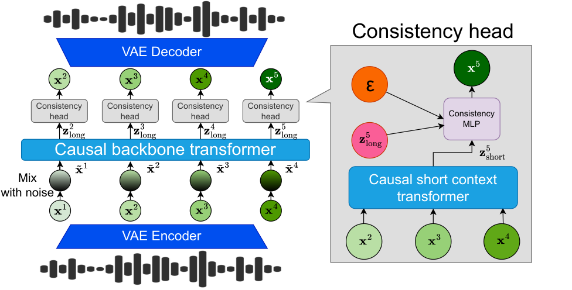

*Figure 1 · [Source](https://arxiv.org/abs/2509.06926)*

### Qwen-Audio

Audio encoder and multitask language alignment.

[Paper](https://arxiv.org/abs/2311.07919) · [Details](models/audio-understanding.md#qwen-audio)

*Figure 3 · [Source](https://arxiv.org/abs/2311.07919)*

### Qwen-Audio-3.0-Gen-Preview

Shared audio VAE and diffusion Transformer.

[Paper](https://arxiv.org/abs/2607.27011) · [Details](models/related.md#qwen-audio-3-0-gen-preview)

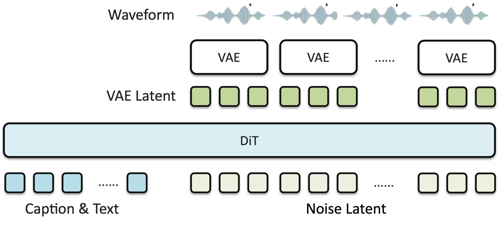

*Figure 1 · [Source](https://arxiv.org/abs/2607.27011)*

### Qwen2-Audio

Audio encoder and instruction-tuned LLM.

[Paper](https://arxiv.org/abs/2407.10759) · [Details](models/audio-understanding.md#qwen2-audio)

*Figure 2 · [Source](https://arxiv.org/abs/2407.10759)*

### Qwen2.5-Omni

Thinker–Talker and time-aligned RoPE.

[Paper](https://arxiv.org/abs/2503.20215) · [Details](models/omni.md#qwen2-5-omni)

*Figure 2 · [Source](https://arxiv.org/abs/2503.20215)*

### Qwen3-ASR

Qwen3-Omni-derived speech recognition.

[Paper](https://arxiv.org/abs/2601.21337) · [Details](models/llm-asr.md#qwen3-asr)

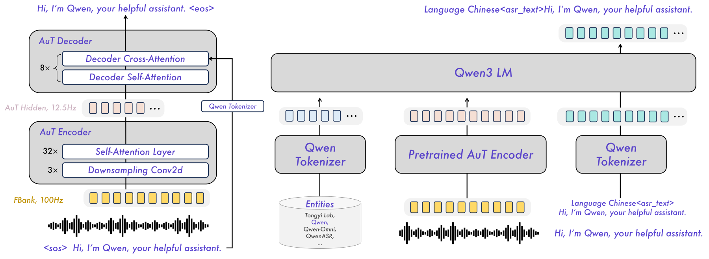

*Figure 2 · [Source](https://arxiv.org/abs/2601.21337)*

### Qwen3-Omni

Thinker–Talker MoE.

[Paper](https://arxiv.org/abs/2509.17765) · [Details](models/omni.md#qwen3-omni)

*Figure 2 · [Source](https://arxiv.org/abs/2509.17765)*

### Qwen3-TTS

Dual-track speech language model.

[Paper](https://arxiv.org/abs/2601.15621) · [Repository](https://github.com/QwenLM/Qwen3-TTS) · [Details](models/speech-generation.md#qwen3-tts)

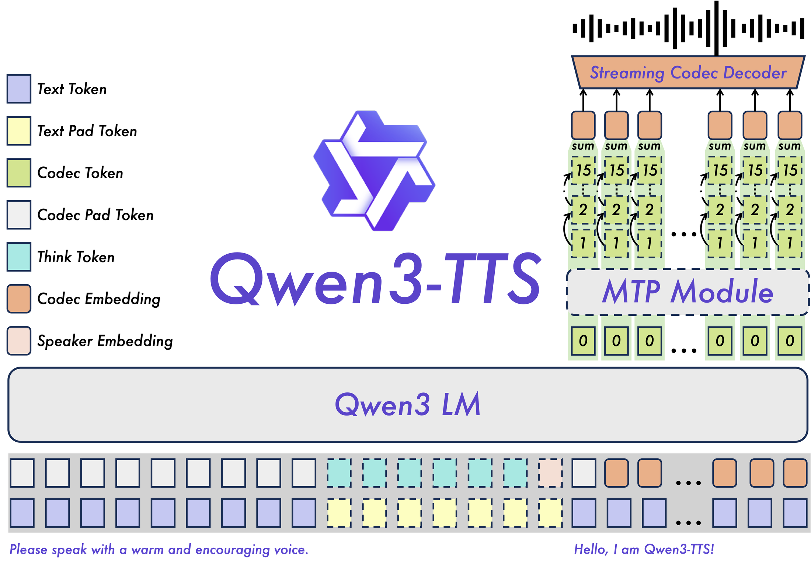

*Figure 3 · [Source](https://arxiv.org/abs/2601.15621)*

### Qwen3.5-Omni

Hybrid-attention MoE and ARIA.

[Paper](https://arxiv.org/abs/2604.15804) · [Details](models/omni.md#qwen3-5-omni)

*Figure 2 · [Source](https://arxiv.org/abs/2604.15804)*

### R1-Omni

Reinforcement learning for emotion reasoning.

[Paper](https://arxiv.org/abs/2503.05379) · [Details](models/omni.md#r1-omni)

*Input/output diagram · [Source](https://arxiv.org/abs/2503.05379)*

### RALL-E

Prosody-guided codec language modeling.

[Paper](https://arxiv.org/abs/2404.03204) · [Details](models/speech-generation.md#rall-e)

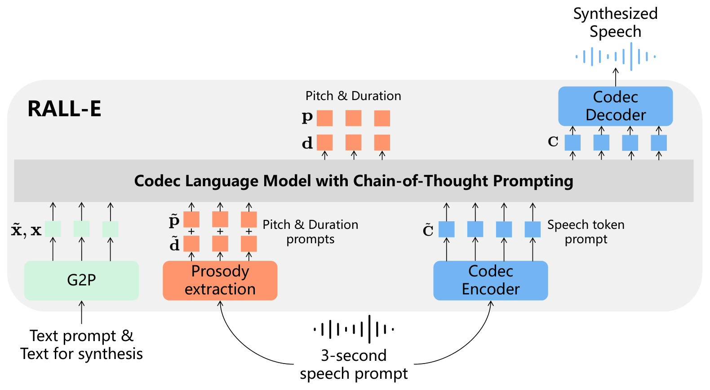

*Figure 1 · [Source](https://arxiv.org/abs/2404.03204)*

### Ref-Thinker / TGS-Agent

Think–Ground–Segment pipeline.

[Paper](https://arxiv.org/abs/2508.04418) · [Details](models/omni.md#ref-thinker-tgs-agent)

*Figure 1 · [Source](https://arxiv.org/abs/2508.04418)*

### RoboEgo

Streaming omnimodal interaction.

[Paper](https://arxiv.org/abs/2506.01934) · [Details](models/omni.md#roboego)

*Figure 2 · [Source](https://arxiv.org/abs/2506.01934)*

### RoboOmni

Perceiver–Thinker–Talker–Executor.

[Paper](https://arxiv.org/abs/2510.23763) · [Details](models/omni.md#roboomni)

*Figure 4 · [Source](https://arxiv.org/abs/2510.23763)*

### SALM

Audio encoder, adapter and frozen LLM.

[Paper](https://arxiv.org/abs/2310.09424) · [Details](models/audio-understanding.md#salm)

*Figure 1 · [Source](https://arxiv.org/abs/2310.09424)*

### SALMONN

Speech/audio encoders and LLM.

[Paper](https://arxiv.org/abs/2310.13289) · [Details](models/audio-understanding.md#salmonn)

*Figure 1 · [Source](https://arxiv.org/abs/2310.13289)*

### SALMONN-2

Self-supervised encoder and multi-layer fusion.

[Paper](https://arxiv.org/abs/2607.17079) · [Details](models/audio-understanding.md#salmonn-2)

*Figure 2 · [Source](https://arxiv.org/abs/2607.17079)*

### SALMONN-omni

Codec-free speech LLM.

[Paper](https://arxiv.org/abs/2505.17060) · [Details](models/speech-dialogue.md#salmonn-omni)

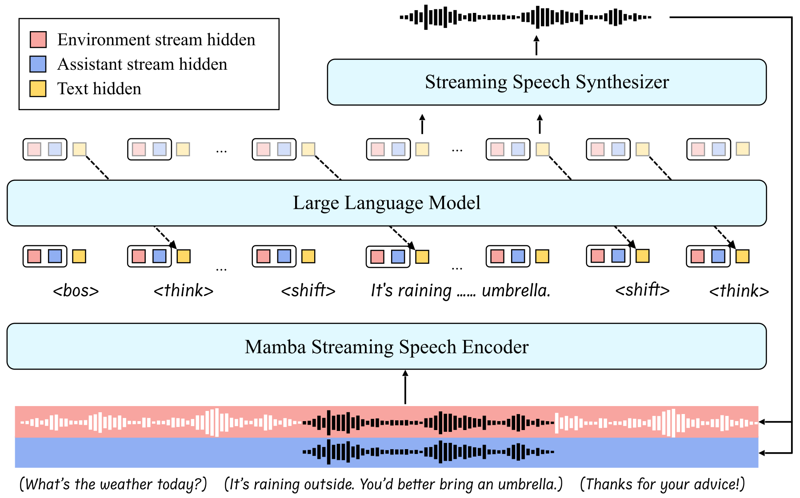

*Figure 1 · [Source](https://arxiv.org/abs/2505.17060)*

### SAVEnVideo

Synergistic audio-visual integration.

[Paper](https://arxiv.org/abs/2411.16213) · [Details](models/omni.md#savenvideo)

*Input/output diagram · [Source](https://arxiv.org/abs/2411.16213)*

### SeamlessExpressive

Expressive speech translation.

[Paper](https://arxiv.org/abs/2312.05187) · [Details](models/speech-foundations.md#seamlessexpressive)

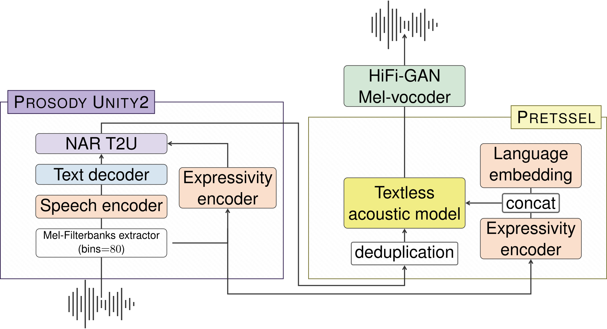

*Figure 7 · [Source](https://arxiv.org/abs/2312.05187)*

### SeamlessM4T

UnitY multilingual encoder-decoder.

[Paper](https://arxiv.org/abs/2308.11596) · [Details](models/speech-foundations.md#seamlessm4t)

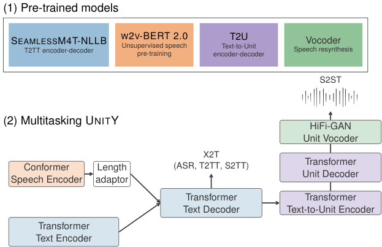

*Figure 4 · [Source](https://arxiv.org/abs/2308.11596)*

### SeamlessM4T v2

UnitY2 and non-AR text-to-unit decoding.

[Paper](https://arxiv.org/abs/2312.05187) · [Details](models/speech-foundations.md#seamlessm4t-v2)

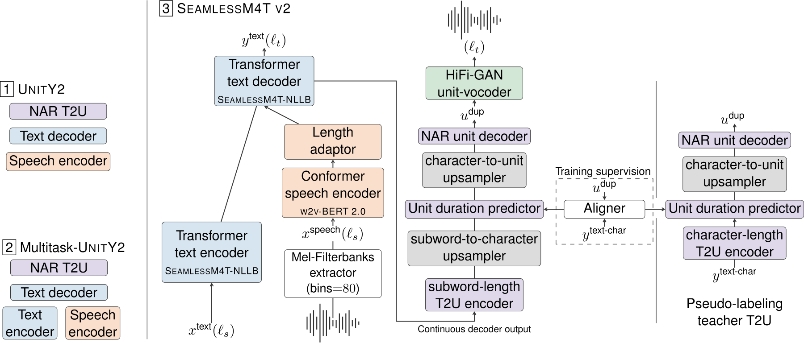

*Figure 3 · [Source](https://arxiv.org/abs/2312.05187)*

### SeamlessStreaming

Monotonic attention and streaming unit decoding.

[Paper](https://arxiv.org/abs/2312.05187) · [Details](models/speech-foundations.md#seamlessstreaming)

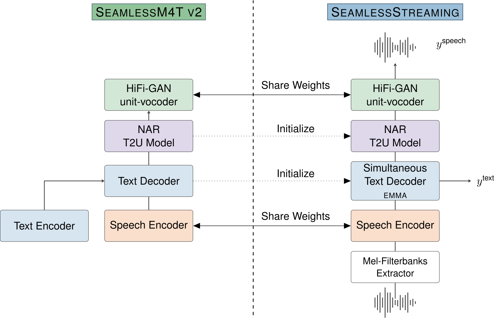

*Figure 11 · [Source](https://arxiv.org/abs/2312.05187)*

### Seed Audio 1.0

Language-model scene control and diffusion acoustics.

[Announcement](https://seed.bytedance.com/en/blog/from-speech-to-audio-creation-introducing-the-seed-audio-1-0-audio-creation-model) · [Details](models/related.md#seed-audio-1-0)

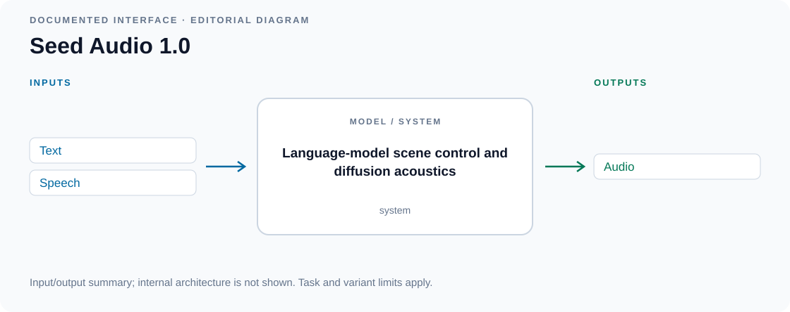

*Input/output diagram · [Source](https://seed.bytedance.com/en/blog/from-speech-to-audio-creation-introducing-the-seed-audio-1-0-audio-creation-model)*

### Seed Omni (Context Unrolling)

Unified model with cross-modal context unrolling.

[Paper](https://arxiv.org/abs/2604.21921) · [Details](models/related.md#seed-omni-context-unrolling)

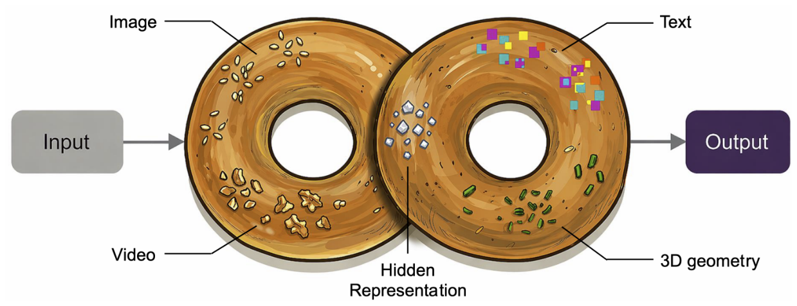

*Figure 1, PDF p. 2 · [Source](https://arxiv.org/abs/2604.21921)*

### Seed-ASR

Audio-conditioned LLM.

[Paper](https://arxiv.org/abs/2407.04675) · [Details](models/llm-asr.md#seed-asr)

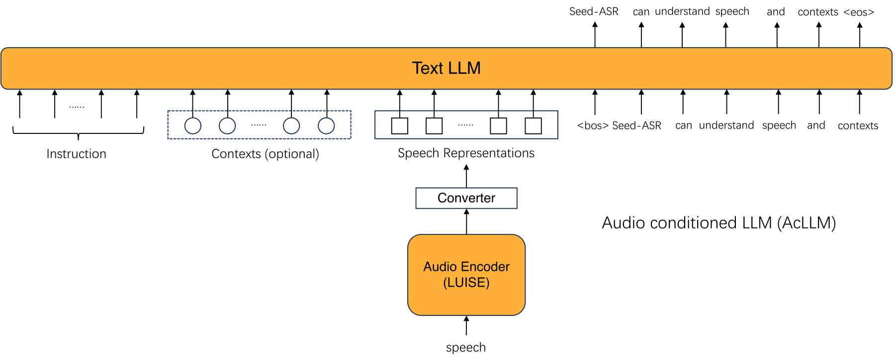

*Figure 2 · [Source](https://arxiv.org/abs/2407.04675)*

### Seed-LiveInterpret 2.0

Duplex speech translation model.

[Paper](https://arxiv.org/abs/2507.17527) · [Details](models/speech-foundations.md#seed-liveinterpret-2-0)

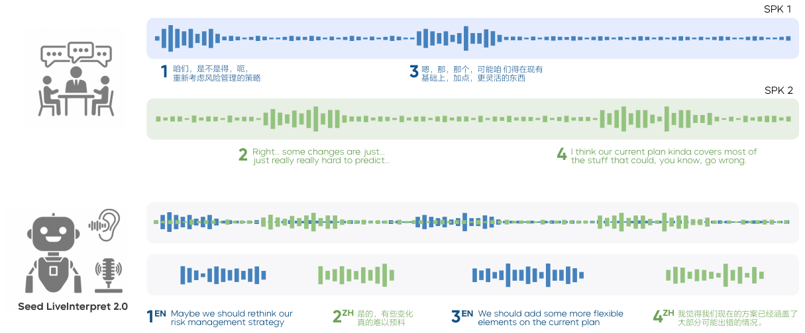

*Figure 2, PDF p. 2 · [Source](https://arxiv.org/abs/2507.17527)*

### Seed-TTS

Autoregressive speech foundation model.

[Paper](https://arxiv.org/abs/2406.02430) · [Details](models/speech-generation.md#seed-tts)

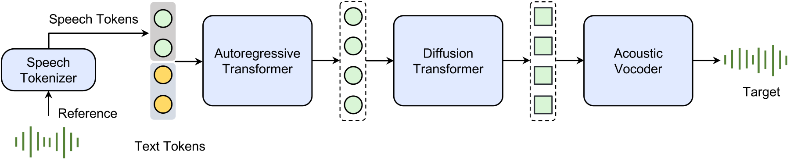

*Figure 1 · [Source](https://arxiv.org/abs/2406.02430)*

### Seed2.0 Lite (audio update)

Omni understanding model.

[Project](https://seed.bytedance.com/en/seed2) · [Details](models/omni.md#seed2-0-lite-audio-update)

*Input/output diagram · [Source](https://seed.bytedance.com/en/seed2)*

### SeedRealtime

Native synchronized audio-visual interaction.

[Announcement](https://seed.bytedance.com/en/blog/seedrealtime-audio-visual-full-duplex-llm-released-toward-omni-modal-natural-interaction) · [Details](models/omni.md#seedrealtime)

*Input/output diagram · [Source](https://seed.bytedance.com/en/blog/seedrealtime-audio-visual-full-duplex-llm-released-toward-omni-modal-natural-interaction)*

### Seeduplex

Native full-duplex speech-semantic LLM.

[Announcement](https://seed.bytedance.com/en/blog/introducing-seed-full-duplex-speech-llm-attentive-listening-robust-interference-suppression-enabling-more-natural-interaction) · [Details](models/speech-dialogue.md#seeduplex)

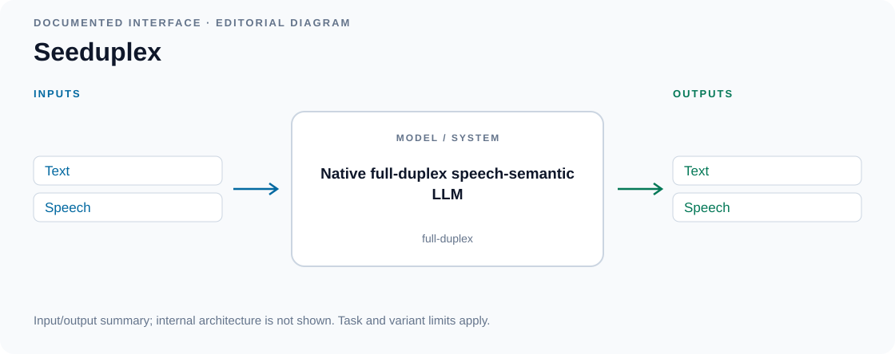

*Input/output diagram · [Source](https://seed.bytedance.com/en/blog/introducing-seed-full-duplex-speech-llm-attentive-listening-robust-interference-suppression-enabling-more-natural-interaction)*

### ShapeLLM-Omni

Qwen-VL and discrete 3D tokens.

[Paper](https://arxiv.org/abs/2506.01853) · [Details](models/related.md#shapellm-omni)

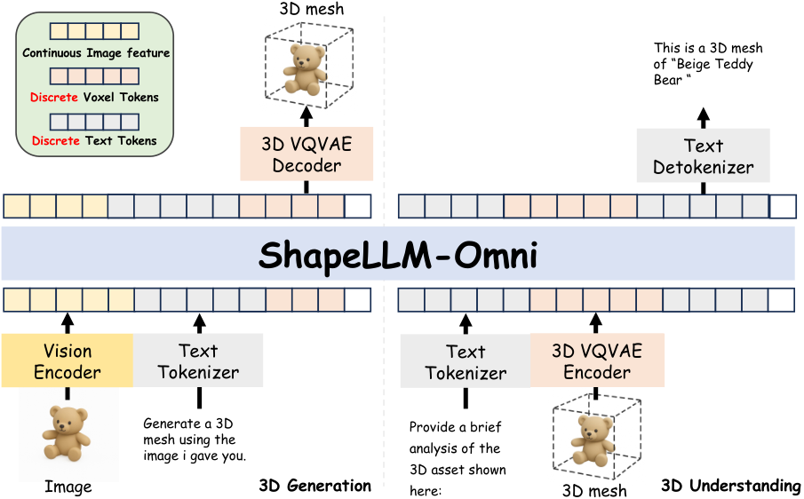

*Figure 1 · [Source](https://arxiv.org/abs/2506.01853)*

### ShizhenGPT

Domain-specific multimodal LLM.

[Paper](https://arxiv.org/abs/2508.14706) · [Details](models/omni.md#shizhengpt)

*Figure 2 · [Source](https://arxiv.org/abs/2508.14706)*

### SLAM-Omni

Grouped semantic speech tokens.

[Paper](https://arxiv.org/abs/2412.15649) · [Details](models/speech-dialogue.md#slam-omni)

*Figure 2 · [Source](https://arxiv.org/abs/2412.15649)*

### Slamming / Slam

Efficient speech LM training recipe.

[Paper](https://arxiv.org/abs/2502.15814) · [Details](models/speech-dialogue.md#slamming-slam)

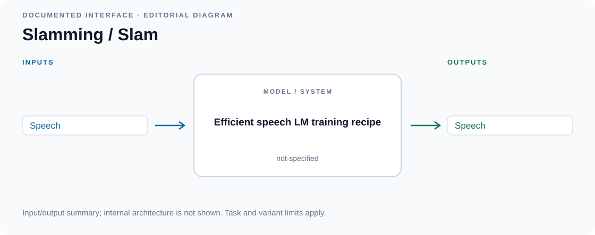

*Input/output diagram · [Source](https://arxiv.org/abs/2502.15814)*

### SLM (Google)

Adapter between frozen speech and text models.

[Paper](https://arxiv.org/abs/2310.00230) · [Details](models/audio-understanding.md#slm-google)

*Figure 2 · [Source](https://arxiv.org/abs/2310.00230)*

### SOLAMI

Social vision-language-action modeling.

[Paper](https://arxiv.org/abs/2412.00174) · [Details](models/omni.md#solami)

*Figure 2 · [Source](https://arxiv.org/abs/2412.00174)*

### SoulX-Duplug

Semantic turn-control module and voice system.

[Paper](https://arxiv.org/abs/2603.14877) · [Details](models/related.md#soulx-duplug)

*Figure 4 · [Source](https://arxiv.org/abs/2603.14877)*

### SoundStorm

Parallel masked audio-token prediction.

[Paper](https://arxiv.org/abs/2305.09636) · [Details](models/speech-foundations.md#soundstorm)

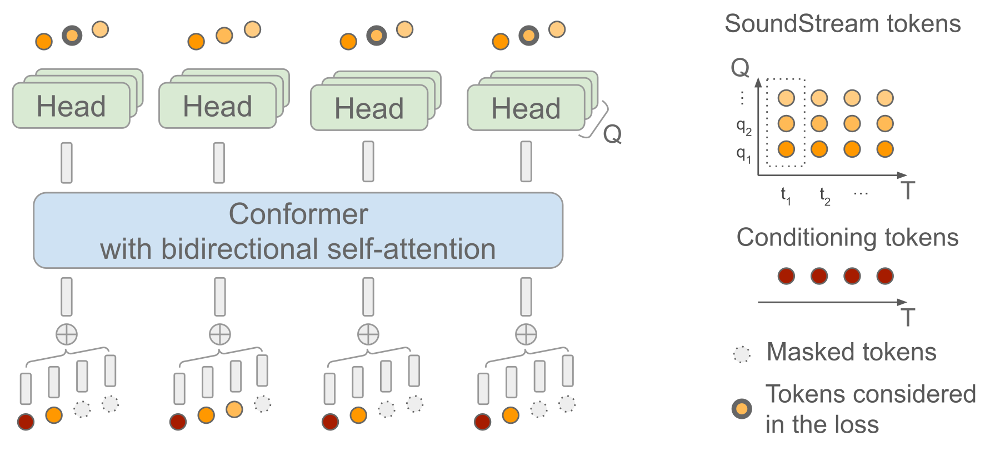

*Figure 1 · [Source](https://arxiv.org/abs/2305.09636)*

### Soundwave

Efficient speech-text alignment.

[Paper](https://arxiv.org/abs/2502.12900) · [Details](models/audio-understanding.md#soundwave)

*Figure 2, PDF p. 3 · [Source](https://arxiv.org/abs/2502.12900)*

### Spark-TTS

Qwen2.5 and single-stream BiCodec.

[Paper](https://arxiv.org/abs/2503.01710) · [Repository](https://github.com/SparkAudio/Spark-TTS) · [Details](models/speech-generation.md#spark-tts)

*Figure 3 · [Source](https://arxiv.org/abs/2503.01710)*

### SPEAR-TTS

Text-to-semantic and semantic-to-acoustic LMs.

[Paper](https://arxiv.org/abs/2302.03540) · [Details](models/speech-generation.md#spear-tts)

*Figure 1 · [Source](https://arxiv.org/abs/2302.03540)*

### Spectron

Speech encoder and spectrogram generation.

[Paper](https://arxiv.org/abs/2305.15255) · [Details](models/speech-dialogue.md#spectron)

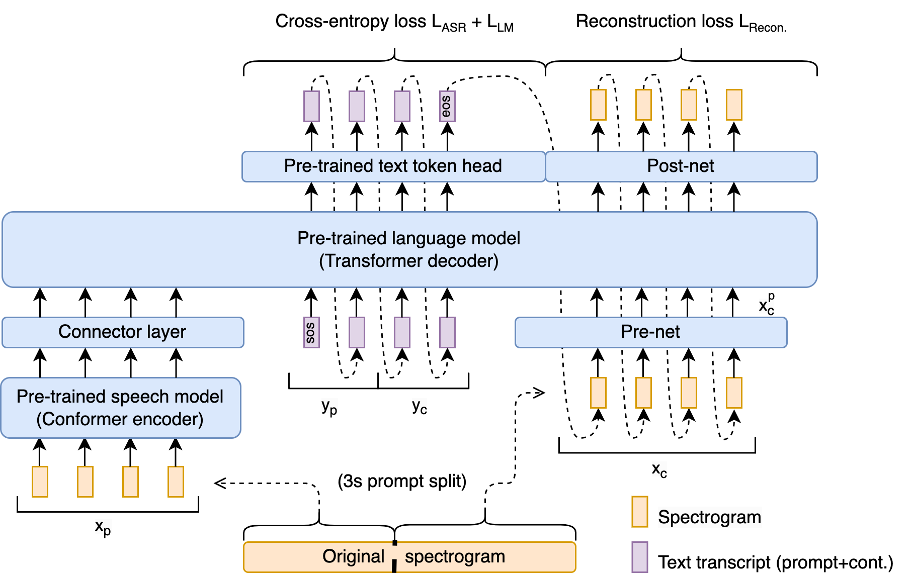

*Figure 1 · [Source](https://arxiv.org/abs/2305.15255)*

### Speech-LLaMA

CTC compression and decoder-only LLM.

[Paper](https://arxiv.org/abs/2307.03917) · [Details](models/llm-asr.md#speech-llama)

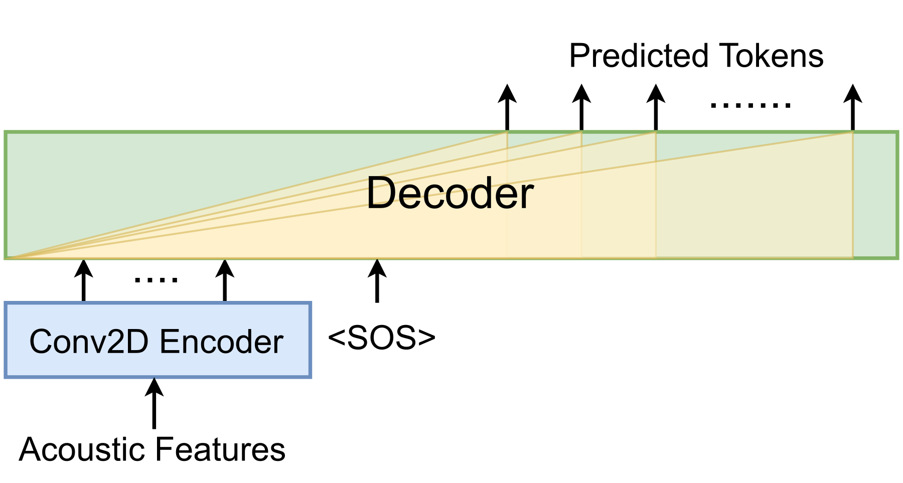

*Figure 2 · [Source](https://arxiv.org/abs/2307.03917)*

### SpeechGPT

Discrete speech tokens and instruction tuning.

[Paper](https://arxiv.org/abs/2305.11000) · [Details](models/speech-dialogue.md#speechgpt)

*Figure 2 · [Source](https://arxiv.org/abs/2305.11000)*

### SpeechGPT 2.0 Preview

Speech-text foundation model.

[Repository](https://github.com/OpenMOSS/SpeechGPT-2.0-preview) · [Details](models/speech-dialogue.md#speechgpt-2-0-preview)

*Official architecture diagram · [Source](https://github.com/OpenMOSS/SpeechGPT-2.0-preview)*

### SpeechGPT-Gen

Semantic LM and perceptual generation.

[Paper](https://arxiv.org/abs/2401.13527) · [Details](models/speech-foundations.md#speechgpt-gen)

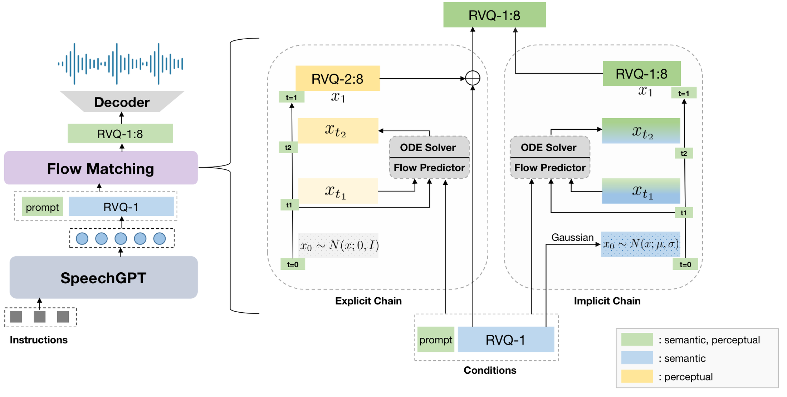

*Figure 2 · [Source](https://arxiv.org/abs/2401.13527)*

### SpeechLM (synthetic interleaved pretraining)

Synthetic speech-text interleaving.

[Paper](https://arxiv.org/abs/2411.17607) · [Details](models/speech-foundations.md#speechlm-synthetic-interleaved-pretraining)

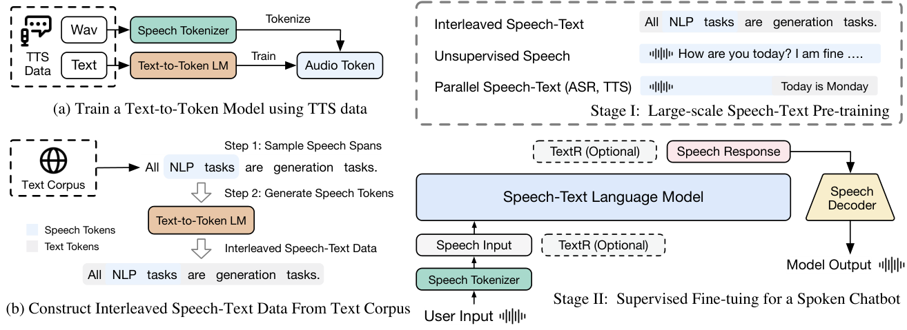

*Figure 2 · [Source](https://arxiv.org/abs/2411.17607)*

### SpeechT5

Shared encoder–decoder with modality interfaces.

[Paper](https://arxiv.org/abs/2110.07205) · [Details](models/speech-foundations.md#speecht5)

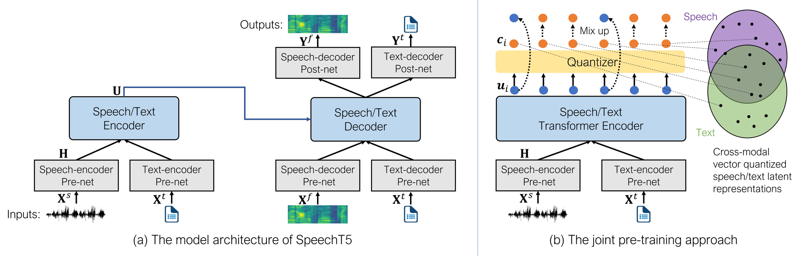

*Figure 2 · [Source](https://arxiv.org/abs/2110.07205)*

### SpeechUT

Hidden-unit speech-text pretraining.

[Paper](https://arxiv.org/abs/2210.03730) · [Details](models/speech-foundations.md#speechut)

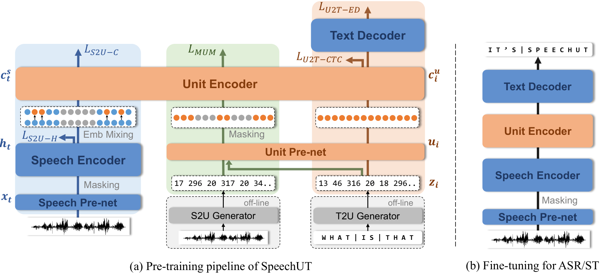

*Figure 2 · [Source](https://arxiv.org/abs/2210.03730)*

### SpeechVerse

Frozen speech/text models with adapters.

[Paper](https://arxiv.org/abs/2405.08295) · [Details](models/audio-understanding.md#speechverse)

*Figure 1 · [Source](https://arxiv.org/abs/2405.08295)*

### SpeechX

Prompted neural codec language model.

[Paper](https://arxiv.org/abs/2308.06873) · [Details](models/speech-foundations.md#speechx)

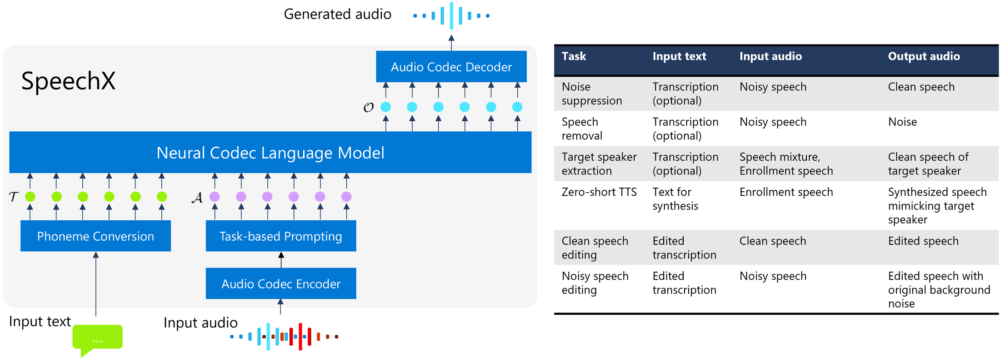

*Figure 1 · [Source](https://arxiv.org/abs/2308.06873)*

### Spider

LLM and decoder controller.

[Paper](https://arxiv.org/abs/2411.09439) · [Details](models/omni.md#spider)

*Figure 2 · [Source](https://arxiv.org/abs/2411.09439)*

### Spirit LM

Interleaved speech-text token LM.

[Paper](https://arxiv.org/abs/2402.05755) · [Details](models/speech-foundations.md#spirit-lm)

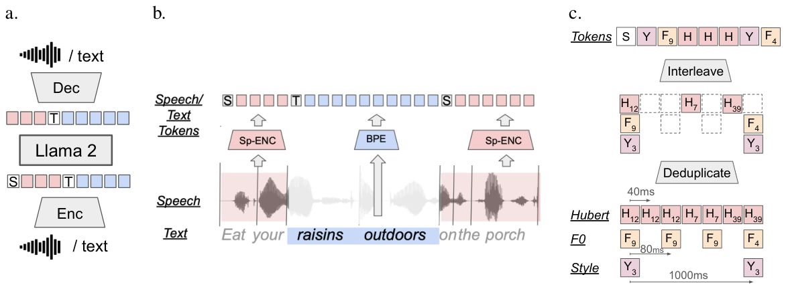

*Figure 1, PDF p. 2 · [Source](https://arxiv.org/abs/2402.05755)*

### ST-Omni-R1

Spatial audio-visual reasoning and RL.

[Paper](https://arxiv.org/abs/2608.09435) · [Details](models/omni.md#st-omni-r1)

*Figure 2 · [Source](https://arxiv.org/abs/2608.09435)*

### Step-Audio

Unified speech-text model.

[Paper](https://arxiv.org/abs/2502.11946) · [Details](models/speech-dialogue.md#step-audio)

*Figure 2 · [Source](https://arxiv.org/abs/2502.11946)*

### Step-Audio 2

Audio encoder and discrete speech generation.

[Paper](https://arxiv.org/abs/2507.16632) · [Details](models/speech-dialogue.md#step-audio-2)

*Figure 3 · [Source](https://arxiv.org/abs/2507.16632)*

### Step-Audio-R1

Modality-grounded reasoning distillation.

[Paper](https://arxiv.org/abs/2511.15848) · [Details](models/audio-understanding.md#step-audio-r1)

*Figure 2 · [Source](https://arxiv.org/abs/2511.15848)*

### Step-Audio-R1.1

Mind-Paced Speaking dual-brain model.

[Repository](https://github.com/stepfun-ai/Step-Audio-R1) · [Paper](https://arxiv.org/abs/2510.09592) · [Details](models/speech-dialogue.md#step-audio-r1-1)

*Figure 3 · [Source](https://arxiv.org/abs/2510.09592)*

### Step-Audio-R1.5

Preference optimization for audio reasoning.

[Paper](https://arxiv.org/abs/2604.25719) · [Details](models/audio-understanding.md#step-audio-r1-5)

*Input/output diagram · [Source](https://arxiv.org/abs/2604.25719)*

### Step-Audio-TTS

Speech-token language model.

[Paper](https://arxiv.org/abs/2502.11946) · [Details](models/speech-generation.md#step-audio-tts)

*Figure 2 · [Source](https://arxiv.org/abs/2502.11946)*

### Stream-Omni

Modality-specific alignment.

[Paper](https://arxiv.org/abs/2506.13642) · [Details](models/omni.md#stream-omni)

*Figure 2 · [Source](https://arxiv.org/abs/2506.13642)*

### SUTLM

Joint speech-unit/text LM.

[Paper](https://arxiv.org/abs/2310.08715) · [Details](models/speech-foundations.md#sutlm)

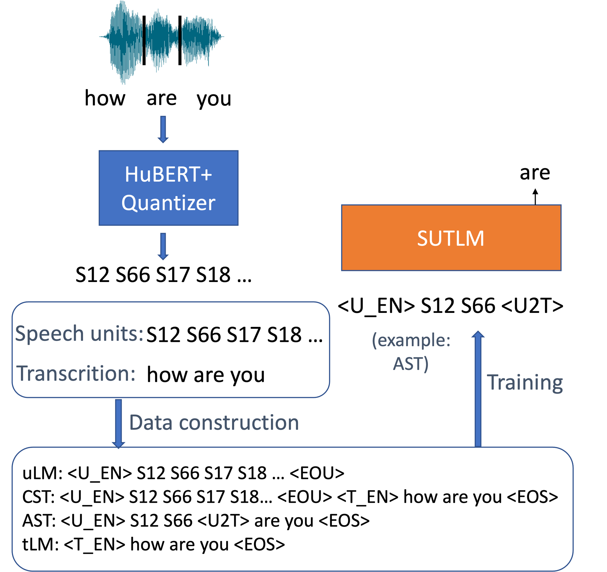

*Figure 1 · [Source](https://arxiv.org/abs/2310.08715)*

### SyllableLM

Coarse semantic speech units.

[Paper](https://arxiv.org/abs/2410.04029) · [Details](models/speech-foundations.md#syllablelm)

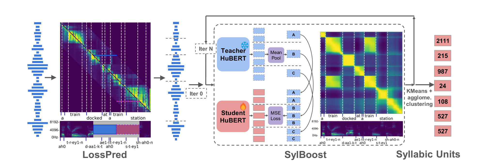

*Figure 1 · [Source](https://arxiv.org/abs/2410.04029)*

### SyncLLM

Clock-synchronized language modeling.

[Paper](https://arxiv.org/abs/2409.15594) · [Details](models/speech-dialogue.md#syncllm)

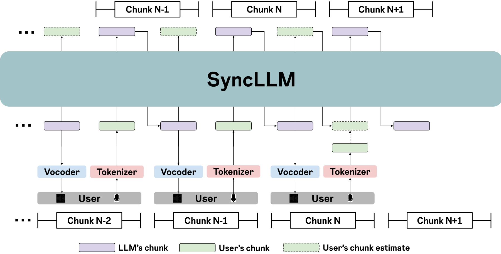

*Figure 1 · [Source](https://arxiv.org/abs/2409.15594)*

### TADA

Text-acoustic dual alignment and flow head.

[Paper](https://arxiv.org/abs/2602.23068) · [Announcement](https://www.hume.ai/blog/opensource-tada) · [Details](models/speech-foundations.md#tada)

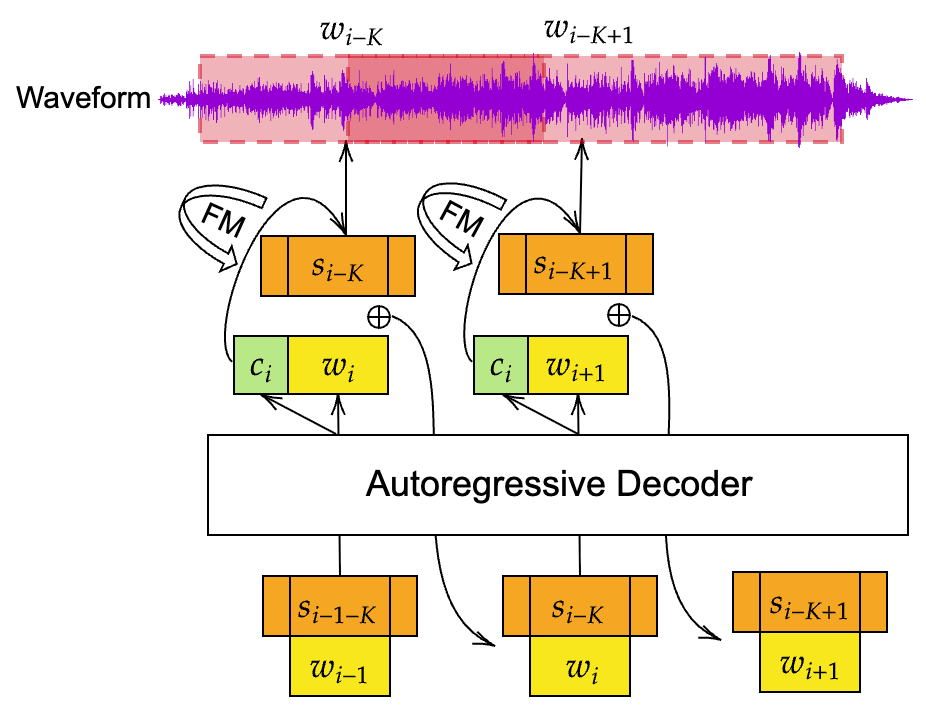

*Figure 4 · [Source](https://arxiv.org/abs/2602.23068)*

### TDC-Video

Temporal context compression.

[Paper](https://arxiv.org/abs/2504.10443) · [Details](models/omni.md#tdc-video)

*Figure 2 · [Source](https://arxiv.org/abs/2504.10443)*

### TEAL

Shared discrete token embeddings.

[Paper](https://arxiv.org/abs/2311.04589) · [Details](models/omni.md#teal)

*Figure 1 · [Source](https://arxiv.org/abs/2311.04589)*

### TextPro-SLM

Text/prosody aligned speech encoder.

[Paper](https://arxiv.org/abs/2605.05927) · [Details](models/audio-understanding.md#textpro-slm)

*Figure 1 · [Source](https://arxiv.org/abs/2605.05927)*

### tGSLM

Continuous word-sized audio tokens.

[Paper](https://arxiv.org/abs/2310.05224) · [Details](models/speech-foundations.md#tgslm)

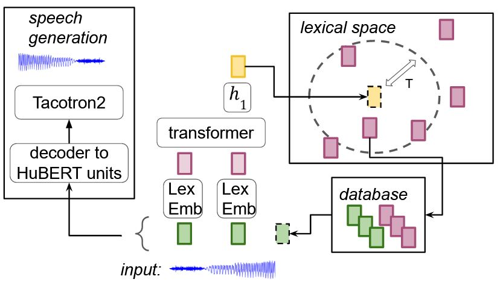

*Figure 2 · [Source](https://arxiv.org/abs/2310.05224)*

### ThinkOmni

Guidance decoding with an external reasoning model.

[Paper](https://arxiv.org/abs/2602.23306) · [Details](models/related.md#thinkomni)

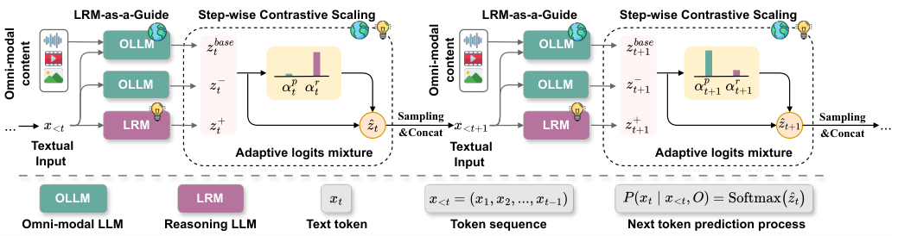

*Figure 4 · [Source](https://arxiv.org/abs/2602.23306)*

### Tortoise TTS

Autoregressive transformer and diffusion decoder.

[Paper](https://arxiv.org/abs/2305.07243) · [Repository](https://github.com/neonbjb/tortoise-tts) · [Details](models/speech-generation.md#tortoise-tts)

*Figure 1 · [Source](https://arxiv.org/abs/2305.07243)*

### TriSense

Query-based multimodal connector.

[Paper](https://arxiv.org/abs/2505.18110) · [Details](models/omni.md#trisense)

*Figure 4 · [Source](https://arxiv.org/abs/2505.18110)*

### TurnGuide

Turn-level text/speech interleaving.

[Paper](https://arxiv.org/abs/2508.07375) · [Details](models/speech-dialogue.md#turnguide)

*Figure 2 · [Source](https://arxiv.org/abs/2508.07375)*

### TWIST

Text-initialized speech LM.

[Paper](https://arxiv.org/abs/2305.13009) · [Details](models/speech-foundations.md#twist)

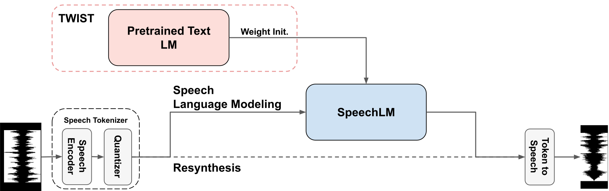

*Figure 1 · [Source](https://arxiv.org/abs/2305.13009)*

### Ultravox

Speech encoder and text LLM.

[Repository](https://github.com/fixie-ai/ultravox) · [Details](models/audio-understanding.md#ultravox)

*Official architecture diagram · [Source](https://github.com/fixie-ai/ultravox)*

### Uni-MoE

Modality encoders and sparse MoE.

[Paper](https://arxiv.org/abs/2405.11273) · [Details](models/omni.md#uni-moe)

*Figure 1 · [Source](https://arxiv.org/abs/2405.11273)*

### Uni-MoE 2.0 Omni

Dynamic-capacity MoE and multimodal RoPE.

[Paper](https://arxiv.org/abs/2511.12609) · [Details](models/omni.md#uni-moe-2-0-omni)

*Figure 2 · [Source](https://arxiv.org/abs/2511.12609)*

### UniAudio

Multi-scale autoregressive transformer.

[Paper](https://arxiv.org/abs/2310.00704) · [Details](models/speech-foundations.md#uniaudio)

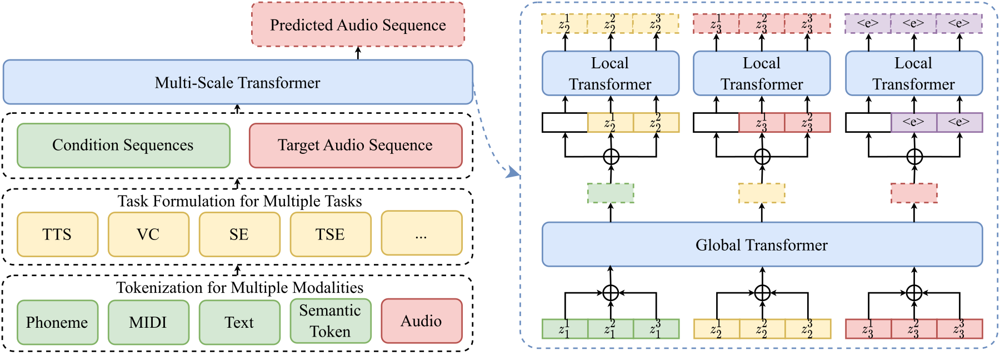

*Figure 1 · [Source](https://arxiv.org/abs/2310.00704)*

### Unified-IO 2

Shared-token encoder–decoder.

[Paper](https://arxiv.org/abs/2312.17172) · [Details](models/omni.md#unified-io-2)

*Figure 2 · [Source](https://arxiv.org/abs/2312.17172)*

### UnifiedMLLM

Unified task representation.

[Paper](https://arxiv.org/abs/2408.02503) · [Details](models/omni.md#unifiedmllm)

*Figure 2 · [Source](https://arxiv.org/abs/2408.02503)*

### UnitY

Two-pass text and discrete-unit decoding.

[Paper](https://arxiv.org/abs/2212.08055) · [Details](models/speech-foundations.md#unity)

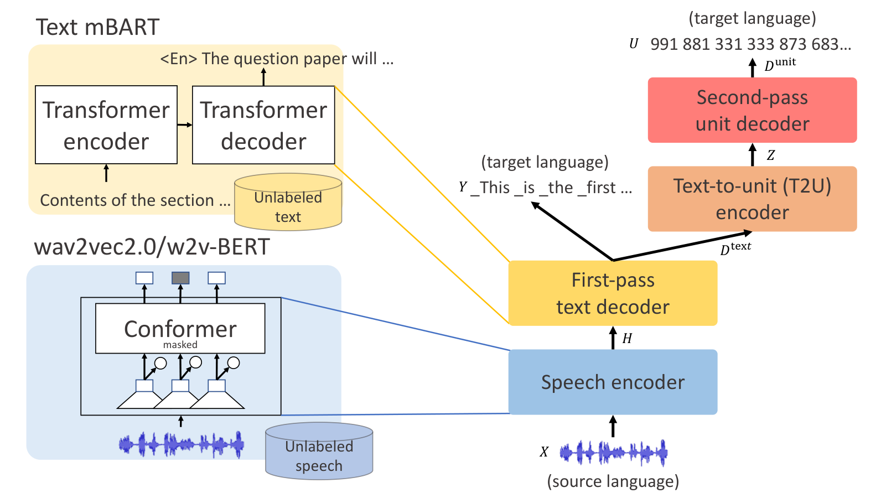

*Figure 1 · [Source](https://arxiv.org/abs/2212.08055)*

### VALL-E

Autoregressive and non-AR codec LMs.

[Paper](https://arxiv.org/abs/2301.02111) · [Details](models/speech-generation.md#vall-e)

*Figure 1 · [Source](https://arxiv.org/abs/2301.02111)*

### VALL-E 2

Grouped codec modeling and repetition-aware sampling.

[Paper](https://arxiv.org/abs/2406.05370) · [Details](models/speech-generation.md#vall-e-2)

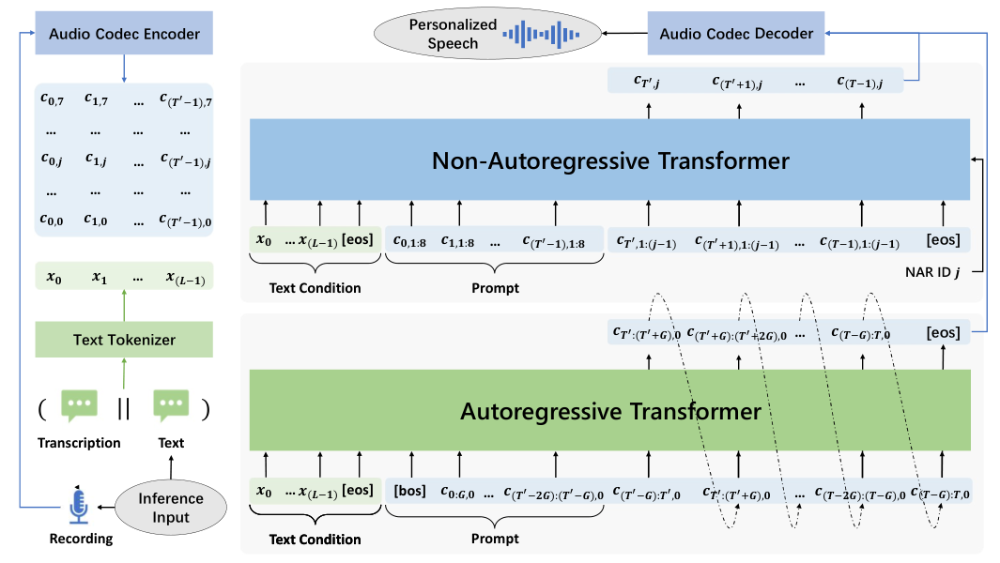

*Figure 3 · [Source](https://arxiv.org/abs/2406.05370)*

### VALL-E X

Cross-lingual neural codec language model.

[Paper](https://arxiv.org/abs/2303.03926) · [Details](models/speech-generation.md#vall-e-x)

*Figure 1 · [Source](https://arxiv.org/abs/2303.03926)*

### VALL-T

Decoder-only generative transducer.

[Paper](https://arxiv.org/abs/2401.14321) · [Details](models/speech-generation.md#vall-t)

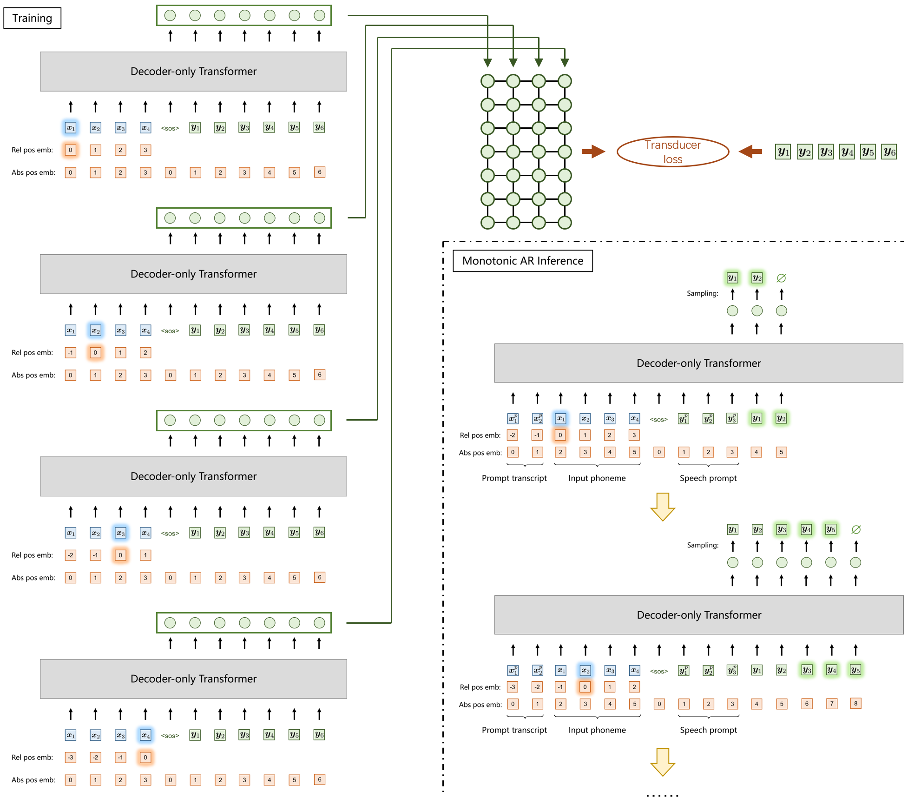

*Figure 1 · [Source](https://arxiv.org/abs/2401.14321)*

### VibeVoice

Next-token diffusion over continuous speech latents.

[Paper](https://arxiv.org/abs/2508.19205) · [Details](models/speech-generation.md#vibevoice)

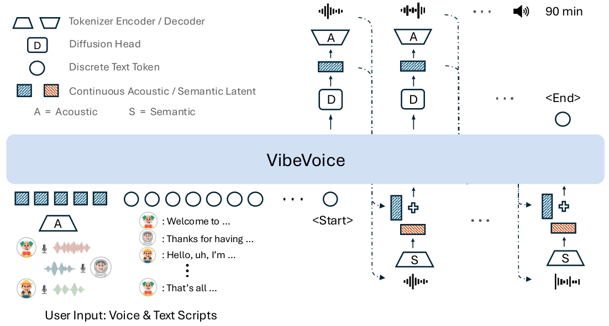

*Figure 2 · [Source](https://arxiv.org/abs/2508.19205)*

### VibeVoice-ASR

Unified long-form speech understanding.

[Paper 1](https://arxiv.org/abs/2601.18184) · [Paper 2](https://arxiv.org/abs/2607.21075) · [Details](models/llm-asr.md#vibevoice-asr)

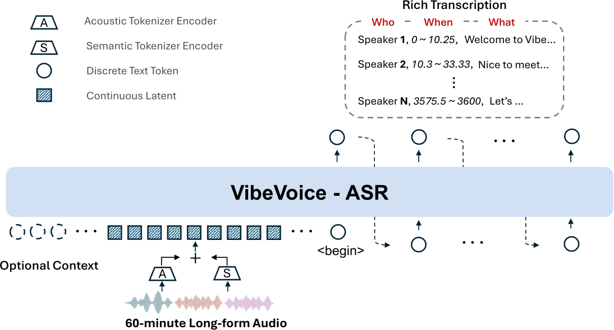

*Figure 2 · [Source](https://arxiv.org/abs/2601.18184)*

### VibeVoice-ASR-Streaming

Streaming speaker-attributed ASR LLM.

[Paper](https://arxiv.org/abs/2609.02812) · [Details](models/llm-asr.md#vibevoice-asr-streaming)

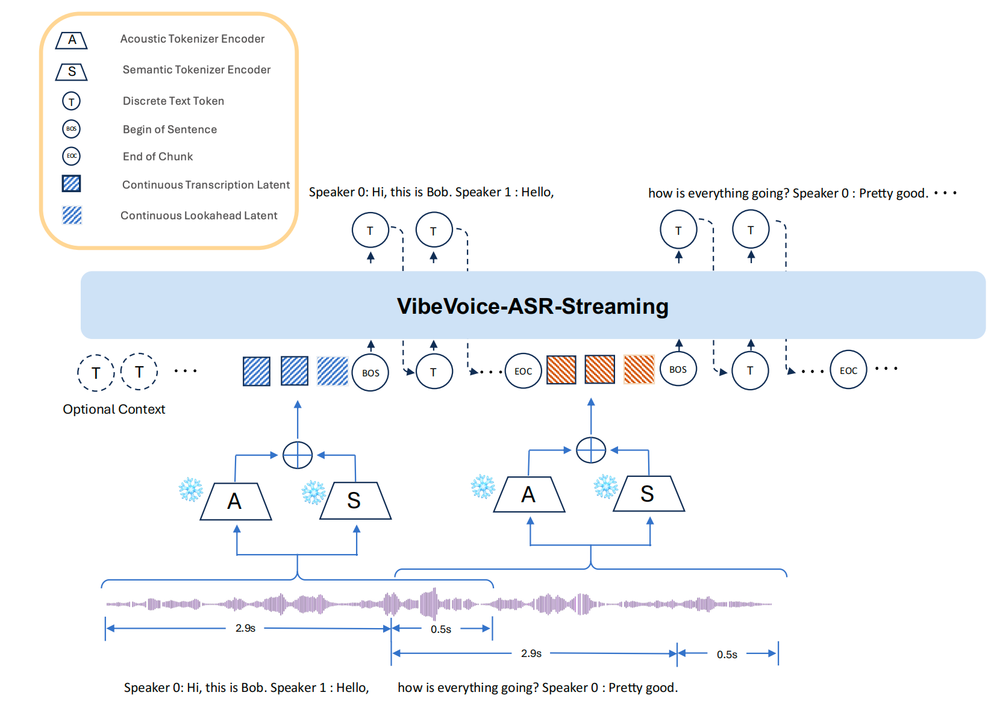

*Figure 2 · [Source](https://arxiv.org/abs/2609.02812)*

### VibeVoice-Realtime

Streaming next-token diffusion.

[Repository](https://github.com/microsoft/VibeVoice) · [Details](models/speech-generation.md#vibevoice-realtime)

*Official architecture diagram · [Source](https://github.com/microsoft/VibeVoice)*

### Video-LLaMA

Visual and audio Q-Formers.

[Paper](https://arxiv.org/abs/2306.02858) · [Details](models/omni.md#video-llama)

*Figure 1 · [Source](https://arxiv.org/abs/2306.02858)*

### video-SALMONN

Multi-resolution causal Q-Former.

[Paper](https://arxiv.org/abs/2406.15704) · [Details](models/omni.md#video-salmonn)

*Figure 1 · [Source](https://arxiv.org/abs/2406.15704)*

### video-SALMONN 2

Caption training and multi-round DPO.

[Paper](https://arxiv.org/abs/2506.15220) · [Details](models/omni.md#video-salmonn-2)

*Figure 1 · [Source](https://arxiv.org/abs/2506.15220)*

### video-SALMONN-o1

Reasoning data and process DPO.

[Paper](https://arxiv.org/abs/2502.11775) · [Details](models/omni.md#video-salmonn-o1)

*Figure 1 · [Source](https://arxiv.org/abs/2502.11775)*

### VideoLLaMA 2

Spatial-temporal connector and audio branch.

[Paper](https://arxiv.org/abs/2406.07476) · [Details](models/omni.md#videollama-2)

*Figure 1 · [Source](https://arxiv.org/abs/2406.07476)*

### VideoPoet

Decoder-only multimodal token language model.

[Paper](https://arxiv.org/abs/2312.14125) · [Details](models/omni.md#videopoet)

*Figure 2 · [Source](https://arxiv.org/abs/2312.14125)*

### VioLA

Conditional codec language model.

[Paper](https://arxiv.org/abs/2305.16107) · [Details](models/speech-foundations.md#viola)

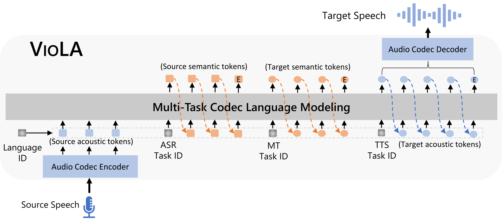

*Figure 1 · [Source](https://arxiv.org/abs/2305.16107)*

### VITA

Omni understanding and external speech synthesis.

[Paper](https://arxiv.org/abs/2408.05211) · [Details](models/omni.md#vita)

*Figure 2 · [Source](https://arxiv.org/abs/2408.05211)*

### VITA-1.5

Integrated vision and speech interaction.

[Paper](https://arxiv.org/abs/2501.01957) · [Details](models/omni.md#vita-1-5)

*Figure 2 · [Source](https://arxiv.org/abs/2501.01957)*

### VITA-Audio

Multiple cross-modal token prediction.

[Paper](https://arxiv.org/abs/2505.03739) · [Details](models/speech-dialogue.md#vita-audio)

*Figure 2 · [Source](https://arxiv.org/abs/2505.03739)*

### VoiceCraft

Token-infilling codec language model.

[Paper](https://arxiv.org/abs/2403.16973) · [Repository](https://github.com/jasonppy/VoiceCraft) · [Details](models/speech-generation.md#voicecraft)

*Figure 2 · [Source](https://arxiv.org/abs/2403.16973)*

### Voila

Hierarchical multi-scale transformer.

[Paper](https://arxiv.org/abs/2505.02707) · [Details](models/speech-dialogue.md#voila)

*Figure 2 · [Source](https://arxiv.org/abs/2505.02707)*

### VoxCPM

Hierarchical semantic/acoustic LM and diffusion.

[Paper](https://arxiv.org/abs/2509.24650) · [Details](models/speech-generation.md#voxcpm)

*Figure 1 · [Source](https://arxiv.org/abs/2509.24650)*

### VoxCPM2

Hierarchical diffusion-autoregressive model.

[Paper](https://arxiv.org/abs/2606.06928) · [Repository](https://github.com/OpenBMB/VoxCPM) · [Details](models/speech-generation.md#voxcpm2)

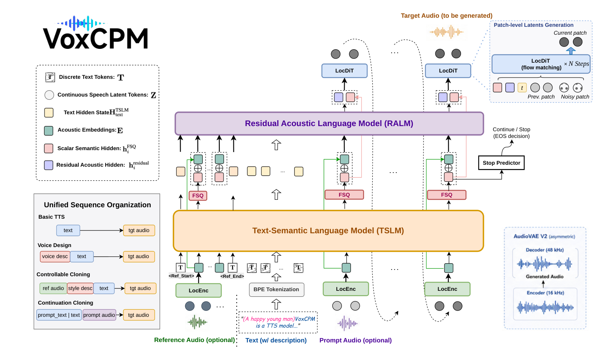

*Figure 1 · [Source](https://arxiv.org/abs/2606.06928)*

### VoxtLM

Unified decoder-only model.

[Paper](https://arxiv.org/abs/2309.07937) · [Details](models/speech-foundations.md#voxtlm)

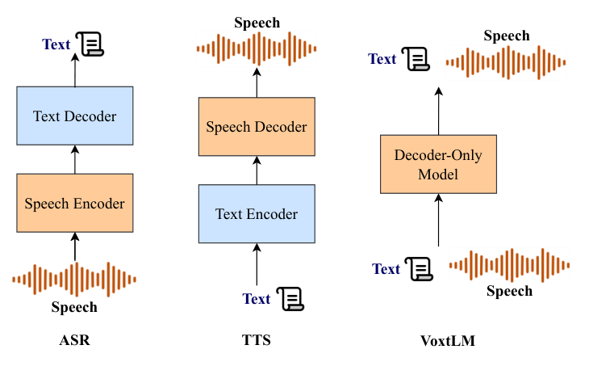

*Figure 1 · [Source](https://arxiv.org/abs/2309.07937)*

### Voxtral

Audio-conditioned language model.

[Paper](https://arxiv.org/abs/2507.13264) · [Details](models/audio-understanding.md#voxtral)

*Figure 1 · [Source](https://arxiv.org/abs/2507.13264)*

### Voxtral Mini Transcribe V2

Specialized Voxtral transcription model.

[Announcement](https://mistral.ai/news/voxtral-transcribe-2) · [Details](models/llm-asr.md#voxtral-mini-transcribe-v2)

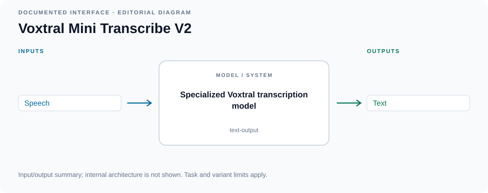

*Input/output diagram · [Source](https://mistral.ai/news/voxtral-transcribe-2)*

### Voxtral Realtime

Causal streaming speech model.

[Announcement](https://mistral.ai/news/voxtral-transcribe-2) · [Details](models/llm-asr.md#voxtral-realtime)

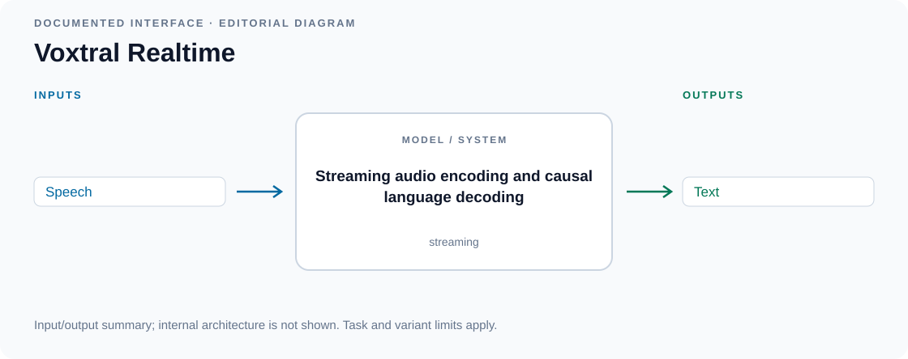

*Input/output diagram · [Source](https://mistral.ai/news/voxtral-transcribe-2)*

### WavLLM

Whisper/WavLM dual encoders.

[Paper](https://arxiv.org/abs/2404.00656) · [Details](models/audio-understanding.md#wavllm)

*Figure 1 · [Source](https://arxiv.org/abs/2404.00656)*

### WorldGPT

Multimodal LLM world modeling.

[Paper](https://arxiv.org/abs/2404.18202) · [Details](models/omni.md#worldgpt)

*Figure 4 · [Source](https://arxiv.org/abs/2404.18202)*

### X-InstructBLIP

Instruction-aware modality projections.

[Paper](https://arxiv.org/abs/2311.18799) · [Details](models/omni.md#x-instructblip)

*Figure 1 · [Source](https://arxiv.org/abs/2311.18799)*

### X-LLM

Modality-to-language interfaces.

[Paper](https://arxiv.org/abs/2305.04160) · [Details](models/omni.md#x-llm)

*Figure 1 · [Source](https://arxiv.org/abs/2305.04160)*

### X-Talk

Cascaded full-duplex voice framework.

[Paper](https://arxiv.org/abs/2512.18706) · [Details](models/related.md#x-talk)

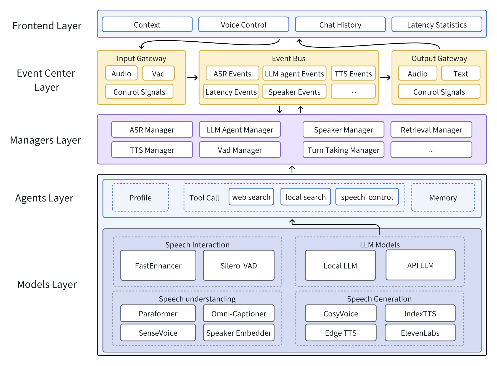

*Figure 2 · [Source](https://arxiv.org/abs/2512.18706)*

### X-VILA

Encoders, LLM and diffusion decoders.

[Paper](https://arxiv.org/abs/2405.19335) · [Details](models/omni.md#x-vila)

*Figure 2 · [Source](https://arxiv.org/abs/2405.19335)*

### XTTS

Autoregressive acoustic codes and decoder.

[Paper](https://arxiv.org/abs/2406.04904) · [Details](models/speech-generation.md#xtts)

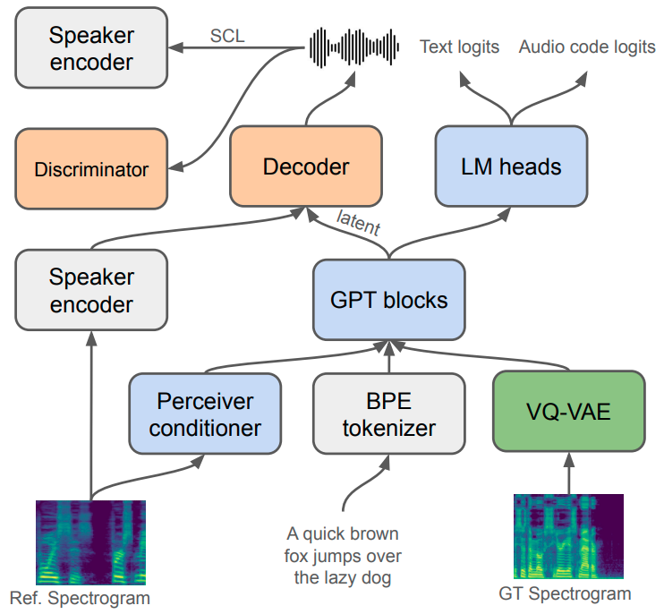

*Figure 1 · [Source](https://arxiv.org/abs/2406.04904)*

### Zonos

Transformer or hybrid backbone with codec prediction.

[Repository](https://github.com/Zyphra/Zonos) · [Details](models/speech-generation.md#zonos)

*Official architecture diagram · [Source](https://github.com/Zyphra/Zonos)*

---

[JSON catalog](data/models.json) · [Apache 2.0](LICENSE) · [Third-party figure notice](assets/architectures/FIGURE_NOTICE.md)
