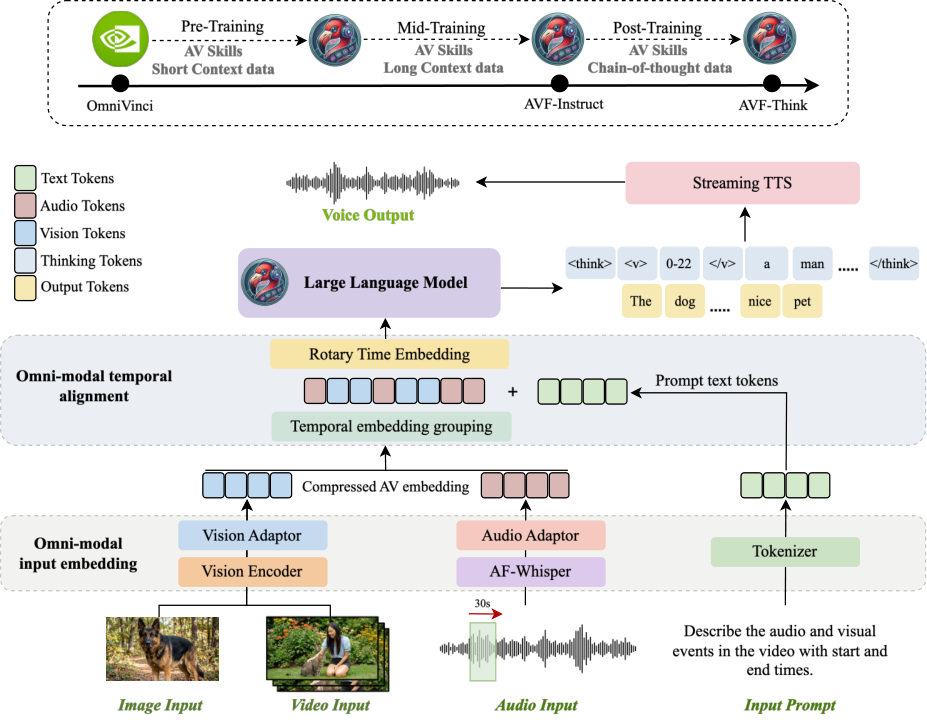
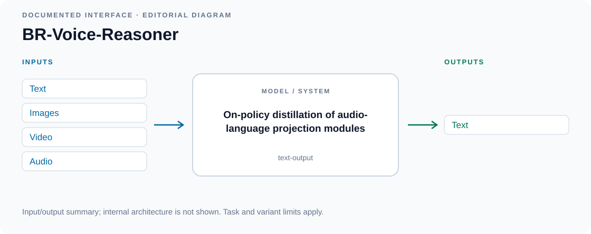
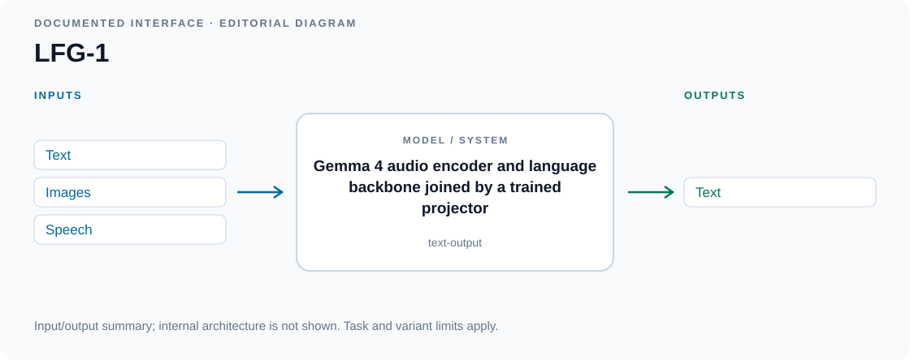
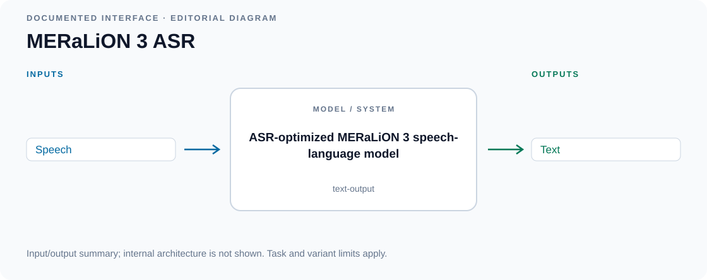
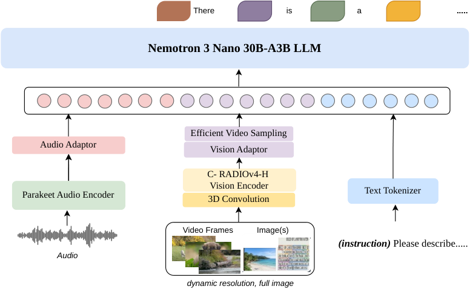

# Awesome Omni Architectures 

<!-- Generated by scripts/catalog.py from data/models.json and data/figures.json. Edit the JSON, then regenerate. -->

A visual catalog of omni, speech and audio language models with public code and weights. Every entry has a short description, a diagram, code and checkpoint links.

**140 models + 4 cascaded systems · Reviewed 2026-09-13**

[Model list](#models) · [All diagrams](#model-figures) · [VoiceBench coverage](docs/voicebench.md) · [Research](docs/research.md) · [Timeline](docs/timeline.md) · [Scope](docs/methodology.md)

Licenses: **68 open · 48 custom/restricted · 28 unclear**. Downloadable weights do not always mean an unrestricted open-source license; each card shows the applicable terms.

| Collection | Entries |
| --- | ---: |
| [Omni and audio-visual models](models/omni.md) | 44 |
| [Speech dialogue models](models/speech.md) | 42 |
| [Audio understanding models](models/audio.md) | 45 |
| [Speech recognition language models](models/asr.md) | 9 |
| [VoiceBench cascaded systems](models/pipelines.md) | 4 |

## Models

T: text · I: image · V: video · A: audio · S: speech · M: music · X: other. [Scope and labels](docs/methodology.md#modalities-and-interaction).

Alphabetical model list · 144 entries

| Model | Group | Input → output | Release |
| --- | --- | --- | --- |
| [AnyGPT](#anygpt) | Omni | T, I, S, M → T, I, S, M | License unclear |
| [Audio Flamingo](#audio-flamingo) | Audio | T, A → T | Custom / restricted |
| [Audio Flamingo 2](#audio-flamingo-2) | Audio | T, A → T | Custom / restricted |
| [Audio Flamingo 3 Chat](#audio-flamingo-3) | Speech | T, A → T, S | Custom / restricted |
| [Audio Flamingo Next](#audio-flamingo-next) | Audio | T, A → T | Custom / restricted |
| [Audio-Interaction](#audio-interaction) | Audio | T, A → T | License unclear |
| [Audio-Reasoner](#audio-reasoner) | Audio | T, A → T | Open license |
| [Audio-Visual Flamingo](#audio-visual-flamingo) | Omni | T, I, V, A → T | Custom / restricted |
| [AzeroS](#azeros) | Audio | T, S → T | Open license |
| [Baichuan-Audio](#baichuan-audio) | Speech | T, A → T, S | Open license |
| [Baichuan-Omni 1.5](#baichuan-omni-1-5) | Omni | T, I, V, A → T, S | Custom / restricted |
| [BLSP-Emo](#blsp-emo) | Audio | T, S → T | Custom / restricted |
| [BR-Voice-Reasoner](#br-voice-reasoner) | Omni | T, I, V, A → T | Open license |
| [Canary-Qwen](#canary-qwen) | LLM-ASR | T, S → T | Open license |
| [Covo-Audio Chat](#covo-audio) | Speech | T, S → T, S | Custom / restricted |
| [DeSTA2](#desta2) | Audio | T, A → T | License unclear |
| [DeSTA2.5-Audio](#desta2-5-audio) | Audio | T, A → T | License unclear |
| [DialectS2S](#dialects2s) | Speech | T, S → T, S | Open license |
| [DIFFA](#diffa) | Audio | T, A → T | License unclear |
| [DIFFA-2](#diffa-2) | Audio | T, A → T | License unclear |
| [DiVA](#diva) | Audio | T, S → T | Custom / restricted |
| [DuplexCascade](#duplex-cascade) | Speech | T, S → T, S | Open license |
| [DuplexMamba](#duplexmamba) | Audio | T, S → T | Open license |
| [EMOVA (Qwen2.5-7B)](#emova) | Omni | T, I, S → T, S | Open license |
| [Freeze-Omni](#freeze-omni) | Speech | T, S → T, S | Custom / restricted |
| [Fun-Audio-Chat](#fun-audio-chat) | Speech | T, S → T, S | Open license |
| [Gemma 3n E4B](#gemma-3n) | Omni | T, I, V, A → T | Custom / restricted |
| [Gemma 4 E4B](#gemma-4-audio-capable-variants) | Omni | T, I, V, A → T | Open license |
| [GLM-4-Voice](#glm-4-voice) | Speech | T, S → T, S | Custom / restricted |
| [GLM-ASR Nano](#glm-asr-nano) | LLM-ASR | S → T | Open license |
| [Granite Speech 3.3](#granite-speech-3-3) | LLM-ASR | T, S → T | Open license |
| [Granite Speech 4.0](#granite-speech-4-0) | LLM-ASR | T, S → T | Open license |
| [Granite Speech 4.1](#granite-speech-4-1) | LLM-ASR | T, S → T | Open license |
| [Hibiki](#hibiki) | Speech | T, S → T, S | Open license |
| [HumanOmni](#humanomni) | Omni | T, V, A → T | License unclear |
| [HumanOmniV2](#humanomniv2) | Omni | T, V, A → T | Open license |
| [Ichigo](#ichigo) | Audio | T, S → T | License unclear |
| [Kimi-Audio](#kimi-audio) | Speech | T, A → T, S | Open license |
| [LFG-1](#lfg-1) | Omni | T, I, S → T | Open license |
| [LFG-2](#lfg-2) | Audio | T, S → T | License unclear |
| [LFG-3](#lfg-3) | Audio | T, S → T | License unclear |
| [LFM2-Audio-1.5B](#lfm2-audio) | Speech | T, S → T, S | Custom / restricted |
| [LFM2.5-Audio-1.5B](#lfm2-5-audio) | Speech | T, S → T, S | Custom / restricted |
| [LFM2.5-Audio-1.5B-JP](#lfm2-5-audio-jp) | Speech | T, S → T, S | Custom / restricted |
| [LLaMA-Omni](#llama-omni) | Speech | T, S → T, S | Custom / restricted |
| [LLaMA-Omni 2](#llama-omni-2) | Speech | T, S → T, S | Custom / restricted |
| [LLaSM](#llasm) | Audio | T, S → T | Custom / restricted |
| [LongCat-Flash-Omni](#longcat-flash-omni) | Omni | T, I, V, A → T, S | Open license |
| [LongCat-Next](#longcat-next) | Omni | T, I, A → T, I, A | Open license |
| [Lychee-FD](#lychee-fd) | Speech | T, S → T, S | Open license |
| [Lyra-Base](#lyra) | Omni | T, I, V, A → T, S | Custom / restricted |
| [Lyra-Mini](#lyra-mini) | Omni | T, I, V, A → T, S | Custom / restricted |
| [Mair-hub-0.5B-Omni](#mair-hub-omni) | Speech | T, S → T, S | License unclear |
| [Megrez-Omni](#megrez-omni) | Omni | T, I, A → T | Open license |
| [Mellow](#mellow) | Audio | T, A → T | Open license |
| [MERaLiON 2](#meralion-2) | Audio | T, A → T | Custom / restricted |
| [MERaLiON 3](#meralion-3) | Audio | T, S → T | Custom / restricted |
| [MERaLiON 3 ASR](#meralion-3-asr) | LLM-ASR | S → T | Custom / restricted |
| [MERaLiON-AudioLLM](#meralion-audiollm) | Audio | T, A → T | Custom / restricted |
| [MiDashengLM](#midashenglm) | Audio | T, A → T | License unclear |
| [MiMo-Audio](#mimo-audio) | Speech | T, A → T, S | Open license |
| [MiMo-V2.5](#mimo-v2-5) | Omni | T, I, V, A → T | Open license |
| [Ming-Flash-Omni](#ming-flash-omni) | Omni | T, I, V, A → T, I, A | Open license |
| [Ming-Flash-Omni 2.0](#ming-flash-omni-2-0) | Omni | T, I, V, A → T, I, A | Open license |
| [Ming-Lite-Omni](#ming-omni) | Omni | T, I, V, A → T, I, S | Open license |
| [Mini-Omni](#mini-omni) | Speech | T, S → T, S | Open license |
| [Mini-Omni2](#mini-omni2) | Omni | T, I, S → T, S | Open license |
| [MiniCPM-o 2.6](#minicpm-o-2-6) | Omni | T, I, V, A → T, S | Open license |
| [MiniCPM-o 4.5](#minicpm-o-4-5) | Omni | T, I, V, A → T, S | Open license |
| [MiniMind-O](#minimind-o) | Omni | T, I, S → T, S | Open license |
| [MIO](#mio) | Omni | T, I, V, A → T, I, S | License unclear |
| [Moshi](#moshi) | Speech | T, S → T, S | Open license |
| [MOSS-Audio Instruct](#moss-audio) | Audio | T, A → T | License unclear |
| [MOSS-Audio Thinking](#moss-audio-thinking) | Audio | T, A → T | License unclear |
| [MOSS-Speech](#moss-speech) | Speech | S → S | License unclear |
| [Music Flamingo](#music-flamingo) | Audio | T, M → T | Custom / restricted |
| [Nemotron 3 Nano Omni](#nemotron-3-nano-omni) | Omni | T, I, V, A → T | Custom / restricted |
| [Nemotron-Labs-Audex 2B](#nemotron-audex-2b) | Speech | T, A → T, A | License unclear |
| [Nemotron-Labs-Audex 30B-A3B](#nemotron-audex-30b) | Speech | T, A → T, A | License unclear |
| [NemotronLabs VoiceChat 11B](#nemotronlabs-voicechat) | Speech | T, S → T, S | Open license |
| [NExT-GPT](#next-gpt) | Omni | T, I, V, A → T, I, V, A | Custom / restricted |
| [Nexus-O](#nexus) | Omni | T, I, V, A → T, S | Custom / restricted |
| [Ola](#ola) | Omni | T, I, V, A → T | Open license |
| [Omni-AutoThink](#omni-autothink) | Omni | T, I, V, A → T | Open license |
| [Omni-R1 (audio reasoning)](#omni-r1-audio-reasoning) | Audio | T, A → T | License unclear |
| [Omni-R1 (two-system collaboration)](#omni-r1-two-system-collaboration) | Omni | T, I, V, A → T | License unclear |
| [OmniVinci](#omnivinci) | Omni | T, I, V, A → T | Custom / restricted |
| [OneLLM](#onellm) | Omni | T, I, V, A → T | Custom / restricted |
| [OpenOmni](#openomni) | Omni | T, I, V, A → T, S | License unclear |
| [OpenS2S](#opens2s) | Speech | T, S → T, S | Open license |
| [OpenS2S 1.5](#opens2s-1-5) | Speech | T, S → T, S | Open license |
| [OSUM](#osum) | Audio | T, S → T | Open license |
| [OSUM-EChat](#osum-echat) | Speech | T, S → T, S | Open license |
| [ParaBridge](#parabridge) | Audio | T, A → T | Open license |
| [Parakeet-TDT-v2 + Qwen3-8B](#parakeet-qwen3) | Cascade | S → T | Open license |
| [PersonaPlex](#personaplex) | Speech | T, S → T, S | Custom / restricted |
| [Phi-4-multimodal](#phi-4-multimodal) | Omni | T, I, A → T | Open license |
| [Qwen-Audio](#qwen-audio) | Audio | T, A → T | Custom / restricted |
| [Qwen2-Audio](#qwen2-audio) | Audio | T, A → T | Open license |
| [Qwen2.5-Omni](#qwen2-5-omni) | Omni | T, I, V, A → T, S | Open license |
| [Qwen3-ASR](#qwen3-asr) | LLM-ASR | T, S → T | Open license |
| [Qwen3-Omni Instruct](#qwen3-omni) | Omni | T, I, V, A → T, S | Open license |
| [Qwen3-Omni Thinking](#qwen3-omni-thinking) | Omni | T, I, V, A → T | Open license |
| [R1-Omni](#r1-omni) | Omni | T, V, A → T | License unclear |
| [SALMONN](#salmonn) | Audio | T, A → T | Custom / restricted |
| [SALMONN-2](#salmonn-2) | Audio | T, A → T | Open license |
| [SLAM-Omni](#slam-omni) | Speech | T, S → T, S | Open license |
| [SoulX-Duplug](#soulx-duplug) | Audio | T, S → T | Open license |
| [SpeechGPT](#speechgpt) | Speech | T, S → T, S | License unclear |
| [SpeechGPT 2.0 Preview](#speechgpt-2-0-preview) | Speech | T, S → T, S | License unclear |
| [Step-Audio](#step-audio) | Speech | T, A → T, S | Open license |
| [Step-Audio 2 Mini](#step-audio-2) | Speech | T, A → T, S | Open license |
| [Step-Audio 2 Mini Think](#step-audio-2-think) | Audio | T, A → T | Open license |
| [Step-Audio-AQAA](#step-audio-aqaa) | Speech | T, A → T, S | Open license |
| [Step-Audio-R1](#step-audio-r1) | Audio | T, A → T | Open license |
| [Step-Audio-R1.1](#step-audio-r1-1) | Speech | T, A → T, S | Open license |
| [Stream-Omni](#stream-omni) | Omni | T, I, S → T, S | Custom / restricted |
| [Sympatheia](#sympatheia) | Speech | T, S → T, S | License unclear |
| [TurnGuide](#turnguide) | Speech | T, S → T, S | License unclear |
| [Ultravox 0.4.1 Llama-3.1-8B](#ultravox-0-4-1) | Audio | T, S → T | Custom / restricted |
| [Ultravox 0.5 Llama-3.1-8B](#ultravox-0-5-8b) | Audio | T, S → T | Custom / restricted |
| [Ultravox 0.5 Llama-3.2-1B](#ultravox-0-5-1b) | Audio | T, S → T | Custom / restricted |
| [Ultravox 0.6 Gemma-3-27B](#ultravox-0-6-gemma3) | Audio | T, S → T | Custom / restricted |
| [Ultravox 0.6 Llama-3.1-8B](#ultravox-0-6-8b) | Audio | T, S → T | Custom / restricted |
| [Ultravox 0.6 Llama-3.3-70B](#ultravox-0-6-70b) | Audio | T, S → T | Custom / restricted |
| [Ultravox 0.6 Qwen3-32B](#ultravox-0-6-qwen3) | Audio | T, S → T | Open license |
| [Ultravox 0.7 GLM-4.6](#ultravox-0-7-glm-4-6) | Audio | T, S → T | Open license |
| [Uni-MoE 2.0 Omni](#uni-moe-2-0-omni) | Omni | T, I, V, A → T, I, A | License unclear |
| [VibeVoice-ASR](#vibevoice-asr) | LLM-ASR | T, S → T | Open license |
| [video-SALMONN 2+ (7B)](#video-salmonn-2) | Omni | T, V, A → T | Open license |
| [VideoLLaMA 2.1 AV](#videollama-2) | Omni | T, I, V, A → T | Custom / restricted |
| [VITA 1.0](#vita) | Omni | T, I, V, A → T | Custom / restricted |
| [VITA 1.5](#vita-1-5) | Omni | T, I, V, A → T, S | Custom / restricted |
| [VITA-Audio](#vita-audio) | Speech | T, S → T, S | Custom / restricted |
| [VITA-Audio Plus](#vita-audio-plus) | Speech | T, S → T, S | Custom / restricted |
| [Voila Autonomous](#voila-autonomous) | Speech | T, S → T, S | Open license |
| [Voila Chat](#voila) | Speech | T, S → T, S | Open license |
| [VoxMind](#voxmind) | Speech | T, S → T, S | License unclear |
| [Voxtral Mini](#voxtral-mini) | Audio | T, A → T | Open license |
| [Voxtral Realtime](#voxtral-realtime) | LLM-ASR | S → T | Open license |
| [Voxtral Small](#voxtral) | Audio | T, A → T | Open license |
| [Whisper-v3-large + Llama-3.1-8B](#whisper-v3-llama31) | Cascade | S → T | Custom / restricted |
| [Whisper-v3-turbo + Llama-3.1-8B](#whisper-turbo-llama31) | Cascade | S → T | Custom / restricted |
| [Whisper-v3-turbo + Llama-3.2-3B](#whisper-turbo-llama32) | Cascade | S → T | Custom / restricted |

## Model figures

Figures are credited to their sources. Editorial input/output diagrams are labeled. [Credits](assets/architectures/CREDITS.md).

### AnyGPT

Understands and generates text, images, speech and music using a shared token vocabulary.

[Paper](https://arxiv.org/abs/2402.12226) · [Code](https://github.com/OpenMOSS/AnyGPT) · [Weights](https://huggingface.co/OpenMOSS-Team/AnyGPT-chat) · [Details](models/omni.md#anygpt)

**License unclear:** code [Not stated](https://github.com/OpenMOSS/AnyGPT/blob/main/README.md) · weights [Apache-2.0 + Llama 2 terms](https://huggingface.co/OpenMOSS-Team/AnyGPT-chat/blob/c8999624b077b3837f32c3948f0f9e90bd67b860/README.md) — Base-model community terms also apply; repository-wide code licensing is not stated.

*Figure 1 · [Source](https://arxiv.org/abs/2402.12226)*

### Audio Flamingo

Answers questions about sounds and music and supports audio-grounded dialogue and examples.

[Paper](https://arxiv.org/abs/2402.01831) · [Code](https://github.com/NVIDIA/audio-flamingo/tree/legacy_audio_flamingo_1) · [Weights](https://huggingface.co/nvidia/audio-flamingo) · [Details](models/audio.md#audio-flamingo)

**Custom / restricted:** code [MIT](https://github.com/NVIDIA/audio-flamingo/tree/legacy_audio_flamingo_1) · weights [OPT-IML noncommercial license](https://huggingface.co/nvidia/audio-flamingo/blob/9e8c1516b93869ce7326556c9fb2c3fac84db77d/README.md) — Noncommercial terms apply to model weights and relevant bundled components.

*Figure 2 · [Source](https://arxiv.org/abs/2402.01831)*

### Audio Flamingo 2

Reasons about environmental sounds and music, including long recordings.

[Paper](https://arxiv.org/abs/2503.03983) · [Code](https://github.com/NVIDIA/audio-flamingo/tree/audio_flamingo_2) · [Weights](https://huggingface.co/nvidia/audio-flamingo-2) · [Details](models/audio.md#audio-flamingo-2)

**Custom / restricted:** code [MIT](https://github.com/NVIDIA/audio-flamingo/tree/audio_flamingo_2) · weights [NVIDIA OneWay Noncommercial](https://huggingface.co/nvidia/audio-flamingo-2/blob/3a7f4aea17e72c7367940affea6749069a7095fc/README.md) — Noncommercial terms apply to model weights and relevant bundled components.

*Figure 2 · [Source](https://arxiv.org/abs/2503.03983)*

### Audio Flamingo 3 Chat

Discusses speech, sounds and music across multiple recordings and can reply with streaming speech.

[Paper](https://arxiv.org/abs/2507.08128) · [Code](https://github.com/NVIDIA/audio-flamingo/tree/audio_flamingo_3) · [Weights](https://huggingface.co/nvidia/audio-flamingo-3-chat) · [Details](models/speech.md#audio-flamingo-3)

**Custom / restricted:** code [MIT](https://github.com/NVIDIA/audio-flamingo/tree/audio_flamingo_3) · weights [NVIDIA OneWay Noncommercial](https://huggingface.co/nvidia/audio-flamingo-3-chat/blob/f5101f44de138aed8527791212be2e070224fb86/README.md) — Noncommercial terms apply to model weights and relevant bundled components.

*Figure 2 · [Source](https://arxiv.org/abs/2507.08128)*

### Audio Flamingo Next

Analyzes long audio recordings and reasons about speech, sounds and music.

[Paper](https://arxiv.org/abs/2604.10905) · [Code](https://github.com/huggingface/transformers/tree/main/src/transformers/models/audioflamingo3) · [Weights](https://huggingface.co/nvidia/audio-flamingo-next-hf) · [Details](models/audio.md#audio-flamingo-next)

**Custom / restricted:** code [Apache-2.0](https://github.com/huggingface/transformers/blob/main/LICENSE) · weights [NVIDIA OneWay Noncommercial](https://huggingface.co/nvidia/audio-flamingo-next-hf/blob/5634886e2615c2f587dcf8b93c6edfe9907930ca/README.md) — Noncommercial terms apply to model weights and relevant bundled components.

*Figure 3 · [Source](https://arxiv.org/abs/2604.10905)*

### Audio-Interaction

Monitors an ongoing audio stream and decides when a text response or proactive intervention is useful.

[Paper](https://arxiv.org/abs/2606.05121) · [Code](https://github.com/xzf-thu/Audio-Interaction) · [Weights](https://huggingface.co/zhifeixie/AudioInteraction) · [Details](models/audio.md#audio-interaction)

**License unclear:** code [Not stated](https://github.com/xzf-thu/Audio-Interaction/blob/main/README.md) · weights [Apache-2.0](https://huggingface.co/zhifeixie/AudioInteraction/blob/a7cd702ba1452c3d65c270af83079afa385dfee2/README.md) — Public code and weights were located, but a complete release license was not stated.

*Figure 3 · [Source](https://arxiv.org/abs/2606.05121)*

### Audio-Reasoner

Reasons about speech, music and environmental sounds to answer complex audio questions.

[Paper](https://arxiv.org/abs/2503.02318) · [Code](https://github.com/xzf-thu/Audio-Reasoner) · [Weights](https://huggingface.co/zhifeixie/Audio-Reasoner) · [Details](models/audio.md#audio-reasoner)

**Open license:** code [MIT](https://github.com/xzf-thu/Audio-Reasoner/blob/main/LICENSE) · weights [MIT](https://huggingface.co/zhifeixie/Audio-Reasoner/blob/f38198da84d4e02623a83fa1d005ad31f1d6a6a7/README.md)

*Figure 3 · [Source](https://arxiv.org/abs/2503.02318)*

### Audio-Visual Flamingo

Explains long videos by reasoning jointly about visual events and their soundtracks.

[Paper](https://arxiv.org/abs/2607.16107) · [Code](https://github.com/lashahub/transformers/tree/add_AudioVisualFlamingo) · [Weights](https://huggingface.co/nvidia/nemotron-labs-audio-visual-flamingo-hf) · [Details](models/omni.md#audio-visual-flamingo)

**Custom / restricted:** code [Apache-2.0](https://github.com/lashahub/transformers/blob/add_AudioVisualFlamingo/LICENSE) · weights [NVIDIA OneWay Noncommercial](https://huggingface.co/nvidia/nemotron-labs-audio-visual-flamingo-hf/blob/4e40cc207574b8d95628f44691f75b01e012e46c/README.md) — Noncommercial terms apply to model weights and relevant bundled components.

*Figure 2 · [Source](https://arxiv.org/abs/2607.16107)*

### AzeroS

Follows spoken instructions using speech adaptation learned without curated instruction-answer pairs.

[Paper](https://arxiv.org/abs/2601.06086) · [Code](https://github.com/AudenAI/Auden) · [Weights](https://huggingface.co/AudenAI/azeros) · [Details](models/audio.md#azeros)

**Open license:** code [Apache-2.0](https://github.com/AudenAI/Auden/blob/main/LICENSE) · weights [Apache-2.0](https://huggingface.co/AudenAI/azeros/blob/e9392d32639e7079cb0e24f7373207ee658a8baf/README.md)

*Figure 1 · [Source](https://arxiv.org/abs/2601.06086)*

### Baichuan-Audio

Follows spoken instructions and generates text and expressive speech responses.

[Paper](https://arxiv.org/abs/2502.17239) · [Code](https://github.com/baichuan-inc/Baichuan-Audio) · [Weights](https://huggingface.co/baichuan-inc/Baichuan-Audio-Instruct) · [Details](models/speech.md#baichuan-audio)

**Open license:** code [Apache-2.0](https://github.com/baichuan-inc/Baichuan-Audio/blob/main/LICENSE) · weights [Apache-2.0](https://huggingface.co/baichuan-inc/Baichuan-Audio-Instruct/blob/6761be848f9bd91847cc647ef70a47b3266ffc36/README.md)

*Figure 1 · [Source](https://arxiv.org/abs/2502.17239)*

### Baichuan-Omni 1.5

Understands images, video and sound and answers through text or speech.

[Paper](https://arxiv.org/abs/2501.15368) · [Code](https://github.com/baichuan-inc/Baichuan-Omni-1.5) · [Weights](https://huggingface.co/baichuan-inc/Baichuan-Omni-1d5) · [Details](models/omni.md#baichuan-omni-1-5)

**Custom / restricted:** code [Apache-2.0](https://github.com/baichuan-inc/Baichuan-Omni-1.5/blob/main/LICENSE) · weights [Baichuan model terms](https://huggingface.co/baichuan-inc/Baichuan-Omni-1d5/blob/0b86202f48ec5e273e1aef3b67caf0f4e7cca1b0/README.md) — The model card adds commercial-use conditions beyond its Apache metadata.

*Figure 2 · [Source](https://arxiv.org/abs/2501.15368)*

### BLSP-Emo

Understands vocal emotion and writes empathetic responses to spoken requests.

[Paper](https://arxiv.org/abs/2406.03872) · [Code](https://github.com/cwang621/blsp-emo) · [Weights](https://huggingface.co/cwang621/blsp-emo) · [Details](models/audio.md#blsp-emo)

**Custom / restricted:** code [Apache-2.0](https://github.com/cwang621/blsp-emo/blob/main/LICENSE) · weights [Apache-2.0 + Qwen terms](https://huggingface.co/cwang621/blsp-emo/blob/ec0ec614e453a7d3be242482d25cdc7697bc0bf8/README.md) — The Qwen-7B-Chat backbone retains its custom license.

*Figure 2 · [Source](https://arxiv.org/abs/2406.03872)*

### BR-Voice-Reasoner

Answers spoken knowledge and reasoning questions using a speech-adapted Qwen3-Omni Thinker.

[Code](https://github.com/huggingface/transformers/tree/main/src/transformers/models/qwen3_omni_moe) · [Weights](https://huggingface.co/brgroup/BR-Voice-Reasoner) · [Details](models/omni.md#br-voice-reasoner)

**Open license:** code [Apache-2.0](https://github.com/huggingface/transformers/blob/main/LICENSE) · weights [Apache-2.0](https://huggingface.co/brgroup/BR-Voice-Reasoner/blob/3254a7c6a4377c943952f43d50b284cd43fca0d6/README.md)

*Input/output diagram · [Source](https://huggingface.co/brgroup/BR-Voice-Reasoner)*

### Canary-Qwen

Transcribes English speech and offers a separate text-language mode for follow-up processing.

[Code](https://github.com/NVIDIA-NeMo/Speech) · [Weights](https://huggingface.co/nvidia/canary-qwen-2.5b) · [Details](models/asr.md#canary-qwen)

**Open license:** code [Apache-2.0](https://github.com/NVIDIA-NeMo/Speech/blob/main/LICENSE) · weights [CC-BY-4.0](https://huggingface.co/nvidia/canary-qwen-2.5b/blob/b1469e1bba1cfe140205529c79c434ca47180960/README.md)

*Input/output diagram · [Source](https://huggingface.co/nvidia/canary-qwen-2.5b)*

### Covo-Audio Chat

Understands spoken requests and generates context-aware, expressive voice responses.

[Paper](https://arxiv.org/abs/2602.09823) · [Code](https://github.com/Tencent/Covo-Audio) · [Weights](https://huggingface.co/tencent/Covo-Audio-Chat) · [Details](models/speech.md#covo-audio)

**Custom / restricted:** code [Tencent research license](https://github.com/Tencent/Covo-Audio/blob/main/LICENSE) · weights [Tencent research license](https://github.com/Tencent/Covo-Audio/blob/main/LICENSE) — Academic/research use only; commercial and production use are excluded.

*Figure 2, PDF p. 4 · [Source](https://arxiv.org/abs/2602.09823)*

### DeSTA2

Describes and answers questions about audio using a language model aligned with speech representations.

[Paper](https://arxiv.org/abs/2409.20007) · [Code](https://github.com/kehanlu/DeSTA2) · [Weights](https://huggingface.co/DeSTA-ntu/DeSTA2-8B-beta) · [Details](models/audio.md#desta2)

**License unclear:** code [Not stated](https://github.com/kehanlu/DeSTA2/blob/main/LICENSE) · weights [Llama community / component terms](https://huggingface.co/DeSTA-ntu/DeSTA2-8B-beta/blob/c8ddfdca7ca208c07c4be2c0c8beceaf12bd6076/README.md) — Base-model and dataset terms apply; no unrestricted standalone weight license is stated.

*Figure 1 · [Source](https://arxiv.org/abs/2409.20007)*

### DeSTA2.5-Audio

Performs general audio understanding and follows spoken instructions without an external transcript pipeline.

[Paper](https://arxiv.org/abs/2507.02768) · [Code](https://github.com/kehanlu/DeSTA2.5-Audio) · [Weights](https://huggingface.co/DeSTA-ntu/DeSTA2.5-Audio-Llama-3.1-8B) · [Details](models/audio.md#desta2-5-audio)

**License unclear:** code [Not stated](https://github.com/kehanlu/DeSTA2.5-Audio/blob/main/README.md) · weights [Llama community / component terms](https://huggingface.co/DeSTA-ntu/DeSTA2.5-Audio-Llama-3.1-8B/blob/1427f8725d35a0c9da0c7c54b1ffcc157a5948af/README.md) — Base-model and dataset terms apply; no unrestricted standalone weight license is stated.

*Figure 2 · [Source](https://arxiv.org/abs/2507.02768)*

### DialectS2S

Understands and speaks low-resource Chinese dialects in end-to-end voice conversations.

[Paper](https://arxiv.org/abs/2507.05177) · [Code](https://github.com/CASIA-LM/OpenS2S) · [Weights](https://huggingface.co/CASIA-LM/DialectS2S) · [Details](models/speech.md#dialects2s)

**Open license:** code [Apache-2.0](https://github.com/CASIA-LM/OpenS2S/blob/main/README.md) · weights [MIT](https://huggingface.co/CASIA-LM/DialectS2S/blob/938dc520d99941b9cf8634b8161823adf1a5694e/README.md)

*Family figure — Figure 1 · [Source](https://arxiv.org/abs/2507.05177)*

### DIFFA

Answers audio questions using diffusion-based text generation instead of left-to-right decoding.

[Paper](https://arxiv.org/abs/2507.18452) · [Code](https://github.com/NKU-HLT/DIFFA) · [Weights](https://huggingface.co/zhoujiaming777/DIFFA) · [Details](models/audio.md#diffa)

**License unclear:** code [Not stated](https://github.com/NKU-HLT/DIFFA/blob/main/README.md) · weights [CC-BY-NC-SA-4.0](https://huggingface.co/zhoujiaming777/DIFFA/blob/e91d27d9bd13beb6fabec0174eefb4cd438887cd/README.md) — The checkpoint uses a noncommercial share-alike license; repository code terms are not stated.

*Figure 2 · [Source](https://arxiv.org/abs/2507.18452)*

### DIFFA-2

Understands speech, sound and music with a diffusion language model and richer acoustic representations.

[Paper](https://arxiv.org/abs/2601.23161) · [Code](https://github.com/NKU-HLT/DIFFA) · [Weights](https://huggingface.co/zhoujiaming777/DIFFA-2) · [Details](models/audio.md#diffa-2)

**License unclear:** code [Not stated](https://github.com/NKU-HLT/DIFFA/blob/main/README.md) · weights [Not stated](https://huggingface.co/zhoujiaming777/DIFFA-2/blob/8aea6122bafb25578cb49d142c6ac1f8e83e3dea/README.md) — No release-specific code or weight license was located; do not assume DIFFA 1 terms apply.

*Figure 1 · [Source](https://arxiv.org/abs/2601.23161)*

### DiVA

Answers spoken questions by transferring a text assistant's behavior into an audio-input model.

[Code](https://huggingface.co/WillHeld/DiVA-llama-3-v0-8b/tree/6e761b15ebde6ccf9b9e91d47a4ae42d79c066ca) · [Weights](https://huggingface.co/WillHeld/DiVA-llama-3-v0-8b) · [Details](models/audio.md#diva)

**Custom / restricted:** code [MPL-2.0](https://huggingface.co/WillHeld/DiVA-llama-3-v0-8b/blob/6e761b15ebde6ccf9b9e91d47a4ae42d79c066ca/README.md) · weights [MPL-2.0 + Llama 3 terms](https://huggingface.co/WillHeld/DiVA-llama-3-v0-8b/blob/6e761b15ebde6ccf9b9e91d47a4ae42d79c066ca/README.md) — The Llama 3 backbone retains its community license.

*Input/output diagram · [Source](https://huggingface.co/WillHeld/DiVA-llama-3-v0-8b)*

### DuplexCascade

Coordinates streaming transcription, language generation and speech synthesis for interruptible voice conversations.

[Paper](https://arxiv.org/abs/2603.09180) · [Code](https://github.com/sbintuitions/DuplexCascade) · [Weights](https://huggingface.co/sbintuitions/DuplexCascade) · [Details](models/speech.md#duplex-cascade)

**Open license:** code [MIT](https://github.com/sbintuitions/DuplexCascade/blob/main/LICENSE) · weights [MIT](https://huggingface.co/sbintuitions/DuplexCascade/blob/31c038ece2f006a28722dd60d1df3868fbb2cc42/README.md)

*Figure 1 · [Source](https://arxiv.org/abs/2603.09180)*

### DuplexMamba

Reads incoming speech incrementally and supports responsive text generation during speech interaction.

[Paper](https://arxiv.org/abs/2502.11123) · [Code](https://github.com/khfs/DuplexMamba) · [Weights](https://huggingface.co/Xiangyu1/DuplexMamba) · [Details](models/audio.md#duplexmamba)

**Open license:** code [GPL-3.0](https://github.com/khfs/DuplexMamba/blob/main/LICENSE) · weights [Apache-2.0](https://huggingface.co/Xiangyu1/DuplexMamba/blob/3fd0fb94963adfaf950a21e0ed062e59e02f2d1a/README.md)

*Figure 1 · [Source](https://arxiv.org/abs/2502.11123)*

### EMOVA (Qwen2.5-7B)

Discusses images and spoken requests, replying with text and expressive speech.

[Paper](https://arxiv.org/abs/2409.18042) · [Code](https://github.com/emova-ollm/EMOVA) · [Weights](https://huggingface.co/Emova-ollm/emova-qwen-2-5-7b-hf) · [Details](models/omni.md#emova)

**Open license:** code [Apache-2.0](https://github.com/emova-ollm/EMOVA/blob/main/LICENSE) · weights [Apache-2.0](https://huggingface.co/Emova-ollm/emova-qwen-2-5-7b-hf/blob/6bb14e7aeba16e44d290fa7e0ecd81e863bc6505/README.md)

*Family figure · Figure 2 · [Source](https://arxiv.org/abs/2409.18042)*

### Freeze-Omni

Enables streaming spoken dialogue while retaining a frozen text model's language abilities.

[Paper](https://arxiv.org/abs/2411.00774) · [Code](https://github.com/VITA-MLLM/Freeze-Omni) · [Weights](https://huggingface.co/VITA-MLLM/Freeze-Omni) · [Details](models/speech.md#freeze-omni)

**Custom / restricted:** code [Tencent research license](https://github.com/VITA-MLLM/Freeze-Omni/blob/main/License.txt) · weights [Tencent research license](https://github.com/VITA-MLLM/Freeze-Omni/blob/main/License.txt) — Academic/research use only; commercial and production use are excluded.

*Figure 1 · [Source](https://arxiv.org/abs/2411.00774)*

### Fun-Audio-Chat

Holds low-latency spoken conversations while responding to vocal style and emotion.

[Paper](https://arxiv.org/abs/2512.20156) · [Code](https://github.com/QwenAudio/Fun-Audio-Chat) · [Weights](https://huggingface.co/FunAudioLLM/Fun-Audio-Chat-8B) · [Details](models/speech.md#fun-audio-chat)

**Open license:** code [Apache-2.0](https://github.com/QwenAudio/Fun-Audio-Chat/blob/main/LICENSE) · weights [Apache-2.0](https://huggingface.co/FunAudioLLM/Fun-Audio-Chat-8B/blob/7bf72dc7c705493f817178a0859efff91e9cf73c/README.md)

*Figure 2, PDF p. 4 · [Source](https://arxiv.org/abs/2512.20156)*

### Gemma 3n E4B

Understands text, images, video and audio in a model designed for mobile devices.

[Code](https://github.com/huggingface/transformers/tree/main/src/transformers/models/gemma3n) · [Weights](https://huggingface.co/google/gemma-3n-E4B-it) · [Details](models/omni.md#gemma-3n)

**Custom / restricted:** code [Apache-2.0](https://github.com/huggingface/transformers/blob/main/LICENSE) · weights [Gemma terms](https://huggingface.co/google/gemma-3n-E4B-it/blob/c1221e9c62e34a43ab7ffacd1be0ea71f126ef10/README.md) — The weights use custom Gemma terms.

*Input/output diagram · [Source](https://huggingface.co/google/gemma-3n-E4B-it)*

### Gemma 4 E4B

Answers questions about images, video and audio in a compact model designed for local use.

[Paper](https://arxiv.org/abs/2607.02770) · [Code](https://github.com/google-deepmind/gemma) · [Weights](https://huggingface.co/google/gemma-4-E4B-it) · [Details](models/omni.md#gemma-4-audio-capable-variants)

**Open license:** code [Apache-2.0](https://github.com/google-deepmind/gemma/blob/main/LICENSE) · weights [Apache-2.0](https://huggingface.co/google/gemma-4-E4B-it/blob/ee0ef6023621cff504d758262d4e04895a5af4a2/README.md)

*Input/output diagram · [Source](https://arxiv.org/abs/2607.02770)*

### GLM-4-Voice

Converses in Chinese and English with controllable emotion, speaking rate and vocal style.

[Paper](https://arxiv.org/abs/2412.02612) · [Code](https://github.com/zai-org/GLM-4-Voice) · [Weights](https://huggingface.co/THUDM/glm-4-voice-9b) · [Details](models/speech.md#glm-4-voice)

**Custom / restricted:** code [Apache-2.0](https://github.com/zai-org/GLM-4-Voice/blob/main/LICENSE) · weights [GLM-4 model license](https://huggingface.co/THUDM/glm-4-voice-9b/blob/352e5a64063448d5e46394753fb65bf1dbab975b/LICENSE) — Custom GLM model terms apply to the speech checkpoint.

*Figure 2 · [Source](https://arxiv.org/abs/2412.02612)*

### GLM-ASR Nano

Transcribes speech in English, Mandarin and Chinese dialects, including noisy recordings.

[Code](https://github.com/zai-org/GLM-ASR) · [Weights](https://huggingface.co/zai-org/GLM-ASR-Nano-2512) · [Details](models/asr.md#glm-asr-nano)

**Open license:** code [MIT](https://github.com/zai-org/GLM-ASR/blob/main/LICENSE) · weights [MIT](https://huggingface.co/zai-org/GLM-ASR-Nano-2512/blob/61ba4e0b3309b6656edea3e93e419f7bd5c61957/README.md)

*Input/output diagram · [Source](https://huggingface.co/zai-org/GLM-ASR-Nano-2512)*

### Granite Speech 3.3

Transcribes and translates speech while retaining a text language-model interface.

[Paper](https://arxiv.org/abs/2505.08699) · [Code](https://github.com/huggingface/transformers/tree/main/src/transformers/models/granite_speech) · [Weights](https://huggingface.co/ibm-granite/granite-speech-3.3-8b) · [Details](models/asr.md#granite-speech-3-3)

**Open license:** code [Apache-2.0](https://github.com/huggingface/transformers/blob/main/LICENSE) · weights [Apache-2.0](https://huggingface.co/ibm-granite/granite-speech-3.3-8b/blob/5670dcfae4a296e6993ac53eb25f638c6aaa54d0/README.md)

*Figure 1 · [Source](https://arxiv.org/abs/2505.08699)*

### Granite Speech 4.0

Provides compact speech transcription and translation with a 1B language backbone.

[Code](https://github.com/huggingface/transformers/tree/main/src/transformers/models/granite_speech) · [Weights](https://huggingface.co/ibm-granite/granite-4.0-1b-speech) · [Details](models/asr.md#granite-speech-4-0)

**Open license:** code [Apache-2.0](https://github.com/huggingface/transformers/blob/main/LICENSE) · weights [Apache-2.0](https://huggingface.co/ibm-granite/granite-4.0-1b-speech/blob/bd87ab862416353633ea431fe49b1614003623c5/README.md)

*Input/output diagram · [Source](https://huggingface.co/ibm-granite/granite-4.0-1b-speech)*

### Granite Speech 4.1

Transcribes and translates multilingual speech using an updated speech-language architecture.

[Code](https://github.com/huggingface/transformers/tree/main/src/transformers/models/granite_speech) · [Weights](https://huggingface.co/ibm-granite/granite-speech-4.1-2b) · [Details](models/asr.md#granite-speech-4-1)

**Open license:** code [Apache-2.0](https://github.com/huggingface/transformers/blob/main/LICENSE) · weights [Apache-2.0](https://huggingface.co/ibm-granite/granite-speech-4.1-2b/blob/de575db64086f84fdc79da4932d1076e965bc546/README.md)

*Input/output diagram · [Source](https://huggingface.co/ibm-granite/granite-speech-4.1-2b)*

### Hibiki

Translates French speech into English as it arrives while preserving the speaker's voice.

[Paper](https://arxiv.org/abs/2502.03382) · [Code](https://github.com/kyutai-labs/hibiki) · [Weights](https://huggingface.co/kyutai/hibiki-2b-pytorch-bf16) · [Details](models/speech.md#hibiki)

**Open license:** code [Apache-2.0](https://github.com/kyutai-labs/hibiki/blob/main/LICENSE-APACHE) · weights [CC-BY-4.0](https://huggingface.co/kyutai/hibiki-2b-pytorch-bf16/blob/bd71144c96f26040612f6414716f5f48ee4fce69/README.md)

*Figure 2 · [Source](https://arxiv.org/abs/2502.03382)*

### HumanOmni

Interprets human behavior, expressions and interactions from video and audio.

[Paper](https://arxiv.org/abs/2501.15111) · [Code](https://github.com/HumanMLLM/HumanOmni) · [Weights](https://huggingface.co/StarJiaxing/HumanOmni-7B) · [Details](models/omni.md#humanomni)

**License unclear:** code [Not stated](https://github.com/HumanMLLM/HumanOmni/blob/main/README.md) · weights [Not stated](https://huggingface.co/StarJiaxing/HumanOmni-7B/tree/60d6f0c0110b80367c3368eb5c100e1d6d3e63e0) — Public code and weights were located, but a complete release license was not stated.

*Figure 1 · [Source](https://arxiv.org/abs/2501.15111)*

### HumanOmniV2

Interprets people's actions, emotions and social interactions from video and audio.

[Paper](https://arxiv.org/abs/2506.21277) · [Code](https://github.com/HumanMLLM/HumanOmniV2) · [Weights](https://huggingface.co/PhilipC/HumanOmniV2) · [Details](models/omni.md#humanomniv2)

**Open license:** code [Apache-2.0](https://github.com/HumanMLLM/HumanOmniV2/blob/main/README.md) · weights [Apache-2.0](https://huggingface.co/PhilipC/HumanOmniV2/blob/459fbfe536d9a1e0cda872c339bb24051bd2de3b/README.md)

*Figure 4 · [Source](https://arxiv.org/abs/2506.21277)*

### Ichigo

Answers spoken questions using audio tokens embedded directly into a Llama conversation.

[Code](https://github.com/janhq/ichigo) · [Weights](https://huggingface.co/homebrewltd/Ichigo-llama3.1-s-instruct-v0.4) · [Details](models/audio.md#ichigo)

**License unclear:** code [Not stated](https://github.com/janhq/ichigo/blob/main/README.md) · weights [Apache-2.0 + Llama 3.1 terms](https://huggingface.co/homebrewltd/Ichigo-llama3.1-s-instruct-v0.4/blob/0c788b5781573910b40d9031a7e26940c4753709/README.md) — The Llama 3.1 backbone retains its community license; no standalone repository license was located.

*Input/output diagram · [Source](https://huggingface.co/homebrewltd/Ichigo-llama3.1-s-instruct-v0.4)*

### Kimi-Audio

Understands speech, sound and music and supports natural voice conversations.

[Paper](https://arxiv.org/abs/2504.18425) · [Code](https://github.com/MoonshotAI/Kimi-Audio) · [Weights](https://huggingface.co/moonshotai/Kimi-Audio-7B-Instruct) · [Details](models/speech.md#kimi-audio)

**Open license:** code [MIT / Apache-2.0](https://github.com/MoonshotAI/Kimi-Audio/blob/master/README.md) · weights [MIT](https://huggingface.co/moonshotai/Kimi-Audio-7B-Instruct/blob/9a82a84c37ad9eb1307fb6ed8d7b397862ef9e6b/README.md)

*Figure 2 · [Source](https://arxiv.org/abs/2504.18425)*

### LFG-1

Answers English spoken questions locally on Apple Silicon and also accepts images.

[Code](https://github.com/codemadeio/LFG-1) · [Weights](https://huggingface.co/glenn2/LFG-1) · [Details](models/omni.md#lfg-1)

**Open license:** code [Apache-2.0](https://github.com/codemadeio/LFG-1/blob/main/README.md) · weights [Apache-2.0](https://huggingface.co/glenn2/LFG-1/blob/dff7a33e27bcbe8d8656565183258634a5489c81/README.md)

*Input/output diagram · [Source](https://huggingface.co/glenn2/LFG-1)*

### LFG-2

Reasons about English spoken instructions and returns a text answer with an optional thought channel.

[Code](https://huggingface.co/glenn2/LFG-2/tree/8ea5f17fa715e7f4310c081e51d20bb0f9380be0) · [Weights](https://huggingface.co/glenn2/LFG-2) · [Details](models/audio.md#lfg-2)

**License unclear:** code [Not stated](https://huggingface.co/glenn2/LFG-2/blob/8ea5f17fa715e7f4310c081e51d20bb0f9380be0/README.md) · weights [Not stated](https://huggingface.co/glenn2/LFG-2/blob/8ea5f17fa715e7f4310c081e51d20bb0f9380be0/README.md) — Code and weights are downloadable, but this release does not state a license.

*Input/output diagram · [Source](https://huggingface.co/glenn2/LFG-2)*

### LFG-3

Answers English spoken questions using acoustic features instead of an intermediate transcript.

[Code](https://huggingface.co/glenn2/LFG-3/tree/80c9ef580ae37b2b93fc6c3d70268fbea7062c91) · [Weights](https://huggingface.co/glenn2/LFG-3) · [Details](models/audio.md#lfg-3)

**License unclear:** code [Not stated](https://huggingface.co/glenn2/LFG-3/blob/80c9ef580ae37b2b93fc6c3d70268fbea7062c91/README.md) · weights [Not stated](https://huggingface.co/glenn2/LFG-3/blob/80c9ef580ae37b2b93fc6c3d70268fbea7062c91/README.md) — Code and weights are downloadable, but this release does not state a license.

*Input/output diagram · [Source](https://huggingface.co/glenn2/LFG-3)*

### LFM2-Audio-1.5B

Transcribes speech, synthesizes speech and supports interleaved voice conversations on local devices.

[Paper](https://arxiv.org/abs/2511.23404) · [Code](https://github.com/Liquid4All/liquid-audio) · [Weights](https://huggingface.co/LiquidAI/LFM2-Audio-1.5B) · [Details](models/speech.md#lfm2-audio)

**Custom / restricted:** code [LFM Open License v1.0](https://github.com/Liquid4All/liquid-audio/blob/main/LICENSE) · weights [LFM Open License v1.0](https://huggingface.co/LiquidAI/LFM2-Audio-1.5B/blob/c798aad30dc3cd72e72970beab51326b8443bd94/README.md) — Revenue-based commercial-use limit; see the LFM license.

*Figure 7 · [Source](https://arxiv.org/abs/2511.23404)*

### LFM2.5-Audio-1.5B

Handles transcription, speech synthesis and voice chat with a faster audio decoder for local inference.

[Paper](https://arxiv.org/abs/2511.23404) · [Code](https://github.com/Liquid4All/liquid-audio) · [Weights](https://huggingface.co/LiquidAI/LFM2.5-Audio-1.5B) · [Details](models/speech.md#lfm2-5-audio)

**Custom / restricted:** code [LFM Open License v1.0](https://github.com/Liquid4All/liquid-audio/blob/main/LICENSE) · weights [LFM Open License v1.0](https://huggingface.co/LiquidAI/LFM2.5-Audio-1.5B/blob/c362a0625dfe45aa588dce5f0ada28a7e5707628/README.md) — Revenue-based commercial-use limit; see the LFM license.

*Input/output diagram · [Source](https://huggingface.co/LiquidAI/LFM2.5-Audio-1.5B)*

### LFM2.5-Audio-1.5B-JP

Brings Japanese transcription, speech synthesis and spoken conversation to the LFM2.5 audio family.

[Paper](https://arxiv.org/abs/2511.23404) · [Code](https://github.com/Liquid4All/liquid-audio) · [Weights](https://huggingface.co/LiquidAI/LFM2.5-Audio-1.5B-JP) · [Details](models/speech.md#lfm2-5-audio-jp)

**Custom / restricted:** code [LFM Open License v1.0](https://github.com/Liquid4All/liquid-audio/blob/main/LICENSE) · weights [LFM Open License v1.0](https://huggingface.co/LiquidAI/LFM2.5-Audio-1.5B-JP/blob/6c34b4d590f80563f8cb2939c2ebd7686d952394/README.md) — Revenue-based commercial-use limit; see the LFM license.

*Input/output diagram · [Source](https://huggingface.co/LiquidAI/LFM2.5-Audio-1.5B-JP)*

### LLaMA-Omni

Answers spoken requests with synchronized text and streaming speech.

[Paper](https://arxiv.org/abs/2409.06666) · [Code](https://github.com/ictnlp/LLaMA-Omni) · [Weights](https://huggingface.co/ICTNLP/Llama-3.1-8B-Omni) · [Details](models/speech.md#llama-omni)

**Custom / restricted:** code [Apache-2.0](https://huggingface.co/ICTNLP/Llama-3.1-8B-Omni/blob/4844429b4f81bc9cd93dcf5b1f0c66b8925fbab8/README.md) · weights [Research-only](https://huggingface.co/ICTNLP/Llama-3.1-8B-Omni/blob/4844429b4f81bc9cd93dcf5b1f0c66b8925fbab8/README.md) — The model card excludes commercial use of the weights.

*Figure 2 · [Source](https://arxiv.org/abs/2409.06666)*

### LLaMA-Omni 2

Supports multi-turn spoken chat with streaming speech generation.

[Paper](https://arxiv.org/abs/2505.02625) · [Code](https://github.com/ictnlp/LLaMA-Omni2) · [Weights](https://huggingface.co/ICTNLP/LLaMA-Omni2-7B) · [Details](models/speech.md#llama-omni-2)

**Custom / restricted:** code [Apache-2.0](https://huggingface.co/ICTNLP/LLaMA-Omni2-7B/blob/50291b44553960219adb145846e13b023dfc1e7e/README.md) · weights [Research-only](https://huggingface.co/ICTNLP/LLaMA-Omni2-7B/blob/50291b44553960219adb145846e13b023dfc1e7e/README.md) — The model card excludes commercial use of the weights.

*Figure 1 · [Source](https://arxiv.org/abs/2505.02625)*

### LLaSM

Answers spoken questions and supports instruction following across speech and text.

[Paper](https://arxiv.org/abs/2308.15930) · [Code](https://github.com/LinkSoul-AI/LLaSM) · [Weights](https://huggingface.co/LinkSoul/LLaSM-Cllama2) · [Details](models/audio.md#llasm)

**Custom / restricted:** code [Apache-2.0](https://github.com/LinkSoul-AI/LLaSM/blob/main/LICENSE) · weights [OpenRAIL](https://huggingface.co/LinkSoul/LLaSM-Cllama2/blob/053a36b0e0006a437e74b7294ab5d112d5df5371/README.md) — Custom release or component terms apply; consult the linked license evidence.

*Figure 1 · [Source](https://arxiv.org/abs/2308.15930)*

### LongCat-Flash-Omni

Understands text, images, video and audio and produces text or spoken responses.

[Paper](https://arxiv.org/abs/2511.00279) · [Code](https://github.com/meituan-longcat/LongCat-Flash-Omni) · [Weights](https://huggingface.co/meituan-longcat/LongCat-Flash-Omni) · [Details](models/omni.md#longcat-flash-omni)

**Open license:** code [MIT](https://github.com/meituan-longcat/LongCat-Flash-Omni/blob/main/LICENSE) · weights [MIT](https://huggingface.co/meituan-longcat/LongCat-Flash-Omni/blob/f65b9038a559d3624d5e52fad28bbe083eb2341e/LICENSE)

*Figure 2 · [Source](https://arxiv.org/abs/2511.00279)*

### LongCat-Next

Understands and generates text, images and audio within one multimodal model.

[Paper](https://arxiv.org/abs/2603.27538) · [Code](https://github.com/meituan-longcat/LongCat-Next) · [Weights](https://huggingface.co/meituan-longcat/LongCat-Next) · [Details](models/omni.md#longcat-next)

**Open license:** code [MIT](https://github.com/meituan-longcat/LongCat-Next/blob/main/LICENSE) · weights [MIT](https://huggingface.co/meituan-longcat/LongCat-Next/blob/0cf0631862402ff36366e513e4023d22e7e5c84c/LICENSE)

*Figure 2 · [Source](https://arxiv.org/abs/2603.27538)*

### Lychee-FD

Listens and speaks continuously while deciding when to respond, stop or handle interruptions.

[Paper](https://arxiv.org/abs/2607.06540) · [Code](https://github.com/HITsz-TMG/Lychee-FD) · [Weights](https://huggingface.co/HIT-TMG/Lychee-FD) · [Details](models/speech.md#lychee-fd)

**Open license:** code [Apache-2.0](https://github.com/HITsz-TMG/Lychee-FD/blob/main/LICENSE) · weights [Apache-2.0](https://huggingface.co/HIT-TMG/Lychee-FD/blob/ac06087bef70b33d4dfebf63a3eadadb4e024f33/README.md)

*Figure 3 · [Source](https://arxiv.org/abs/2607.06540)*

### Lyra-Base

Handles long speech, audiovisual questions and spoken dialogue with a 9B configuration.

[Paper](https://arxiv.org/abs/2412.09501) · [Code](https://github.com/JIA-Lab-research/Lyra) · [Weights](https://huggingface.co/zszhong/Lyra_Base_9B) · [Details](models/omni.md#lyra)

**Custom / restricted:** code [Apache-2.0](https://github.com/JIA-Lab-research/Lyra/blob/main/LICENSE) · weights [CC-BY-NC-4.0](https://github.com/JIA-Lab-research/Lyra/blob/main/README.md) — The repository limits model weights to noncommercial research despite the model-card badge.

*Figure 2 · [Source](https://arxiv.org/abs/2412.09501)*

### Lyra-Mini

Offers audiovisual understanding and spoken interaction in Lyra's smaller 3B configuration.

[Paper](https://arxiv.org/abs/2412.09501) · [Code](https://github.com/JIA-Lab-research/Lyra) · [Weights](https://huggingface.co/zszhong/Lyra_Mini_3B) · [Details](models/omni.md#lyra-mini)

**Custom / restricted:** code [Apache-2.0](https://github.com/JIA-Lab-research/Lyra/blob/main/LICENSE) · weights [CC-BY-NC-4.0](https://github.com/JIA-Lab-research/Lyra/blob/main/README.md) — The repository limits model weights to noncommercial research despite the model-card badge.

*Family figure — Figure 2 · [Source](https://arxiv.org/abs/2412.09501)*

### Mair-hub-0.5B-Omni

Provides a small speech-to-speech assistant trained with a reproducible Qwen-Omni-like recipe.

[Code](https://github.com/nvidia-china-sae/mair-hub/tree/main/speech-llm/qwen_omni_like) · [Weights](https://huggingface.co/yuekai/qwen-omni-like-0.5B-speech2speech-en) · [Details](models/speech.md#mair-hub-omni)

**License unclear:** code [Apache-2.0](https://github.com/nvidia-china-sae/mair-hub/blob/main/LICENSE) · weights [Not stated](https://huggingface.co/yuekai/qwen-omni-like-0.5B-speech2speech-en/tree/04e54c0d1cb7263c69fe33445c575264166bb045) — The training recipe is Apache-2.0; the published checkpoint does not state a weight license.

*Input/output diagram · [Source](https://huggingface.co/yuekai/qwen-omni-like-0.5B-speech2speech-en)*

### Megrez-Omni

Answers questions about pictures and audio using a compact 3B language backbone.

[Paper](https://arxiv.org/abs/2502.15803) · [Code](https://github.com/infinigence/Infini-Megrez-Omni) · [Weights](https://huggingface.co/Infinigence/Megrez-3B-Omni) · [Details](models/omni.md#megrez-omni)

**Open license:** code [Apache-2.0](https://github.com/infinigence/Infini-Megrez-Omni/blob/main/LICENSE) · weights [Apache-2.0](https://huggingface.co/Infinigence/Megrez-3B-Omni/blob/2a15ac85df31645708eb0bdf769aa1f92eb44a31/README.md)

*Figure 2 · [Source](https://arxiv.org/abs/2502.15803)*

### Mellow

Uses reasoning over audio to answer questions that require more than recognizing a sound.

[Paper](https://arxiv.org/abs/2503.08540) · [Code](https://github.com/soham97/mellow) · [Weights](https://huggingface.co/soham97/mellow) · [Details](models/audio.md#mellow)

**Open license:** code [MIT](https://github.com/soham97/mellow/blob/main/LICENSE) · weights [MIT](https://huggingface.co/soham97/mellow/blob/83672db0dae28764e283210d5bb732621e903d8a/README.md)

*Figure 2 · [Source](https://arxiv.org/abs/2503.08540)*

### MERaLiON 2

Understands multilingual Southeast Asian speech, code-switching, emotion and audio scenes.

[Code](https://huggingface.co/MERaLiON/MERaLiON-2-10B/tree/57bb08fd110af1f1ef5a6b16d53ac240393d4f93) · [Weights](https://huggingface.co/MERaLiON/MERaLiON-2-10B) · [Details](models/audio.md#meralion-2)

**Custom / restricted:** code [MERaLiON public license](https://huggingface.co/MERaLiON/MERaLiON-2-10B/blob/57bb08fd110af1f1ef5a6b16d53ac240393d4f93/README.md) · weights [MERaLiON public license](https://huggingface.co/datasets/MERaLiON/MERaLiON_Public_Licence/blob/main/MERaLiON-Public-Licence-v3.pdf) — Custom MERaLiON terms and incorporated base-model licenses apply.

*Input/output diagram · [Source](https://huggingface.co/MERaLiON/MERaLiON-2-10B)*

### MERaLiON 3

Understands multilingual Southeast Asian speech, including local dialects and conversational code-switching.

[Code](https://huggingface.co/MERaLiON/MERaLiON-3-10B/tree/3d5c2f772641b1cfeba35743df3db32a07db8c48) · [Weights](https://huggingface.co/MERaLiON/MERaLiON-3-10B) · [Details](models/audio.md#meralion-3)

**Custom / restricted:** code [MERaLiON public license](https://huggingface.co/MERaLiON/MERaLiON-3-10B/blob/3d5c2f772641b1cfeba35743df3db32a07db8c48/README.md) · weights [MERaLiON public license](https://huggingface.co/datasets/MERaLiON/MERaLiON_Public_Licence/blob/main/MERaLiON-3-Public-Licence.pdf) — Custom MERaLiON terms and incorporated base-model licenses apply.

*Input/output diagram · [Source](https://huggingface.co/MERaLiON/MERaLiON-3-10B)*

### MERaLiON 3 ASR

Transcribes Southeast Asian languages, regional dialects and code-switched speech.

[Code](https://huggingface.co/MERaLiON/MERaLiON-3-3B-ASR/tree/9f226d738dee62c60a2f43b0ab7b9a2585a132c3) · [Weights](https://huggingface.co/MERaLiON/MERaLiON-3-3B-ASR) · [Details](models/asr.md#meralion-3-asr)

**Custom / restricted:** code [MERaLiON public license](https://huggingface.co/MERaLiON/MERaLiON-3-3B-ASR/blob/9f226d738dee62c60a2f43b0ab7b9a2585a132c3/README.md) · weights [MERaLiON public license](https://huggingface.co/datasets/MERaLiON/MERaLiON_Public_Licence/blob/main/MERaLiON-3-Public-Licence.pdf) — Custom MERaLiON terms and incorporated base-model licenses apply.

*Input/output diagram · [Source](https://huggingface.co/MERaLiON/MERaLiON-3-3B-ASR)*

### MERaLiON-AudioLLM

Transcribes, translates and explains audio, including Singaporean speech and local language usage.

[Paper](https://arxiv.org/abs/2412.09818) · [Code](https://huggingface.co/MERaLiON/MERaLiON-AudioLLM-Whisper-SEA-LION/tree/df3199c9e110a92b1e78b77ebf5acd7009f25f70) · [Weights](https://huggingface.co/MERaLiON/MERaLiON-AudioLLM-Whisper-SEA-LION) · [Details](models/audio.md#meralion-audiollm)

**Custom / restricted:** code [MERaLiON public license](https://huggingface.co/MERaLiON/MERaLiON-AudioLLM-Whisper-SEA-LION/blob/df3199c9e110a92b1e78b77ebf5acd7009f25f70/README.md) · weights [MERaLiON public license](https://huggingface.co/datasets/MERaLiON/MERaLiON_Public_Licence/blob/main/MERaLiON-Public-Licence-v1.pdf) — Custom MERaLiON terms and incorporated base-model licenses apply.

*Figure 1 · [Source](https://arxiv.org/abs/2412.09818)*

### MiDashengLM

Describes speech, environmental sounds and music and answers questions about recordings.

[Paper](https://arxiv.org/abs/2508.03983) · [Code](https://huggingface.co/mispeech/midashenglm-7b-1021-bf16/tree/f7b0fdb745fc7997a62443007191b50f1c94702b) · [Weights](https://huggingface.co/mispeech/midashenglm-7b-1021-bf16) · [Details](models/audio.md#midashenglm)

**License unclear:** code [Not stated](https://huggingface.co/mispeech/midashenglm-7b-1021-bf16/blob/f7b0fdb745fc7997a62443007191b50f1c94702b/README.md) · weights [Apache-2.0](https://huggingface.co/mispeech/midashenglm-7b-1021-bf16/blob/f7b0fdb745fc7997a62443007191b50f1c94702b/README.md) — Public code and weights were located, but a complete release license was not stated.

*Figure 2 · [Source](https://arxiv.org/abs/2508.03983)*

### MiMo-Audio

Understands recordings and conducts spoken conversations using instructions and audio examples.

[Paper](https://arxiv.org/abs/2512.23808) · [Code](https://github.com/XiaomiMiMo/MiMo-Audio) · [Weights](https://huggingface.co/XiaomiMiMo/MiMo-Audio-7B-Instruct) · [Details](models/speech.md#mimo-audio)

**Open license:** code [Apache-2.0](https://github.com/XiaomiMiMo/MiMo-Audio/blob/main/LICENSE) · weights [MIT](https://huggingface.co/XiaomiMiMo/MiMo-Audio-7B-Instruct/blob/c359441c22c2a1c74be5f99a91e83392680e9cc8/README.md)

*Figure 3 · [Source](https://arxiv.org/abs/2512.23808)*

### MiMo-V2.5

Answers questions and follows instructions involving text, images, videos and audio.

[Code](https://huggingface.co/XiaomiMiMo/MiMo-V2.5/blob/63651580ca774f8504f676040460aed3e1244ac1/modeling_mimo_v2.py) · [Weights](https://huggingface.co/XiaomiMiMo/MiMo-V2.5) · [Details](models/omni.md#mimo-v2-5)

**Open license:** code [Apache-2.0](https://huggingface.co/XiaomiMiMo/MiMo-V2.5/blob/63651580ca774f8504f676040460aed3e1244ac1/modeling_mimo_v2.py) · weights [MIT](https://huggingface.co/XiaomiMiMo/MiMo-V2.5/blob/63651580ca774f8504f676040460aed3e1244ac1/README.md)

*Official architecture diagram · [Source](https://huggingface.co/XiaomiMiMo/MiMo-V2.5)*

### Ming-Flash-Omni

Combines audiovisual understanding with text, image and audio generation.

[Paper](https://arxiv.org/abs/2510.24821) · [Code](https://github.com/inclusionAI/Ming) · [Weights](https://huggingface.co/inclusionAI/Ming-flash-omni-Preview) · [Details](models/omni.md#ming-flash-omni)

**Open license:** code [MIT](https://github.com/inclusionAI/Ming/blob/main/LICENSE) · weights [MIT](https://huggingface.co/inclusionAI/Ming-flash-omni-Preview/blob/8791771443ae7525ee27140dcf6c8f2830f45888/README.md)

*Figure 2 · [Source](https://arxiv.org/abs/2510.24821)*

### Ming-Flash-Omni 2.0

Interprets mixed audiovisual inputs and generates text, images or expressive audio.

[Code](https://github.com/inclusionAI/Ming) · [Weights](https://huggingface.co/inclusionAI/Ming-flash-omni-2.0) · [Details](models/omni.md#ming-flash-omni-2-0)

**Open license:** code [MIT](https://github.com/inclusionAI/Ming/blob/main/LICENSE) · weights [MIT](https://huggingface.co/inclusionAI/Ming-flash-omni-2.0/blob/6a2e1dec07066d20f62a743ac7c34284e4a3932d/README.md)

*Official architecture diagram · [Source](https://github.com/inclusionAI/Ming)*

### Ming-Lite-Omni

Handles audiovisual questions and creates text, images and spoken responses.

[Paper](https://arxiv.org/abs/2506.09344) · [Code](https://github.com/inclusionAI/Ming) · [Weights](https://huggingface.co/inclusionAI/Ming-Lite-Omni) · [Details](models/omni.md#ming-omni)

**Open license:** code [MIT](https://github.com/inclusionAI/Ming/blob/main/LICENSE) · weights [MIT](https://huggingface.co/inclusionAI/Ming-Lite-Omni/blob/ecd74fdae16ecb5a97429f943f262f7715ca2ee6/README.md)

*Family figure · Figure 2 · [Source](https://arxiv.org/abs/2506.09344)*

### Mini-Omni

Listens to spoken questions and streams text and speech answers together.

[Paper](https://arxiv.org/abs/2408.16725) · [Code](https://github.com/gpt-omni/mini-omni) · [Weights](https://huggingface.co/gpt-omni/mini-omni) · [Details](models/speech.md#mini-omni)

**Open license:** code [MIT](https://github.com/gpt-omni/mini-omni/blob/main/LICENSE) · weights [MIT](https://huggingface.co/gpt-omni/mini-omni/blob/ed19d73eb13401dcd2c9de6fa36c69f74f15ae37/README.md)

*Figure 1 · [Source](https://arxiv.org/abs/2408.16725)*

### Mini-Omni2

Sees images, follows spoken instructions and streams spoken replies with interruption handling.

[Paper](https://arxiv.org/abs/2410.11190) · [Code](https://github.com/gpt-omni/mini-omni2) · [Weights](https://huggingface.co/gpt-omni/mini-omni2) · [Details](models/omni.md#mini-omni2)

**Open license:** code [MIT](https://github.com/gpt-omni/mini-omni2/blob/main/LICENSE) · weights [MIT](https://huggingface.co/gpt-omni/mini-omni2/blob/49f474f4c38f80cf716859bb1b1442df2a8dea46/README.md)

*Figure 1 · [Source](https://arxiv.org/abs/2410.11190)*

### MiniCPM-o 2.6

Chats about images, video and audio, with speech output and voice imitation.

[Code](https://github.com/OpenBMB/MiniCPM-V) · [Weights](https://huggingface.co/openbmb/MiniCPM-o-2_6) · [Details](models/omni.md#minicpm-o-2-6)

**Open license:** code [Apache-2.0](https://github.com/OpenBMB/MiniCPM-V/blob/main/LICENSE) · weights [Apache-2.0](https://huggingface.co/openbmb/MiniCPM-o-2_6/blob/06849bfd36da94da1f5a88fa17e8ba63f08a4c4d/README.md)

*Official architecture diagram · [Source](https://github.com/OpenBMB/MiniCPM-o)*

### MiniCPM-o 4.5

Supports live audiovisual conversations while listening and speaking at the same time.

[Paper](https://arxiv.org/abs/2604.27393) · [Code](https://github.com/OpenBMB/MiniCPM-V) · [Weights](https://huggingface.co/openbmb/MiniCPM-o-4_5) · [Details](models/omni.md#minicpm-o-4-5)

**Open license:** code [Apache-2.0](https://github.com/OpenBMB/MiniCPM-V/blob/main/LICENSE) · weights [Apache-2.0](https://huggingface.co/openbmb/MiniCPM-o-4_5/blob/503e754207c94da6bb26850b4469f367c9ea3582/README.md)

*Figure 4 · [Source](https://arxiv.org/abs/2604.27393)*

### MiniMind-O

Provides a small, trainable model for image questions and spoken conversations.

[Paper](https://arxiv.org/abs/2605.03937) · [Code](https://github.com/jingyaogong/minimind-o) · [Weights](https://huggingface.co/jingyaogong/minimind-3o) · [Details](models/omni.md#minimind-o)

**Open license:** code [Apache-2.0](https://github.com/jingyaogong/minimind-o/blob/master/LICENSE) · weights [Apache-2.0](https://huggingface.co/jingyaogong/minimind-3o/blob/ee3febbd08cc5b2bd41c039c825a8934232fee33/README.md)

*Figure 1 · [Source](https://arxiv.org/abs/2605.03937)*

### MIO

Understands audiovisual content and generates text, images or speech using multimodal tokens.

[Paper](https://arxiv.org/abs/2409.17692) · [Code](https://github.com/MIO-Team/MIO) · [Weights](https://huggingface.co/m-a-p/MIO-7B-Instruct) · [Details](models/omni.md#mio)

**License unclear:** code [Not stated](https://github.com/MIO-Team/MIO/blob/main/README.md) · weights [Apache-2.0 + Yi terms](https://huggingface.co/m-a-p/MIO-7B-Instruct/blob/b8f5e48ce79fcf3268dba64b1395ac150c1ad99e/README.md) — The Yi-6B-Chat base retains its license; repository-wide code terms are not stated.

*Figure 1 · [Source](https://arxiv.org/abs/2409.17692)*

### Moshi

Listens and speaks simultaneously, handling conversational overlap and interruptions.

[Paper](https://arxiv.org/abs/2410.00037) · [Code](https://github.com/kyutai-labs/moshi) · [Weights](https://huggingface.co/kyutai/moshiko-pytorch-bf16) · [Details](models/speech.md#moshi)

**Open license:** code [Apache-2.0](https://github.com/kyutai-labs/moshi/blob/main/LICENSE-APACHE) · weights [CC-BY-4.0](https://huggingface.co/kyutai/moshiko-pytorch-bf16/blob/2bfc9ae6e89079a5cc7ed2a68436010d91a3d289/README.md)

*Figure 1 · [Source](https://arxiv.org/abs/2410.00037)*

### MOSS-Audio Instruct

Captions recordings, answers time-specific questions and transcribes speech with timestamps.

[Paper](https://arxiv.org/abs/2606.01802) · [Code](https://github.com/OpenMOSS/MOSS-Audio) · [Weights](https://huggingface.co/OpenMOSS-Team/MOSS-Audio-8B-Instruct) · [Details](models/audio.md#moss-audio)

**License unclear:** code [Not stated](https://github.com/OpenMOSS/MOSS-Audio/blob/main/README.md) · weights [Apache-2.0](https://huggingface.co/OpenMOSS-Team/MOSS-Audio-8B-Instruct/blob/6521a39181b47a18f2d9f4b3acfb5bca7b76b57f/README.md) — Public code and weights were located, but a complete release license was not stated.

*Figure 2 · [Source](https://arxiv.org/abs/2606.01802)*

### MOSS-Audio Thinking

Reasons about speech, environmental sound and music before producing a text answer.

[Paper](https://arxiv.org/abs/2606.01802) · [Code](https://github.com/OpenMOSS/MOSS-Audio) · [Weights](https://huggingface.co/OpenMOSS-Team/MOSS-Audio-8B-Thinking) · [Details](models/audio.md#moss-audio-thinking)

**License unclear:** code [Not stated](https://github.com/OpenMOSS/MOSS-Audio/blob/main/README.md) · weights [Apache-2.0](https://huggingface.co/OpenMOSS-Team/MOSS-Audio-8B-Thinking/blob/3d09aad8d7803dd131c8f42d2c09364d1f9367db/README.md) — Public code and weights were located, but a complete release license was not stated.

*Family figure — Figure 2 · [Source](https://arxiv.org/abs/2606.01802)*

### MOSS-Speech

Converses directly in Chinese and English speech without first generating a text response.

[Paper](https://arxiv.org/abs/2510.00499) · [Code](https://github.com/OpenMOSS/MOSS-Speech) · [Weights](https://huggingface.co/OpenMOSS-Team/MOSS-Speech) · [Details](models/speech.md#moss-speech)

**License unclear:** code [Apache-2.0](https://github.com/OpenMOSS/MOSS-Speech/blob/main/LICENSE) · weights [Not stated](https://huggingface.co/OpenMOSS-Team/MOSS-Speech/blob/cff025bb41d8459d59abac0b5e44aba7f659ec9e/README.md) — The repository licenses code, but a release-specific weight license was not located.

*Figure 3 · [Source](https://arxiv.org/abs/2510.00499)*

### Music Flamingo

Explains musical structure, instruments and expressive qualities in recordings.

[Paper](https://arxiv.org/abs/2511.10289) · [Code](https://github.com/huggingface/transformers/tree/main/src/transformers/models/musicflamingo) · [Weights](https://huggingface.co/nvidia/music-flamingo-2601-hf) · [Details](models/audio.md#music-flamingo)

**Custom / restricted:** code [Apache-2.0](https://github.com/huggingface/transformers/blob/main/LICENSE) · weights [NVIDIA OneWay Noncommercial](https://huggingface.co/nvidia/music-flamingo-2601-hf/blob/6b5be086d52f65a1e204cb0faf70bf54e2741ecd/README.md) — Noncommercial terms apply to model weights and relevant bundled components.

*Figure 2 · [Source](https://arxiv.org/abs/2511.10289)*

### Nemotron 3 Nano Omni

Reasons over documents, images, video and audio and returns text responses.

[Paper](https://arxiv.org/abs/2604.24954) · [Code](https://huggingface.co/nvidia/Nemotron-3-Nano-Omni-30B-A3B-Reasoning-BF16/tree/e5e9932441de940c9a62185c870ea5bcd4cd24e2) · [Weights](https://huggingface.co/nvidia/Nemotron-3-Nano-Omni-30B-A3B-Reasoning-BF16) · [Details](models/omni.md#nemotron-3-nano-omni)

**Custom / restricted:** code [Apache-2.0](https://huggingface.co/nvidia/Nemotron-3-Nano-Omni-30B-A3B-Reasoning-BF16/blob/e5e9932441de940c9a62185c870ea5bcd4cd24e2/modeling.py) · weights [NVIDIA Open Model Agreement](https://huggingface.co/nvidia/Nemotron-3-Nano-Omni-30B-A3B-Reasoning-BF16/blob/e5e9932441de940c9a62185c870ea5bcd4cd24e2/README.md) — Custom model terms apply to the weights.

*Figure 1 · [Source](https://arxiv.org/abs/2604.24954)*

### Nemotron-Labs-Audex 2B

Performs audio understanding, speech tasks and sound generation with a smaller dense backbone.

[Paper](https://arxiv.org/abs/2607.05196) · [Code](https://huggingface.co/nvidia/Nemotron-Labs-Audex-2B/tree/77b7e1a4de899769f22c1bc074db666601c28907) · [Weights](https://huggingface.co/nvidia/Nemotron-Labs-Audex-2B) · [Details](models/speech.md#nemotron-audex-2b)

**License unclear:** code [Not stated](https://huggingface.co/nvidia/Nemotron-Labs-Audex-2B/blob/77b7e1a4de899769f22c1bc074db666601c28907/README.md) · weights [NVIDIA OneWay Noncommercial](https://huggingface.co/nvidia/Nemotron-Labs-Audex-2B/blob/77b7e1a4de899769f22c1bc074db666601c28907/README.md) — Noncommercial weight license; inspect the included code files for component-specific terms.

*Family figure — 30B variant · [Source](https://huggingface.co/nvidia/Nemotron-Labs-Audex-2B)*

### Nemotron-Labs-Audex 30B-A3B

Understands recordings, transcribes and translates speech, and generates speech or general sounds.

[Paper](https://arxiv.org/abs/2607.05196) · [Code](https://huggingface.co/nvidia/Nemotron-Labs-Audex-30B-A3B/tree/4e7e342045736382ddf3e2952c313847a08642b8) · [Weights](https://huggingface.co/nvidia/Nemotron-Labs-Audex-30B-A3B) · [Details](models/speech.md#nemotron-audex-30b)

**License unclear:** code [Not stated](https://huggingface.co/nvidia/Nemotron-Labs-Audex-30B-A3B/blob/4e7e342045736382ddf3e2952c313847a08642b8/README.md) · weights [NVIDIA OneWay Noncommercial](https://huggingface.co/nvidia/Nemotron-Labs-Audex-30B-A3B/blob/4e7e342045736382ddf3e2952c313847a08642b8/README.md) — Noncommercial weight license; inspect the included code files for component-specific terms.

*Official family architecture diagram · [Source](https://huggingface.co/nvidia/Nemotron-Labs-Audex-30B-A3B)*

### NemotronLabs VoiceChat 11B

Holds interruptible, full-duplex voice conversations and can call tools while maintaining the dialogue.

[Code](https://github.com/NVIDIA-NeMo/Speech/tree/nemotron-labs-voicechat) · [Weights](https://huggingface.co/nvidia/NVIDIA-NemotronLabs-VoiceChat-11B) · [Details](models/speech.md#nemotronlabs-voicechat)

**Open license:** code [Apache-2.0](https://github.com/NVIDIA-NeMo/Speech/blob/nemotron-labs-voicechat/LICENSE) · weights [OpenMDW-1.1](https://huggingface.co/nvidia/NVIDIA-NemotronLabs-VoiceChat-11B/blob/a4c40ca5b4fe77db13e9840ca4a2b91becf030c8/README.md)

*Input/output diagram · [Source](https://huggingface.co/nvidia/NVIDIA-NemotronLabs-VoiceChat-11B)*

### NExT-GPT

Accepts and generates combinations of text, images, video and audio through connected modality models.

[Paper](https://arxiv.org/abs/2309.05519) · [Code](https://github.com/NExT-GPT/NExT-GPT) · [Weights](https://huggingface.co/ChocoWu/nextgpt_7b_tiva_v0) · [Details](models/omni.md#next-gpt)

**Custom / restricted:** code [BSD-3-Clause](https://github.com/NExT-GPT/NExT-GPT/blob/main/LICENSE.md) · weights [CC-BY-NC-SA-4.0](https://huggingface.co/ChocoWu/nextgpt_7b_tiva_v0/blob/f28bea33714c810ef6cb9b9e440edcddb93297a4/README.md) — Noncommercial share-alike weight license; downstream modality decoders retain their own terms.

*Figure 1, PDF p. 2 · [Source](https://arxiv.org/abs/2309.05519)*

### Nexus-O

Combines image, video and audio understanding with text and speech interaction.

[Paper](https://arxiv.org/abs/2503.01879) · [Code](https://huggingface.co/HiThink-Research/NEXUS-O/tree/eaeaf3501b1b271c2cfa95920788ebf2f81b220b) · [Weights](https://huggingface.co/HiThink-Research/NEXUS-O) · [Details](models/omni.md#nexus)

**Custom / restricted:** code [Research-only / CC-BY-NC-4.0](https://huggingface.co/HiThink-Research/NEXUS-O/blob/eaeaf3501b1b271c2cfa95920788ebf2f81b220b/README.md) · weights [Research-only / CC-BY-NC-4.0](https://huggingface.co/HiThink-Research/NEXUS-O/blob/eaeaf3501b1b271c2cfa95920788ebf2f81b220b/README.md) — The model-card body restricts research use despite its Apache metadata.

*Figure 1 · [Source](https://arxiv.org/abs/2503.01879)*

### Ola

Answers questions that combine images, video, audio and text.

[Paper](https://arxiv.org/abs/2502.04328) · [Code](https://github.com/Ola-Omni/Ola) · [Weights](https://huggingface.co/THUdyh/Ola-7b) · [Details](models/omni.md#ola)

**Open license:** code [Apache-2.0](https://github.com/Ola-Omni/Ola/blob/main/LICENSE) · weights [Apache-2.0](https://huggingface.co/THUdyh/Ola-7b/blob/d2fcaa533792480ce748321bea5101fed29d857e/README.md)

*Figure 3 · [Source](https://arxiv.org/abs/2502.04328)*

### Omni-AutoThink

Adapts how much reasoning it uses before answering audiovisual questions.

[Paper](https://arxiv.org/abs/2512.03783) · [Code](https://github.com/yangdongchao/Omni-AutoThink) · [Weights](https://huggingface.co/Dongchao/Omni-AutoThink) · [Details](models/omni.md#omni-autothink)

**Open license:** code [MIT](https://github.com/yangdongchao/Omni-AutoThink/blob/main/README.md) · weights [MIT](https://huggingface.co/Dongchao/Omni-AutoThink/blob/4acf74dcc5ca543ff34361fa76f5137022ecf774/README.md)

*Figure 1 · [Source](https://arxiv.org/abs/2512.03783)*

### Omni-R1 (audio reasoning)

Answers questions about speech, sounds and music using reinforcement-trained audio reasoning.

[Paper](https://arxiv.org/abs/2505.09439) · [Code](https://github.com/roudimit/Omni-R1) · [Weights](https://data.csail.mit.edu/public-release-sls/omni-r1/omni-r1-checkpoint-vggs-gpt.tar.gz) · [Details](models/audio.md#omni-r1-audio-reasoning)

**License unclear:** code [Apache-2.0](https://github.com/roudimit/Omni-R1/blob/main/LICENSE) · weights [Not stated](https://github.com/roudimit/Omni-R1/blob/main/README.md) — Public checkpoint archive; no separate weight-license declaration was located.

*Input/output diagram · [Source](https://github.com/roudimit/Omni-R1)*

### Omni-R1 (two-system collaboration)

Combines global audiovisual reasoning with detailed visual grounding to answer multimodal questions.

[Paper](https://arxiv.org/abs/2505.20256) · [Code](https://github.com/aim-uofa/Omni-R1) · [Weights](https://huggingface.co/Haoz0206/Omni-R1) · [Details](models/omni.md#omni-r1-two-system-collaboration)

**License unclear:** code [Not stated](https://github.com/aim-uofa/Omni-R1/blob/main/README.md) · weights [Academic use](https://huggingface.co/Haoz0206/Omni-R1/blob/5a9d5210b8f6d795ebd65adfe0fe726fa61be441/README.md) — The model card asks commercial users to contact the authors.

*Figure 1, PDF p. 2 · [Source](https://arxiv.org/abs/2505.20256)*

### OmniVinci

Answers questions about combined visual and audio content with temporal alignment.

[Paper](https://arxiv.org/abs/2510.15870) · [Code](https://huggingface.co/nvidia/omnivinci/tree/7b3777b1c1f7c4e85f7bdef7b765dee1e76c1b7f) · [Weights](https://huggingface.co/nvidia/omnivinci) · [Details](models/omni.md#omnivinci)

**Custom / restricted:** code [Apache-2.0](https://huggingface.co/nvidia/omnivinci/blob/7b3777b1c1f7c4e85f7bdef7b765dee1e76c1b7f/modeling_vila.py) · weights [NVIDIA OneWay Noncommercial](https://huggingface.co/nvidia/omnivinci/blob/7b3777b1c1f7c4e85f7bdef7b765dee1e76c1b7f/README.md) — Noncommercial terms apply to model weights and relevant bundled components.

*Figure 2 · [Source](https://arxiv.org/abs/2510.15870)*

### OneLLM

Answers questions across images, video and audio through one aligned language model.

[Paper](https://arxiv.org/abs/2312.03700) · [Code](https://github.com/csuhan/OneLLM) · [Weights](https://huggingface.co/csuhan/OneLLM-7B) · [Details](models/omni.md#onellm)

**Custom / restricted:** code [Llama 2 community license](https://github.com/csuhan/OneLLM/blob/main/LICENSE_llama2) · weights [Llama 2 community license](https://github.com/csuhan/OneLLM/blob/main/LICENSE) — Custom base-model community terms apply.

*Figure 2 · [Source](https://arxiv.org/abs/2312.03700)*

### OpenOmni

Combines audiovisual understanding with multilingual and emotionally aware spoken responses.

[Paper](https://arxiv.org/abs/2501.04561) · [Code](https://github.com/RainBowLuoCS/OpenOmni) · [Weights](https://huggingface.co/Tongyi-ConvAI/OpenOmni) · [Details](models/omni.md#openomni)

**License unclear:** code [Not stated](https://github.com/RainBowLuoCS/OpenOmni/blob/main/README.md) · weights [Apache-2.0](https://huggingface.co/Tongyi-ConvAI/OpenOmni/blob/30c84c70cd5e5b09ea9d26a5346fc3789401b4e2/README.md) — Public code and weights were located, but a complete release license was not stated.

*Figure 1 · [Source](https://arxiv.org/abs/2501.04561)*

### OpenS2S

Recognizes emotional cues in speech and generates empathetic, streaming spoken replies.

[Paper](https://arxiv.org/abs/2507.05177) · [Code](https://github.com/CASIA-LM/OpenS2S) · [Weights](https://huggingface.co/CASIA-LM/OpenS2S) · [Details](models/speech.md#opens2s)

**Open license:** code [Apache-2.0](https://github.com/CASIA-LM/OpenS2S/blob/main/README.md) · weights [Apache-2.0](https://huggingface.co/CASIA-LM/OpenS2S/blob/ebea6b542b82759115ac7c9596b9bc60ee045aed/README.md)

*Figure 1 · [Source](https://arxiv.org/abs/2507.05177)*

### OpenS2S 1.5

Provides the updated OpenS2S checkpoint for expressive, empathetic spoken dialogue.

[Paper](https://arxiv.org/abs/2507.05177) · [Code](https://github.com/CASIA-LM/OpenS2S) · [Weights](https://huggingface.co/CASIA-LM/OpenS2S_V1.5) · [Details](models/speech.md#opens2s-1-5)

**Open license:** code [Apache-2.0](https://github.com/CASIA-LM/OpenS2S/blob/main/README.md) · weights [Apache-2.0](https://huggingface.co/CASIA-LM/OpenS2S_V1.5/blob/5dc1a8a49994ddfcc95d4b6480ffadfa60c33423/README.md)

*Family figure — Figure 1 · [Source](https://arxiv.org/abs/2507.05177)*

### OSUM

Recognizes words, timestamps, vocal events, emotions and speaking style from speech.

[Paper](https://arxiv.org/abs/2501.13306) · [Code](https://github.com/ASLP-lab/OSUM) · [Weights](https://huggingface.co/ASLP-lab/OSUM) · [Details](models/audio.md#osum)

**Open license:** code [Apache-2.0](https://github.com/ASLP-lab/OSUM/blob/main/LICENSE.txt) · weights [Apache-2.0](https://huggingface.co/ASLP-lab/OSUM/blob/ec725b96c96a1e94578d924b5a9e0285549f5aa0/README.md)

*Figure 2 · [Source](https://arxiv.org/abs/2501.13306)*

### OSUM-EChat

Uses speech understanding to produce empathetic text and voice responses.

[Paper](https://arxiv.org/abs/2508.09600) · [Code](https://github.com/ASLP-lab/OSUM) · [Weights](https://huggingface.co/ASLP-lab/OSUM-EChat) · [Details](models/speech.md#osum-echat)

**Open license:** code [Apache-2.0](https://github.com/ASLP-lab/OSUM/blob/main/LICENSE.txt) · weights [Apache-2.0](https://huggingface.co/ASLP-lab/OSUM-EChat/blob/974b3d37cc774acd00c097c07961d23674a35186/README.md)

*Figure 2 · [Source](https://arxiv.org/abs/2508.09600)*

### ParaBridge

Adapts replies to vocal emotion and other nonverbal cues in a spoken request.

[Paper](https://arxiv.org/abs/2606.10581) · [Code](https://github.com/AmphionTeam/ParaBridge) · [Weights](https://huggingface.co/YuxiangW/ParaBridge) · [Details](models/audio.md#parabridge)

**Open license:** code [Apache-2.0](https://github.com/AmphionTeam/ParaBridge/blob/main/LICENSE) · weights [Apache-2.0](https://huggingface.co/YuxiangW/ParaBridge/blob/0f3bb834e4bcc3840a7b75905982f56205f4e0f5/README.md)

*Figure 3 · [Source](https://arxiv.org/abs/2606.10581)*

### Parakeet-TDT-v2 + Qwen3-8B

Transcribes speech with Parakeet and sends the transcript to Qwen3 for a text response.

[Code](https://github.com/NVIDIA-NeMo/Speech) · [Weights](https://huggingface.co/Qwen/Qwen3-8B) · [ASR weights](https://huggingface.co/nvidia/parakeet-tdt-0.6b-v2) · [Details](models/pipelines.md#parakeet-qwen3)

**Open license:** code [Apache-2.0](https://github.com/NVIDIA-NeMo/Speech/blob/main/LICENSE) · weights [Apache-2.0](https://huggingface.co/Qwen/Qwen3-8B/blob/b968826d9c46dd6066d109eabc6255188de91218/README.md) · ASR [CC-BY-4.0](https://huggingface.co/nvidia/parakeet-tdt-0.6b-v2/blob/ae9ad07059c7c739ffaf932226a8fe64ae2620b0/README.md)

*Input/output diagram · [Source](https://huggingface.co/Qwen/Qwen3-8B)*

### PersonaPlex

Holds full-duplex conversations with a role set by text and a voice set by an audio prompt.

[Paper](https://arxiv.org/abs/2602.06053) · [Code](https://github.com/NVIDIA/personaplex) · [Weights](https://huggingface.co/nvidia/personaplex-7b-v1) · [Details](models/speech.md#personaplex)

**Custom / restricted:** code [MIT](https://github.com/NVIDIA/personaplex/blob/main/LICENSE-MIT) · weights [NVIDIA Open Model License](https://huggingface.co/nvidia/personaplex-7b-v1/blob/fdaf4090a61cb315c138a1faee287ffd6c716309/README.md) — Custom NVIDIA weight terms; access requires accepting the model agreement.

*Figure 1 · [Source](https://arxiv.org/abs/2602.06053)*

### Phi-4-multimodal

Reads images, transcribes or translates speech, and answers multimodal questions in text.

[Paper](https://arxiv.org/abs/2503.01743) · [Code](https://huggingface.co/microsoft/Phi-4-multimodal-instruct/blob/93f923e1a7727d1c4f446756212d9d3e8fcc5d81/modeling_phi4mm.py) · [Weights](https://huggingface.co/microsoft/Phi-4-multimodal-instruct) · [Details](models/omni.md#phi-4-multimodal)

**Open license:** code [Apache-2.0](https://huggingface.co/microsoft/Phi-4-multimodal-instruct/blob/93f923e1a7727d1c4f446756212d9d3e8fcc5d81/modeling_phi4mm.py) · weights [MIT](https://huggingface.co/microsoft/Phi-4-multimodal-instruct/blob/93f923e1a7727d1c4f446756212d9d3e8fcc5d81/LICENSE)

*Figure 1 · [Source](https://arxiv.org/abs/2503.01743)*

### Qwen-Audio

Transcribes, translates and describes speech, sounds and music through natural-language responses.

[Paper](https://arxiv.org/abs/2311.07919) · [Code](https://github.com/QwenLM/Qwen-Audio) · [Weights](https://huggingface.co/Qwen/Qwen-Audio-Chat) · [Details](models/audio.md#qwen-audio)

**Custom / restricted:** code [Tongyi Qianwen license](https://github.com/QwenLM/Qwen-Audio/blob/main/LICENSE) · weights [Tongyi Qianwen license](https://github.com/QwenLM/Qwen-Audio/blob/main/LICENSE) — Custom Qwen terms include a large-user-base commercial permission requirement.

*Figure 3 · [Source](https://arxiv.org/abs/2311.07919)*

### Qwen2-Audio

Answers spoken instructions and analyzes speech, environmental sounds and music in text.

[Paper](https://arxiv.org/abs/2407.10759) · [Code](https://github.com/huggingface/transformers/tree/main/src/transformers/models/qwen2_audio) · [Weights](https://huggingface.co/Qwen/Qwen2-Audio-7B-Instruct) · [Details](models/audio.md#qwen2-audio)

**Open license:** code [Apache-2.0](https://github.com/huggingface/transformers/blob/main/LICENSE) · weights [Apache-2.0](https://huggingface.co/Qwen/Qwen2-Audio-7B-Instruct/blob/0a095220c30b7b31434169c3086508ef3ea5bf0a/README.md)

*Figure 2 · [Source](https://arxiv.org/abs/2407.10759)*

### Qwen2.5-Omni

Understands images, video and sound and streams coordinated text and speech replies.

[Paper](https://arxiv.org/abs/2503.20215) · [Code](https://github.com/QwenLM/Qwen2.5-Omni) · [Weights](https://huggingface.co/Qwen/Qwen2.5-Omni-7B) · [Details](models/omni.md#qwen2-5-omni)

**Open license:** code [Apache-2.0](https://github.com/QwenLM/Qwen2.5-Omni/blob/main/LICENSE) · weights [Apache-2.0](https://huggingface.co/Qwen/Qwen2.5-Omni-7B/blob/ae9e1690543ffd5c0221dc27f79834d0294cba00/LICENSE)

*Figure 2 · [Source](https://arxiv.org/abs/2503.20215)*

### Qwen3-ASR

Identifies languages and transcribes speech across languages and dialects.

[Paper](https://arxiv.org/abs/2601.21337) · [Code](https://github.com/QwenLM/Qwen3-ASR) · [Weights](https://huggingface.co/Qwen/Qwen3-ASR-1.7B) · [Details](models/asr.md#qwen3-asr)

**Open license:** code [Apache-2.0](https://github.com/QwenLM/Qwen3-ASR/blob/main/LICENSE) · weights [Apache-2.0](https://huggingface.co/Qwen/Qwen3-ASR-1.7B/blob/7278e1e70fe206f11671096ffdd38061171dd6e5/README.md)

*Figure 2 · [Source](https://arxiv.org/abs/2601.21337)*

### Qwen3-Omni Instruct

Converses about text, images, video and audio and generates streaming speech.

[Paper](https://arxiv.org/abs/2509.17765) · [Code](https://github.com/QwenLM/Qwen3-Omni) · [Weights](https://huggingface.co/Qwen/Qwen3-Omni-30B-A3B-Instruct) · [Details](models/omni.md#qwen3-omni)

**Open license:** code [Apache-2.0](https://github.com/QwenLM/Qwen3-Omni/blob/main/LICENSE) · weights [Apache-2.0](https://huggingface.co/Qwen/Qwen3-Omni-30B-A3B-Instruct/blob/26291f793822fb6be9555850f06dfe95f2d7e695/README.md)

*Figure 2 · [Source](https://arxiv.org/abs/2509.17765)*

### Qwen3-Omni Thinking

Uses explicit reasoning to answer questions about text, images, video and audio.

[Paper](https://arxiv.org/abs/2509.17765) · [Code](https://github.com/QwenLM/Qwen3-Omni) · [Weights](https://huggingface.co/Qwen/Qwen3-Omni-30B-A3B-Thinking) · [Details](models/omni.md#qwen3-omni-thinking)

**Open license:** code [Apache-2.0](https://github.com/QwenLM/Qwen3-Omni/blob/main/LICENSE) · weights [Apache-2.0](https://huggingface.co/Qwen/Qwen3-Omni-30B-A3B-Thinking/blob/2f443cfc4c54b14a815c0e2bb9a9d6cbcd9a748b/README.md)

*Family figure — Figure 2 · [Source](https://arxiv.org/abs/2509.17765)*

### R1-Omni

Reasons about emotion using facial, vocal and contextual cues in videos.

[Paper](https://arxiv.org/abs/2503.05379) · [Code](https://github.com/HumanMLLM/R1-Omni) · [Weights](https://huggingface.co/StarJiaxing/R1-Omni-0.5B) · [Details](models/omni.md#r1-omni)

**License unclear:** code [Not stated](https://github.com/HumanMLLM/R1-Omni/blob/main/README.md) · weights [Apache-2.0](https://huggingface.co/StarJiaxing/R1-Omni-0.5B/blob/b3774e27104d3f0b6cceb889f93d74f5a129e59b/README.md) — Public code and weights were located, but a complete release license was not stated.

*Input/output diagram · [Source](https://huggingface.co/StarJiaxing/R1-Omni-0.5B)*

### SALMONN

Transcribes speech, captions sound and music, and answers audio-grounded questions.

[Paper](https://arxiv.org/abs/2310.13289) · [Code](https://github.com/bytedance/SALMONN) · [Weights](https://huggingface.co/tsinghua-ee/SALMONN-7B) · [Details](models/audio.md#salmonn)

**Custom / restricted:** code [Apache-2.0](https://github.com/bytedance/SALMONN/blob/main/LICENSE) · weights [Apache-2.0 + Llama 2 terms](https://huggingface.co/tsinghua-ee/SALMONN-7B/blob/ed583f2c565c1110b3bf5772ed42d6744f3cc443/README.md) — The Vicuna/Llama 2 language backbone retains its community license.

*Figure 1 · [Source](https://arxiv.org/abs/2310.13289)*

### SALMONN-2

Understands speech, sounds and music and supports context-aware transcription and audio questions.

[Paper](https://arxiv.org/abs/2607.17079) · [Code](https://huggingface.co/marcoyang/SALMONN-2-8B/tree/1ee8613c2d4f718e1932d4d4dbb008e1c6dc7c13) · [Weights](https://huggingface.co/marcoyang/SALMONN-2-8B) · [Details](models/audio.md#salmonn-2)

**Open license:** code [Apache-2.0](https://huggingface.co/marcoyang/SALMONN-2-8B/blob/1ee8613c2d4f718e1932d4d4dbb008e1c6dc7c13/LICENSE) · weights [Apache-2.0](https://huggingface.co/marcoyang/SALMONN-2-8B/blob/1ee8613c2d4f718e1932d4d4dbb008e1c6dc7c13/README.md)

*Figure 2 · [Source](https://arxiv.org/abs/2607.17079)*

### SLAM-Omni

Conducts multi-turn voice conversations while allowing the output speaker's timbre to be changed.

[Paper](https://arxiv.org/abs/2412.15649) · [Code](https://github.com/X-LANCE/SLAM-LLM) · [Weights](https://huggingface.co/xcczach/SLAM-Omni) · [Details](models/speech.md#slam-omni)

**Open license:** code [MIT](https://github.com/X-LANCE/SLAM-LLM/blob/main/LICENSE) · weights [MIT](https://huggingface.co/xcczach/SLAM-Omni/blob/1b9e53858d45b340d41d23f538790c2095e286fb/README.md)

*Figure 2 · [Source](https://arxiv.org/abs/2412.15649)*

### SoulX-Duplug

Predicts when a voice assistant should keep listening, respond or handle an interruption.

[Paper](https://arxiv.org/abs/2603.14877) · [Code](https://github.com/Soul-AILab/SoulX-Duplug) · [Weights](https://huggingface.co/Soul-AILab/SoulX-Duplug-0.6B) · [Details](models/audio.md#soulx-duplug)

**Open license:** code [Apache-2.0](https://github.com/Soul-AILab/SoulX-Duplug/blob/main/LICENSE) · weights [Apache-2.0](https://huggingface.co/Soul-AILab/SoulX-Duplug-0.6B/blob/61701c4ab8193cc1ee2220d3848872ac6c720142/README.md)

*Figure 4 · [Source](https://arxiv.org/abs/2603.14877)*

### SpeechGPT

Follows spoken instructions and generates speech using discrete speech units in a language model.

[Paper](https://arxiv.org/abs/2305.11000) · [Code](https://github.com/0nutation/SpeechGPT) · [Weights](https://huggingface.co/OpenMOSS-Team/SpeechGPT-7B-cm) · [Details](models/speech.md#speechgpt)

**License unclear:** code [Apache-2.0](https://github.com/0nutation/SpeechGPT/blob/main/LICENSE) · weights [Not stated](https://huggingface.co/OpenMOSS-Team/SpeechGPT-7B-cm/blob/f6d3fc9cfd604e530c59905d1047463083b66cdc/README.md) — The repository licenses code, but a release-specific weight license was not located.

*Figure 2 · [Source](https://arxiv.org/abs/2305.11000)*

### SpeechGPT 2.0 Preview

Understands spoken requests and produces natural spoken responses through a speech-native language model.

[Code](https://github.com/OpenMOSS/SpeechGPT-2.0-preview) · [Weights](https://huggingface.co/OpenMOSS-Team/SpeechGPT-2.0-preview-7B) · [Details](models/speech.md#speechgpt-2-0-preview)

**License unclear:** code [Apache-2.0](https://github.com/OpenMOSS/SpeechGPT-2.0-preview/blob/main/LICENSE) · weights [Not stated](https://huggingface.co/OpenMOSS-Team/SpeechGPT-2.0-preview-7B/blob/bced655764e7aac2a9cbc15f93d392de46cd6af9/README.md) — The repository licenses code, but a release-specific weight license was not located.

*Official architecture diagram · [Source](https://github.com/OpenMOSS/SpeechGPT-2.0-preview)*

### Step-Audio

Supports voice conversations with expressive speech, role-play and spoken tool requests.

[Paper](https://arxiv.org/abs/2502.11946) · [Code](https://github.com/stepfun-ai/Step-Audio) · [Weights](https://huggingface.co/stepfun-ai/Step-Audio-Chat) · [Details](models/speech.md#step-audio)

**Open license:** code [Apache-2.0](https://github.com/stepfun-ai/Step-Audio/blob/main/LICENSE) · weights [Apache-2.0](https://huggingface.co/stepfun-ai/Step-Audio-Chat/blob/e0335e2510b20d8b10e0ac1e07b159ef86681f14/README.md)

*Figure 2 · [Source](https://arxiv.org/abs/2502.11946)*

### Step-Audio 2 Mini

Understands audio and produces expressive spoken replies, with support for tool-assisted conversations.

[Paper](https://arxiv.org/abs/2507.16632) · [Code](https://github.com/stepfun-ai/Step-Audio2) · [Weights](https://huggingface.co/stepfun-ai/Step-Audio-2-mini) · [Details](models/speech.md#step-audio-2)

**Open license:** code [Apache-2.0](https://github.com/stepfun-ai/Step-Audio2/blob/main/LICENSE) · weights [Apache-2.0](https://huggingface.co/stepfun-ai/Step-Audio-2-mini/blob/e36fdd5d71e0ea22f09dd94bbab9bfc544ca1e36/README.md)

*Figure 3 · [Source](https://arxiv.org/abs/2507.16632)*

### Step-Audio 2 Mini Think

Reasons before answering spoken questions and complex audio-understanding tasks.

[Paper](https://arxiv.org/abs/2507.16632) · [Code](https://github.com/stepfun-ai/Step-Audio2) · [Weights](https://huggingface.co/stepfun-ai/Step-Audio-2-mini-Think) · [Details](models/audio.md#step-audio-2-think)

**Open license:** code [Apache-2.0](https://github.com/stepfun-ai/Step-Audio2/blob/main/LICENSE) · weights [Apache-2.0](https://huggingface.co/stepfun-ai/Step-Audio-2-mini-Think/blob/729b52fd9f4d5075fe60197e0a710be7392680a1/README.md)

*Family figure — Figure 3 · [Source](https://arxiv.org/abs/2507.16632)*

### Step-Audio-AQAA

Produces expressive spoken answers directly from audio questions.

[Paper](https://arxiv.org/abs/2506.08967) · [Code](https://github.com/stepfun-ai/Step-Audio) · [Weights](https://huggingface.co/stepfun-ai/Step-Audio-AQAA) · [Details](models/speech.md#step-audio-aqaa)

**Open license:** code [Apache-2.0](https://github.com/stepfun-ai/Step-Audio/blob/main/LICENSE) · weights [Apache-2.0](https://huggingface.co/stepfun-ai/Step-Audio-AQAA/blob/34a727e86410053580e40f3c5ffab4fd36a46dd6/README.md)

*Figure 1 · [Source](https://arxiv.org/abs/2506.08967)*

### Step-Audio-R1

Uses reinforcement-learned reasoning to answer questions about speech, sound and music.

[Paper](https://arxiv.org/abs/2511.15848) · [Code](https://github.com/stepfun-ai/Step-Audio-R1) · [Weights](https://huggingface.co/stepfun-ai/Step-Audio-R1) · [Details](models/audio.md#step-audio-r1)

**Open license:** code [Apache-2.0](https://github.com/stepfun-ai/Step-Audio-R1/blob/main/LICENSE) · weights [Apache-2.0](https://huggingface.co/stepfun-ai/Step-Audio-R1/blob/60a56dbe86918b0a85b07ec29f2c8983025e7073/README.md)

*Figure 2 · [Source](https://arxiv.org/abs/2511.15848)*

### Step-Audio-R1.1

Extends audio reasoning into responsive spoken dialogue and voice interaction.

[Paper](https://arxiv.org/abs/2510.09592) · [Code](https://github.com/stepfun-ai/Step-Audio-R1) · [Weights](https://huggingface.co/stepfun-ai/Step-Audio-R1.1) · [Details](models/speech.md#step-audio-r1-1)

**Open license:** code [Apache-2.0](https://github.com/stepfun-ai/Step-Audio-R1/blob/main/LICENSE) · weights [Apache-2.0](https://huggingface.co/stepfun-ai/Step-Audio-R1.1/blob/8abb296c09123345b09de57dbc2830b6a12134b1/README.md)

*Related method — Mind-Paced Speaking, Figure 3 · [Source](https://arxiv.org/abs/2510.09592)*

### Stream-Omni

Supports simultaneous text, image and spoken interaction while aligning text and speech outputs.

[Paper](https://arxiv.org/abs/2506.13642) · [Code](https://github.com/ictnlp/Stream-Omni) · [Weights](https://huggingface.co/ICTNLP/stream-omni-8b) · [Details](models/omni.md#stream-omni)

**Custom / restricted:** code [GPL-3.0](https://github.com/ictnlp/Stream-Omni/blob/main/LICENSE) · weights [GPL-3.0 + Llama 3.1 terms](https://huggingface.co/ICTNLP/stream-omni-8b/blob/cf6a7854ebe9d5de92b248d390719f02be672272/README.md) — The included Llama 3.1 backbone retains its community license.

*Figure 2 · [Source](https://arxiv.org/abs/2506.13642)*

### Sympatheia

Adjusts spoken replies to a speaker's changing emotional state.

[Paper](https://arxiv.org/abs/2606.00851) · [Code](https://github.com/susameddin/sympatheia) · [Weights](https://huggingface.co/susameddin/Sympatheia) · [Details](models/speech.md#sympatheia)

**License unclear:** code [Not stated](https://github.com/susameddin/sympatheia/blob/master/README.md) · weights [Apache-2.0 + GLM-4 terms](https://huggingface.co/susameddin/Sympatheia/blob/6fbd7205be95147cd5dec4463500ffee4e2e428d/README.md) — GLM-4-Voice base-model conditions also apply; repository code licensing is not stated.

*Figure 3 · [Source](https://arxiv.org/abs/2606.00851)*

### TurnGuide

Maintains coherent spoken conversations while managing overlaps and turn changes.

[Paper](https://arxiv.org/abs/2508.07375) · [Code](https://github.com/dreamtheater123/TurnGuide) · [Weights](https://huggingface.co/qqjz/turnguide_loss_2_1) · [Details](models/speech.md#turnguide)

**License unclear:** code [Apache-2.0](https://github.com/dreamtheater123/TurnGuide/blob/main/LICENSE) · weights [Not stated](https://huggingface.co/qqjz/turnguide_loss_2_1/blob/37b5b8517353513e9e36935fdc4f7a156c1e87ca/README.md) — No release-specific weight license is stated; the GLM-4-Voice base has custom terms.

*Figure 2 · [Source](https://arxiv.org/abs/2508.07375)*

### Ultravox 0.4.1 Llama-3.1-8B

Provides an earlier Ultravox speech-understanding checkpoint for text-based voice responses.

[Code](https://github.com/fixie-ai/ultravox) · [Weights](https://huggingface.co/fixie-ai/ultravox-v0_4_1-llama-3_1-8b) · [Details](models/audio.md#ultravox-0-4-1)

**Custom / restricted:** code [MIT](https://github.com/fixie-ai/ultravox/blob/main/LICENSE) · weights [MIT + Llama community terms](https://huggingface.co/fixie-ai/ultravox-v0_4_1-llama-3_1-8b/blob/d1d4298148a6584e085c15111f3348ca0cd47a19/README.md) — Ultravox code is MIT; the included Llama backbone retains its community license.

*Family figure — Llama-based example · [Source](https://github.com/fixie-ai/ultravox)*

### Ultravox 0.5 Llama-3.1-8B

Handles spoken questions and instruction following with text output.

[Code](https://github.com/fixie-ai/ultravox) · [Weights](https://huggingface.co/fixie-ai/ultravox-v0_5-llama-3_1-8b) · [Details](models/audio.md#ultravox-0-5-8b)

**Custom / restricted:** code [MIT](https://github.com/fixie-ai/ultravox/blob/main/LICENSE) · weights [MIT + Llama community terms](https://huggingface.co/fixie-ai/ultravox-v0_5-llama-3_1-8b/blob/94aa77f70ca548e669ea61f737e159b2fddbb7f7/README.md) — Ultravox code is MIT; the included Llama backbone retains its community license.

*Family figure — Llama-based example · [Source](https://github.com/fixie-ai/ultravox)*

### Ultravox 0.5 Llama-3.2-1B

Provides speech-to-text-answer interaction with a small 1B language backbone.

[Code](https://github.com/fixie-ai/ultravox) · [Weights](https://huggingface.co/fixie-ai/ultravox-v0_5-llama-3_2-1b) · [Details](models/audio.md#ultravox-0-5-1b)

**Custom / restricted:** code [MIT](https://github.com/fixie-ai/ultravox/blob/main/LICENSE) · weights [MIT + Llama community terms](https://huggingface.co/fixie-ai/ultravox-v0_5-llama-3_2-1b/blob/b95bec8ab291eeb04b5cd600dd473377f6b79026/README.md) — Ultravox code is MIT; the included Llama backbone retains its community license.

*Family figure — Llama-based example · [Source](https://github.com/fixie-ai/ultravox)*

### Ultravox 0.6 Gemma-3-27B

Answers voice requests using Gemma 3's language capabilities.

[Code](https://github.com/fixie-ai/ultravox) · [Weights](https://huggingface.co/fixie-ai/ultravox-v0_6-gemma-3-27b) · [Details](models/audio.md#ultravox-0-6-gemma3)

**Custom / restricted:** code [MIT](https://github.com/fixie-ai/ultravox/blob/main/LICENSE) · weights [MIT + Gemma terms](https://huggingface.co/fixie-ai/ultravox-v0_6-gemma-3-27b/blob/17a79bc5441ef09916cce45aae525dc6a8b0c031/README.md) — The included Gemma backbone retains its custom usage terms.

*Family figure — Llama-based example · [Source](https://github.com/fixie-ai/ultravox)*

### Ultravox 0.6 Llama-3.1-8B

Responds to spoken instructions in text using the 8B Ultravox 0.6 release.

[Code](https://github.com/fixie-ai/ultravox) · [Weights](https://huggingface.co/fixie-ai/ultravox-v0_6-llama-3_1-8b) · [Details](models/audio.md#ultravox-0-6-8b)

**Custom / restricted:** code [MIT](https://github.com/fixie-ai/ultravox/blob/main/LICENSE) · weights [MIT + Llama community terms](https://huggingface.co/fixie-ai/ultravox-v0_6-llama-3_1-8b/blob/9db56c13737ad34e962d8be02d0df5075ec0a9da/README.md) — Ultravox code is MIT; the included Llama backbone retains its community license.

*Family figure — Llama-based example · [Source](https://github.com/fixie-ai/ultravox)*

### Ultravox 0.6 Llama-3.3-70B

Turns spoken questions into text answers using a large Llama 3.3 backbone.

[Code](https://github.com/fixie-ai/ultravox) · [Weights](https://huggingface.co/fixie-ai/ultravox-v0_6-llama-3_3-70b) · [Details](models/audio.md#ultravox-0-6-70b)

**Custom / restricted:** code [MIT](https://github.com/fixie-ai/ultravox/blob/main/LICENSE) · weights [MIT + Llama community terms](https://huggingface.co/fixie-ai/ultravox-v0_6-llama-3_3-70b/blob/48ce31171d03d4aaf4356d019c3262bc8fbae90a/README.md) — Ultravox code is MIT; the included Llama backbone retains its community license.

*Family figure — Llama-based example · [Source](https://github.com/fixie-ai/ultravox)*

### Ultravox 0.6 Qwen3-32B

Adds spoken-instruction understanding and text responses to Qwen3-32B.

[Code](https://github.com/fixie-ai/ultravox) · [Weights](https://huggingface.co/fixie-ai/ultravox-v0_6-qwen-3-32b) · [Details](models/audio.md#ultravox-0-6-qwen3)

**Open license:** code [MIT](https://github.com/fixie-ai/ultravox/blob/main/LICENSE) · weights [MIT](https://huggingface.co/fixie-ai/ultravox-v0_6-qwen-3-32b/blob/783a02929a402cc425ddcf7638e27e09b961d744/README.md)

*Family figure — Llama-based example · [Source](https://github.com/fixie-ai/ultravox)*

### Ultravox 0.7 GLM-4.6

Answers spoken questions and follows voice instructions using a GLM-4.6 language backbone.

[Code](https://github.com/fixie-ai/ultravox) · [Weights](https://huggingface.co/fixie-ai/ultravox-v0_7-glm-4_6) · [Details](models/audio.md#ultravox-0-7-glm-4-6)

**Open license:** code [MIT](https://github.com/fixie-ai/ultravox/blob/main/LICENSE) · weights [MIT](https://huggingface.co/fixie-ai/ultravox-v0_7-glm-4_6/blob/a849a0957d3f67dadc25e4fbc2e1122d5daf8ea0/README.md)

*Family figure — Llama-based example · [Source](https://github.com/fixie-ai/ultravox)*

### Uni-MoE 2.0 Omni

Understands audiovisual requests and supports text, image and speech generation.

[Paper](https://arxiv.org/abs/2511.12609) · [Code](https://github.com/HITsz-TMG/Uni-MoE/tree/master/Uni-MoE-2) · [Weights](https://huggingface.co/HIT-TMG/Uni-MoE-2.0-Omni) · [Details](models/omni.md#uni-moe-2-0-omni)

**License unclear:** code [Not stated](https://github.com/HITsz-TMG/Uni-MoE/tree/master/Uni-MoE-2) · weights [Apache-2.0](https://huggingface.co/HIT-TMG/Uni-MoE-2.0-Omni/blob/e4bdc0346ccd025b4994f3b61fe19567f5fe80cb/README.md) — Weights are Apache-2.0; no license for this implementation directory was located.

*Figure 2 · [Source](https://arxiv.org/abs/2511.12609)*

### VibeVoice-ASR

Transcribes long recordings with speaker labels and timestamps in one pass.

[Paper](https://arxiv.org/abs/2601.18184) · [Code](https://github.com/microsoft/VibeVoice) · [Weights](https://huggingface.co/microsoft/VibeVoice-ASR) · [Details](models/asr.md#vibevoice-asr)

**Open license:** code [MIT](https://github.com/microsoft/VibeVoice/blob/main/LICENSE) · weights [MIT](https://huggingface.co/microsoft/VibeVoice-ASR/blob/d0c9efdb8d614685062c04425d91e01b6f37d944/README.md)

*Figure 2 · [Source](https://arxiv.org/abs/2601.18184)*

### video-SALMONN 2+ (7B)

Captions videos and answers questions using both what is seen and heard.

[Paper](https://arxiv.org/abs/2506.15220) · [Code](https://github.com/bytedance/video-SALMONN-2) · [Weights](https://huggingface.co/tsinghua-ee/video-SALMONN2_plus_7B_full) · [Details](models/omni.md#video-salmonn-2)

**Open license:** code [Apache-2.0](https://github.com/bytedance/video-SALMONN-2/blob/main/LICENSE) · weights [Apache-2.0](https://huggingface.co/tsinghua-ee/video-SALMONN2_plus_7B_full/blob/aab28bd55258742f7dbaca319b2031f69b662f8f/README.md)

*Family figure · Figure 1 · [Source](https://arxiv.org/abs/2506.15220)*

### VideoLLaMA 2.1 AV

Answers questions about videos using synchronized visual and audio information.

[Paper](https://arxiv.org/abs/2406.07476) · [Code](https://github.com/DAMO-NLP-SG/VideoLLaMA2) · [Weights](https://huggingface.co/DAMO-NLP-SG/VideoLLaMA2.1-7B-AV) · [Details](models/omni.md#videollama-2)

**Custom / restricted:** code [Apache-2.0](https://github.com/DAMO-NLP-SG/VideoLLaMA2/blob/main/LICENSE) · weights [Research-only](https://github.com/DAMO-NLP-SG/VideoLLaMA2/blob/main/README.md) — The repository restricts use to noncommercial research despite the checkpoint badge.

*Figure 1 · [Source](https://arxiv.org/abs/2406.07476)*

### VITA 1.0

Understands images, video and speech in a multimodal assistant with interruptible interaction.

[Paper](https://arxiv.org/abs/2408.05211) · [Code](https://github.com/VITA-MLLM/VITA) · [Weights](https://huggingface.co/VITA-MLLM/VITA) · [Details](models/omni.md#vita)

**Custom / restricted:** code [Tencent research license](https://github.com/VITA-MLLM/VITA/blob/main/License.txt) · weights [Tencent research license](https://github.com/VITA-MLLM/VITA/blob/main/License.txt) — Academic/research use only; commercial and production use are excluded.

*Figure 2 · [Source](https://arxiv.org/abs/2408.05211)*

### VITA 1.5

Provides visual and spoken interaction with streaming speech responses.

[Paper](https://arxiv.org/abs/2501.01957) · [Code](https://github.com/VITA-MLLM/VITA) · [Weights](https://huggingface.co/VITA-MLLM/VITA-1.5) · [Details](models/omni.md#vita-1-5)

**Custom / restricted:** code [Tencent research license](https://github.com/VITA-MLLM/VITA/blob/main/License.txt) · weights [Tencent research license](https://github.com/VITA-MLLM/VITA/blob/main/License.txt) — Academic/research use only; commercial and production use are excluded.

*Figure 2 · [Source](https://arxiv.org/abs/2501.01957)*

### VITA-Audio

Streams spoken responses quickly by generating multiple audio tokens per language-model step.

[Paper](https://arxiv.org/abs/2505.03739) · [Code](https://github.com/VITA-MLLM/VITA-Audio) · [Weights](https://huggingface.co/VITA-MLLM/VITA-Audio-Boost) · [Details](models/speech.md#vita-audio)

**Custom / restricted:** code [Tencent research license](https://github.com/VITA-MLLM/VITA-Audio/blob/main/LICENSE) · weights [Tencent research license](https://github.com/VITA-MLLM/VITA-Audio/blob/main/LICENSE) — Academic/research use only; commercial and production use are excluded.

*Figure 2 · [Source](https://arxiv.org/abs/2505.03739)*

### VITA-Audio Plus

Provides the later VITA-Audio release with accelerated interleaved speech and text generation.

[Paper](https://arxiv.org/abs/2505.03739) · [Code](https://github.com/VITA-MLLM/VITA-Audio) · [Weights](https://huggingface.co/VITA-MLLM/VITA-Audio-Plus-Boost) · [Details](models/speech.md#vita-audio-plus)

**Custom / restricted:** code [Tencent research license](https://github.com/VITA-MLLM/VITA-Audio/blob/main/LICENSE) · weights [Tencent research license](https://github.com/VITA-MLLM/VITA-Audio/blob/main/LICENSE) — Academic/research use only; commercial and production use are excluded.

*Family figure — Figure 2 · [Source](https://arxiv.org/abs/2505.03739)*

### Voila Autonomous

Supports autonomous voice interaction with simultaneous listening and speaking.

[Paper](https://arxiv.org/abs/2505.02707) · [Code](https://github.com/maitrix-org/Voila) · [Weights](https://huggingface.co/maitrix-org/Voila-autonomous-preview) · [Details](models/speech.md#voila-autonomous)

**Open license:** code [MIT](https://github.com/maitrix-org/Voila/blob/main/LICENSE) · weights [MIT](https://huggingface.co/maitrix-org/Voila-autonomous-preview/blob/be9ffe8da05094a17178a11ba19332c463e29406/README.md)

*Family figure — Figure 2 · [Source](https://arxiv.org/abs/2505.02707)*

### Voila Chat

Holds voice conversations with speaker identity and speaking style controlled by prompts.

[Paper](https://arxiv.org/abs/2505.02707) · [Code](https://github.com/maitrix-org/Voila) · [Weights](https://huggingface.co/maitrix-org/Voila-chat) · [Details](models/speech.md#voila)

**Open license:** code [MIT](https://github.com/maitrix-org/Voila/blob/main/LICENSE) · weights [MIT](https://huggingface.co/maitrix-org/Voila-chat/blob/ad4ee33219a02808841b575cbdbd439e0100848c/README.md)

*Figure 2 · [Source](https://arxiv.org/abs/2505.02707)*

### VoxMind

Handles spoken requests that require reasoning, planning and external tool use.

[Paper](https://arxiv.org/abs/2604.15710) · [Code](https://github.com/MM-Speech/VoxMind) · [Weights](https://huggingface.co/leungtianle/VoxMind) · [Details](models/speech.md#voxmind)

**License unclear:** code [Not stated](https://github.com/MM-Speech/VoxMind/blob/main/README.md) · weights [Not stated](https://huggingface.co/leungtianle/VoxMind/blob/0d5d1df306ff78da40058f5aee2c74a4a33dda20/README.md) — Public code and weights were located, but a complete release license was not stated.

*Figure 2 · [Source](https://arxiv.org/abs/2604.15710)*

### Voxtral Mini

Provides transcription and audio question answering in a smaller 3B configuration.

[Paper](https://arxiv.org/abs/2507.13264) · [Code](https://github.com/mistralai/mistral-inference) · [Weights](https://huggingface.co/mistralai/Voxtral-Mini-3B-2507) · [Details](models/audio.md#voxtral-mini)

**Open license:** code [Apache-2.0](https://github.com/mistralai/mistral-inference/blob/main/LICENSE) · weights [Apache-2.0](https://huggingface.co/mistralai/Voxtral-Mini-3B-2507/blob/3060fe34b35ba5d44202ce9ff3c097642914f8f3/README.md)

*Family figure — Figure 1 · [Source](https://arxiv.org/abs/2507.13264)*

### Voxtral Realtime

Transcribes live audio incrementally for low-latency applications.

[Code](https://github.com/huggingface/transformers/tree/main/src/transformers/models/voxtral_realtime) · [Weights](https://huggingface.co/mistralai/Voxtral-Mini-4B-Realtime-2602) · [Details](models/asr.md#voxtral-realtime)

**Open license:** code [Apache-2.0](https://github.com/huggingface/transformers/blob/main/LICENSE) · weights [Apache-2.0](https://huggingface.co/mistralai/Voxtral-Mini-4B-Realtime-2602/blob/2769294da9567371363522aac9bbcfdd19447add/README.md)

*Input/output diagram · [Source](https://huggingface.co/mistralai/Voxtral-Mini-4B-Realtime-2602)*

### Voxtral Small

Transcribes and translates speech and answers questions about long audio recordings.

[Paper](https://arxiv.org/abs/2507.13264) · [Code](https://github.com/mistralai/mistral-inference) · [Weights](https://huggingface.co/mistralai/Voxtral-Small-24B-2507) · [Details](models/audio.md#voxtral)

**Open license:** code [Apache-2.0](https://github.com/mistralai/mistral-inference/blob/main/LICENSE) · weights [Apache-2.0](https://huggingface.co/mistralai/Voxtral-Small-24B-2507/blob/da5b42409f279fdd92febee0511a6c32828569c1/README.md)

*Figure 1 · [Source](https://arxiv.org/abs/2507.13264)*

### Whisper-v3-large + Llama-3.1-8B

Uses Whisper to transcribe a spoken request and Llama 3.1 to answer it.

[Code](https://github.com/MatthewCYM/VoiceBench/blob/6992cf4fc51d0426c52c4805b5002e0aae49118a/src/models/naive.py) · [Weights](https://huggingface.co/meta-llama/Meta-Llama-3.1-8B-Instruct) · [ASR weights](https://huggingface.co/openai/whisper-large-v3) · [Details](models/pipelines.md#whisper-v3-llama31)

**Custom / restricted:** code [Apache-2.0](https://github.com/MatthewCYM/VoiceBench/blob/6992cf4fc51d0426c52c4805b5002e0aae49118a/LICENSE) · weights [Llama community license](https://huggingface.co/meta-llama/Meta-Llama-3.1-8B-Instruct/blob/0e9e39f249a16976918f6564b8830bc894c89659/README.md) · ASR [Apache-2.0](https://huggingface.co/openai/whisper-large-v3/blob/06f233fe06e710322aca913c1bc4249a0d71fce1/README.md) — The text backbone uses the Llama community license.

*Input/output diagram · [Source](https://huggingface.co/meta-llama/Meta-Llama-3.1-8B-Instruct)*

### Whisper-v3-turbo + Llama-3.1-8B

Pairs faster Whisper transcription with Llama 3.1 text responses.

[Code](https://github.com/MatthewCYM/VoiceBench/blob/6992cf4fc51d0426c52c4805b5002e0aae49118a/src/models/naive3.py) · [Weights](https://huggingface.co/meta-llama/Meta-Llama-3.1-8B-Instruct) · [ASR weights](https://huggingface.co/openai/whisper-large-v3-turbo) · [Details](models/pipelines.md#whisper-turbo-llama31)

**Custom / restricted:** code [Apache-2.0](https://github.com/MatthewCYM/VoiceBench/blob/6992cf4fc51d0426c52c4805b5002e0aae49118a/LICENSE) · weights [Llama community license](https://huggingface.co/meta-llama/Meta-Llama-3.1-8B-Instruct/blob/0e9e39f249a16976918f6564b8830bc894c89659/README.md) · ASR [MIT](https://huggingface.co/openai/whisper-large-v3-turbo/blob/41f01f3fe87f28c78e2fbf8b568835947dd65ed9/README.md) — The text backbone uses the Llama community license.

*Input/output diagram · [Source](https://huggingface.co/meta-llama/Meta-Llama-3.1-8B-Instruct)*

### Whisper-v3-turbo + Llama-3.2-3B

Combines Whisper Turbo with a smaller Llama 3.2 model for spoken question answering.

[Code](https://github.com/MatthewCYM/VoiceBench/blob/6992cf4fc51d0426c52c4805b5002e0aae49118a/src/models/naive4.py) · [Weights](https://huggingface.co/meta-llama/Llama-3.2-3B-Instruct) · [ASR weights](https://huggingface.co/openai/whisper-large-v3-turbo) · [Details](models/pipelines.md#whisper-turbo-llama32)

**Custom / restricted:** code [Apache-2.0](https://github.com/MatthewCYM/VoiceBench/blob/6992cf4fc51d0426c52c4805b5002e0aae49118a/LICENSE) · weights [Llama community license](https://huggingface.co/meta-llama/Llama-3.2-3B-Instruct/blob/0cb88a4f764b7a12671c53f0838cd831a0843b95/README.md) · ASR [MIT](https://huggingface.co/openai/whisper-large-v3-turbo/blob/41f01f3fe87f28c78e2fbf8b568835947dd65ed9/README.md) — The text backbone uses the Llama community license.

*Input/output diagram · [Source](https://huggingface.co/meta-llama/Llama-3.2-3B-Instruct)*

---

[JSON catalog](data/models.json) · [Apache 2.0](LICENSE) · [Third-party figure notice](assets/architectures/FIGURE_NOTICE.md)
