# Audio and speech understanding

<!-- Generated by scripts/catalog.py from data/models.json and data/figures.json. Edit the JSON, then regenerate. -->

[← All models](../README.md#models)

**44 models · Reviewed 2026-09-12**

Primary-source figures and labeled input/output diagrams. [Figure credits](../assets/architectures/CREDITS.md).

Model index and modality key

**Modalities:** T = text, I = image, V = video, A = general audio, S = speech, M = music, X = other structured modalities. A is a broad label, not a guarantee of every audio task. See the [methodology](../docs/methodology.md) for interaction labels, variant scope and inclusion rules.

Dates refer to papers or announcements, not necessarily model releases.

| Model | Source date | Input → output | Interaction |
| --- | --- | --- | --- |
| [Audio Flamingo](#audio-flamingo) | 2024-02-02 | T, A → T | text-output |
| [Audio Flamingo 2](#audio-flamingo-2) | 2025-03-06 | T, A → T | text-output |
| [Audio Flamingo Next](#audio-flamingo-next) | 2026-04-13 | T, A → T | text-output |
| [Audio-Cogito](#audio-cogito) | 2026-04-14 | T, A → T | text-output |
| [Audio-DeepThinker](#audio-deepthinker) | 2026-04-20 | T, A → T | text-output |
| [Audio-Reasoner](#audio-reasoner) | 2025-03-04 | T, A → T | text-output |
| [AudioChatLlama](#audiochatllama) | 2023-11-12 | T, S → T | text-output |
| [BLSP](#blsp) | 2023-09-02 | T, S → T | text-output |
| [BLSP-Emo](#blsp-emo) | 2024-06-06 | T, S → T | text-output |
| [DeSTA](#desta) | 2024-06-27 | T, S → T | text-output |
| [DeSTA2](#desta2) | 2024-09-30 | T, S → T | text-output |
| [DeSTA2.5-Audio](#desta2-5-audio) | 2025-07-03 | T, A → T | text-output |
| [DIFFA](#diffa) | 2025-07-24 | T, S → T | text-output |
| [DIFFA-2](#diffa-2) | 2026-01-30 | T, A → T | text-output |
| [DuplexMamba](#duplexmamba) | 2025-02-16 | T, S → T | streaming |
| [GAMA](#gama) | 2024-06-17 | T, A → T | text-output |
| [LLark](#llark) | 2023-10-11 | T, M → T | text-output |
| [LLaSM](#llasm) | 2023-08-30 | T, S → T | text-output |
| [LTU](#ltu) | 2023-05-18 | T, A → T | text-output |
| [LTU-AS](#ltu-as) | 2023-09-25 | T, A → T | text-output |
| [Mellow](#mellow) | 2025-03-11 | T, A → T | text-output |
| [MERaLiON-AudioLLM](#meralion-audiollm) | 2024-12-13 | T, S → T | text-output |
| [MiDashengLM](#midashenglm) | 2025-08-06 | T, A → T | text-output |
| [MOSS-Audio](#moss-audio) | 2026-06-01 | T, A → T | text-output |
| [MU-LLaMA](#mu-llama) | 2023-08-22 | T, M → T | text-output |
| [Music Flamingo](#music-flamingo) | 2025-11-13 | T, M → T | text-output |
| [MusiLingo](#musilingo) | 2023-09-15 | T, M → T | text-output |
| [Omni-R1 (audio reasoning)](#omni-r1-audio-reasoning) | 2025-05-14 | T, A → T | text-output |
| [OSUM](#osum) | 2025-01-23 | T, S → T | text-output |
| [Pengi](#pengi) | 2023-05-19 | T, A → T | text-output |
| [Qwen-Audio](#qwen-audio) | 2023-11-14 | T, A → T | text-output |
| [Qwen2-Audio](#qwen2-audio) | 2024-07-15 | T, A → T | text-output |
| [SALM](#salm) | 2023-10-13 | T, S → T | text-output |
| [SALMONN](#salmonn) | 2023-10-20 | T, A → T | text-output |
| [SALMONN-2](#salmonn-2) | 2026-07-19 | T, A → T | text-output |
| [SLM (Google)](#slm-google) | 2023-09-30 | T, S → T | text-output |
| [Soundwave](#soundwave) | 2025-02-18 | T, S → T | text-output |
| [SpeechVerse](#speechverse) | 2024-05-14 | T, S → T | text-output |
| [Step-Audio-R1](#step-audio-r1) | 2025-11-19 | T, A → T | text-output |
| [Step-Audio-R1.5](#step-audio-r1-5) | 2026-04-28 | T, A → T | text-output |
| [TextPro-SLM](#textpro-slm) | 2026-05-07 | T, S → T | text-output |
| [Ultravox](#ultravox) | — | T, S → T | text-output |
| [Voxtral](#voxtral) | 2025-07-17 | T, A → T | text-output |
| [WavLLM](#wavllm) | 2024-03-31 | T, S → T | text-output |

## Architectures

### Audio Flamingo

Audio encoder and language model.

[Paper](https://arxiv.org/abs/2402.01831) · [Repository](https://github.com/NVIDIA/audio-flamingo)

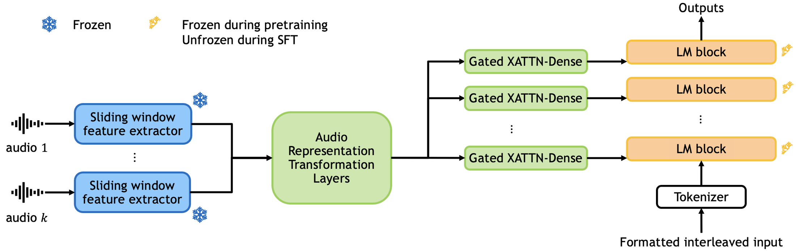

*Figure 2 · [Source](https://arxiv.org/abs/2402.01831)*

Details

**Input → output:** T, A → T · **Interaction:** text-output

Focuses on sound understanding, in-context examples and textual dialogue.

### Audio Flamingo 2

Custom CLAP and curriculum training.

[Paper](https://arxiv.org/abs/2503.03983)

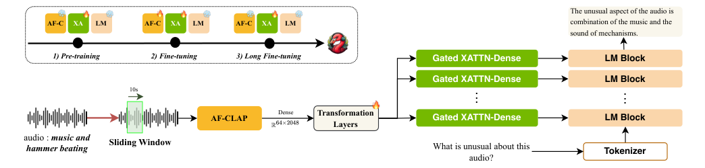

*Figure 2 · [Source](https://arxiv.org/abs/2503.03983)*

Details

**Input → output:** T, A → T · **Interaction:** text-output

Non-speech sound/music understanding and long-audio reasoning.

### Audio Flamingo Next

Temporal audio chain-of-thought.

[Paper](https://arxiv.org/abs/2604.10905)

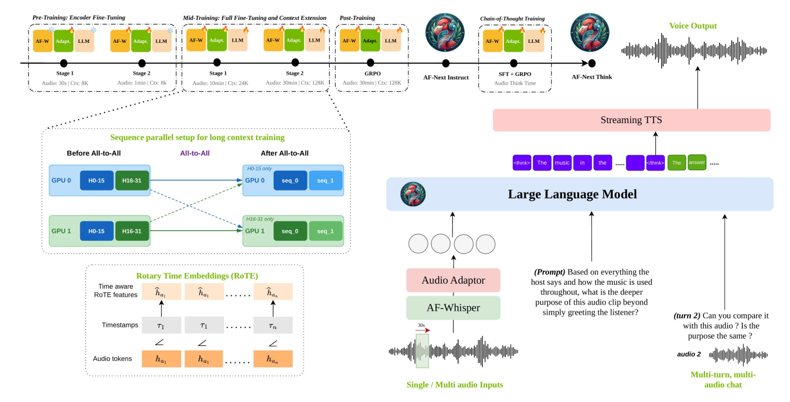

*Figure 3 · [Source](https://arxiv.org/abs/2604.10905)*

Details

**Input → output:** T, A → T · **Interaction:** text-output

General audio understanding and temporally grounded reasoning.

**Variants:** AF-Next.

### Audio-Cogito

Reasoning data and self-distillation.

[Paper](https://arxiv.org/abs/2604.12527)

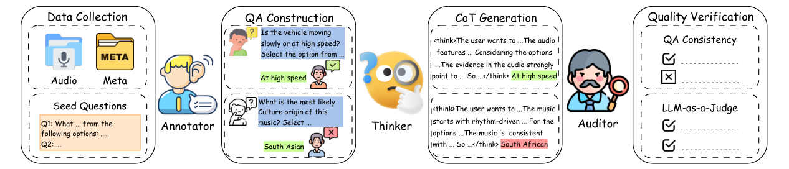

*Figure 1 · [Source](https://arxiv.org/abs/2604.12527)*

Details

**Input → output:** T, A → T · **Interaction:** text-output

A reasoning-trained audio-language model.

### Audio-DeepThinker

Progressive reasoning-aware RL.

[Paper](https://arxiv.org/abs/2604.18187)

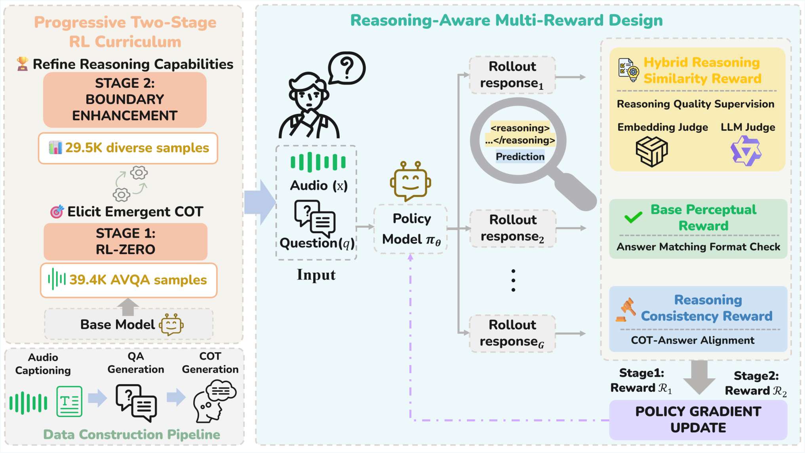

*Figure 2 · [Source](https://arxiv.org/abs/2604.18187)*

Details

**Input → output:** T, A → T · **Interaction:** text-output

Trains reasoning chains to remain grounded in acoustic evidence.

### Audio-Reasoner

Audio chain-of-thought training.

[Paper](https://arxiv.org/abs/2503.02318)

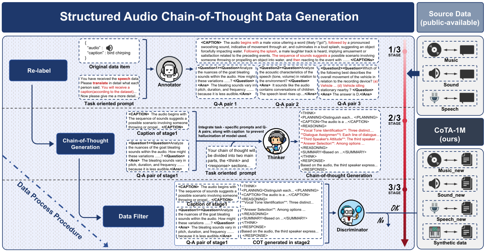

*Figure 3 · [Source](https://arxiv.org/abs/2503.02318)*

Details

**Input → output:** T, A → T · **Interaction:** text-output

Learns explicit reasoning from audio-question-answer data.

### AudioChatLlama

Speech-conditioned Llama.

[Paper](https://arxiv.org/abs/2311.06753)

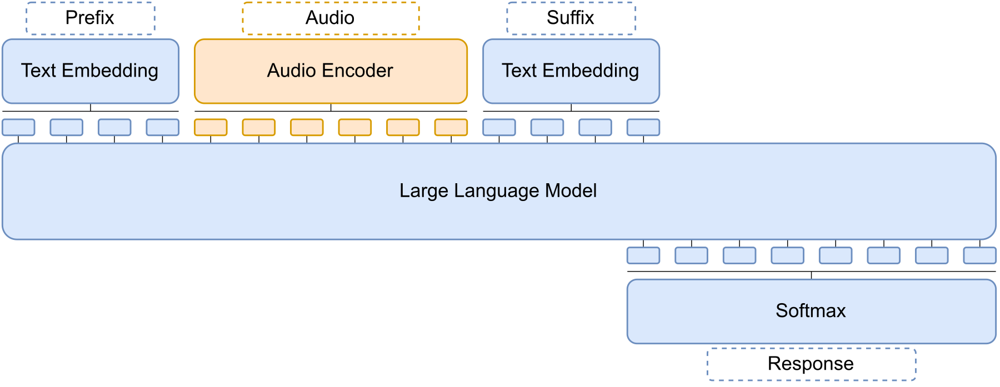

*Figure 1 · [Source](https://arxiv.org/abs/2311.06753)*

Details

**Input → output:** T, S → T · **Interaction:** text-output

Uses spoken prompts for instruction-following and language tasks.

### BLSP

Frozen encoder/LLM with learned adapter.

[Paper](https://arxiv.org/abs/2309.00916)

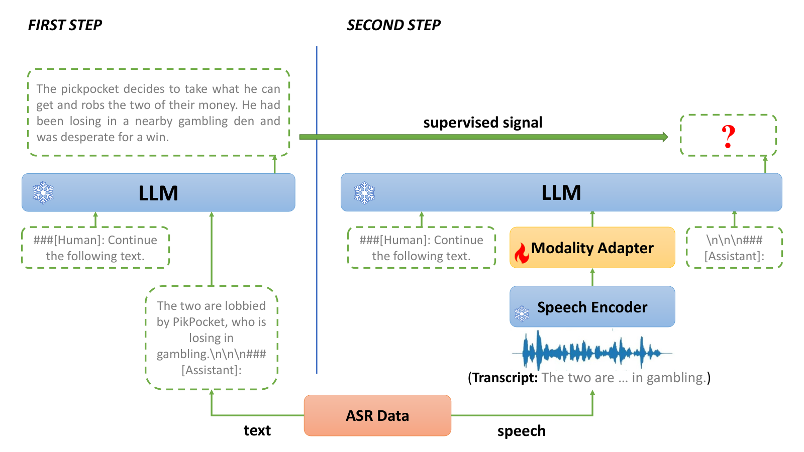

*Figure 2 · [Source](https://arxiv.org/abs/2309.00916)*

Details

**Input → output:** T, S → T · **Interaction:** text-output

Aligns speech-conditioned and text-conditioned language behavior.

### BLSP-Emo

Semantic and emotion-aware alignment.

[Paper](https://arxiv.org/abs/2406.03872)

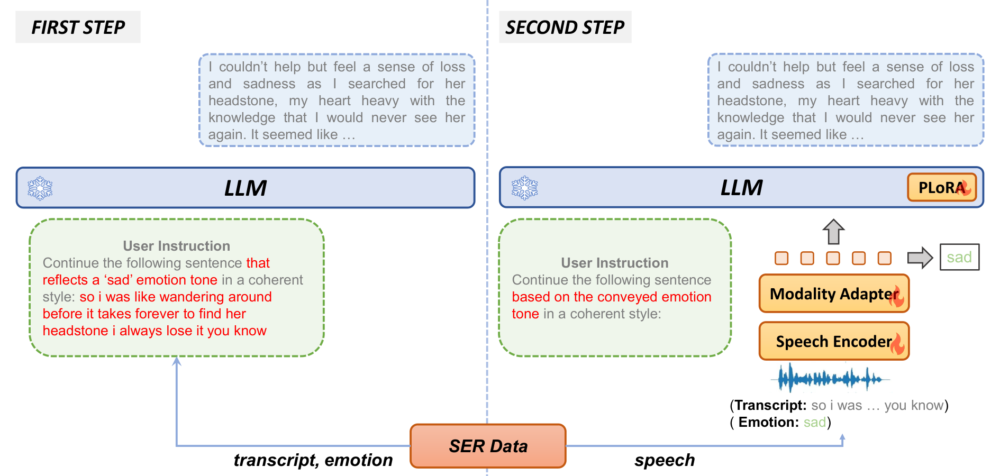

*Figure 2 · [Source](https://arxiv.org/abs/2406.03872)*

Details

**Input → output:** T, S → T · **Interaction:** text-output

Preserves speech emotion in the language model's responses.

### DeSTA

Descriptive speech-text alignment.

[Paper](https://arxiv.org/abs/2406.18871)

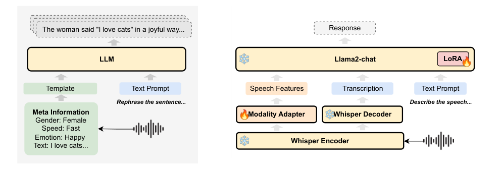

*Figure 2 · [Source](https://arxiv.org/abs/2406.18871)*

Details

**Input → output:** T, S → T · **Interaction:** text-output

Preserves nonlexical speech information through descriptive supervision.

### DeSTA2

Self-generated alignment data.

[Paper](https://arxiv.org/abs/2409.20007)

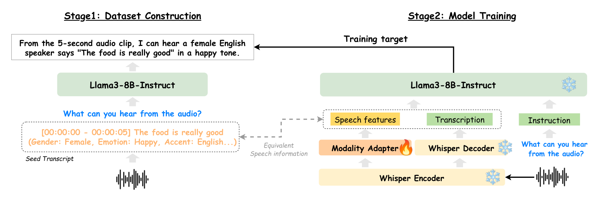

*Figure 1 · [Source](https://arxiv.org/abs/2409.20007)*

Details

**Input → output:** T, S → T · **Interaction:** text-output

Speech instruction-following without dedicated speech instruction-tuning data.

### DeSTA2.5-Audio

Self-generated cross-modal alignment.

[Paper](https://arxiv.org/abs/2507.02768)

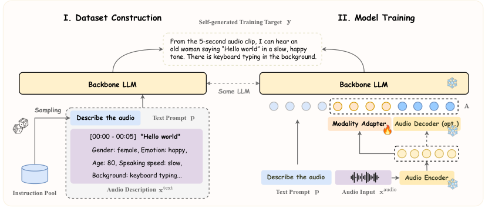

*Figure 2 · [Source](https://arxiv.org/abs/2507.02768)*

Details

**Input → output:** T, A → T · **Interaction:** text-output

General audio model intended to preserve the text backbone's language abilities.

### DIFFA

Diffusion language backbone and adapters.

[Paper](https://arxiv.org/abs/2507.18452)

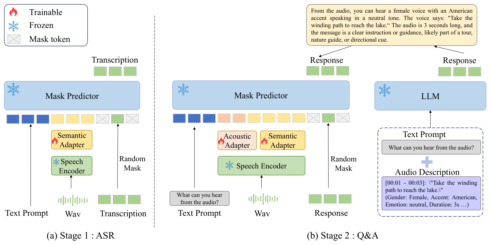

*Figure 2 · [Source](https://arxiv.org/abs/2507.18452)*

Details

**Input → output:** T, S → T · **Interaction:** text-output

Speech-conditioned text generation with a diffusion LM.

### DIFFA-2

Diffusion LM and dual audio adapters.

[Paper](https://arxiv.org/abs/2601.23161)

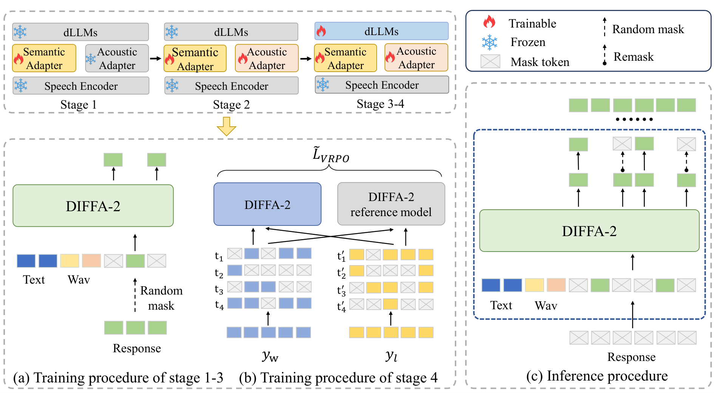

*Figure 1 · [Source](https://arxiv.org/abs/2601.23161)*

Details

**Input → output:** T, A → T · **Interaction:** text-output

Extends DIFFA to broader audio understanding and practical decoding.

### DuplexMamba

Mamba speech-to-text backbone.

[Paper](https://arxiv.org/abs/2502.11123)

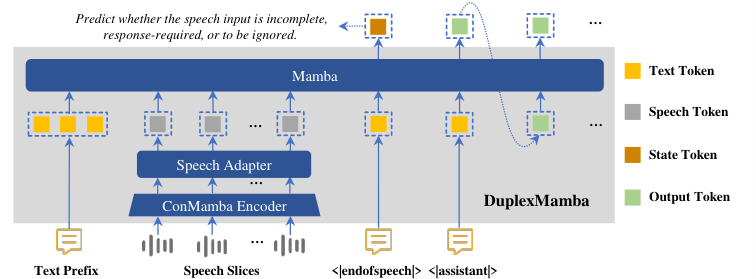

*Figure 1 · [Source](https://arxiv.org/abs/2502.11123)*

Details

**Input → output:** T, S → T · **Interaction:** streaming

Simultaneously processes speech and generates text; a deployed spoken interface needs a speech-output component.

### GAMA

Audio Q-Former and multi-layer aggregation.

[Paper](https://arxiv.org/abs/2406.11768)

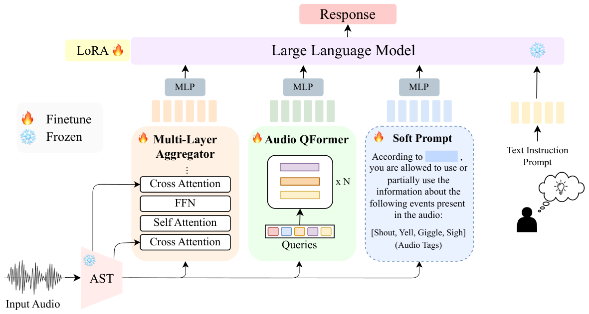

*Figure 2, PDF p. 3 · [Source](https://arxiv.org/abs/2406.11768)*

Details

**Input → output:** T, A → T · **Interaction:** text-output

Reasoning over non-speech sounds and nonverbal audio.

### LLark

Music representations and text LLM.

[Paper](https://arxiv.org/abs/2310.07160)

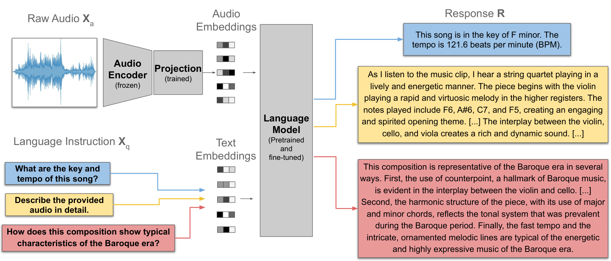

*Figure 1 · [Source](https://arxiv.org/abs/2310.07160)*

Details

**Input → output:** T, M → T · **Interaction:** text-output

Music description, understanding and reasoning.

### LLaSM

Speech-language instruction alignment.

[Paper](https://arxiv.org/abs/2308.15930)

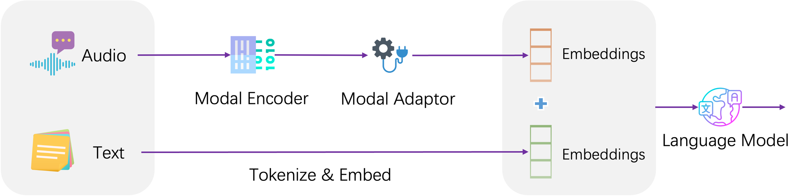

*Figure 1 · [Source](https://arxiv.org/abs/2308.15930)*

Details

**Input → output:** T, S → T · **Interaction:** text-output

Accepts spoken instructions; speech generation is not implied by its name.

### LTU

Audio encoder and language model.

[Paper](https://arxiv.org/abs/2305.10790)

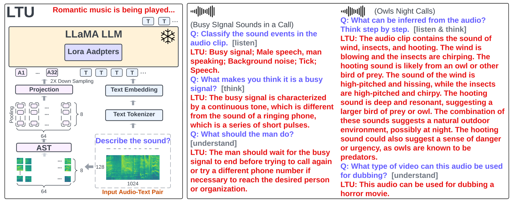

*Figure 1 · [Source](https://arxiv.org/abs/2305.10790)*

Details

**Input → output:** T, A → T · **Interaction:** text-output

Open-ended sound understanding beyond fixed classification labels.

### LTU-AS

Whisper and LLaMA.

[Paper](https://arxiv.org/abs/2309.14405)

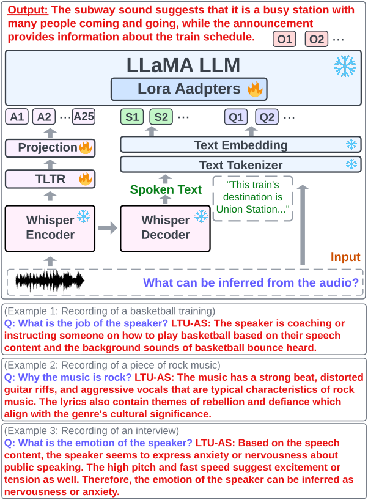

*Figure 1 · [Source](https://arxiv.org/abs/2309.14405)*

Details

**Input → output:** T, A → T · **Interaction:** text-output

Joint speech content, paralinguistic and non-speech audio understanding.

### Mellow

Compact audio-language model.

[Paper](https://arxiv.org/abs/2503.08540)

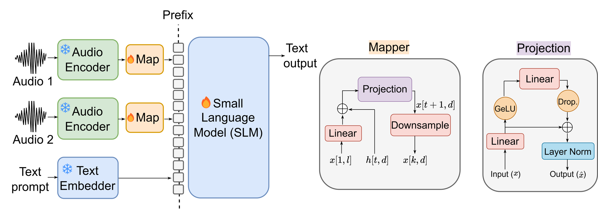

*Figure 2 · [Source](https://arxiv.org/abs/2503.08540)*

Details

**Input → output:** T, A → T · **Interaction:** text-output

Small model trained for audio-grounded reasoning.

### MERaLiON-AudioLLM

Speech-text alignment.

[Paper](https://arxiv.org/abs/2412.09818)

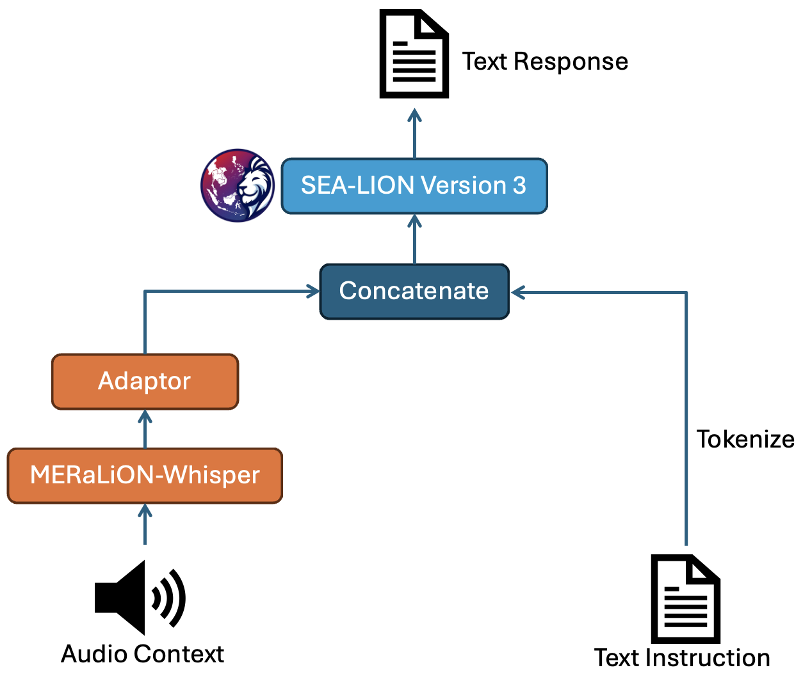

*Figure 1 · [Source](https://arxiv.org/abs/2412.09818)*

Details

**Input → output:** T, S → T · **Interaction:** text-output

Singapore-focused multilingual and paralinguistic speech understanding.

### MiDashengLM

Dasheng audio encoder and language model.

[Paper](https://arxiv.org/abs/2508.03983)

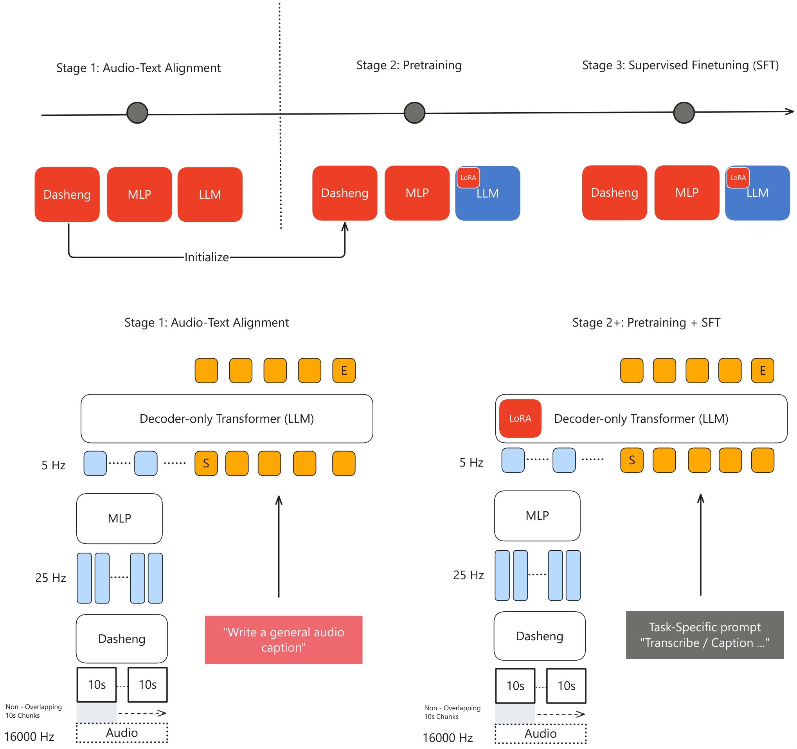

*Figure 2 · [Source](https://arxiv.org/abs/2508.03983)*

Details

**Input → output:** T, A → T · **Interaction:** text-output

Uses general audio captions to align speech, sounds and music with text.

### MOSS-Audio

Audio encoder, adapter and DeepStack.

[Paper](https://arxiv.org/abs/2606.01802)

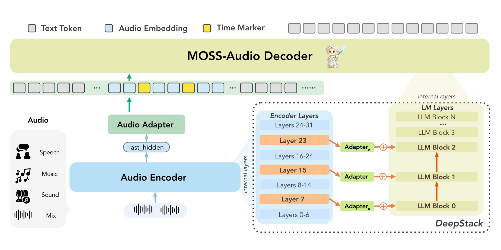

*Figure 2 · [Source](https://arxiv.org/abs/2606.01802)*

Details

**Input → output:** T, A → T · **Interaction:** text-output

Timestamped audio understanding and text generation.

### MU-LLaMA

MERT and language model.

[Paper](https://arxiv.org/abs/2308.11276)

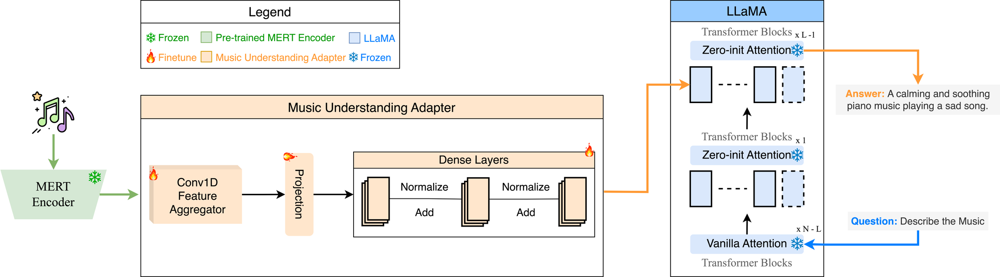

*Figure 1 · [Source](https://arxiv.org/abs/2308.11276)*

Details

**Input → output:** T, M → T · **Interaction:** text-output

Music question answering and captioning; separate from MuMu-LLaMA.

### Music Flamingo

Music-language reasoning model.

[Paper](https://arxiv.org/abs/2511.10289)

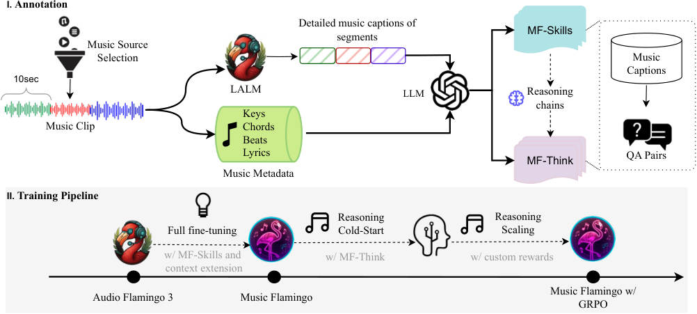

*Figure 2 · [Source](https://arxiv.org/abs/2511.10289)*

Details

**Input → output:** T, M → T · **Interaction:** text-output

Analyzes music and songs; does not serve as a music generator here.

### MusiLingo

MERT-to-LLM projection.

[Paper](https://arxiv.org/abs/2309.08730)

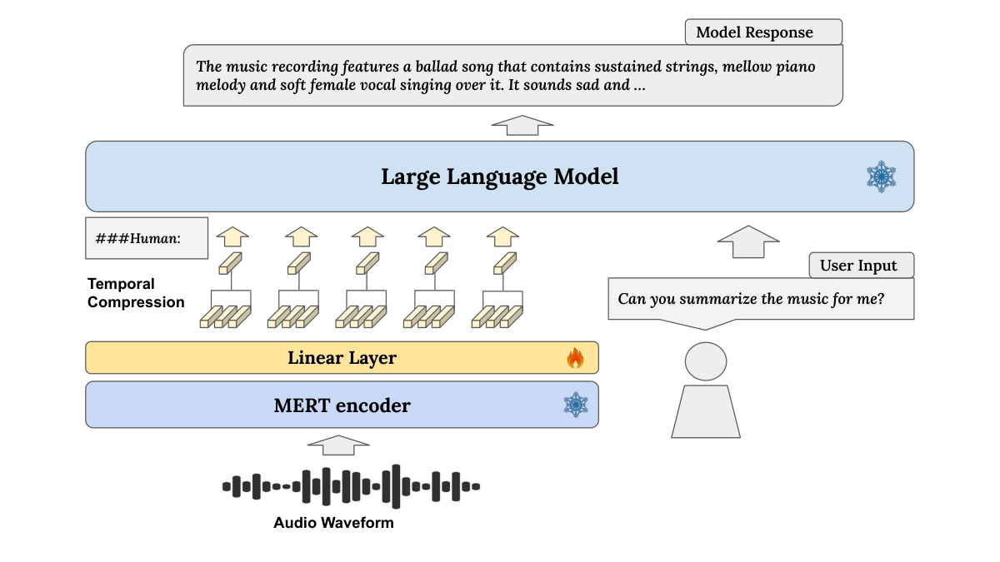

*Figure 1 · [Source](https://arxiv.org/abs/2309.08730)*

Details

**Input → output:** T, M → T · **Interaction:** text-output

Music captioning and textual responses to music questions.

### Omni-R1 (audio reasoning)

GRPO on Qwen2.5-Omni.

[Paper](https://arxiv.org/abs/2505.09439)

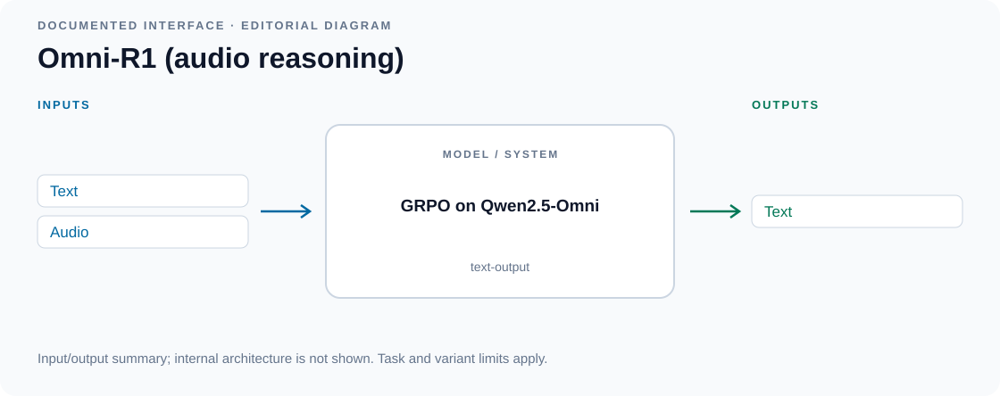

*Input/output diagram · [Source](https://arxiv.org/abs/2505.09439)*

Details

**Input → output:** T, A → T · **Interaction:** text-output

Rouditchenko et al.; distinct from the two-system Omni-R1 and R1-Omni.

Editorial summary of documented inputs and outputs; internal architecture is not shown.

### OSUM

Whisper encoder and Qwen2.

[Paper](https://arxiv.org/abs/2501.13306)

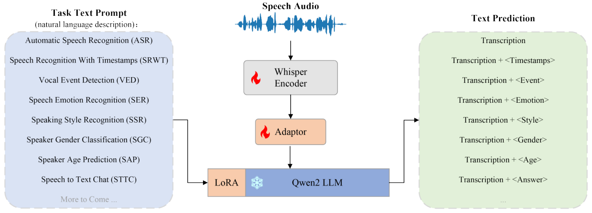

*Figure 2 · [Source](https://arxiv.org/abs/2501.13306)*

Details

**Input → output:** T, S → T · **Interaction:** text-output

Speech recognition, emotion, speaking style and other speech-understanding tasks.

### Pengi

Audio/text conditioning of an LM.

[Paper](https://arxiv.org/abs/2305.11834)

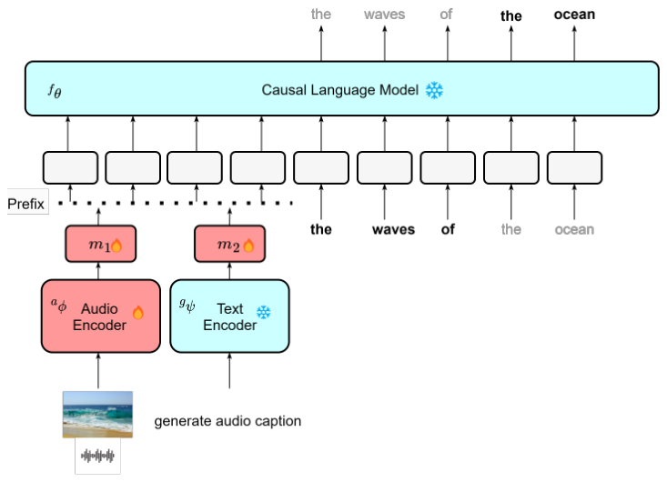

*Figure 2, PDF p. 3 · [Source](https://arxiv.org/abs/2305.11834)*

Details

**Input → output:** T, A → T · **Interaction:** text-output

Casts audio tasks as free-form text generation.

### Qwen-Audio

Audio encoder and multitask language alignment.

[Paper](https://arxiv.org/abs/2311.07919)

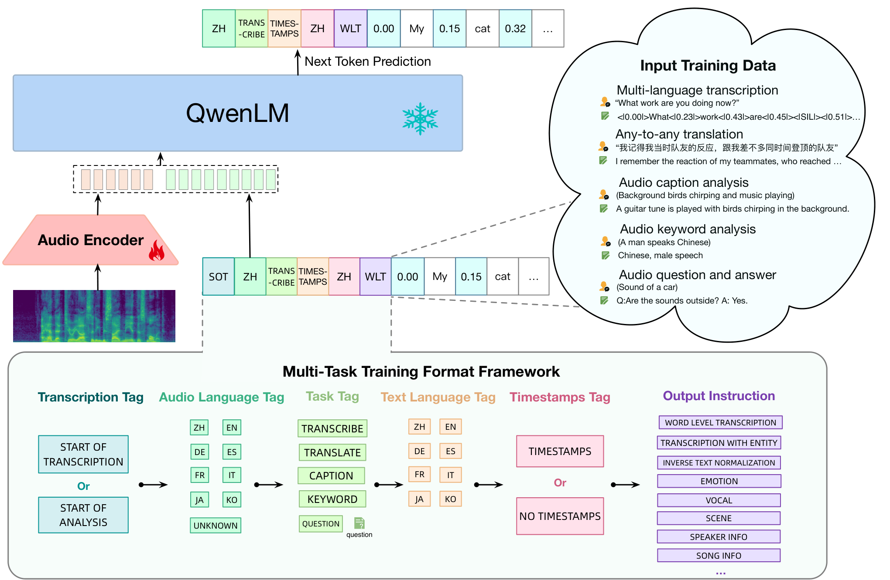

*Figure 3 · [Source](https://arxiv.org/abs/2311.07919)*

Details

**Input → output:** T, A → T · **Interaction:** text-output

General audio input with textual answers.

**Variants:** Base; Chat.

### Qwen2-Audio

Audio encoder and instruction-tuned LLM.

[Paper](https://arxiv.org/abs/2407.10759)

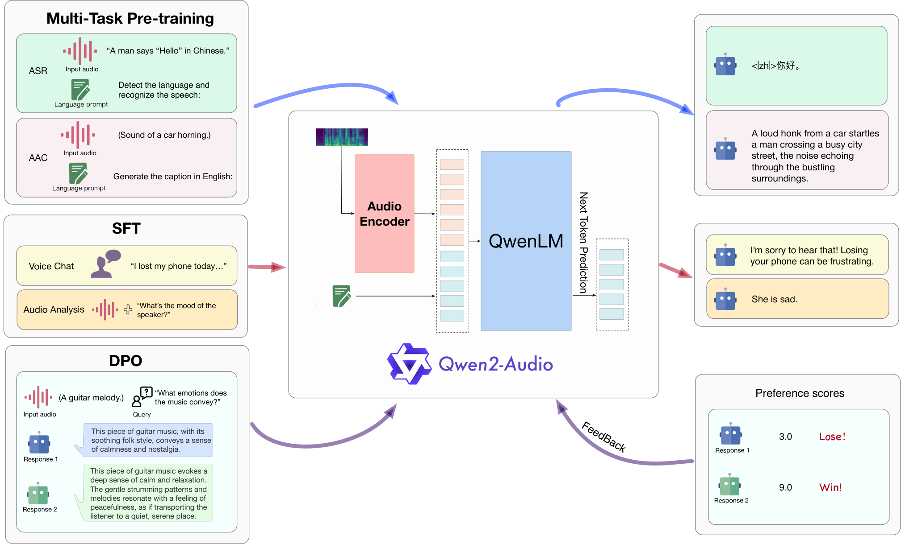

*Figure 2 · [Source](https://arxiv.org/abs/2407.10759)*

Details

**Input → output:** T, A → T · **Interaction:** text-output

Voice-chat mode accepts speech but generates text, not audio.

**Variants:** Base; Instruct.

### SALM

Audio encoder, adapter and frozen LLM.

[Paper](https://arxiv.org/abs/2310.09424)

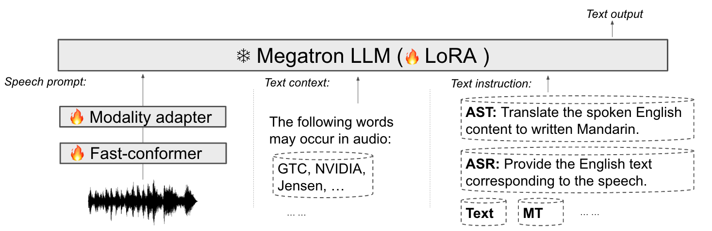

*Figure 1 · [Source](https://arxiv.org/abs/2310.09424)*

Details

**Input → output:** T, S → T · **Interaction:** text-output

Speech recognition and translation with in-context examples.

### SALMONN

Speech/audio encoders and LLM.

[Paper](https://arxiv.org/abs/2310.13289)

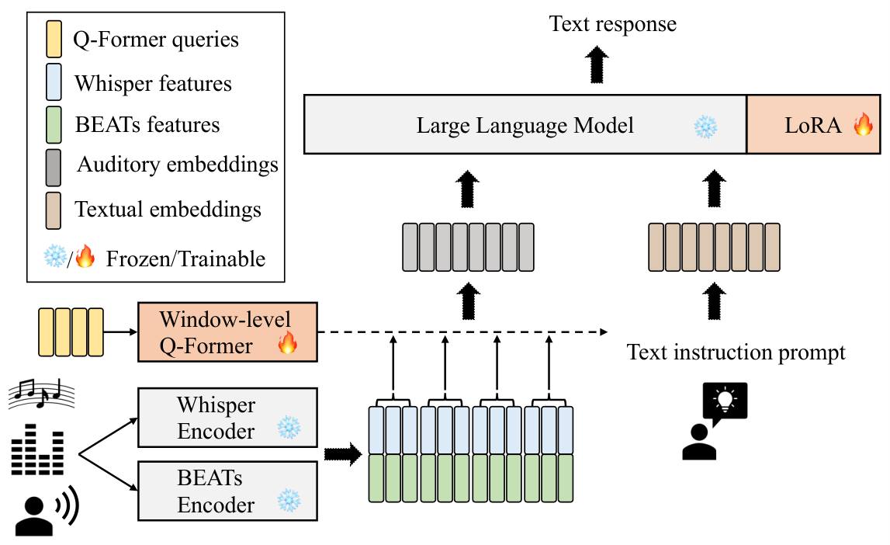

*Figure 1 · [Source](https://arxiv.org/abs/2310.13289)*

Details

**Input → output:** T, A → T · **Interaction:** text-output

General hearing model for speech, sounds and music.

**Variants:** 7B; 13B.

### SALMONN-2

Self-supervised encoder and multi-layer fusion.

[Paper](https://arxiv.org/abs/2607.17079)

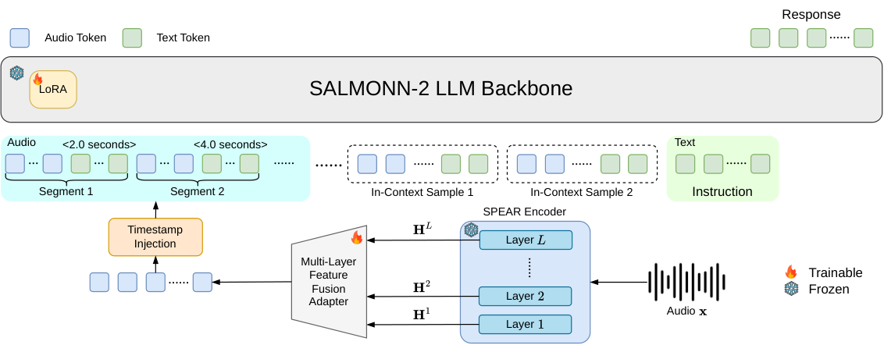

*Figure 2 · [Source](https://arxiv.org/abs/2607.17079)*

Details

**Input → output:** T, A → T · **Interaction:** text-output

Uses general-purpose self-supervised representations for hearing tasks; separate from video-SALMONN 2.

**Variants:** 8B.

### SLM (Google)

Adapter between frozen speech and text models.

[Paper](https://arxiv.org/abs/2310.00230)

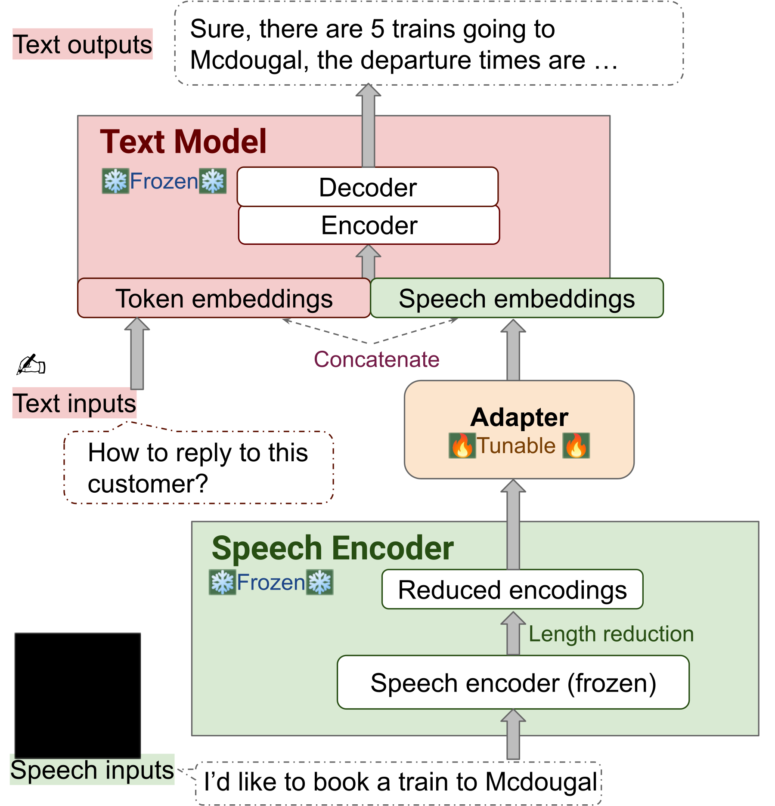

*Figure 2 · [Source](https://arxiv.org/abs/2310.00230)*

Details

**Input → output:** T, S → T · **Interaction:** text-output

The named model from 'Bridge the thin gap'; SLM is also a generic abbreviation elsewhere.

### Soundwave

Efficient speech-text alignment.

[Paper](https://arxiv.org/abs/2502.12900)

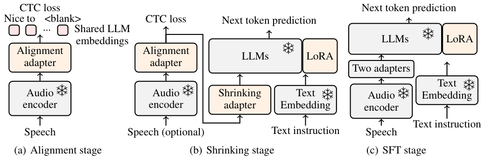

*Figure 2, PDF p. 3 · [Source](https://arxiv.org/abs/2502.12900)*

Details

**Input → output:** T, S → T · **Interaction:** text-output

Reduces the representation and sequence-length gap between speech and text.

### SpeechVerse

Frozen speech/text models with adapters.

[Paper](https://arxiv.org/abs/2405.08295)

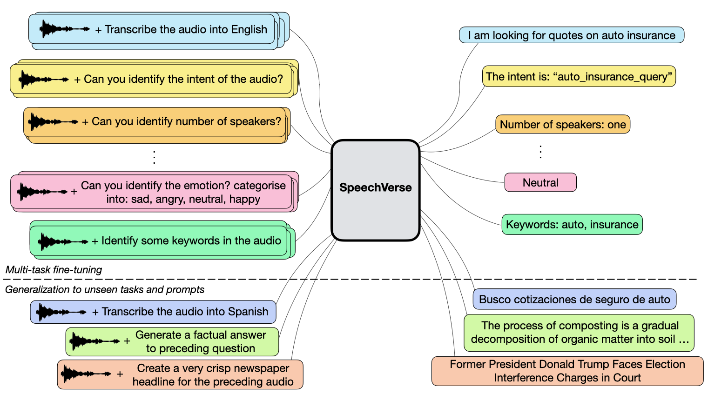

*Figure 1 · [Source](https://arxiv.org/abs/2405.08295)*

Details

**Input → output:** T, S → T · **Interaction:** text-output

Multi-task audio-language instruction-following and generalization.

### Step-Audio-R1

Modality-grounded reasoning distillation.

[Paper](https://arxiv.org/abs/2511.15848)

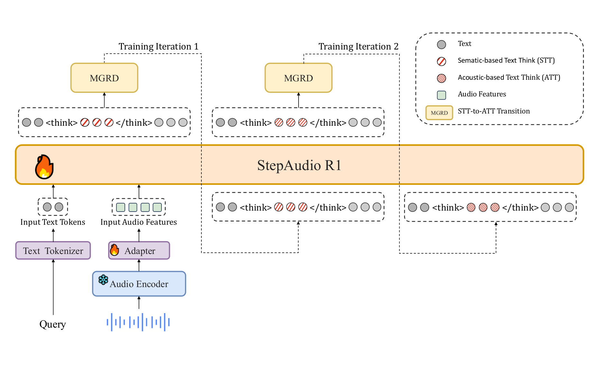

*Figure 2 · [Source](https://arxiv.org/abs/2511.15848)*

Details

**Input → output:** T, A → T · **Interaction:** text-output

Audio reasoning release; consult later R1 variants for spoken interaction support.

### Step-Audio-R1.5

Preference optimization for audio reasoning.

[Paper](https://arxiv.org/abs/2604.25719)

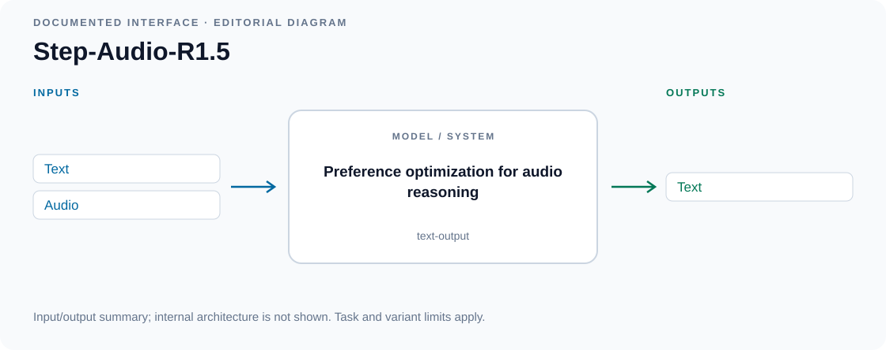

*Input/output diagram · [Source](https://arxiv.org/abs/2604.25719)*

Details

**Input → output:** T, A → T · **Interaction:** text-output

The report improves reasoning and alignment for open-ended audio tasks; no speech output is asserted.

Editorial summary of documented inputs and outputs; internal architecture is not shown.

**Variants:** R1.5.

### TextPro-SLM

Text/prosody aligned speech encoder.

[Paper](https://arxiv.org/abs/2605.05927)

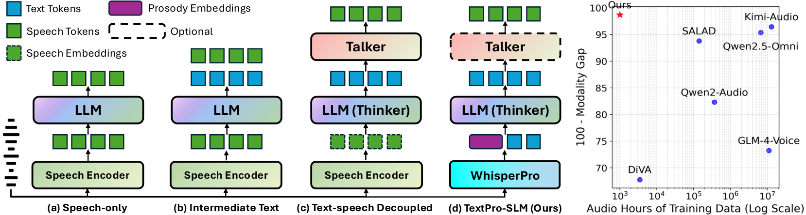

*Figure 1 · [Source](https://arxiv.org/abs/2605.05927)*

Details

**Input → output:** T, S → T · **Interaction:** text-output

Preserves both recognized words and prosodic embeddings for language reasoning.

### Ultravox

Speech encoder and text LLM.

[Repository](https://github.com/fixie-ai/ultravox)

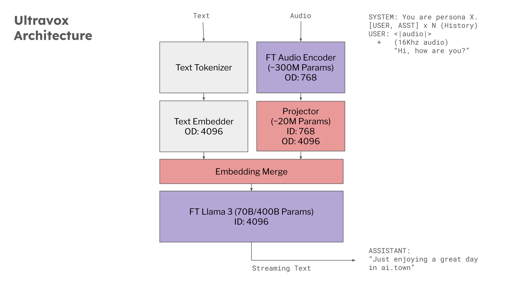

*Official architecture diagram · [Source](https://github.com/fixie-ai/ultravox)*

Details

**Input → output:** T, S → T · **Interaction:** text-output

Model emits text; a deployed voice agent adds a separate speech synthesizer.

**Variants:** Release family; model cards identify checkpoints.

### Voxtral

Audio-conditioned language model.

[Paper](https://arxiv.org/abs/2507.13264)

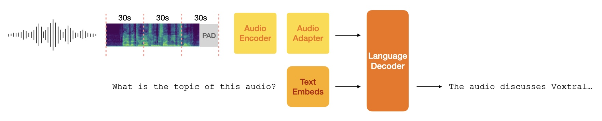

*Figure 1 · [Source](https://arxiv.org/abs/2507.13264)*

Details

**Input → output:** T, A → T · **Interaction:** text-output

Audio chat and spoken-content understanding; separate from Voxtral transcription-only releases.

**Variants:** Mini; Small.

### WavLLM

Whisper/WavLM dual encoders.

[Paper](https://arxiv.org/abs/2404.00656)

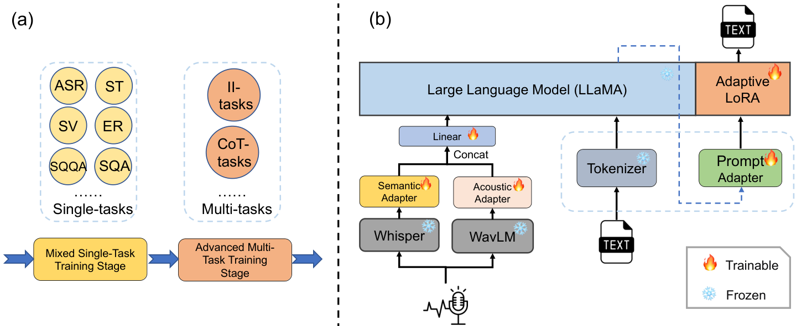

*Figure 1 · [Source](https://arxiv.org/abs/2404.00656)*

Details

**Input → output:** T, S → T · **Interaction:** text-output

Combines linguistic and speaker-related speech features.

