# Audio understanding models

<!-- Generated by scripts/catalog.py from data/models.json and data/figures.json. Edit the JSON, then regenerate. -->

[← All models](../README.md#models)

**45 models · Reviewed 2026-09-13**

Primary-source figures and labeled input/output diagrams. [Figure credits](../assets/architectures/CREDITS.md).

Model index and modality key

**Modalities:** T = text, I = image, V = video, A = general audio, S = speech, M = music, X = other structured modalities. A is a broad label, not a guarantee of every audio task. See the [methodology](../docs/methodology.md) for interaction labels, variant scope and inclusion rules.

Dates refer to papers or announcements, not necessarily model releases.

| Model | Source date | Input → output | Interaction |
| --- | --- | --- | --- |
| [Audio Flamingo](#audio-flamingo) | 2024-02-02 | T, A → T | text-output |
| [Audio Flamingo 2](#audio-flamingo-2) | 2025-03-06 | T, A → T | text-output |
| [Audio Flamingo Next](#audio-flamingo-next) | 2026-04-13 | T, A → T | text-output |
| [Audio-Interaction](#audio-interaction) | 2026-06-03 | T, A → T | text-output |
| [Audio-Reasoner](#audio-reasoner) | 2025-03-04 | T, A → T | text-output |
| [AzeroS](#azeros) | 2025-12-31 | T, S → T | text-output |
| [BLSP-Emo](#blsp-emo) | — | T, S → T | text-output |
| [DeSTA2](#desta2) | 2024-09-30 | T, A → T | text-output |
| [DeSTA2.5-Audio](#desta2-5-audio) | 2025-07-03 | T, A → T | text-output |
| [DIFFA](#diffa) | 2025-07-24 | T, A → T | text-output |
| [DIFFA-2](#diffa-2) | 2026-01-30 | T, A → T | text-output |
| [DiVA](#diva) | — | T, S → T | text-output |
| [DuplexMamba](#duplexmamba) | 2025-02-16 | T, S → T | text-output |
| [Ichigo](#ichigo) | — | T, S → T | text-output |
| [LFG-2](#lfg-2) | — | T, S → T | text-output |
| [LFG-3](#lfg-3) | — | T, S → T | text-output |
| [LLaSM](#llasm) | 2023-08-30 | T, S → T | text-output |
| [Mellow](#mellow) | 2025-03-11 | T, A → T | text-output |
| [MERaLiON 2](#meralion-2) | — | T, A → T | text-output |
| [MERaLiON 3](#meralion-3) | — | T, S → T | text-output |
| [MERaLiON-AudioLLM](#meralion-audiollm) | 2024-12-13 | T, A → T | text-output |
| [MiDashengLM](#midashenglm) | 2025-08-06 | T, A → T | text-output |
| [MOSS-Audio Instruct](#moss-audio) | 2026-06-01 | T, A → T | text-output |
| [MOSS-Audio Thinking](#moss-audio-thinking) | — | T, A → T | text-output |
| [Music Flamingo](#music-flamingo) | 2025-11-13 | T, M → T | text-output |
| [Omni-R1 (audio reasoning)](#omni-r1-audio-reasoning) | — | T, A → T | text-output |
| [OSUM](#osum) | 2025-01-23 | T, S → T | text-output |
| [ParaBridge](#parabridge) | 2026-06-09 | T, A → T | text-output |
| [Qwen-Audio](#qwen-audio) | 2023-11-14 | T, A → T | text-output |
| [Qwen2-Audio](#qwen2-audio) | 2024-07-15 | T, A → T | text-output |
| [SALMONN](#salmonn) | 2023-10-20 | T, A → T | text-output |
| [SALMONN-2](#salmonn-2) | — | T, A → T | text-output |
| [SoulX-Duplug](#soulx-duplug) | 2026-03-16 | T, S → T | text-output |
| [Step-Audio 2 Mini Think](#step-audio-2-think) | — | T, A → T | text-output |
| [Step-Audio-R1](#step-audio-r1) | 2025-11-19 | T, A → T | text-output |
| [Ultravox 0.4.1 Llama-3.1-8B](#ultravox-0-4-1) | — | T, S → T | text-output |
| [Ultravox 0.5 Llama-3.1-8B](#ultravox-0-5-8b) | — | T, S → T | text-output |
| [Ultravox 0.5 Llama-3.2-1B](#ultravox-0-5-1b) | — | T, S → T | text-output |
| [Ultravox 0.6 Gemma-3-27B](#ultravox-0-6-gemma3) | — | T, S → T | text-output |
| [Ultravox 0.6 Llama-3.1-8B](#ultravox-0-6-8b) | — | T, S → T | text-output |
| [Ultravox 0.6 Llama-3.3-70B](#ultravox-0-6-70b) | — | T, S → T | text-output |
| [Ultravox 0.6 Qwen3-32B](#ultravox-0-6-qwen3) | — | T, S → T | text-output |
| [Ultravox 0.7 GLM-4.6](#ultravox-0-7-glm-4-6) | — | T, S → T | text-output |
| [Voxtral Mini](#voxtral-mini) | — | T, A → T | text-output |
| [Voxtral Small](#voxtral) | 2025-07-17 | T, A → T | text-output |

## Architectures

### Audio Flamingo

Answers questions about sounds and music and supports audio-grounded dialogue and examples.

**Architecture:** Audio embeddings connected to a language model through gated cross-attention.

[Paper](https://arxiv.org/abs/2402.01831) · [Code](https://github.com/NVIDIA/audio-flamingo/tree/legacy_audio_flamingo_1) · [Weights](https://huggingface.co/nvidia/audio-flamingo)

**Custom / restricted:** code [MIT](https://github.com/NVIDIA/audio-flamingo/tree/legacy_audio_flamingo_1) · weights [OPT-IML noncommercial license](https://huggingface.co/nvidia/audio-flamingo/blob/9e8c1516b93869ce7326556c9fb2c3fac84db77d/README.md) — Noncommercial terms apply to model weights and relevant bundled components.

*Figure 2 · [Source](https://arxiv.org/abs/2402.01831)*

Details

**Input → output:** T, A → T · **Interaction:** text-output

Capabilities refer to the linked checkpoint; consult its model card for task prompts and deployment requirements.

**Variants:** audio-flamingo.

### Audio Flamingo 2

Reasons about environmental sounds and music, including long recordings.

**Architecture:** Audio encoder and language model trained with audio-skill curricula.

[Paper](https://arxiv.org/abs/2503.03983) · [Code](https://github.com/NVIDIA/audio-flamingo/tree/audio_flamingo_2) · [Weights](https://huggingface.co/nvidia/audio-flamingo-2)

**Custom / restricted:** code [MIT](https://github.com/NVIDIA/audio-flamingo/tree/audio_flamingo_2) · weights [NVIDIA OneWay Noncommercial](https://huggingface.co/nvidia/audio-flamingo-2/blob/3a7f4aea17e72c7367940affea6749069a7095fc/README.md) — Noncommercial terms apply to model weights and relevant bundled components.

*Figure 2 · [Source](https://arxiv.org/abs/2503.03983)*

Details

**Input → output:** T, A → T · **Interaction:** text-output

Capabilities refer to the linked checkpoint; consult its model card for task prompts and deployment requirements.

**Variants:** audio-flamingo-2.

### Audio Flamingo Next

Analyzes long audio recordings and reasons about speech, sounds and music.

**Architecture:** Extended-context audio-language modeling.

[Paper](https://arxiv.org/abs/2604.10905) · [Code](https://github.com/huggingface/transformers/tree/main/src/transformers/models/audioflamingo3) · [Weights](https://huggingface.co/nvidia/audio-flamingo-next-hf)

**Custom / restricted:** code [Apache-2.0](https://github.com/huggingface/transformers/blob/main/LICENSE) · weights [NVIDIA OneWay Noncommercial](https://huggingface.co/nvidia/audio-flamingo-next-hf/blob/5634886e2615c2f587dcf8b93c6edfe9907930ca/README.md) — Noncommercial terms apply to model weights and relevant bundled components.

*Figure 3 · [Source](https://arxiv.org/abs/2604.10905)*

Details

**Input → output:** T, A → T · **Interaction:** text-output

Capabilities refer to the linked checkpoint; consult its model card for task prompts and deployment requirements.

**Variants:** audio-flamingo-next-hf.

### Audio-Interaction

Monitors an ongoing audio stream and decides when a text response or proactive intervention is useful.

**Architecture:** Streaming perceive-decide-respond modeling with asynchronous inference.

[Paper](https://arxiv.org/abs/2606.05121) · [Code](https://github.com/xzf-thu/Audio-Interaction) · [Weights](https://huggingface.co/zhifeixie/AudioInteraction)

**License unclear:** code [Not stated](https://github.com/xzf-thu/Audio-Interaction/blob/main/README.md) · weights [Apache-2.0](https://huggingface.co/zhifeixie/AudioInteraction/blob/a7cd702ba1452c3d65c270af83079afa385dfee2/README.md) — Public code and weights were located, but a complete release license was not stated.

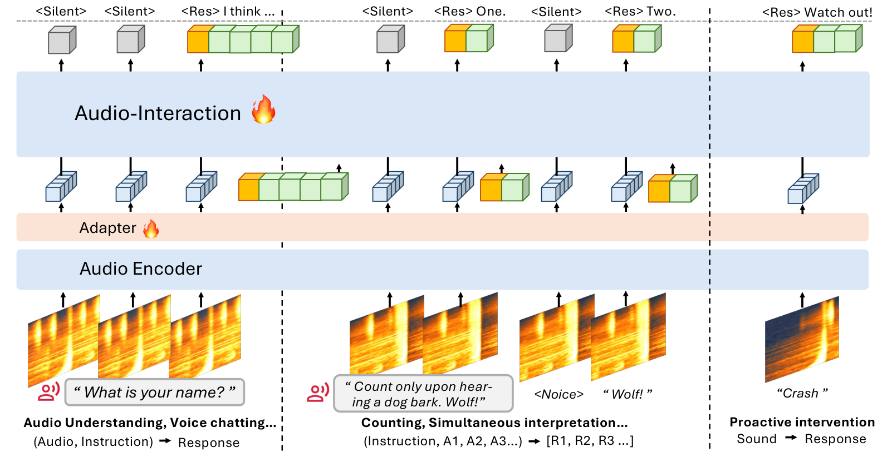

*Figure 3 · [Source](https://arxiv.org/abs/2606.05121)*

Details

**Input → output:** T, A → T · **Interaction:** text-output

Capabilities refer to the linked checkpoint; consult its model card for task prompts and deployment requirements.

**Variants:** AudioInteraction.

### Audio-Reasoner

Reasons about speech, music and environmental sounds to answer complex audio questions.

**Architecture:** Reasoning-focused audio-language post-training.

[Paper](https://arxiv.org/abs/2503.02318) · [Code](https://github.com/xzf-thu/Audio-Reasoner) · [Weights](https://huggingface.co/zhifeixie/Audio-Reasoner)

**Open license:** code [MIT](https://github.com/xzf-thu/Audio-Reasoner/blob/main/LICENSE) · weights [MIT](https://huggingface.co/zhifeixie/Audio-Reasoner/blob/f38198da84d4e02623a83fa1d005ad31f1d6a6a7/README.md)

*Figure 3 · [Source](https://arxiv.org/abs/2503.02318)*

Details

**Input → output:** T, A → T · **Interaction:** text-output

Capabilities refer to the linked checkpoint; consult its model card for task prompts and deployment requirements.

**Variants:** Audio-Reasoner.

### AzeroS

Follows spoken instructions using speech adaptation learned without curated instruction-answer pairs.

**Architecture:** Self-generated instruction-free speech-language alignment.

[Paper](https://arxiv.org/abs/2601.06086) · [Code](https://github.com/AudenAI/Auden) · [Weights](https://huggingface.co/AudenAI/azeros)

**Open license:** code [Apache-2.0](https://github.com/AudenAI/Auden/blob/main/LICENSE) · weights [Apache-2.0](https://huggingface.co/AudenAI/azeros/blob/e9392d32639e7079cb0e24f7373207ee658a8baf/README.md)

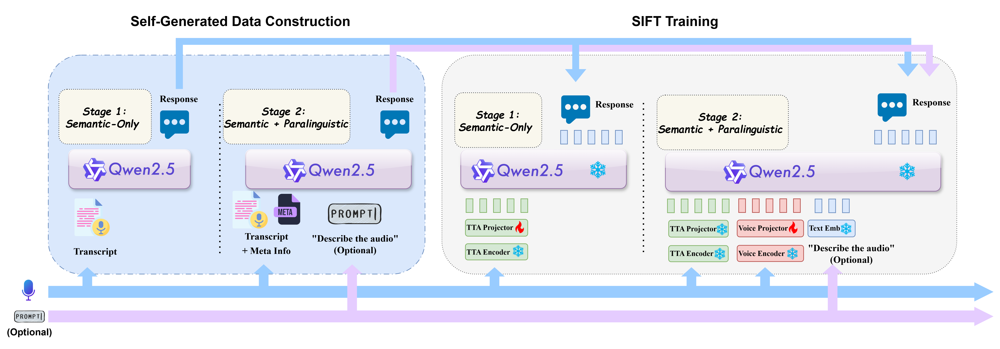

*Figure 1 · [Source](https://arxiv.org/abs/2601.06086)*

Details

**Input → output:** T, S → T · **Interaction:** text-output

Capabilities refer to the linked checkpoint; consult its model card for task prompts and deployment requirements.

**Variants:** azeros.

### BLSP-Emo

Understands vocal emotion and writes empathetic responses to spoken requests.

**Architecture:** Emotion-aware speech-language alignment with Whisper and Qwen.

[Paper](https://arxiv.org/abs/2406.03872) · [Code](https://github.com/cwang621/blsp-emo) · [Weights](https://huggingface.co/cwang621/blsp-emo)

**Custom / restricted:** code [Apache-2.0](https://github.com/cwang621/blsp-emo/blob/main/LICENSE) · weights [Apache-2.0 + Qwen terms](https://huggingface.co/cwang621/blsp-emo/blob/ec0ec614e453a7d3be242482d25cdc7697bc0bf8/README.md) — The Qwen-7B-Chat backbone retains its custom license.

*Figure 2 · [Source](https://arxiv.org/abs/2406.03872)*

Details

**Input → output:** T, S → T · **Interaction:** text-output

Capabilities refer to the linked checkpoint; consult its model card for task prompts and deployment requirements.

**Variants:** blsp-emo.

### DeSTA2

Describes and answers questions about audio using a language model aligned with speech representations.

**Architecture:** Self-generated cross-modal alignment of speech and language representations.

[Paper](https://arxiv.org/abs/2409.20007) · [Code](https://github.com/kehanlu/DeSTA2) · [Weights](https://huggingface.co/DeSTA-ntu/DeSTA2-8B-beta)

**License unclear:** code [Not stated](https://github.com/kehanlu/DeSTA2/blob/main/LICENSE) · weights [Llama community / component terms](https://huggingface.co/DeSTA-ntu/DeSTA2-8B-beta/blob/c8ddfdca7ca208c07c4be2c0c8beceaf12bd6076/README.md) — Base-model and dataset terms apply; no unrestricted standalone weight license is stated.

*Figure 1 · [Source](https://arxiv.org/abs/2409.20007)*

Details

**Input → output:** T, A → T · **Interaction:** text-output

Capabilities refer to the linked checkpoint; consult its model card for task prompts and deployment requirements.

**Variants:** DeSTA2-8B-beta.

### DeSTA2.5-Audio

Performs general audio understanding and follows spoken instructions without an external transcript pipeline.

**Architecture:** Self-generated cross-modal alignment of audio encoders and Llama.

[Paper](https://arxiv.org/abs/2507.02768) · [Code](https://github.com/kehanlu/DeSTA2.5-Audio) · [Weights](https://huggingface.co/DeSTA-ntu/DeSTA2.5-Audio-Llama-3.1-8B)

**License unclear:** code [Not stated](https://github.com/kehanlu/DeSTA2.5-Audio/blob/main/README.md) · weights [Llama community / component terms](https://huggingface.co/DeSTA-ntu/DeSTA2.5-Audio-Llama-3.1-8B/blob/1427f8725d35a0c9da0c7c54b1ffcc157a5948af/README.md) — Base-model and dataset terms apply; no unrestricted standalone weight license is stated.

*Figure 2 · [Source](https://arxiv.org/abs/2507.02768)*

Details

**Input → output:** T, A → T · **Interaction:** text-output

Capabilities refer to the linked checkpoint; consult its model card for task prompts and deployment requirements.

**Variants:** DeSTA2.5-Audio-Llama-3.1-8B.

### DIFFA

Answers audio questions using diffusion-based text generation instead of left-to-right decoding.

**Architecture:** Audio adapter connected to a diffusion language model.

[Paper](https://arxiv.org/abs/2507.18452) · [Code](https://github.com/NKU-HLT/DIFFA) · [Weights](https://huggingface.co/zhoujiaming777/DIFFA)

**License unclear:** code [Not stated](https://github.com/NKU-HLT/DIFFA/blob/main/README.md) · weights [CC-BY-NC-SA-4.0](https://huggingface.co/zhoujiaming777/DIFFA/blob/e91d27d9bd13beb6fabec0174eefb4cd438887cd/README.md) — The checkpoint uses a noncommercial share-alike license; repository code terms are not stated.

*Figure 2 · [Source](https://arxiv.org/abs/2507.18452)*

Details

**Input → output:** T, A → T · **Interaction:** text-output

Capabilities refer to the linked checkpoint; consult its model card for task prompts and deployment requirements.

**Variants:** DIFFA.

### DIFFA-2

Understands speech, sound and music with a diffusion language model and richer acoustic representations.

**Architecture:** Whisper encoder with semantic and acoustic adapters into a diffusion decoder.

[Paper](https://arxiv.org/abs/2601.23161) · [Code](https://github.com/NKU-HLT/DIFFA) · [Weights](https://huggingface.co/zhoujiaming777/DIFFA-2)

**License unclear:** code [Not stated](https://github.com/NKU-HLT/DIFFA/blob/main/README.md) · weights [Not stated](https://huggingface.co/zhoujiaming777/DIFFA-2/blob/8aea6122bafb25578cb49d142c6ac1f8e83e3dea/README.md) — No release-specific code or weight license was located; do not assume DIFFA 1 terms apply.

*Figure 1 · [Source](https://arxiv.org/abs/2601.23161)*

Details

**Input → output:** T, A → T · **Interaction:** text-output

Capabilities refer to the linked checkpoint; consult its model card for task prompts and deployment requirements.

**Variants:** DIFFA-2.

### DiVA

Answers spoken questions by transferring a text assistant's behavior into an audio-input model.

**Architecture:** Self-supervised speech-to-text representation distillation.

[Code](https://huggingface.co/WillHeld/DiVA-llama-3-v0-8b/tree/6e761b15ebde6ccf9b9e91d47a4ae42d79c066ca) · [Weights](https://huggingface.co/WillHeld/DiVA-llama-3-v0-8b)

**Custom / restricted:** code [MPL-2.0](https://huggingface.co/WillHeld/DiVA-llama-3-v0-8b/blob/6e761b15ebde6ccf9b9e91d47a4ae42d79c066ca/README.md) · weights [MPL-2.0 + Llama 3 terms](https://huggingface.co/WillHeld/DiVA-llama-3-v0-8b/blob/6e761b15ebde6ccf9b9e91d47a4ae42d79c066ca/README.md) — The Llama 3 backbone retains its community license.

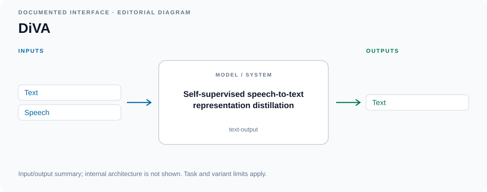

*Input/output diagram · [Source](https://huggingface.co/WillHeld/DiVA-llama-3-v0-8b)*

Details

**Input → output:** T, S → T · **Interaction:** text-output

Capabilities refer to the linked checkpoint; consult its model card for task prompts and deployment requirements.

Editorial summary of documented inputs and outputs; internal architecture is not shown.

**Variants:** DiVA-llama-3-v0-8b.

### DuplexMamba

Reads incoming speech incrementally and supports responsive text generation during speech interaction.

**Architecture:** Streaming speech adaptation of a Mamba backbone.

[Paper](https://arxiv.org/abs/2502.11123) · [Code](https://github.com/khfs/DuplexMamba) · [Weights](https://huggingface.co/Xiangyu1/DuplexMamba)

**Open license:** code [GPL-3.0](https://github.com/khfs/DuplexMamba/blob/main/LICENSE) · weights [Apache-2.0](https://huggingface.co/Xiangyu1/DuplexMamba/blob/3fd0fb94963adfaf950a21e0ed062e59e02f2d1a/README.md)

*Figure 1 · [Source](https://arxiv.org/abs/2502.11123)*

Details

**Input → output:** T, S → T · **Interaction:** text-output

Capabilities refer to the linked checkpoint; consult its model card for task prompts and deployment requirements.

**Variants:** DuplexMamba.

### Ichigo

Answers spoken questions using audio tokens embedded directly into a Llama conversation.

**Architecture:** Early fusion of WhisperVQ tokens and Llama 3.1 text tokens.

[Code](https://github.com/janhq/ichigo) · [Weights](https://huggingface.co/homebrewltd/Ichigo-llama3.1-s-instruct-v0.4)

**License unclear:** code [Not stated](https://github.com/janhq/ichigo/blob/main/README.md) · weights [Apache-2.0 + Llama 3.1 terms](https://huggingface.co/homebrewltd/Ichigo-llama3.1-s-instruct-v0.4/blob/0c788b5781573910b40d9031a7e26940c4753709/README.md) — The Llama 3.1 backbone retains its community license; no standalone repository license was located.

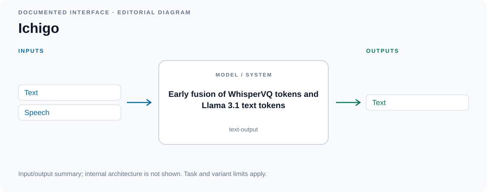

*Input/output diagram · [Source](https://huggingface.co/homebrewltd/Ichigo-llama3.1-s-instruct-v0.4)*

Details

**Input → output:** T, S → T · **Interaction:** text-output

Capabilities refer to the linked checkpoint; consult its model card for task prompts and deployment requirements.

Editorial summary of documented inputs and outputs; internal architecture is not shown.

**Variants:** Ichigo-llama3.1-s-instruct-v0.4.

### LFG-2

Reasons about English spoken instructions and returns a text answer with an optional thought channel.

**Architecture:** Frozen Gemma 4 encoder and 31B decoder with a deep audio projector.

[Code](https://huggingface.co/glenn2/LFG-2/tree/8ea5f17fa715e7f4310c081e51d20bb0f9380be0) · [Weights](https://huggingface.co/glenn2/LFG-2)

**License unclear:** code [Not stated](https://huggingface.co/glenn2/LFG-2/blob/8ea5f17fa715e7f4310c081e51d20bb0f9380be0/README.md) · weights [Not stated](https://huggingface.co/glenn2/LFG-2/blob/8ea5f17fa715e7f4310c081e51d20bb0f9380be0/README.md) — Code and weights are downloadable, but this release does not state a license.

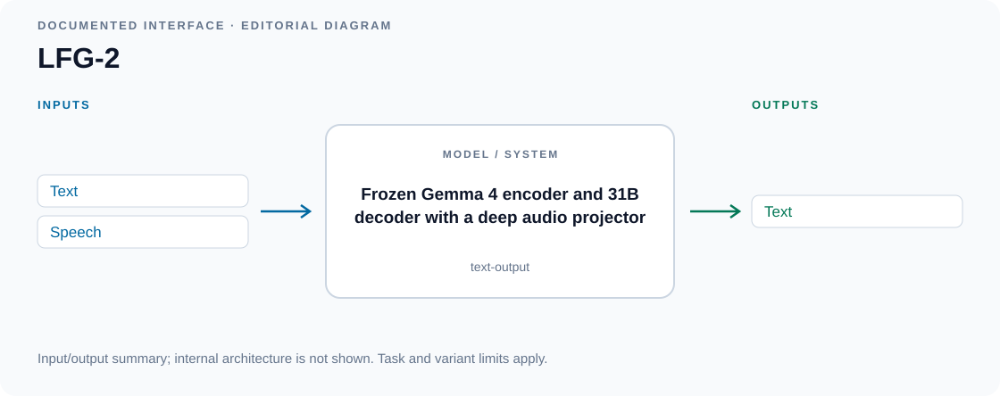

*Input/output diagram · [Source](https://huggingface.co/glenn2/LFG-2)*

Details

**Input → output:** T, S → T · **Interaction:** text-output

Capabilities refer to the linked checkpoint; consult its model card for task prompts and deployment requirements.

Editorial summary of documented inputs and outputs; internal architecture is not shown.

**Variants:** LFG-2.

### LFG-3

Answers English spoken questions using acoustic features instead of an intermediate transcript.

**Architecture:** Parakeet encoder and Gemma 4 31B joined by a trained projector.

[Code](https://huggingface.co/glenn2/LFG-3/tree/80c9ef580ae37b2b93fc6c3d70268fbea7062c91) · [Weights](https://huggingface.co/glenn2/LFG-3)

**License unclear:** code [Not stated](https://huggingface.co/glenn2/LFG-3/blob/80c9ef580ae37b2b93fc6c3d70268fbea7062c91/README.md) · weights [Not stated](https://huggingface.co/glenn2/LFG-3/blob/80c9ef580ae37b2b93fc6c3d70268fbea7062c91/README.md) — Code and weights are downloadable, but this release does not state a license.

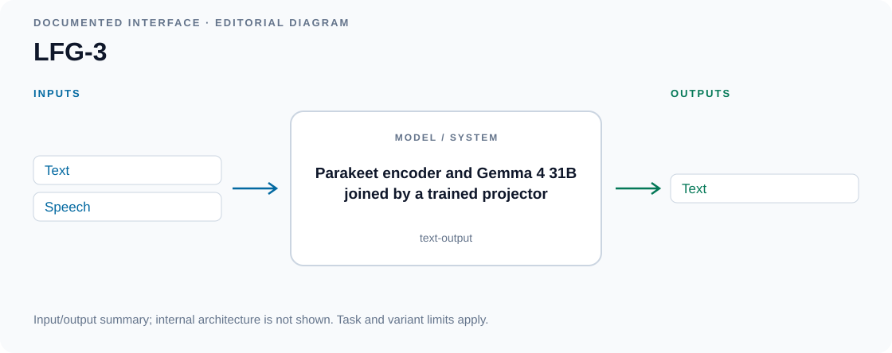

*Input/output diagram · [Source](https://huggingface.co/glenn2/LFG-3)*

Details

**Input → output:** T, S → T · **Interaction:** text-output

Capabilities refer to the linked checkpoint; consult its model card for task prompts and deployment requirements.

Editorial summary of documented inputs and outputs; internal architecture is not shown.

**Variants:** LFG-3.

### LLaSM

Answers spoken questions and supports instruction following across speech and text.

**Architecture:** Speech encoder aligned to a Chinese Llama language model.

[Paper](https://arxiv.org/abs/2308.15930) · [Code](https://github.com/LinkSoul-AI/LLaSM) · [Weights](https://huggingface.co/LinkSoul/LLaSM-Cllama2)

**Custom / restricted:** code [Apache-2.0](https://github.com/LinkSoul-AI/LLaSM/blob/main/LICENSE) · weights [OpenRAIL](https://huggingface.co/LinkSoul/LLaSM-Cllama2/blob/053a36b0e0006a437e74b7294ab5d112d5df5371/README.md) — Custom release or component terms apply; consult the linked license evidence.

*Figure 1 · [Source](https://arxiv.org/abs/2308.15930)*

Details

**Input → output:** T, S → T · **Interaction:** text-output

Capabilities refer to the linked checkpoint; consult its model card for task prompts and deployment requirements.

**Variants:** LLaSM-Cllama2.

### Mellow

Uses reasoning over audio to answer questions that require more than recognizing a sound.

**Architecture:** Audio-language model trained for hearing and reasoning.

[Paper](https://arxiv.org/abs/2503.08540) · [Code](https://github.com/soham97/mellow) · [Weights](https://huggingface.co/soham97/mellow)

**Open license:** code [MIT](https://github.com/soham97/mellow/blob/main/LICENSE) · weights [MIT](https://huggingface.co/soham97/mellow/blob/83672db0dae28764e283210d5bb732621e903d8a/README.md)

*Figure 2 · [Source](https://arxiv.org/abs/2503.08540)*

Details

**Input → output:** T, A → T · **Interaction:** text-output

Capabilities refer to the linked checkpoint; consult its model card for task prompts and deployment requirements.

**Variants:** mellow.

### MERaLiON 2

Understands multilingual Southeast Asian speech, code-switching, emotion and audio scenes.

**Architecture:** Localized Whisper encoder and Gemma 2 decoder.

[Code](https://huggingface.co/MERaLiON/MERaLiON-2-10B/tree/57bb08fd110af1f1ef5a6b16d53ac240393d4f93) · [Weights](https://huggingface.co/MERaLiON/MERaLiON-2-10B)

**Custom / restricted:** code [MERaLiON public license](https://huggingface.co/MERaLiON/MERaLiON-2-10B/blob/57bb08fd110af1f1ef5a6b16d53ac240393d4f93/README.md) · weights [MERaLiON public license](https://huggingface.co/datasets/MERaLiON/MERaLiON_Public_Licence/blob/main/MERaLiON-Public-Licence-v3.pdf) — Custom MERaLiON terms and incorporated base-model licenses apply.

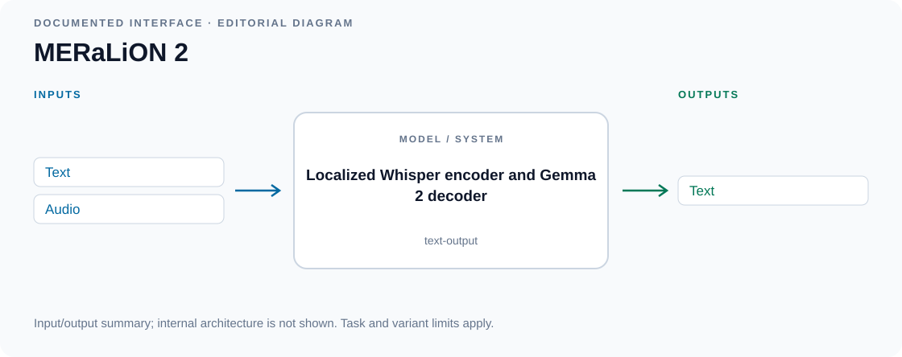

*Input/output diagram · [Source](https://huggingface.co/MERaLiON/MERaLiON-2-10B)*

Details

**Input → output:** T, A → T · **Interaction:** text-output

Capabilities refer to the linked checkpoint; consult its model card for task prompts and deployment requirements.

Editorial summary of documented inputs and outputs; internal architecture is not shown.

**Variants:** MERaLiON-2-10B.

### MERaLiON 3

Understands multilingual Southeast Asian speech, including local dialects and conversational code-switching.

**Architecture:** Speech encoder connected to a multilingual language decoder.

[Code](https://huggingface.co/MERaLiON/MERaLiON-3-10B/tree/3d5c2f772641b1cfeba35743df3db32a07db8c48) · [Weights](https://huggingface.co/MERaLiON/MERaLiON-3-10B)

**Custom / restricted:** code [MERaLiON public license](https://huggingface.co/MERaLiON/MERaLiON-3-10B/blob/3d5c2f772641b1cfeba35743df3db32a07db8c48/README.md) · weights [MERaLiON public license](https://huggingface.co/datasets/MERaLiON/MERaLiON_Public_Licence/blob/main/MERaLiON-3-Public-Licence.pdf) — Custom MERaLiON terms and incorporated base-model licenses apply.

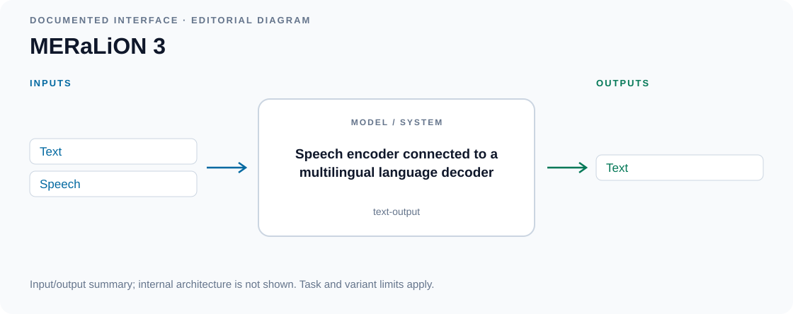

*Input/output diagram · [Source](https://huggingface.co/MERaLiON/MERaLiON-3-10B)*

Details

**Input → output:** T, S → T · **Interaction:** text-output

Capabilities refer to the linked checkpoint; consult its model card for task prompts and deployment requirements.

Editorial summary of documented inputs and outputs; internal architecture is not shown.

**Variants:** MERaLiON-3-10B.

### MERaLiON-AudioLLM

Transcribes, translates and explains audio, including Singaporean speech and local language usage.

**Architecture:** Whisper encoder and SEA-LION language decoder.

[Paper](https://arxiv.org/abs/2412.09818) · [Code](https://huggingface.co/MERaLiON/MERaLiON-AudioLLM-Whisper-SEA-LION/tree/df3199c9e110a92b1e78b77ebf5acd7009f25f70) · [Weights](https://huggingface.co/MERaLiON/MERaLiON-AudioLLM-Whisper-SEA-LION)

**Custom / restricted:** code [MERaLiON public license](https://huggingface.co/MERaLiON/MERaLiON-AudioLLM-Whisper-SEA-LION/blob/df3199c9e110a92b1e78b77ebf5acd7009f25f70/README.md) · weights [MERaLiON public license](https://huggingface.co/datasets/MERaLiON/MERaLiON_Public_Licence/blob/main/MERaLiON-Public-Licence-v1.pdf) — Custom MERaLiON terms and incorporated base-model licenses apply.

*Figure 1 · [Source](https://arxiv.org/abs/2412.09818)*

Details

**Input → output:** T, A → T · **Interaction:** text-output

Capabilities refer to the linked checkpoint; consult its model card for task prompts and deployment requirements.

**Variants:** MERaLiON-AudioLLM-Whisper-SEA-LION.

### MiDashengLM

Describes speech, environmental sounds and music and answers questions about recordings.

**Architecture:** Dasheng audio encoder aligned to a language model with general audio captions.

[Paper](https://arxiv.org/abs/2508.03983) · [Code](https://huggingface.co/mispeech/midashenglm-7b-1021-bf16/tree/f7b0fdb745fc7997a62443007191b50f1c94702b) · [Weights](https://huggingface.co/mispeech/midashenglm-7b-1021-bf16)

**License unclear:** code [Not stated](https://huggingface.co/mispeech/midashenglm-7b-1021-bf16/blob/f7b0fdb745fc7997a62443007191b50f1c94702b/README.md) · weights [Apache-2.0](https://huggingface.co/mispeech/midashenglm-7b-1021-bf16/blob/f7b0fdb745fc7997a62443007191b50f1c94702b/README.md) — Public code and weights were located, but a complete release license was not stated.

*Figure 2 · [Source](https://arxiv.org/abs/2508.03983)*

Details

**Input → output:** T, A → T · **Interaction:** text-output

Capabilities refer to the linked checkpoint; consult its model card for task prompts and deployment requirements.

**Variants:** midashenglm-7b-1021-bf16.

### MOSS-Audio Instruct

Captions recordings, answers time-specific questions and transcribes speech with timestamps.

**Architecture:** Dedicated audio encoder with DeepStack feature injection and time markers.

[Paper](https://arxiv.org/abs/2606.01802) · [Code](https://github.com/OpenMOSS/MOSS-Audio) · [Weights](https://huggingface.co/OpenMOSS-Team/MOSS-Audio-8B-Instruct)

**License unclear:** code [Not stated](https://github.com/OpenMOSS/MOSS-Audio/blob/main/README.md) · weights [Apache-2.0](https://huggingface.co/OpenMOSS-Team/MOSS-Audio-8B-Instruct/blob/6521a39181b47a18f2d9f4b3acfb5bca7b76b57f/README.md) — Public code and weights were located, but a complete release license was not stated.

*Figure 2 · [Source](https://arxiv.org/abs/2606.01802)*

Details

**Input → output:** T, A → T · **Interaction:** text-output

Capabilities refer to the linked checkpoint; consult its model card for task prompts and deployment requirements.

**Variants:** MOSS-Audio-8B-Instruct.

### MOSS-Audio Thinking

Reasons about speech, environmental sound and music before producing a text answer.

**Architecture:** Reasoning-tuned MOSS-Audio with temporal grounding.

[Paper](https://arxiv.org/abs/2606.01802) · [Code](https://github.com/OpenMOSS/MOSS-Audio) · [Weights](https://huggingface.co/OpenMOSS-Team/MOSS-Audio-8B-Thinking)

**License unclear:** code [Not stated](https://github.com/OpenMOSS/MOSS-Audio/blob/main/README.md) · weights [Apache-2.0](https://huggingface.co/OpenMOSS-Team/MOSS-Audio-8B-Thinking/blob/3d09aad8d7803dd131c8f42d2c09364d1f9367db/README.md) — Public code and weights were located, but a complete release license was not stated.

*Family figure — Figure 2 · [Source](https://arxiv.org/abs/2606.01802)*

Details

**Input → output:** T, A → T · **Interaction:** text-output

Capabilities refer to the linked checkpoint; consult its model card for task prompts and deployment requirements. The image illustrates the shared model family; checkpoint-specific changes are described in the model card.

**Variants:** MOSS-Audio-8B-Thinking.

### Music Flamingo

Explains musical structure, instruments and expressive qualities in recordings.

**Architecture:** Music-adapted audio-language model with temporal reasoning.

[Paper](https://arxiv.org/abs/2511.10289) · [Code](https://github.com/huggingface/transformers/tree/main/src/transformers/models/musicflamingo) · [Weights](https://huggingface.co/nvidia/music-flamingo-2601-hf)

**Custom / restricted:** code [Apache-2.0](https://github.com/huggingface/transformers/blob/main/LICENSE) · weights [NVIDIA OneWay Noncommercial](https://huggingface.co/nvidia/music-flamingo-2601-hf/blob/6b5be086d52f65a1e204cb0faf70bf54e2741ecd/README.md) — Noncommercial terms apply to model weights and relevant bundled components.

*Figure 2 · [Source](https://arxiv.org/abs/2511.10289)*

Details

**Input → output:** T, M → T · **Interaction:** text-output

Capabilities refer to the linked checkpoint; consult its model card for task prompts and deployment requirements.

**Variants:** music-flamingo-2601-hf.

### Omni-R1 (audio reasoning)

Answers questions about speech, sounds and music using reinforcement-trained audio reasoning.

**Architecture:** GRPO fine-tuning of the Qwen2.5-Omni Thinker.

[Paper](https://arxiv.org/abs/2505.09439) · [Code](https://github.com/roudimit/Omni-R1) · [Weights](https://data.csail.mit.edu/public-release-sls/omni-r1/omni-r1-checkpoint-vggs-gpt.tar.gz)

**License unclear:** code [Apache-2.0](https://github.com/roudimit/Omni-R1/blob/main/LICENSE) · weights [Not stated](https://github.com/roudimit/Omni-R1/blob/main/README.md) — Public checkpoint archive; no separate weight-license declaration was located.

*Input/output diagram · [Source](https://github.com/roudimit/Omni-R1)*

Details

**Input → output:** T, A → T · **Interaction:** text-output

Selects the VGGS-GPT-trained checkpoint, distinct from the two-system Omni-R1 project. Weights are served as a public archive: the recorded HTTP ETag identifies the inspected response but is not a cryptographic checksum or an immutable download URL.

Editorial summary of documented inputs and outputs; internal architecture is not shown.

**Variants:** Omni-R1-VGGS-GPT.

### OSUM

Recognizes words, timestamps, vocal events, emotions and speaking style from speech.

**Architecture:** Whisper encoder, audio adapter and Qwen language model.

[Paper](https://arxiv.org/abs/2501.13306) · [Code](https://github.com/ASLP-lab/OSUM) · [Weights](https://huggingface.co/ASLP-lab/OSUM)

**Open license:** code [Apache-2.0](https://github.com/ASLP-lab/OSUM/blob/main/LICENSE.txt) · weights [Apache-2.0](https://huggingface.co/ASLP-lab/OSUM/blob/ec725b96c96a1e94578d924b5a9e0285549f5aa0/README.md)

*Figure 2 · [Source](https://arxiv.org/abs/2501.13306)*

Details

**Input → output:** T, S → T · **Interaction:** text-output

Capabilities refer to the linked checkpoint; consult its model card for task prompts and deployment requirements.

**Variants:** OSUM.

### ParaBridge

Adapts replies to vocal emotion and other nonverbal cues in a spoken request.

**Architecture:** On-policy self-distillation of a Qwen3-Omni reasoning model.

[Paper](https://arxiv.org/abs/2606.10581) · [Code](https://github.com/AmphionTeam/ParaBridge) · [Weights](https://huggingface.co/YuxiangW/ParaBridge)

**Open license:** code [Apache-2.0](https://github.com/AmphionTeam/ParaBridge/blob/main/LICENSE) · weights [Apache-2.0](https://huggingface.co/YuxiangW/ParaBridge/blob/0f3bb834e4bcc3840a7b75905982f56205f4e0f5/README.md)

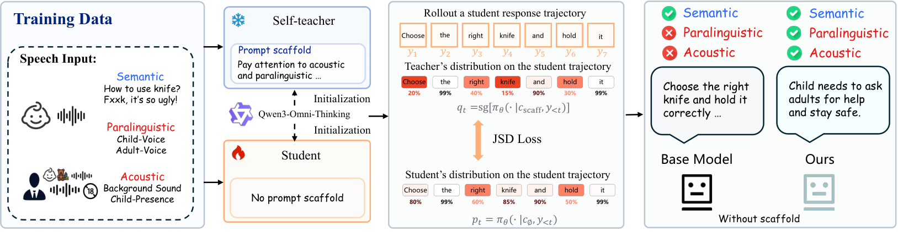

*Figure 3 · [Source](https://arxiv.org/abs/2606.10581)*

Details

**Input → output:** T, A → T · **Interaction:** text-output

Capabilities refer to the linked checkpoint; consult its model card for task prompts and deployment requirements.

**Variants:** ParaBridge.

### Qwen-Audio

Transcribes, translates and describes speech, sounds and music through natural-language responses.

**Architecture:** Multitask audio encoder connected to Qwen.

[Paper](https://arxiv.org/abs/2311.07919) · [Code](https://github.com/QwenLM/Qwen-Audio) · [Weights](https://huggingface.co/Qwen/Qwen-Audio-Chat)

**Custom / restricted:** code [Tongyi Qianwen license](https://github.com/QwenLM/Qwen-Audio/blob/main/LICENSE) · weights [Tongyi Qianwen license](https://github.com/QwenLM/Qwen-Audio/blob/main/LICENSE) — Custom Qwen terms include a large-user-base commercial permission requirement.

*Figure 3 · [Source](https://arxiv.org/abs/2311.07919)*

Details

**Input → output:** T, A → T · **Interaction:** text-output

Capabilities refer to the linked checkpoint; consult its model card for task prompts and deployment requirements.

**Variants:** Qwen-Audio-Chat.

### Qwen2-Audio

Answers spoken instructions and analyzes speech, environmental sounds and music in text.

**Architecture:** Whisper-large-v3 encoder and Qwen language decoder.

[Paper](https://arxiv.org/abs/2407.10759) · [Code](https://github.com/huggingface/transformers/tree/main/src/transformers/models/qwen2_audio) · [Weights](https://huggingface.co/Qwen/Qwen2-Audio-7B-Instruct)

**Open license:** code [Apache-2.0](https://github.com/huggingface/transformers/blob/main/LICENSE) · weights [Apache-2.0](https://huggingface.co/Qwen/Qwen2-Audio-7B-Instruct/blob/0a095220c30b7b31434169c3086508ef3ea5bf0a/README.md)

*Figure 2 · [Source](https://arxiv.org/abs/2407.10759)*

Details

**Input → output:** T, A → T · **Interaction:** text-output

Capabilities refer to the linked checkpoint; consult its model card for task prompts and deployment requirements.

**Variants:** Qwen2-Audio-7B-Instruct.

### SALMONN

Transcribes speech, captions sound and music, and answers audio-grounded questions.

**Architecture:** Whisper and BEATs encoders fused through a window-level Q-Former.

[Paper](https://arxiv.org/abs/2310.13289) · [Code](https://github.com/bytedance/SALMONN) · [Weights](https://huggingface.co/tsinghua-ee/SALMONN-7B)

**Custom / restricted:** code [Apache-2.0](https://github.com/bytedance/SALMONN/blob/main/LICENSE) · weights [Apache-2.0 + Llama 2 terms](https://huggingface.co/tsinghua-ee/SALMONN-7B/blob/ed583f2c565c1110b3bf5772ed42d6744f3cc443/README.md) — The Vicuna/Llama 2 language backbone retains its community license.

*Figure 1 · [Source](https://arxiv.org/abs/2310.13289)*

Details

**Input → output:** T, A → T · **Interaction:** text-output

Capabilities refer to the linked checkpoint; consult its model card for task prompts and deployment requirements.

**Variants:** SALMONN-7B.

### SALMONN-2

Understands speech, sounds and music and supports context-aware transcription and audio questions.

**Architecture:** Self-supervised audio representations fused across language-model layers.

[Paper](https://arxiv.org/abs/2607.17079) · [Code](https://huggingface.co/marcoyang/SALMONN-2-8B/tree/1ee8613c2d4f718e1932d4d4dbb008e1c6dc7c13) · [Weights](https://huggingface.co/marcoyang/SALMONN-2-8B)

**Open license:** code [Apache-2.0](https://huggingface.co/marcoyang/SALMONN-2-8B/blob/1ee8613c2d4f718e1932d4d4dbb008e1c6dc7c13/LICENSE) · weights [Apache-2.0](https://huggingface.co/marcoyang/SALMONN-2-8B/blob/1ee8613c2d4f718e1932d4d4dbb008e1c6dc7c13/README.md)

*Figure 2 · [Source](https://arxiv.org/abs/2607.17079)*

Details

**Input → output:** T, A → T · **Interaction:** text-output

Capabilities refer to the linked checkpoint; consult its model card for task prompts and deployment requirements.

**Variants:** SALMONN-2-8B.

### SoulX-Duplug

Predicts when a voice assistant should keep listening, respond or handle an interruption.

**Architecture:** Lightweight speech-language turn-control model.

[Paper](https://arxiv.org/abs/2603.14877) · [Code](https://github.com/Soul-AILab/SoulX-Duplug) · [Weights](https://huggingface.co/Soul-AILab/SoulX-Duplug-0.6B)

**Open license:** code [Apache-2.0](https://github.com/Soul-AILab/SoulX-Duplug/blob/main/LICENSE) · weights [Apache-2.0](https://huggingface.co/Soul-AILab/SoulX-Duplug-0.6B/blob/61701c4ab8193cc1ee2220d3848872ac6c720142/README.md)

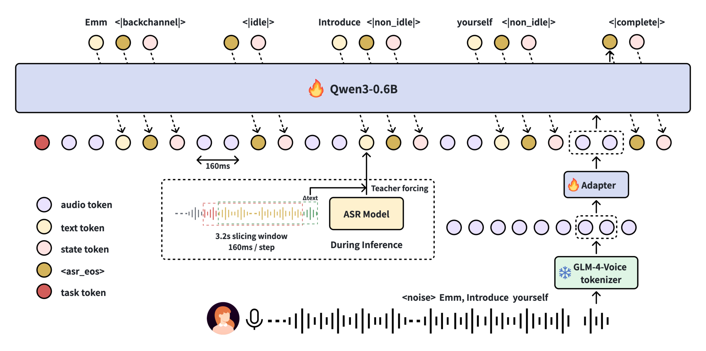

*Figure 4 · [Source](https://arxiv.org/abs/2603.14877)*

Details

**Input → output:** T, S → T · **Interaction:** text-output

Capabilities refer to the linked checkpoint; consult its model card for task prompts and deployment requirements.

**Variants:** SoulX-Duplug-0.6B.

### Step-Audio 2 Mini Think

Reasons before answering spoken questions and complex audio-understanding tasks.

**Architecture:** Reasoning-tuned Step-Audio 2 Mini.

[Paper](https://arxiv.org/abs/2507.16632) · [Code](https://github.com/stepfun-ai/Step-Audio2) · [Weights](https://huggingface.co/stepfun-ai/Step-Audio-2-mini-Think)

**Open license:** code [Apache-2.0](https://github.com/stepfun-ai/Step-Audio2/blob/main/LICENSE) · weights [Apache-2.0](https://huggingface.co/stepfun-ai/Step-Audio-2-mini-Think/blob/729b52fd9f4d5075fe60197e0a710be7392680a1/README.md)

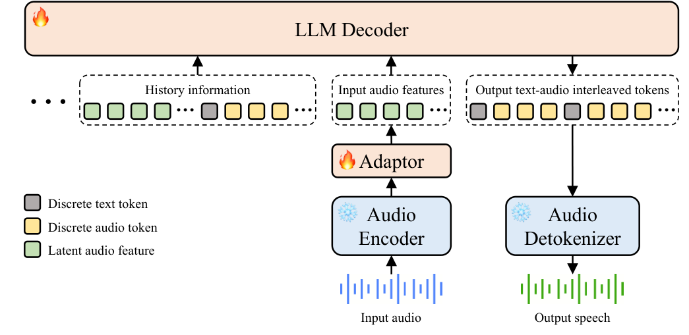

*Family figure — Figure 3 · [Source](https://arxiv.org/abs/2507.16632)*

Details

**Input → output:** T, A → T · **Interaction:** text-output

Capabilities refer to the linked checkpoint; consult its model card for task prompts and deployment requirements. The image illustrates the shared model family; checkpoint-specific changes are described in the model card.

**Variants:** Step-Audio-2-mini-Think.

### Step-Audio-R1

Uses reinforcement-learned reasoning to answer questions about speech, sound and music.

**Architecture:** Reasoning-optimized audio-language model.

[Paper](https://arxiv.org/abs/2511.15848) · [Code](https://github.com/stepfun-ai/Step-Audio-R1) · [Weights](https://huggingface.co/stepfun-ai/Step-Audio-R1)

**Open license:** code [Apache-2.0](https://github.com/stepfun-ai/Step-Audio-R1/blob/main/LICENSE) · weights [Apache-2.0](https://huggingface.co/stepfun-ai/Step-Audio-R1/blob/60a56dbe86918b0a85b07ec29f2c8983025e7073/README.md)

*Figure 2 · [Source](https://arxiv.org/abs/2511.15848)*

Details

**Input → output:** T, A → T · **Interaction:** text-output

Capabilities refer to the linked checkpoint; consult its model card for task prompts and deployment requirements.

**Variants:** Step-Audio-R1.

### Ultravox 0.4.1 Llama-3.1-8B

Provides an earlier Ultravox speech-understanding checkpoint for text-based voice responses.

**Architecture:** Whisper encoder and multimodal adapter on Llama 3.1.

[Code](https://github.com/fixie-ai/ultravox) · [Weights](https://huggingface.co/fixie-ai/ultravox-v0_4_1-llama-3_1-8b)

**Custom / restricted:** code [MIT](https://github.com/fixie-ai/ultravox/blob/main/LICENSE) · weights [MIT + Llama community terms](https://huggingface.co/fixie-ai/ultravox-v0_4_1-llama-3_1-8b/blob/d1d4298148a6584e085c15111f3348ca0cd47a19/README.md) — Ultravox code is MIT; the included Llama backbone retains its community license.

*Family figure — Llama-based example · [Source](https://github.com/fixie-ai/ultravox)*

Details

**Input → output:** T, S → T · **Interaction:** text-output

The checkpoint produces text from speech. A separate TTS system is needed for a spoken assistant response. The image illustrates the shared model family; checkpoint-specific changes are described in the model card. The family figure shows a Llama configuration; use the linked checkpoint card for this release’s actual backbone and dimensions.

**Variants:** ultravox-v0_4_1-llama-3_1-8b.

### Ultravox 0.5 Llama-3.1-8B

Handles spoken questions and instruction following with text output.

**Architecture:** Whisper encoder and multimodal adapter on Llama 3.1.

[Code](https://github.com/fixie-ai/ultravox) · [Weights](https://huggingface.co/fixie-ai/ultravox-v0_5-llama-3_1-8b)

**Custom / restricted:** code [MIT](https://github.com/fixie-ai/ultravox/blob/main/LICENSE) · weights [MIT + Llama community terms](https://huggingface.co/fixie-ai/ultravox-v0_5-llama-3_1-8b/blob/94aa77f70ca548e669ea61f737e159b2fddbb7f7/README.md) — Ultravox code is MIT; the included Llama backbone retains its community license.

*Family figure — Llama-based example · [Source](https://github.com/fixie-ai/ultravox)*

Details

**Input → output:** T, S → T · **Interaction:** text-output

The checkpoint produces text from speech. A separate TTS system is needed for a spoken assistant response. The image illustrates the shared model family; checkpoint-specific changes are described in the model card. The family figure shows a Llama configuration; use the linked checkpoint card for this release’s actual backbone and dimensions.

**Variants:** ultravox-v0_5-llama-3_1-8b.

### Ultravox 0.5 Llama-3.2-1B

Provides speech-to-text-answer interaction with a small 1B language backbone.

**Architecture:** Whisper encoder and multimodal adapter on Llama 3.2.

[Code](https://github.com/fixie-ai/ultravox) · [Weights](https://huggingface.co/fixie-ai/ultravox-v0_5-llama-3_2-1b)

**Custom / restricted:** code [MIT](https://github.com/fixie-ai/ultravox/blob/main/LICENSE) · weights [MIT + Llama community terms](https://huggingface.co/fixie-ai/ultravox-v0_5-llama-3_2-1b/blob/b95bec8ab291eeb04b5cd600dd473377f6b79026/README.md) — Ultravox code is MIT; the included Llama backbone retains its community license.

*Family figure — Llama-based example · [Source](https://github.com/fixie-ai/ultravox)*

Details

**Input → output:** T, S → T · **Interaction:** text-output

The checkpoint produces text from speech. A separate TTS system is needed for a spoken assistant response. The image illustrates the shared model family; checkpoint-specific changes are described in the model card. The family figure shows a Llama configuration; use the linked checkpoint card for this release’s actual backbone and dimensions.

**Variants:** ultravox-v0_5-llama-3_2-1b.

### Ultravox 0.6 Gemma-3-27B

Answers voice requests using Gemma 3's language capabilities.

**Architecture:** Whisper encoder and audio projection into Gemma 3.

[Code](https://github.com/fixie-ai/ultravox) · [Weights](https://huggingface.co/fixie-ai/ultravox-v0_6-gemma-3-27b)

**Custom / restricted:** code [MIT](https://github.com/fixie-ai/ultravox/blob/main/LICENSE) · weights [MIT + Gemma terms](https://huggingface.co/fixie-ai/ultravox-v0_6-gemma-3-27b/blob/17a79bc5441ef09916cce45aae525dc6a8b0c031/README.md) — The included Gemma backbone retains its custom usage terms.

*Family figure — Llama-based example · [Source](https://github.com/fixie-ai/ultravox)*

Details

**Input → output:** T, S → T · **Interaction:** text-output

The checkpoint produces text from speech. A separate TTS system is needed for a spoken assistant response. The image illustrates the shared model family; checkpoint-specific changes are described in the model card. The family figure shows a Llama configuration; use the linked checkpoint card for this release’s actual backbone and dimensions.

**Variants:** ultravox-v0_6-gemma-3-27b.

### Ultravox 0.6 Llama-3.1-8B

Responds to spoken instructions in text using the 8B Ultravox 0.6 release.

**Architecture:** Whisper encoder and multimodal adapter on Llama 3.1.

[Code](https://github.com/fixie-ai/ultravox) · [Weights](https://huggingface.co/fixie-ai/ultravox-v0_6-llama-3_1-8b)

**Custom / restricted:** code [MIT](https://github.com/fixie-ai/ultravox/blob/main/LICENSE) · weights [MIT + Llama community terms](https://huggingface.co/fixie-ai/ultravox-v0_6-llama-3_1-8b/blob/9db56c13737ad34e962d8be02d0df5075ec0a9da/README.md) — Ultravox code is MIT; the included Llama backbone retains its community license.

*Family figure — Llama-based example · [Source](https://github.com/fixie-ai/ultravox)*

Details

**Input → output:** T, S → T · **Interaction:** text-output

The checkpoint produces text from speech. A separate TTS system is needed for a spoken assistant response. The image illustrates the shared model family; checkpoint-specific changes are described in the model card. The family figure shows a Llama configuration; use the linked checkpoint card for this release’s actual backbone and dimensions.

**Variants:** ultravox-v0_6-llama-3_1-8b.

### Ultravox 0.6 Llama-3.3-70B

Turns spoken questions into text answers using a large Llama 3.3 backbone.

**Architecture:** Whisper encoder and multimodal adapter on Llama 3.3.

[Code](https://github.com/fixie-ai/ultravox) · [Weights](https://huggingface.co/fixie-ai/ultravox-v0_6-llama-3_3-70b)

**Custom / restricted:** code [MIT](https://github.com/fixie-ai/ultravox/blob/main/LICENSE) · weights [MIT + Llama community terms](https://huggingface.co/fixie-ai/ultravox-v0_6-llama-3_3-70b/blob/48ce31171d03d4aaf4356d019c3262bc8fbae90a/README.md) — Ultravox code is MIT; the included Llama backbone retains its community license.

*Family figure — Llama-based example · [Source](https://github.com/fixie-ai/ultravox)*

Details

**Input → output:** T, S → T · **Interaction:** text-output

The checkpoint produces text from speech. A separate TTS system is needed for a spoken assistant response. The image illustrates the shared model family; checkpoint-specific changes are described in the model card. The family figure shows a Llama configuration; use the linked checkpoint card for this release’s actual backbone and dimensions.

**Variants:** ultravox-v0_6-llama-3_3-70b.

### Ultravox 0.6 Qwen3-32B

Adds spoken-instruction understanding and text responses to Qwen3-32B.

**Architecture:** Whisper encoder and learned projection into Qwen3.

[Code](https://github.com/fixie-ai/ultravox) · [Weights](https://huggingface.co/fixie-ai/ultravox-v0_6-qwen-3-32b)

**Open license:** code [MIT](https://github.com/fixie-ai/ultravox/blob/main/LICENSE) · weights [MIT](https://huggingface.co/fixie-ai/ultravox-v0_6-qwen-3-32b/blob/783a02929a402cc425ddcf7638e27e09b961d744/README.md)

*Family figure — Llama-based example · [Source](https://github.com/fixie-ai/ultravox)*

Details

**Input → output:** T, S → T · **Interaction:** text-output

The checkpoint produces text from speech. A separate TTS system is needed for a spoken assistant response. The image illustrates the shared model family; checkpoint-specific changes are described in the model card. The family figure shows a Llama configuration; use the linked checkpoint card for this release’s actual backbone and dimensions.

**Variants:** ultravox-v0_6-qwen-3-32b.

### Ultravox 0.7 GLM-4.6

Answers spoken questions and follows voice instructions using a GLM-4.6 language backbone.

**Architecture:** Whisper audio encoder projected into a GLM language model.

[Code](https://github.com/fixie-ai/ultravox) · [Weights](https://huggingface.co/fixie-ai/ultravox-v0_7-glm-4_6)

**Open license:** code [MIT](https://github.com/fixie-ai/ultravox/blob/main/LICENSE) · weights [MIT](https://huggingface.co/fixie-ai/ultravox-v0_7-glm-4_6/blob/a849a0957d3f67dadc25e4fbc2e1122d5daf8ea0/README.md)

*Family figure — Llama-based example · [Source](https://github.com/fixie-ai/ultravox)*

Details

**Input → output:** T, S → T · **Interaction:** text-output

The checkpoint produces text from speech. A separate TTS system is needed for a spoken assistant response. The image illustrates the shared model family; checkpoint-specific changes are described in the model card. The family figure shows a Llama configuration; use the linked checkpoint card for this release’s actual backbone and dimensions.

**Variants:** ultravox-v0_7-glm-4_6.

### Voxtral Mini

Provides transcription and audio question answering in a smaller 3B configuration.

**Architecture:** Compact Voxtral audio-language architecture.

[Paper](https://arxiv.org/abs/2507.13264) · [Code](https://github.com/mistralai/mistral-inference) · [Weights](https://huggingface.co/mistralai/Voxtral-Mini-3B-2507)

**Open license:** code [Apache-2.0](https://github.com/mistralai/mistral-inference/blob/main/LICENSE) · weights [Apache-2.0](https://huggingface.co/mistralai/Voxtral-Mini-3B-2507/blob/3060fe34b35ba5d44202ce9ff3c097642914f8f3/README.md)

*Family figure — Figure 1 · [Source](https://arxiv.org/abs/2507.13264)*

Details

**Input → output:** T, A → T · **Interaction:** text-output

Capabilities refer to the linked checkpoint; consult its model card for task prompts and deployment requirements. The image illustrates the shared model family; checkpoint-specific changes are described in the model card.

**Variants:** Voxtral-Mini-3B-2507.

### Voxtral Small

Transcribes and translates speech and answers questions about long audio recordings.

**Architecture:** Audio encoder connected to a Mistral language model.

[Paper](https://arxiv.org/abs/2507.13264) · [Code](https://github.com/mistralai/mistral-inference) · [Weights](https://huggingface.co/mistralai/Voxtral-Small-24B-2507)

**Open license:** code [Apache-2.0](https://github.com/mistralai/mistral-inference/blob/main/LICENSE) · weights [Apache-2.0](https://huggingface.co/mistralai/Voxtral-Small-24B-2507/blob/da5b42409f279fdd92febee0511a6c32828569c1/README.md)

*Figure 1 · [Source](https://arxiv.org/abs/2507.13264)*

Details

**Input → output:** T, A → T · **Interaction:** text-output

Capabilities refer to the linked checkpoint; consult its model card for task prompts and deployment requirements.

**Variants:** Voxtral-Small-24B-2507.

