# Omni and audio-visual language models

<!-- Generated by scripts/catalog.py from data/models.json and data/figures.json. Edit the JSON, then regenerate. -->

[← All models](../README.md#models)

**131 models · Reviewed 2026-09-12**

Primary-source figures and labeled input/output diagrams. [Figure credits](../assets/architectures/CREDITS.md).

Model index and modality key

**Modalities:** T = text, I = image, V = video, A = general audio, S = speech, M = music, X = other structured modalities. A is a broad label, not a guarantee of every audio task. See the [methodology](../docs/methodology.md) for interaction labels, variant scope and inclusion rules.

Dates refer to papers or announcements, not necessarily model releases.

| Model | Source date | Input → output | Interaction |
| --- | --- | --- | --- |
| [AGAV-Rater](#agav-rater) | 2025-01-30 | T, V, A → T, X | text-output |
| [Amazon Nova 2 Omni](#amazon-nova-2-omni) | 2025-12-02 | T, I, V, S → T, I | generation |
| [AnyGPT](#anygpt) | 2024-02-19 | T, I, S, M → T, I, S, M | generation |
| [AnyMAL](#anymal) | 2023-09-27 | T, I, V, A, X → T | text-output |
| [ARC-Hunyuan-Video](#arc-hunyuan-video) | 2025-07-28 | T, V, A → T | text-output |
| [Audio-Visual LLM](#audio-visual-llm) | 2023-12-11 | T, V, A → T | text-output |
| [AURORA](#aurora) | 2025-08-04 | T, V, A → T, X | text-output |
| [AV-Reasoner](#av-reasoner) | 2025-06-05 | T, V, A → T | text-output |
| [AVicuna](#avicuna) | 2024-03-24 | T, V, A → T | text-output |
| [Baichuan-Omni](#baichuan-omni) | 2024-10-11 | T, I, V, A → T | text-output |
| [Baichuan-Omni-1.5](#baichuan-omni-1-5) | 2025-01-26 | T, I, V, A → T, S | streaming |
| [BuboGPT](#bubogpt) | 2023-07-17 | T, I, A → T, X | text-output |
| [Capybara-OMNI](#capybara-omni) | 2025-04-10 | T, I, V, A → T | text-output |
| [CAT](#cat) | 2024-03-07 | T, V, A → T | text-output |
| [ChatBridge](#chatbridge) | 2023-05-25 | T, I, V, A → T | text-output |
| [ChronusOmni](#chronusomni) | 2025-12-10 | T, V, A → T | text-output |
| [CoDi-2](#codi-2) | 2023-11-30 | T, I, A → T, I, A | system |
| [Crab](#crab) | 2025-03-17 | T, V, A → T, X | text-output |
| [CREMA](#crema) | 2024-02-08 | T, V, A, X → T | text-output |
| [DeepSound-V1](#deepsound-v1) | 2025-03-28 | T, V → T, A | system |
| [DuplexOmni](#duplexomni) | 2026-06-08 | T, V, A → T, S | full-duplex |
| [EchoInk-R1](#echoink-r1) | 2025-05-07 | T, I, A → T | text-output |
| [EgoGPT](#egogpt) | 2025-03-05 | T, V, A → T | text-output |
| [ELLSA](#ellsa) | 2025-10-19 | T, V, S, X → T, S, X | full-duplex |
| [Emotion-LLaMA](#emotion-llama) | 2024-06-17 | T, I, V, A → T | text-output |
| [EMOVA](#emova) | 2024-09-26 | T, I, S → T, S | not-specified |
| [Empatheia](#empatheia) | 2025-02-07 | T, V, S → T, V, S | system |
| [EmpathyEar](#empathyear) | 2024-06-21 | T, I, S → T, V, S | system |
| [eP-ALM](#ep-alm) | 2023-03-20 | T, I, V, A → T | text-output |
| [FAVOR](#favor) | 2023-10-09 | T, I, V, A → T | text-output |
| [Gemini 1.0](#gemini-1-0) | 2023-12-19 | T, I, V, A → T | text-output |
| [Gemini 1.5](#gemini-1-5) | 2024-03-08 | T, I, V, A → T | text-output |
| [Gemini 2.0](#gemini-2-0) | 2025-07-07 | T, I, V, A → T | text-output |
| [Gemini 2.5](#gemini-2-5) | 2025-07-07 | T, I, V, A → T | text-output |
| [Gemini 2.5 Flash Live](#gemini-2-5-flash-live) | — | T, I, V, A → S | streaming |
| [Gemini 3](#gemini-3) | — | T, I, V, A → T | text-output |
| [Gemini 3.1](#gemini-3-1) | — | T, I, V, A → T | text-output |
| [Gemini 3.1 Flash Live](#gemini-3-1-flash-live) | — | T, I, V, A → T, S | streaming |
| [Gemini 3.5](#gemini-3-5) | — | T, I, V, A → T | text-output |
| [Gemini 3.6 Flash](#gemini-3-6-flash) | — | T, I, V, A → T | text-output |
| [Gemini 3.7 Flash](#gemini-3-7-flash) | — | T, I, V, A → T | text-output |
| [Gemini 3.8 Flash](#gemini-3-8-flash) | — | T, I, V, A → T | text-output |
| [Gemma 3n](#gemma-3n) | — | T, I, V, A → T | text-output |
| [Gemma 4 (audio-capable variants)](#gemma-4-audio-capable-variants) | 2026-07-02 | T, I, V, A → T | text-output |
| [GPT-4o (reported model)](#gpt-4o-reported-model) | 2024-10-25 | T, I, V, A → T, I, S | generation |
| [GPT-Realtime](#gpt-realtime) | — | T, I, A → T, S | streaming |
| [GPT-Realtime Mini](#gpt-realtime-mini) | — | T, I, A → T, S | streaming |
| [GPT-Realtime-1.5](#gpt-realtime-1-5) | — | T, I, A → T, S | streaming |
| [GPT-Realtime-2](#gpt-realtime-2) | — | T, I, A → T, S | streaming |
| [GPT-Realtime-2.1](#gpt-realtime-2-1) | — | T, I, A → T, S | streaming |
| [GPT-Realtime-2.1 Mini](#gpt-realtime-2-1-mini) | — | T, I, A → T, S | streaming |
| [GroundingGPT](#groundinggpt) | 2024-01-11 | T, I, V, A → T, X | text-output |
| [HumanOmni](#humanomni) | 2025-01-25 | T, V, A → T | text-output |
| [HumanOmniV2](#humanomniv2) | 2025-06-26 | T, V, A → T | text-output |
| [ImageBind-LLM](#imagebind-llm) | 2023-09-07 | T, I, V, A, X → T | text-output |
| [InteractiveOmni](#interactiveomni) | 2025-10-15 | T, I, V, A → T, S | not-specified |
| [InternOmni](#internomni) | — | T, I, V, A → T | text-output |
| [LongCat-Flash-Omni](#longcat-flash-omni) | 2025-10-31 | T, I, V, A → T, S | streaming |
| [LongCat-Next](#longcat-next) | 2026-03-29 | T, I, A → T, I, A | generation |
| [Lyra](#lyra) | 2024-12-12 | T, I, V, A → T, S | streaming |
| [M2-omni](#m2-omni) | 2025-02-26 | T, I, V, A → T, I, S | streaming |
| [Macaw-LLM](#macaw-llm) | 2023-06-15 | T, I, V, A → T | text-output |
| [Meerkat](#meerkat) | 2024-07-01 | T, I, V, A → T, X | text-output |
| [Megrez-Omni](#megrez-omni) | 2025-02-19 | T, I, A → T | text-output |
| [MiMo-V2-Omni](#mimo-v2-omni) | — | T, I, V, A → T, X | text-output |
| [MiMo-V2.5](#mimo-v2-5) | — | T, I, V, A → T | text-output |
| [Ming-Flash-Omni](#ming-flash-omni) | 2025-10-28 | T, I, V, A → T, I, A | generation |
| [Ming-Flash-Omni 2.0](#ming-flash-omni-2-0) | — | T, I, V, A → T, I, A | generation |
| [Ming-Omni](#ming-omni) | 2025-06-11 | T, I, V, A → T, I, S | generation |
| [Mini-Omni2](#mini-omni2) | 2024-10-15 | T, I, S → T, S | full-duplex |
| [MiniCPM-o 2.6](#minicpm-o-2-6) | — | T, I, V, A → T, S | streaming |
| [MiniCPM-o 4.5](#minicpm-o-4-5) | 2026-04-30 | T, I, V, A → T, S | full-duplex |
| [MiniMind-O](#minimind-o) | 2026-05-05 | T, I, S → T, S | streaming |
| [MIO](#mio) | 2024-09-26 | T, I, V, S → T, I, V, S | generation |
| [MLLM-Tool](#mllm-tool) | 2024-01-19 | T, I, A → T, X | system |
| [ModaVerse](#modaverse) | 2024-01-12 | T, I, V, A → T, I, V, A | system |
| [ModelCompose](#modelcompose) | 2024-02-20 | T, I, V, A, X → T | text-output |
| [MoshiVis](#moshivis) | 2025-03-19 | T, I, S → T, S | full-duplex |
| [MultiPLY](#multiply) | 2024-01-16 | T, I, A, X → T, X | system |
| [MuMu-LLaMA](#mumu-llama) | 2024-12-09 | T, I, V, M → T, M | system |
| [NExT-GPT](#next-gpt) | 2023-09-11 | T, I, V, A → T, I, V, A | system |
| [NExT-OMNI](#next-omni) | 2025-10-15 | T, I, V, A → T, I, V, A | generation |
| [Nexus](#nexus) | 2025-02-26 | T, I, V, S → T, S | not-specified |
| [OISA](#oisa) | 2025-07-30 | T, I, V, A → T, X | text-output |
| [Ola](#ola) | 2025-02-06 | T, I, V, A → T | text-output |
| [OMCAT](#omcat) | 2024-10-15 | T, V, A → T | text-output |
| [Omni-AutoThink](#omni-autothink) | 2025-12-03 | T, I, V, A → T | text-output |
| [Omni-R1 (two-system collaboration)](#omni-r1-two-system-collaboration) | 2025-05-26 | T, V, A → T, X | system |
| [Omni-RewardModel](#omni-rewardmodel) | 2025-10-27 | T, I, V, A, X → T, X | text-output |
| [OmniAtlas](#omniatlas) | 2026-02-26 | T, I, V, A → T, X | system |
| [OmniVideo-R1](#omnivideo-r1) | 2026-02-05 | T, V, A → T | text-output |
| [OmniVinci](#omnivinci) | 2025-10-17 | T, I, V, A → T | text-output |
| [OneLLM](#onellm) | 2023-12-06 | T, I, V, A, X → T | text-output |
| [OpenOmni](#openomni) | 2025-01-08 | T, I, S → T, S | streaming |
| [PandaGPT](#pandagpt) | 2023-05-25 | T, I, V, A, X → T | text-output |
| [PathWeave](#pathweave) | 2024-10-26 | T, I, V, A, X → T | text-output |
| [Phi-4-multimodal](#phi-4-multimodal) | 2025-03-03 | T, I, A → T | text-output |
| [Qwen2.5-Omni](#qwen2-5-omni) | 2025-03-26 | T, I, V, A → T, S | streaming |
| [Qwen3-Omni](#qwen3-omni) | 2025-09-22 | T, I, V, A → T, S | streaming |
| [Qwen3.5-Omni](#qwen3-5-omni) | 2026-04-17 | T, I, V, A → T, S | streaming |
| [R1-Omni](#r1-omni) | 2025-03-07 | T, V, A → T | text-output |
| [Ref-Thinker / TGS-Agent](#ref-thinker-tgs-agent) | 2025-08-06 | T, V, A → T, X | system |
| [RoboEgo](#roboego) | 2025-06-02 | T, V, A → T, S | full-duplex |
| [RoboOmni](#roboomni) | 2025-10-27 | T, I, V, A → T, S, X | system |
| [SAVEnVideo](#savenvideo) | 2024-11-25 | T, V, A → T | text-output |
| [Seed2.0 Lite (audio update)](#seed2-0-lite-audio-update) | — | T, I, V, A → T | text-output |
| [SeedRealtime](#seedrealtime) | 2026-08-05 | T, V, A → T, S | full-duplex |
| [ShizhenGPT](#shizhengpt) | 2025-08-20 | T, I, A, X → T | text-output |
| [SOLAMI](#solami) | 2024-11-29 | T, V, S, X → S, X | system |
| [Spider](#spider) | 2024-11-14 | T, I, V, A → T, I, V, A | system |
| [ST-Omni-R1](#st-omni-r1) | 2026-08-10 | T, V, A → T, X | text-output |
| [Stream-Omni](#stream-omni) | 2025-06-16 | T, I, V, S → T, S | streaming |
| [TDC-Video](#tdc-video) | 2025-04-14 | T, V, A → T | text-output |
| [TEAL](#teal) | 2023-11-08 | T, I, S → T, I, S | generation |
| [TriSense](#trisense) | 2025-05-23 | T, V, A → T, X | text-output |
| [Uni-MoE](#uni-moe) | 2024-05-18 | T, I, V, A → T | text-output |
| [Uni-MoE 2.0 Omni](#uni-moe-2-0-omni) | 2025-11-16 | T, I, V, A, X → T, I, S | generation |
| [Unified-IO 2](#unified-io-2) | 2023-12-28 | T, I, V, A, X → T, I, A, X | generation |
| [UnifiedMLLM](#unifiedmllm) | 2024-08-05 | T, I, V, A → T, X | system |
| [Video-LLaMA](#video-llama) | 2023-06-05 | T, V, A → T | text-output |
| [video-SALMONN](#video-salmonn) | 2024-06-22 | T, V, A → T | text-output |
| [video-SALMONN 2](#video-salmonn-2) | 2025-06-18 | T, V, A → T | text-output |
| [video-SALMONN-o1](#video-salmonn-o1) | 2025-02-17 | T, V, A → T | text-output |
| [VideoLLaMA 2](#videollama-2) | 2024-06-11 | T, I, V, A → T | text-output |
| [VideoPoet](#videopoet) | 2023-12-21 | T, I, V, A → V, A | generation |
| [VITA](#vita) | 2024-08-09 | T, I, V, A → T | system |
| [VITA-1.5](#vita-1-5) | 2025-01-03 | T, I, V, A → T, S | streaming |
| [WorldGPT](#worldgpt) | 2024-04-28 | T, I, V, A → T, I, A | system |
| [X-InstructBLIP](#x-instructblip) | 2023-11-30 | T, I, V, A, X → T | text-output |
| [X-LLM](#x-llm) | 2023-05-07 | T, I, V, S → T | text-output |
| [X-VILA](#x-vila) | 2024-05-29 | T, I, V, A → T, I, V, A | system |

## Architectures

### AGAV-Rater

Multimodal quality-rating LLM.

[Paper](https://arxiv.org/abs/2501.18314)

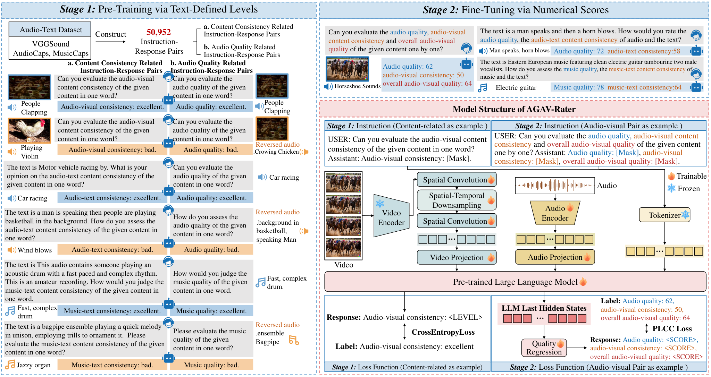

*Figure 3 · [Source](https://arxiv.org/abs/2501.18314)*

Details

**Input → output:** T, V, A → T, X · **Interaction:** text-output

Rates generated audiovisual content, audio and music.

### Amazon Nova 2 Omni

Multimodal reasoning and image generation.

[Announcement](https://aws.amazon.com/about-aws/whats-new/2025/12/amazon-nova-2-omni-preview)

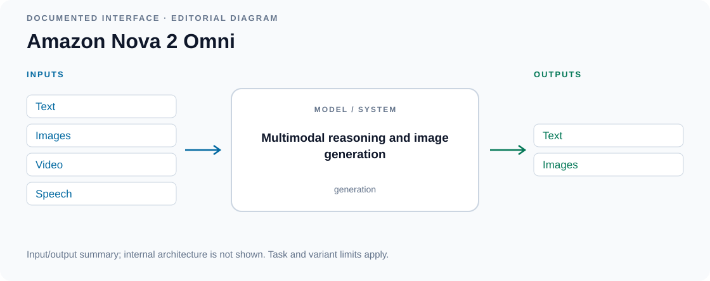

*Input/output diagram · [Source](https://aws.amazon.com/about-aws/whats-new/2025/12/amazon-nova-2-omni-preview)*

Details

**Input → output:** T, I, V, S → T, I · **Interaction:** generation

Announced as a preview; accepts speech but the announcement specifies text and image outputs.

Editorial summary of documented inputs and outputs; internal architecture is not shown.

**Variants:** Nova 2 Omni Preview.

### AnyGPT

Discrete multimodal tokens.

[Paper](https://arxiv.org/abs/2402.12226)

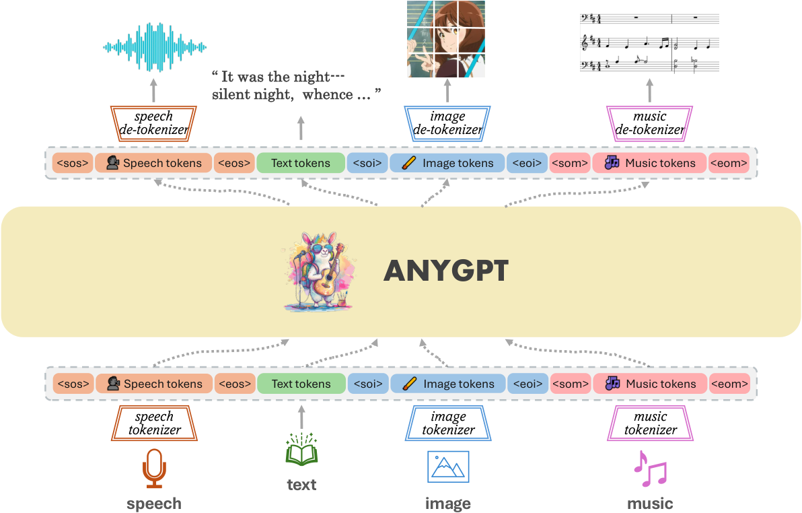

*Figure 1 · [Source](https://arxiv.org/abs/2402.12226)*

Details

**Input → output:** T, I, S, M → T, I, S, M · **Interaction:** generation

Autoregressive modeling of text, images, speech and music.

**Variants:** Base; Chat.

### AnyMAL

Modality encoders and adapters.

[Paper](https://arxiv.org/abs/2309.16058)

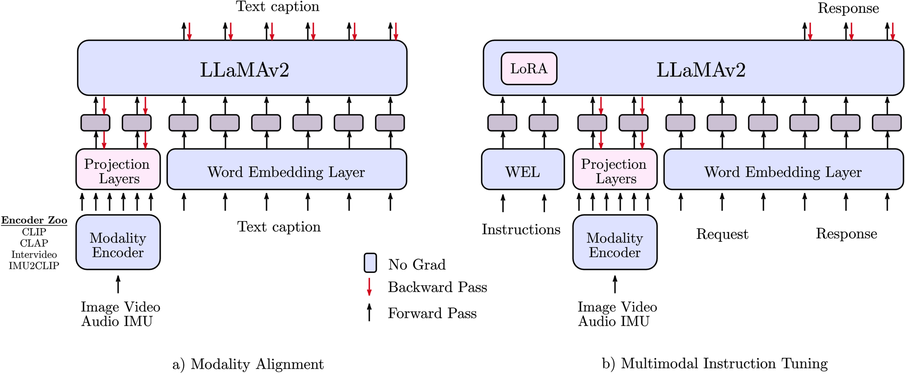

*Figure 2 · [Source](https://arxiv.org/abs/2309.16058)*

Details

**Input → output:** T, I, V, A, X → T · **Interaction:** text-output

Any-modality conditioning of a text LLM, including motion-sensor signals.

### ARC-Hunyuan-Video

Audio-visual LLM.

[Paper](https://arxiv.org/abs/2507.20939)

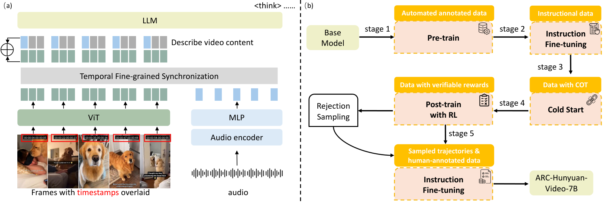

*Figure 2 · [Source](https://arxiv.org/abs/2507.20939)*

Details

**Input → output:** T, V, A → T · **Interaction:** text-output

Structured descriptions, timestamps and questions about short videos.

**Variants:** 7B.

### Audio-Visual LLM

Modality-selective encoders and instruction tuning.

[Paper](https://arxiv.org/abs/2312.06720)

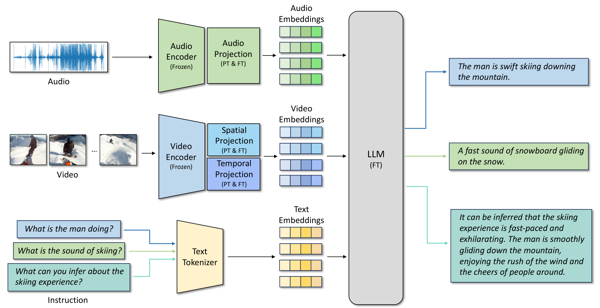

*Figure 2 · [Source](https://arxiv.org/abs/2312.06720)*

Details

**Input → output:** T, V, A → T · **Interaction:** text-output

Handles visual-only, audio-only and audiovisual video instructions.

### AURORA

Structured reasoning and segmentation distillation.

[Paper](https://arxiv.org/abs/2508.02149)

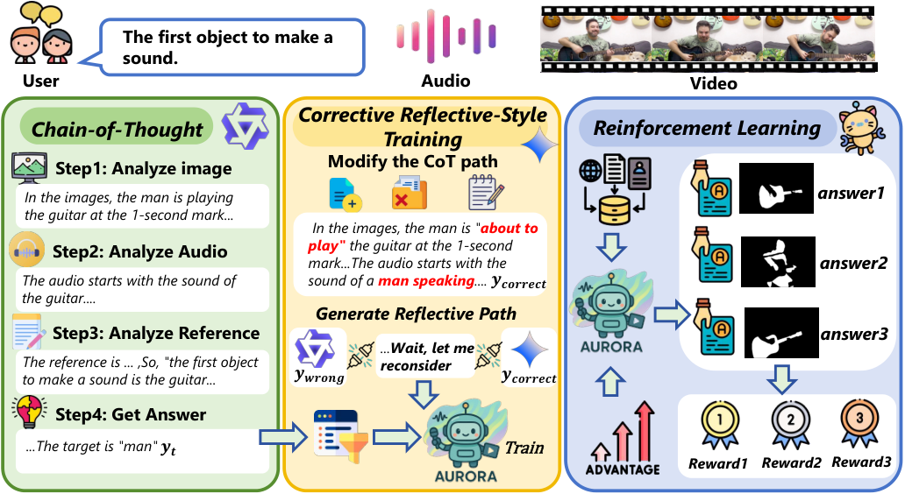

*Figure 1 · [Source](https://arxiv.org/abs/2508.02149)*

Details

**Input → output:** T, V, A → T, X · **Interaction:** text-output

Reference audio-visual segmentation with staged alignment and reinforcement learning.

### AV-Reasoner

GRPO and counting curriculum.

[Paper](https://arxiv.org/abs/2506.05328)

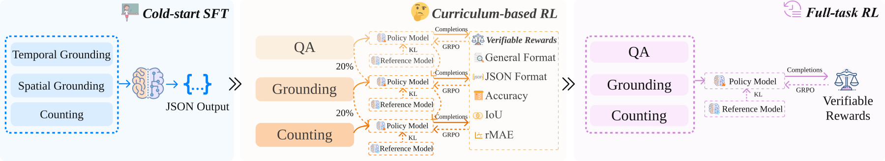

*Figure 4 · [Source](https://arxiv.org/abs/2506.05328)*

Details

**Input → output:** T, V, A → T · **Interaction:** text-output

Specialized fine-tuned model for clue-grounded audiovisual counting.

### AVicuna

Temporal audio-visual instruction tuning.

[Paper](https://arxiv.org/abs/2403.16276)

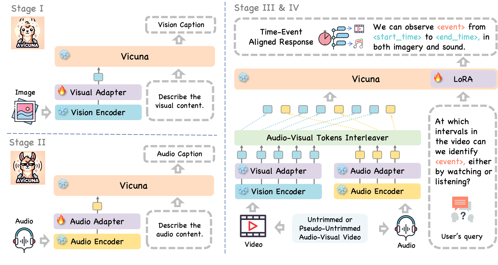

*Figure 3 · [Source](https://arxiv.org/abs/2403.16276)*

Details

**Input → output:** T, V, A → T · **Interaction:** text-output

Uses pseudo-untrimmed videos for temporal localization and dialogue.

### Baichuan-Omni

Encoder–LLM alignment.

[Paper](https://arxiv.org/abs/2410.08565)

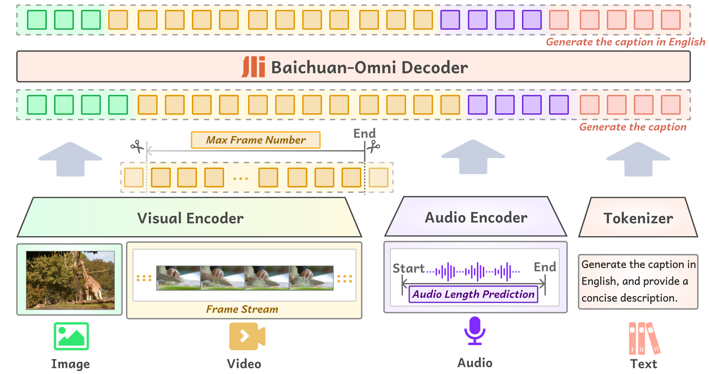

*Figure 2 · [Source](https://arxiv.org/abs/2410.08565)*

Details

**Input → output:** T, I, V, A → T · **Interaction:** text-output

The initial release documents multimodal understanding; speech generation arrives in 1.5.

**Variants:** 7B.

### Baichuan-Omni-1.5

Audio tokenizer and multimodal LLM.

[Paper](https://arxiv.org/abs/2501.15368)

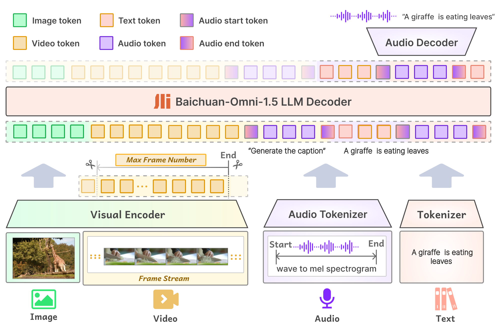

*Figure 2 · [Source](https://arxiv.org/abs/2501.15368)*

Details

**Input → output:** T, I, V, A → T, S · **Interaction:** streaming

Adds an integrated speech-generation path to the Baichuan omni family.

### BuboGPT

Encoder alignment and grounding module.

[Paper](https://arxiv.org/abs/2307.08581)

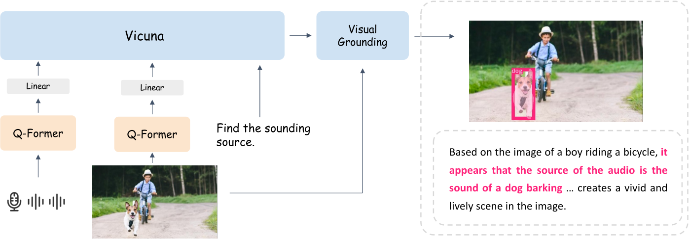

*Figure 1 · [Source](https://arxiv.org/abs/2307.08581)*

Details

**Input → output:** T, I, A → T, X · **Interaction:** text-output

Connects audio-visual answers to image regions through an external grounding module.

### Capybara-OMNI

Progressive modality alignment.

[Paper](https://arxiv.org/abs/2504.12315)

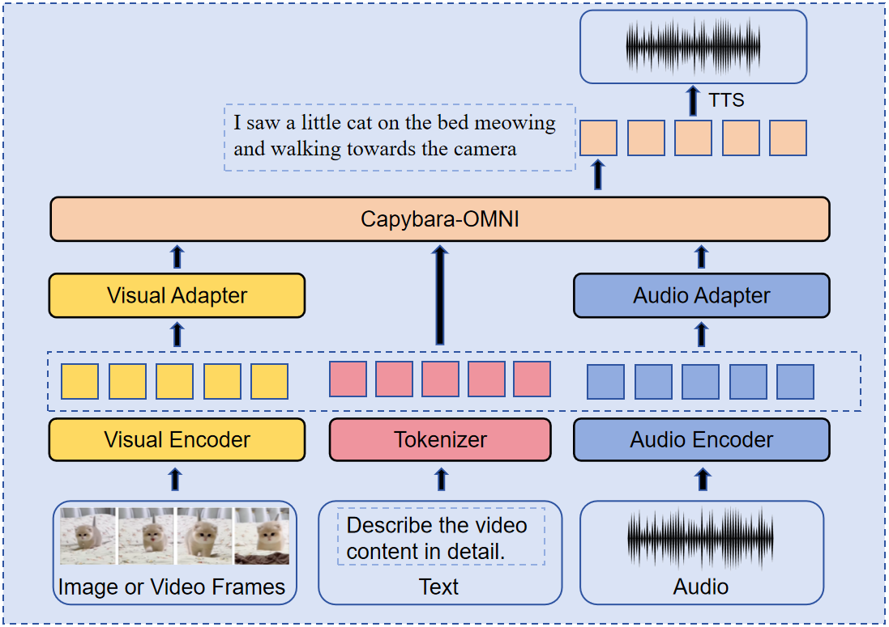

*Figure 1 · [Source](https://arxiv.org/abs/2504.12315)*

Details

**Input → output:** T, I, V, A → T · **Interaction:** text-output

Efficient training recipe with understanding and chat releases.

**Variants:** Understanding; Chat.

### CAT

Clue aggregation.

[Paper](https://arxiv.org/abs/2403.04640)

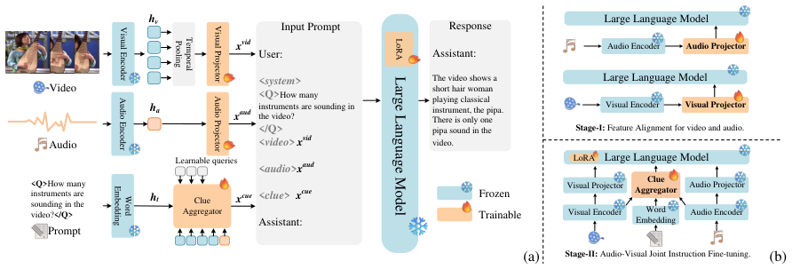

*Figure 2, PDF p. 5 · [Source](https://arxiv.org/abs/2403.04640)*

Details

**Input → output:** T, V, A → T · **Interaction:** text-output

Question-conditioned audio-visual features support dynamic scene reasoning.

### ChatBridge

Language-centered alignment.

[Paper](https://arxiv.org/abs/2305.16103)

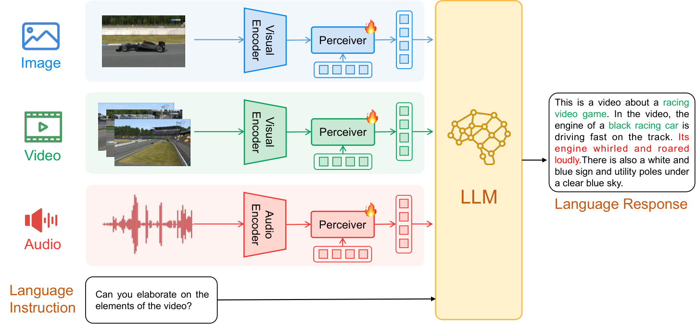

*Figure 2 · [Source](https://arxiv.org/abs/2305.16103)*

Details

**Input → output:** T, I, V, A → T · **Interaction:** text-output

Learns cross-modal connections using language-paired training data.

### ChronusOmni

Temporal interleaving and RL.

[Paper](https://arxiv.org/abs/2512.09841)

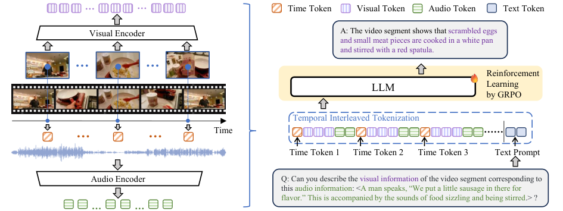

*Figure 2 · [Source](https://arxiv.org/abs/2512.09841)*

Details

**Input → output:** T, V, A → T · **Interaction:** text-output

Uses timestamps and reinforcement learning for audio-visual temporal grounding.

### CoDi-2

Multimodal LLM and generation modules.

[Paper](https://arxiv.org/abs/2311.18775)

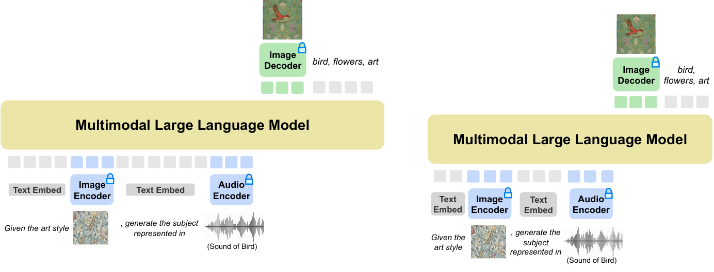

*Figure 2 · [Source](https://arxiv.org/abs/2311.18775)*

Details

**Input → output:** T, I, A → T, I, A · **Interaction:** system

Supports interleaved multimodal conditioning and interactive any-to-any generation.

### Crab

Cooperative audio-visual task modeling.

[Paper](https://arxiv.org/abs/2503.13068)

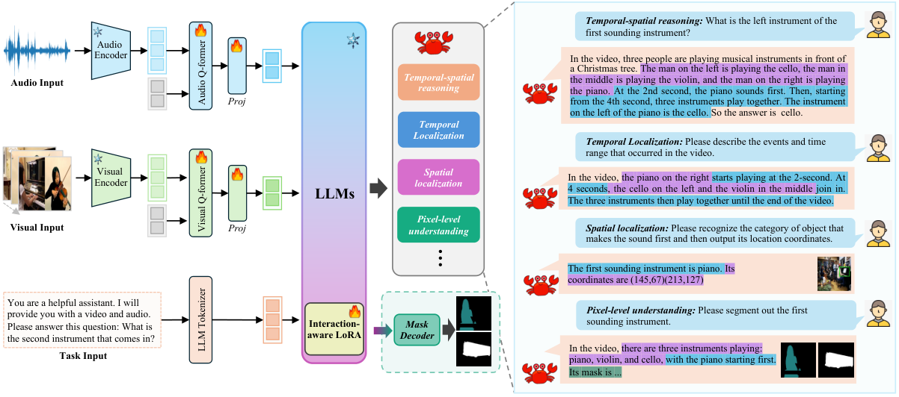

*Figure 3 · [Source](https://arxiv.org/abs/2503.13068)*

Details

**Input → output:** T, V, A → T, X · **Interaction:** text-output

Unifies scene reasoning with temporal, spatial and pixel-level localization tasks.

### CREMA

Modular fusion.

[Paper](https://arxiv.org/abs/2402.05889)

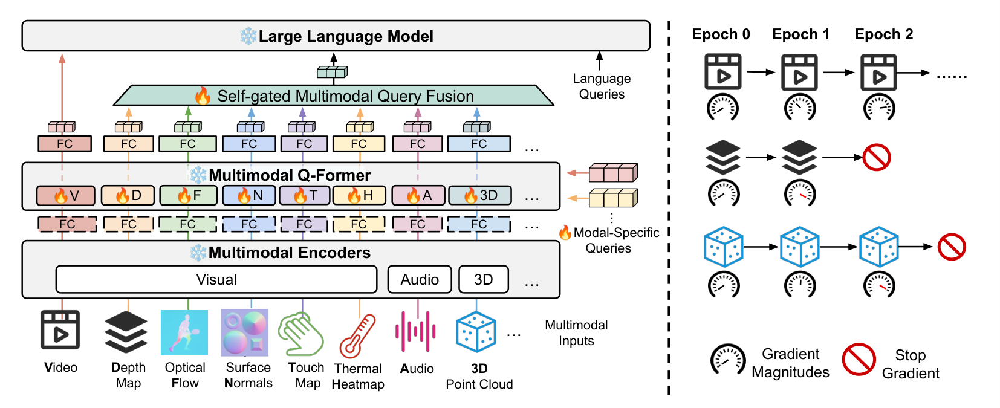

*Figure 1 · [Source](https://arxiv.org/abs/2402.05889)*

Details

**Input → output:** T, V, A, X → T · **Interaction:** text-output

Extends video reasoning with audio and additional sensor-derived representations.

### DeepSound-V1

Multimodal reasoning and audio generation.

[Paper](https://arxiv.org/abs/2503.22208)

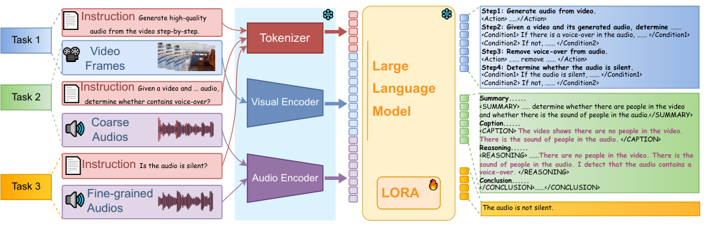

*Figure 3 · [Source](https://arxiv.org/abs/2503.22208)*

Details

**Input → output:** T, V → T, A · **Interaction:** system

Uses language-model reasoning to align generated sounds with videos.

### DuplexOmni

Asynchronous interaction and reasoning layers.

[Paper](https://arxiv.org/abs/2606.09186)

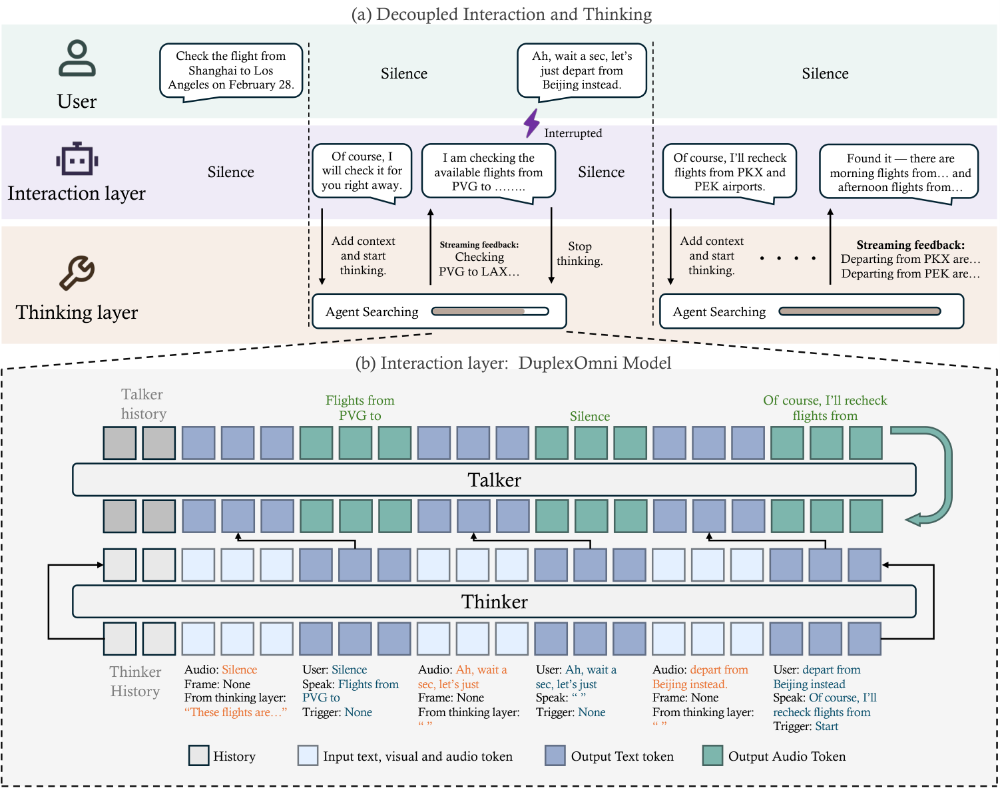

*Figure 2 · [Source](https://arxiv.org/abs/2606.09186)*

Details

**Input → output:** T, V, A → T, S · **Interaction:** full-duplex

Processes streaming audiovisual input while producing spoken responses; reasoning is a pluggable layer.

### EchoInk-R1

GRPO on Qwen2.5-Omni.

[Paper](https://arxiv.org/abs/2505.04623)

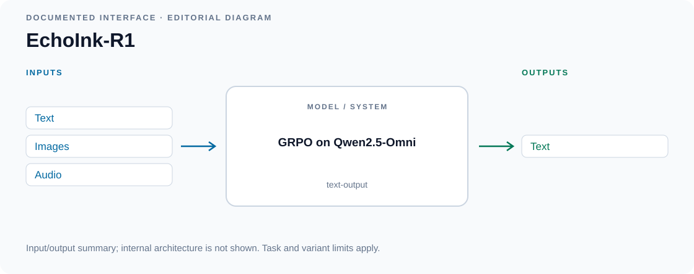

*Input/output diagram · [Source](https://arxiv.org/abs/2505.04623)*

Details

**Input → output:** T, I, A → T · **Interaction:** text-output

Named fine-tuned model for audio-image reasoning; does not establish a new base architecture.

Editorial summary of documented inputs and outputs; internal architecture is not shown.

**Variants:** 7B.

### EgoGPT

Egocentric multimodal LLM.

[Paper](https://arxiv.org/abs/2503.03803)

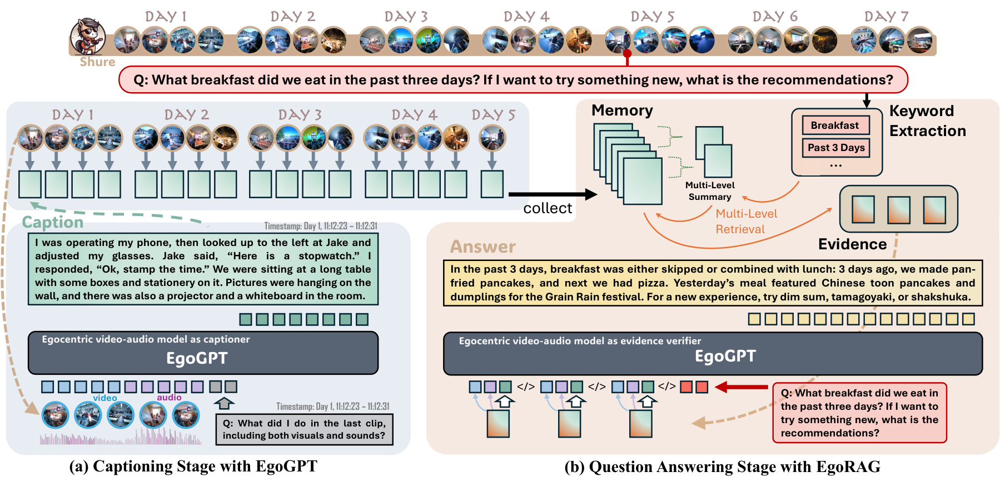

*Figure 7 · [Source](https://arxiv.org/abs/2503.03803)*

Details

**Input → output:** T, V, A → T · **Interaction:** text-output

The model introduced alongside the EgoLife dataset and assistant project.

### ELLSA

Speech-Action MoE.

[Paper](https://arxiv.org/abs/2510.16756)

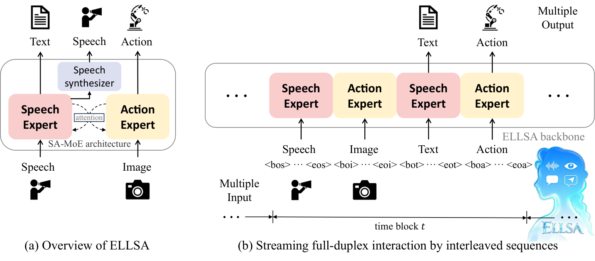

*Figure 1 · [Source](https://arxiv.org/abs/2510.16756)*

Details

**Input → output:** T, V, S, X → T, S, X · **Interaction:** full-duplex

Joint listening, visual perception, speech and action generation in a single interaction model.

### Emotion-LLaMA

Emotion-specific encoders.

[Paper](https://arxiv.org/abs/2406.11161)

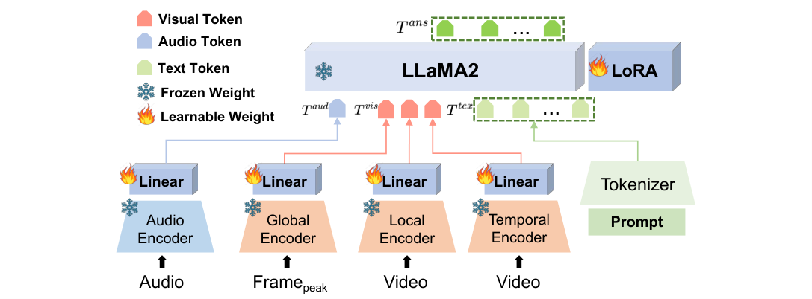

*Figure 2 · [Source](https://arxiv.org/abs/2406.11161)*

Details

**Input → output:** T, I, V, A → T · **Interaction:** text-output

Multimodal emotion recognition and explanations.

### EMOVA

Speech-vision-language alignment.

[Paper](https://arxiv.org/abs/2409.18042)

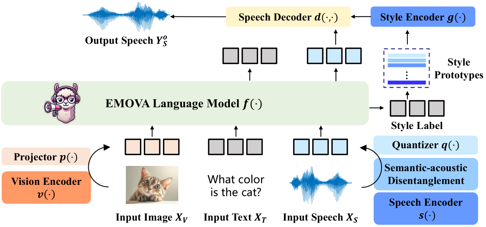

*Figure 2 · [Source](https://arxiv.org/abs/2409.18042)*

Details

**Input → output:** T, I, S → T, S · **Interaction:** not-specified

Combines image understanding with expressive speech interaction.

### Empatheia

Multimodal LLM, speech and avatar generators.

[Paper](https://arxiv.org/abs/2502.04976)

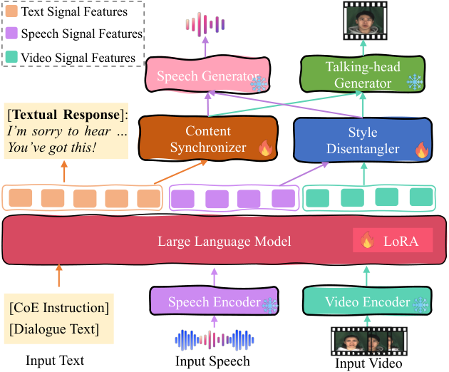

*Figure 3 · [Source](https://arxiv.org/abs/2502.04976)*

Details

**Input → output:** T, V, S → T, V, S · **Interaction:** system

The system introduced with AvaMERG; the benchmark itself is not a model.

### EmpathyEar

Emotion-aware LLM and avatar generation.

[Paper](https://arxiv.org/abs/2406.15177)

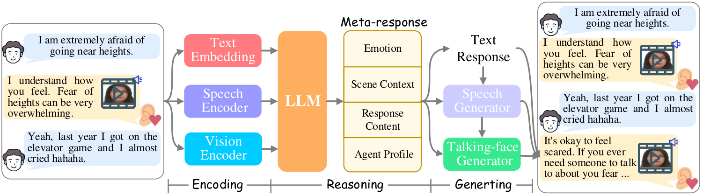

*Figure 1 · [Source](https://arxiv.org/abs/2406.15177)*

Details

**Input → output:** T, I, S → T, V, S · **Interaction:** system

Generates text, synchronized speech and talking-face responses.

### eP-ALM

Efficient perception-to-language projections.

[Paper](https://arxiv.org/abs/2303.11403)

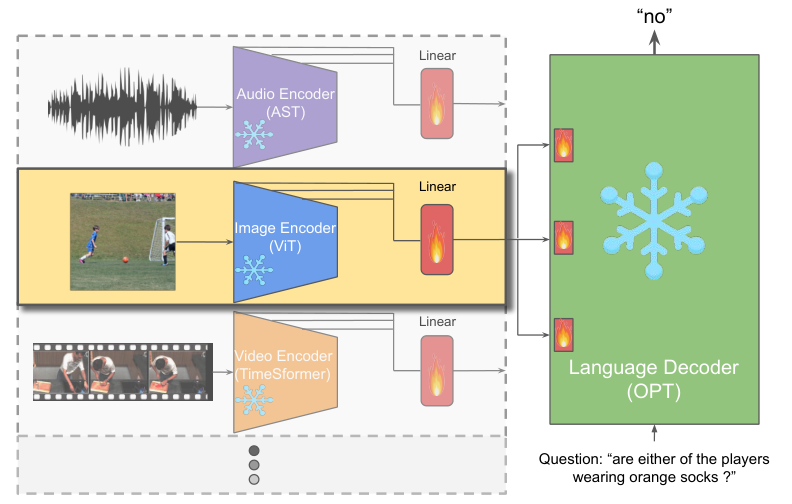

*Figure 1 · [Source](https://arxiv.org/abs/2303.11403)*

Details

**Input → output:** T, I, V, A → T · **Interaction:** text-output

Research configurations adapt frozen language models to image, video and audio tasks.

### FAVOR

Causal Q-Former.

[Paper](https://arxiv.org/abs/2310.05863)

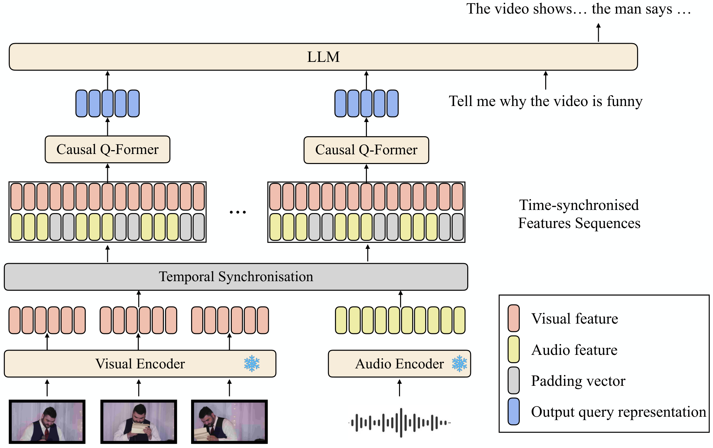

*Figure 1 · [Source](https://arxiv.org/abs/2310.05863)*

Details

**Input → output:** T, I, V, A → T · **Interaction:** text-output

Fine-grained fusion of visual frames, speech and other audio events.

### Gemini 1.0

Natively multimodal Transformer.

[Paper](https://arxiv.org/abs/2312.11805)

*Input/output diagram · [Source](https://arxiv.org/abs/2312.11805)*

Details

**Input → output:** T, I, V, A → T · **Interaction:** text-output

Initial Gemini report covers a family; its research modality claims do not establish identical public endpoints for every size.

Editorial summary of documented inputs and outputs; internal architecture is not shown.

**Variants:** Ultra; Pro.

### Gemini 1.5

Long-context multimodal MoE family.

[Paper](https://arxiv.org/abs/2403.05530)

*Input/output diagram · [Source](https://arxiv.org/abs/2403.05530)*

Details

**Input → output:** T, I, V, A → T · **Interaction:** text-output

Audio and video understanding with text responses.

Editorial summary of documented inputs and outputs; internal architecture is not shown.

**Variants:** Pro; Flash; Flash-8B.

### Gemini 2.0

Multimodal model family.

[Paper](https://arxiv.org/abs/2507.06261)

*Input/output diagram · [Source](https://arxiv.org/abs/2507.06261)*

Details

**Input → output:** T, I, V, A → T · **Interaction:** text-output

Standard understanding endpoints are listed here; experimental native-audio interfaces have different output capabilities.

Editorial summary of documented inputs and outputs; internal architecture is not shown.

**Variants:** Flash; Flash-Lite.

### Gemini 2.5

Reasoning-enabled multimodal family.

[Paper](https://arxiv.org/abs/2507.06261) · [Docs 1](https://ai.google.dev/gemini-api/docs/models/gemini-2.5-pro) · [Docs 2](https://ai.google.dev/gemini-api/docs/models/gemini-2.5-flash) · [Docs 3](https://ai.google.dev/gemini-api/docs/models/gemini-2.5-flash-lite)

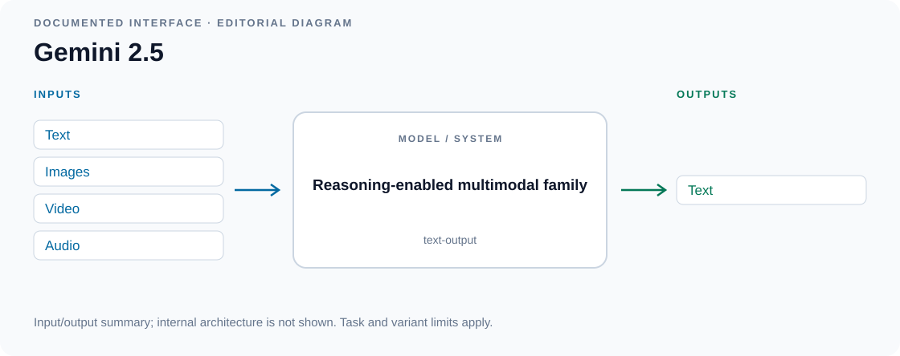

*Input/output diagram · [Source](https://arxiv.org/abs/2507.06261)*

Details

**Input → output:** T, I, V, A → T · **Interaction:** text-output

The general Pro/Flash models produce text; native-audio Live and TTS variants have their own entries.

Editorial summary of documented inputs and outputs; internal architecture is not shown.

**Variants:** Pro; Flash; Flash-Lite.

### Gemini 2.5 Flash Live

Native-audio Live API model.

[Docs](https://ai.google.dev/gemini-api/docs/models/gemini-2.5-flash-native-audio-preview-12-2025)

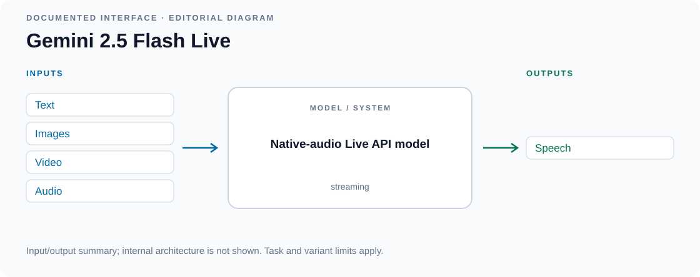

*Input/output diagram · [Source](https://ai.google.dev/gemini-api/docs/models/gemini-2.5-flash-native-audio-preview-12-2025)*

Details

**Input → output:** T, I, V, A → S · **Interaction:** streaming

Realtime audiovisual input with native speech output; live transcription is an associated API feature.

Editorial summary of documented inputs and outputs; internal architecture is not shown.

**Variants:** gemini-2.5-flash-native-audio-preview-12-2025.

### Gemini 3

Multimodal reasoning family.

[Docs 1](https://ai.google.dev/gemini-api/docs/models/gemini-3-pro-preview) · [Docs 2](https://ai.google.dev/gemini-api/docs/models/gemini-3-flash-preview)

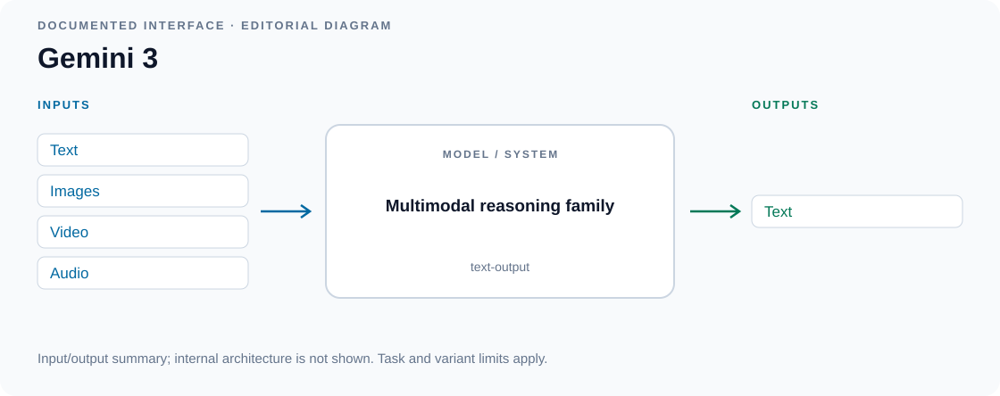

*Input/output diagram · [Source](https://ai.google.dev/gemini-api/docs/models/gemini-3-pro-preview)*

Details

**Input → output:** T, I, V, A → T · **Interaction:** text-output

Pro and Flash preview understanding models; audio input does not imply speech generation.

Editorial summary of documented inputs and outputs; internal architecture is not shown.

**Variants:** 3 Pro Preview; 3 Flash Preview.

### Gemini 3.1

Multimodal reasoning family.

[Docs 1](https://ai.google.dev/gemini-api/docs/models/gemini-3.1-pro-preview) · [Docs 2](https://ai.google.dev/gemini-api/docs/models/gemini-3.1-flash-lite)

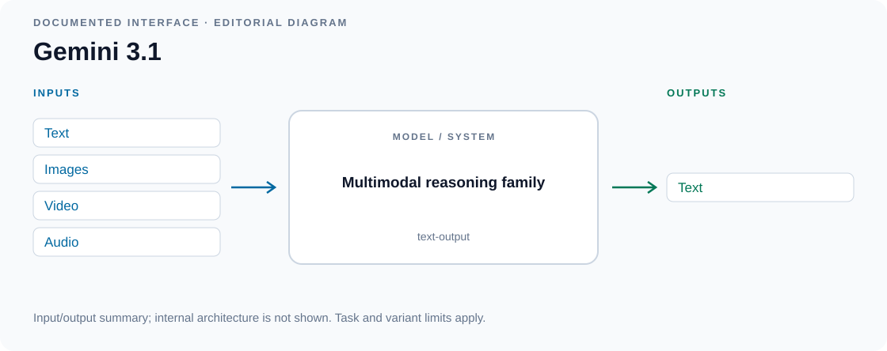

*Input/output diagram · [Source](https://ai.google.dev/gemini-api/docs/models/gemini-3.1-pro-preview)*

Details

**Input → output:** T, I, V, A → T · **Interaction:** text-output

General understanding variants are separate from Flash Live and Flash TTS.

Editorial summary of documented inputs and outputs; internal architecture is not shown.

**Variants:** 3.1 Pro Preview; 3.1 Flash-Lite.

### Gemini 3.1 Flash Live

Native audio-visual Live API model.

[Docs](https://ai.google.dev/gemini-api/docs/models/gemini-3.1-flash-live-preview)

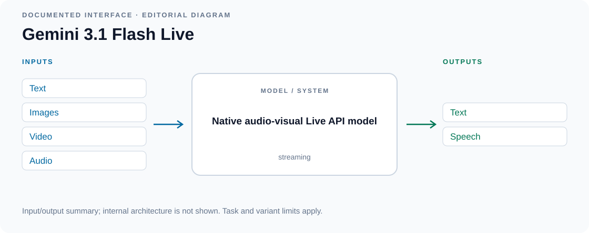

*Input/output diagram · [Source](https://ai.google.dev/gemini-api/docs/models/gemini-3.1-flash-live-preview)*

Details

**Input → output:** T, I, V, A → T, S · **Interaction:** streaming

Documents both text and audio responses to multimodal inputs.

Editorial summary of documented inputs and outputs; internal architecture is not shown.

**Variants:** gemini-3.1-flash-live-preview.

### Gemini 3.5

Multimodal Flash family.

[Docs 1](https://ai.google.dev/gemini-api/docs/models/gemini-3.5-flash) · [Docs 2](https://ai.google.dev/gemini-api/docs/models/gemini-3.5-flash-lite)

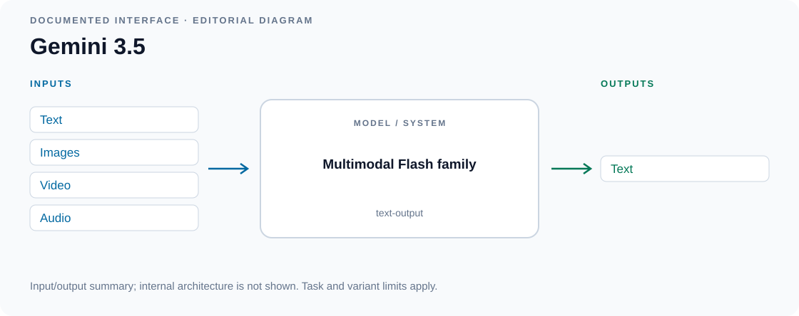

*Input/output diagram · [Source](https://ai.google.dev/gemini-api/docs/models/gemini-3.5-flash)*

Details

**Input → output:** T, I, V, A → T · **Interaction:** text-output

General audio/vision understanding; specialized translation and transcription models are listed separately.

Editorial summary of documented inputs and outputs; internal architecture is not shown.

**Variants:** 3.5 Flash; 3.5 Flash-Lite.

### Gemini 3.6 Flash

Multimodal Flash API model.

[Docs](https://ai.google.dev/gemini-api/docs/models/gemini-3.6-flash)

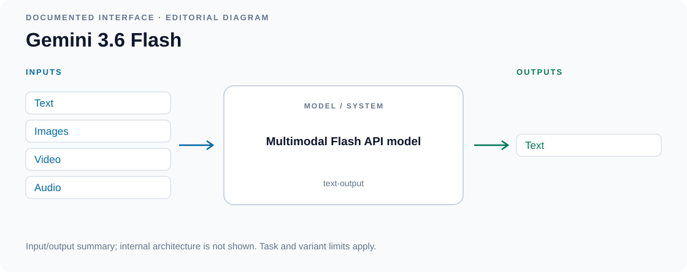

*Input/output diagram · [Source](https://ai.google.dev/gemini-api/docs/models/gemini-3.6-flash)*

Details

**Input → output:** T, I, V, A → T · **Interaction:** text-output

Supports audio input and text output; its model page does not support audio generation.

Editorial summary of documented inputs and outputs; internal architecture is not shown.

**Variants:** gemini-3.6-flash.

### Gemini 3.7 Flash

Multimodal Flash API model.

[Docs](https://ai.google.dev/gemini-api/docs/models/gemini-3.7-flash)

*Input/output diagram · [Source](https://ai.google.dev/gemini-api/docs/models/gemini-3.7-flash)*

Details

**Input → output:** T, I, V, A → T · **Interaction:** text-output

Text-generating model with audio, image and video understanding.

Editorial summary of documented inputs and outputs; internal architecture is not shown.

**Variants:** gemini-3.7-flash.

### Gemini 3.8 Flash

Multimodal Flash API model.

[Docs](https://ai.google.dev/gemini-api/docs/models/gemini-3.8-flash)

*Input/output diagram · [Source](https://ai.google.dev/gemini-api/docs/models/gemini-3.8-flash)*

Details

**Input → output:** T, I, V, A → T · **Interaction:** text-output

The September 2026 model documentation lists audio input but no audio generation.

Editorial summary of documented inputs and outputs; internal architecture is not shown.

**Variants:** gemini-3.8-flash.

### Gemma 3n

Efficient multimodal backbone.

[Project](https://deepmind.google/models/gemma/gemma-3n)

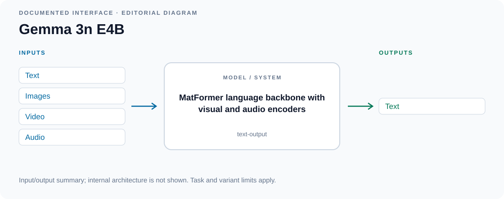

*Input/output diagram · [Source](https://deepmind.google/models/gemma/gemma-3n)*

Details

**Input → output:** T, I, V, A → T · **Interaction:** text-output

On-device multimodal understanding; the listed model generates text.

Editorial summary of documented inputs and outputs; internal architecture is not shown.

**Variants:** E2B; E4B.

### Gemma 4 (audio-capable variants)

Encoders for E2B/E4B; encoder-free 12B.

[Paper](https://arxiv.org/abs/2607.02770) · [Docs 1](https://ai.google.dev/gemma/docs/core) · [Docs 2](https://ai.google.dev/gemma/docs/capabilities/audio)

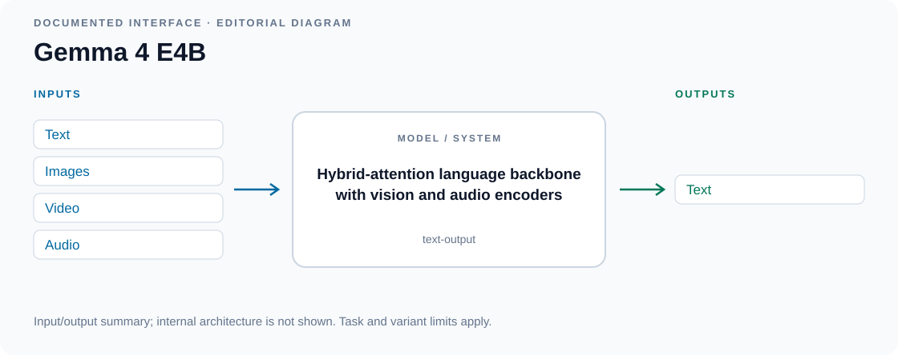

*Input/output diagram · [Source](https://arxiv.org/abs/2607.02770)*

Details

**Input → output:** T, I, V, A → T · **Interaction:** text-output

Audio coverage here applies to E2B, E4B and 12B Unified; larger visual-only variants are not assigned speech capabilities.

Editorial summary of documented inputs and outputs; internal architecture is not shown.

**Variants:** E2B; E4B; 12B Unified.

### GPT-4o (reported model)

Native multimodal model; internals partly disclosed.

[Paper](https://arxiv.org/abs/2410.21276)

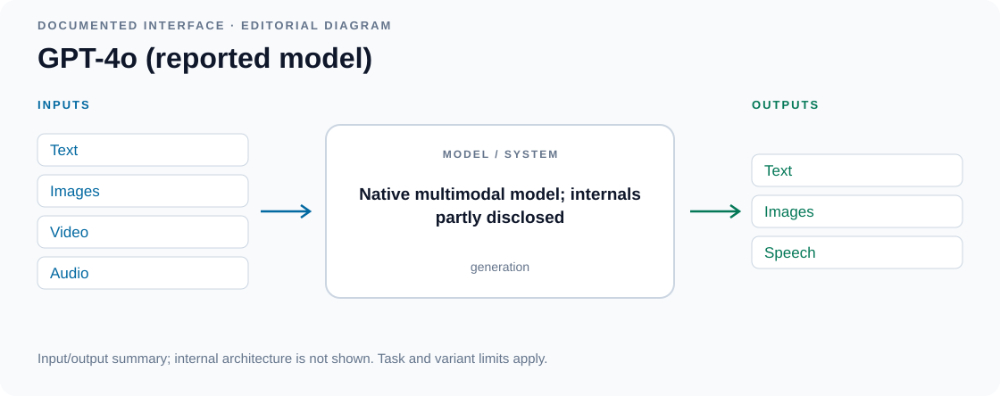

*Input/output diagram · [Source](https://arxiv.org/abs/2410.21276)*

Details

**Input → output:** T, I, V, A → T, I, S · **Interaction:** generation

System-card capabilities describe the reported model. Individual text, audio and realtime APIs expose different subsets.

Editorial summary of documented inputs and outputs; internal architecture is not shown.

**Variants:** GPT-4o research/system-card scope.

### GPT-Realtime

Native audio API model; detailed architecture undisclosed.

[Docs](https://developers.openai.com/api/docs/models/gpt-realtime)

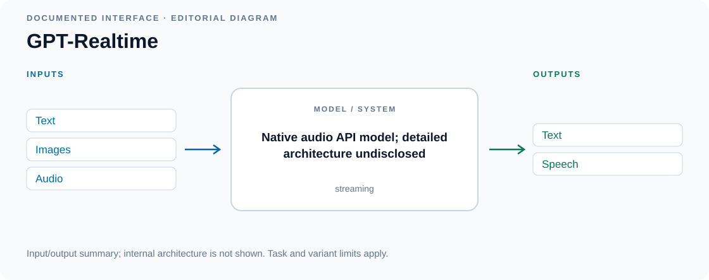

*Input/output diagram · [Source](https://developers.openai.com/api/docs/models/gpt-realtime)*

Details

**Input → output:** T, I, A → T, S · **Interaction:** streaming

Realtime API model with image input; image support does not imply a native video stream.

Editorial summary of documented inputs and outputs; internal architecture is not shown.

**Variants:** gpt-realtime.

### GPT-Realtime Mini

Compact realtime audio model.

[Docs](https://developers.openai.com/api/docs/models/gpt-realtime-mini)

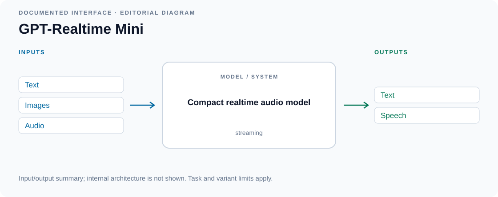

*Input/output diagram · [Source](https://developers.openai.com/api/docs/models/gpt-realtime-mini)*

Details

**Input → output:** T, I, A → T, S · **Interaction:** streaming

Smaller realtime API variant with image input.

Editorial summary of documented inputs and outputs; internal architecture is not shown.

**Variants:** gpt-realtime-mini.

### GPT-Realtime-1.5

Realtime multimodal API model.

[Docs](https://developers.openai.com/api/docs/models/gpt-realtime-1.5)

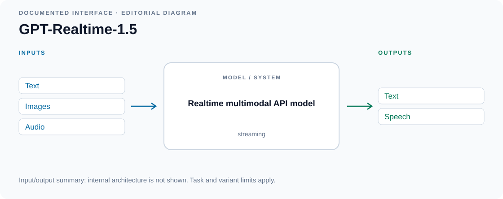

*Input/output diagram · [Source](https://developers.openai.com/api/docs/models/gpt-realtime-1.5)*

Details

**Input → output:** T, I, A → T, S · **Interaction:** streaming

Audio-focused interaction with text and image conditioning.

Editorial summary of documented inputs and outputs; internal architecture is not shown.

**Variants:** gpt-realtime-1.5.

### GPT-Realtime-2

Reasoning-enabled realtime audio model.

[Docs](https://developers.openai.com/api/docs/models/gpt-realtime-2)

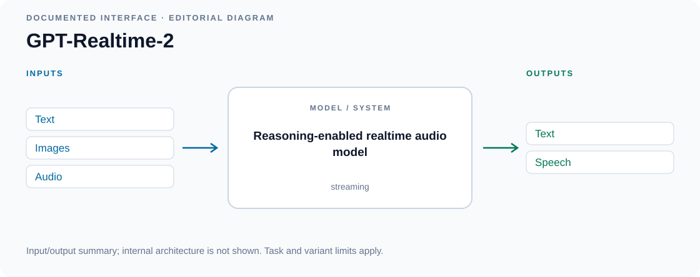

*Input/output diagram · [Source](https://developers.openai.com/api/docs/models/gpt-realtime-2)*

Details

**Input → output:** T, I, A → T, S · **Interaction:** streaming

API model combining speech interaction, reasoning and tool use.

Editorial summary of documented inputs and outputs; internal architecture is not shown.

**Variants:** gpt-realtime-2.

### GPT-Realtime-2.1

Realtime reasoning model.

[Docs](https://developers.openai.com/api/docs/models/gpt-realtime-2.1)

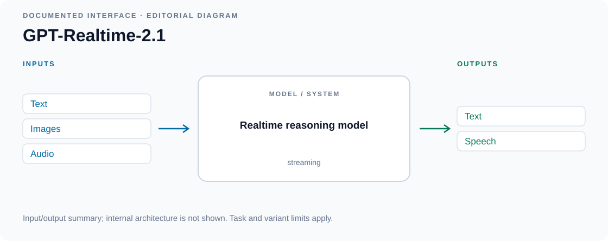

*Input/output diagram · [Source](https://developers.openai.com/api/docs/models/gpt-realtime-2.1)*

Details

**Input → output:** T, I, A → T, S · **Interaction:** streaming

Successor voice model with text, image and audio input.

Editorial summary of documented inputs and outputs; internal architecture is not shown.

**Variants:** gpt-realtime-2.1.

### GPT-Realtime-2.1 Mini

Distilled realtime reasoning model.

[Docs](https://developers.openai.com/api/docs/models/gpt-realtime-2.1-mini)

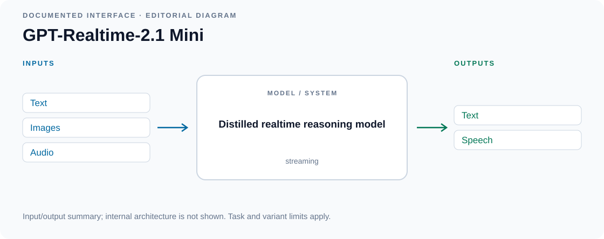

*Input/output diagram · [Source](https://developers.openai.com/api/docs/models/gpt-realtime-2.1-mini)*

Details

**Input → output:** T, I, A → T, S · **Interaction:** streaming

Compact API variant of the realtime reasoning family.

Editorial summary of documented inputs and outputs; internal architecture is not shown.

**Variants:** gpt-realtime-2.1-mini.

### GroundingGPT

Multimodal grounding.

[Paper](https://arxiv.org/abs/2401.06071)

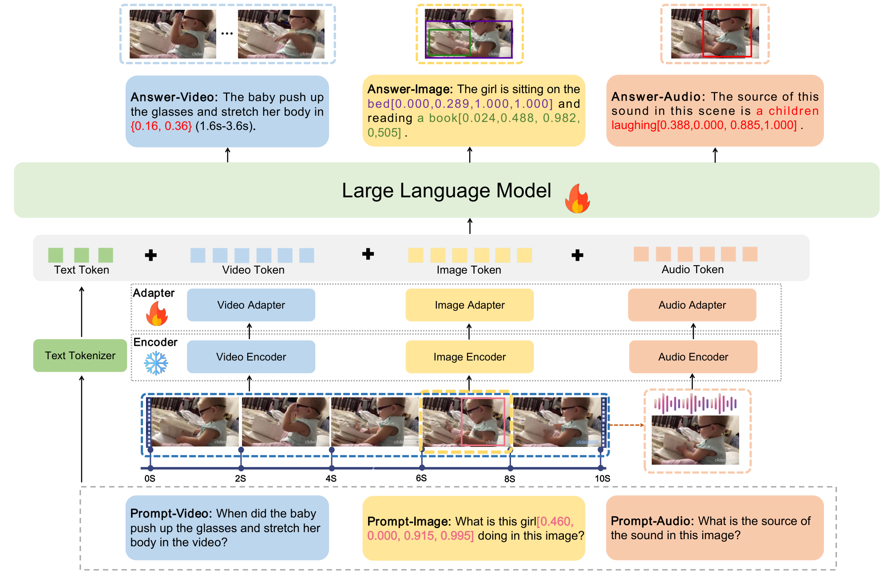

*Figure 1 · [Source](https://arxiv.org/abs/2401.06071)*

Details

**Input → output:** T, I, V, A → T, X · **Interaction:** text-output

Returns language and localization information for visual and audio inputs.

### HumanOmni

Human-centered visual branches and audio fusion.

[Paper](https://arxiv.org/abs/2501.15111)

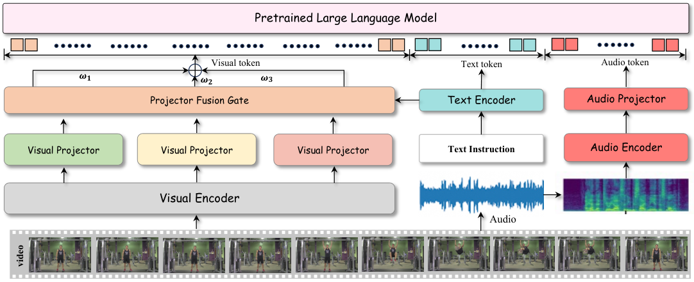

*Figure 1 · [Source](https://arxiv.org/abs/2501.15111)*

Details

**Input → output:** T, V, A → T · **Interaction:** text-output

Specializes in people, interactions and human-centered video interpretation.

### HumanOmniV2

Context-aware reasoning and RL.

[Paper](https://arxiv.org/abs/2506.21277)

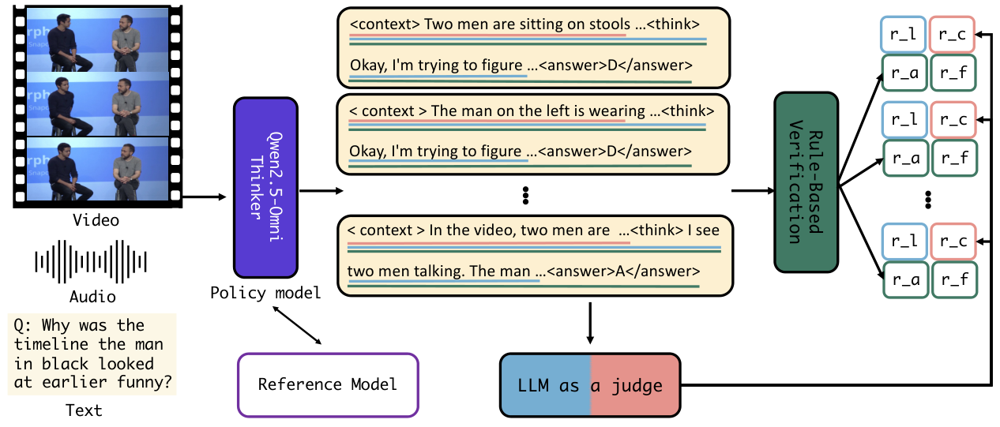

*Figure 4 · [Source](https://arxiv.org/abs/2506.21277)*

Details

**Input → output:** T, V, A → T · **Interaction:** text-output

Extends the HumanOmni line with multimodal reasoning training.

### ImageBind-LLM

Shared embedding alignment.

[Paper](https://arxiv.org/abs/2309.03905)

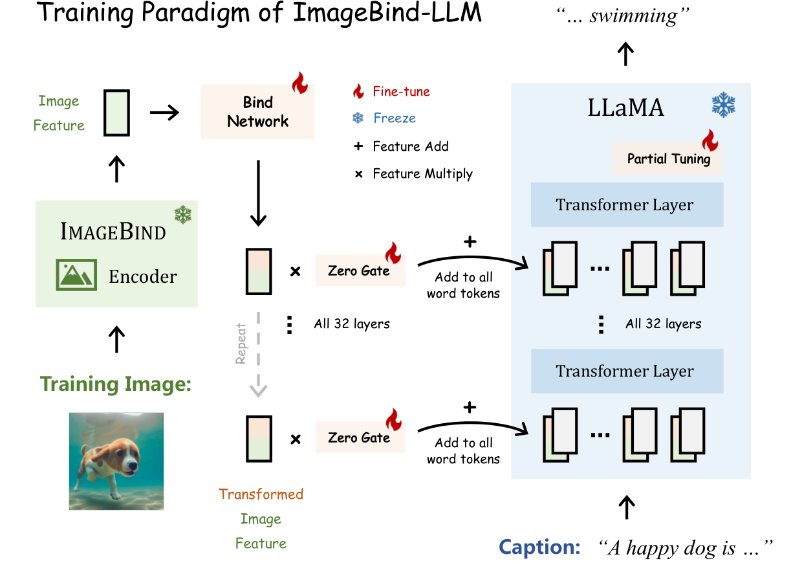

*Figure 2 · [Source](https://arxiv.org/abs/2309.03905)*

Details

**Input → output:** T, I, V, A, X → T · **Interaction:** text-output

Uses ImageBind alignment to extend a language model to additional input modalities.

### InteractiveOmni

Encoders, LLM and speech decoder.

[Paper](https://arxiv.org/abs/2510.13747)

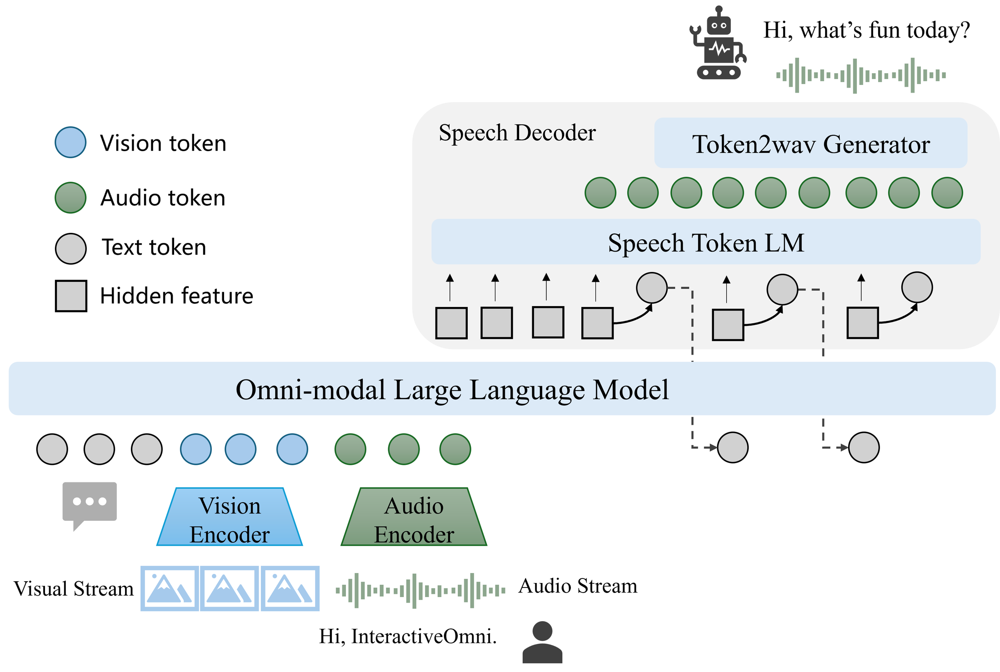

*Figure 3 · [Source](https://arxiv.org/abs/2510.13747)*

Details

**Input → output:** T, I, V, A → T, S · **Interaction:** not-specified

Multi-turn audiovisual dialogue with a trained speech-generation component.

**Variants:** 4B; 8B.

### InternOmni

InternVL extended with audio.

[Announcement](https://internvl.github.io/blog/2024-07-27-InternOmni)

*Input/output diagram · [Source](https://internvl.github.io/blog/2024-07-27-InternOmni)*

Details

**Input → output:** T, I, V, A → T · **Interaction:** text-output

Audio-enabled extension of InternVL; consult its release-specific checkpoint instructions.

Editorial summary of documented inputs and outputs; internal architecture is not shown.

### LongCat-Flash-Omni

MoE with perception and speech modules.

[Paper](https://arxiv.org/abs/2511.00279)

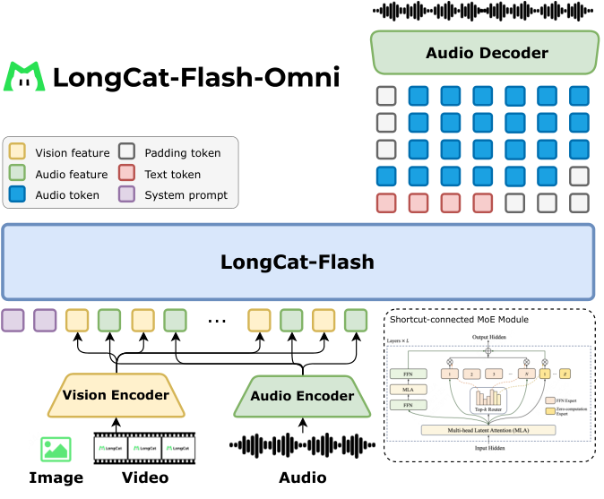

*Figure 2 · [Source](https://arxiv.org/abs/2511.00279)*

Details

**Input → output:** T, I, V, A → T, S · **Interaction:** streaming

Real-time audiovisual interaction built on the LongCat-Flash backbone.

### LongCat-Next

Unified discrete tokens.

[Paper](https://arxiv.org/abs/2603.27538) · [Repository](https://github.com/meituan-longcat/LongCat-Next)

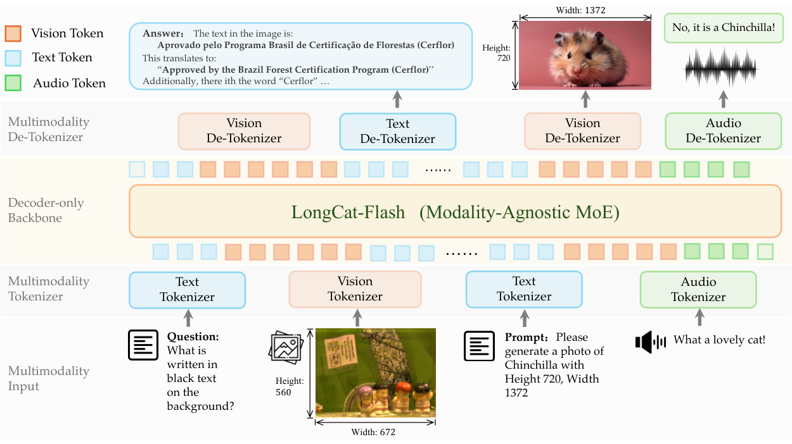

*Figure 2 · [Source](https://arxiv.org/abs/2603.27538)*

Details

**Input → output:** T, I, A → T, I, A · **Interaction:** generation

Models multiple modalities through token sequences; check the report for individual generation paths.

### Lyra

Multimodal adapters and speech decoder.

[Paper](https://arxiv.org/abs/2412.09501)

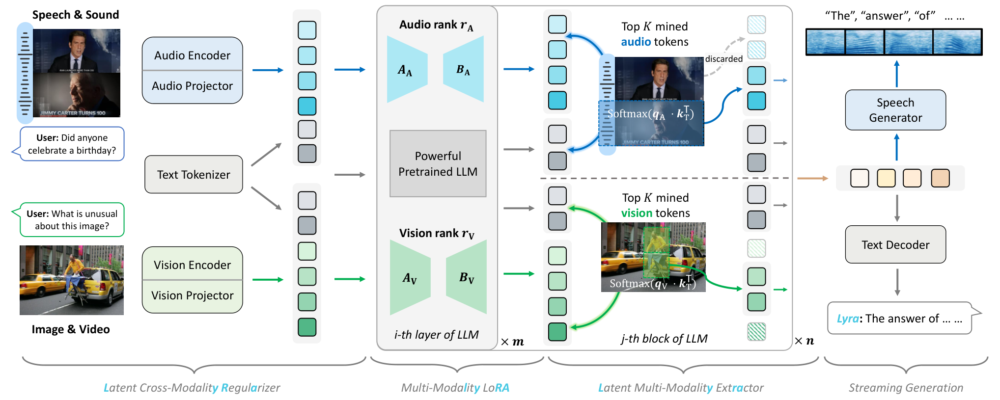

*Figure 2 · [Source](https://arxiv.org/abs/2412.09501)*

Details

**Input → output:** T, I, V, A → T, S · **Interaction:** streaming

Speech-centered multimodal understanding and spoken interaction.

### M2-omni

Unified multimodal sequence modeling.

[Paper](https://arxiv.org/abs/2502.18778)

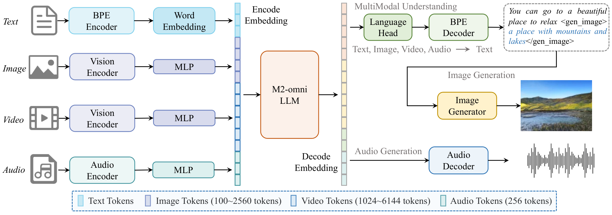

*Figure 2 · [Source](https://arxiv.org/abs/2502.18778)*

Details

**Input → output:** T, I, V, A → T, I, S · **Interaction:** streaming

Interleaves text, image and audio outputs; release claims require checking the linked report.

### Macaw-LLM

Modality, alignment and language modules.

[Paper](https://arxiv.org/abs/2306.09093)

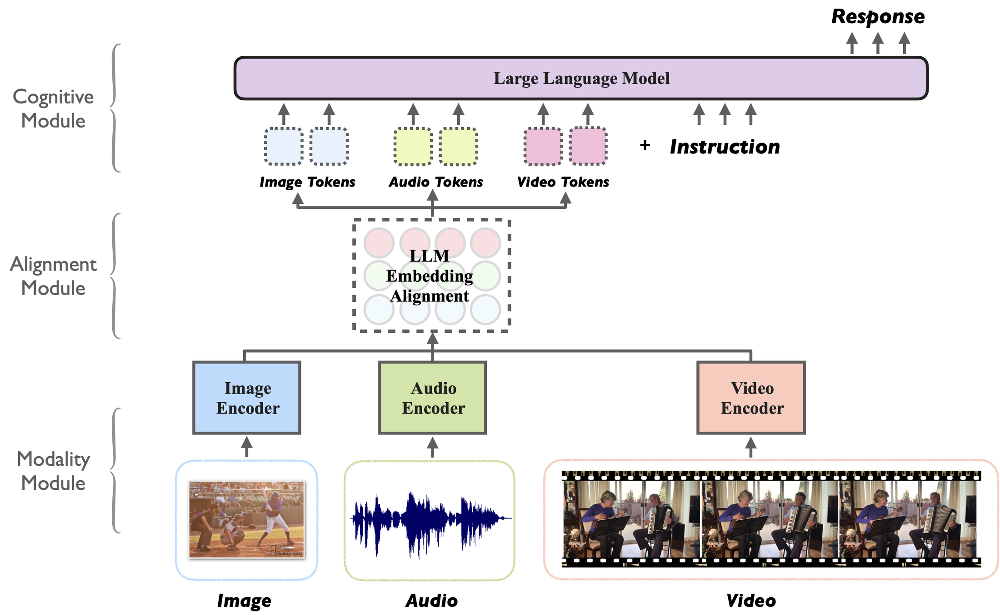

*Figure 1 · [Source](https://arxiv.org/abs/2306.09093)*

Details

**Input → output:** T, I, V, A → T · **Interaction:** text-output

Instruction-following over image, video and audio inputs.

### Meerkat

Optimal-transport alignment and cross-attention.

[Paper](https://arxiv.org/abs/2407.01851)

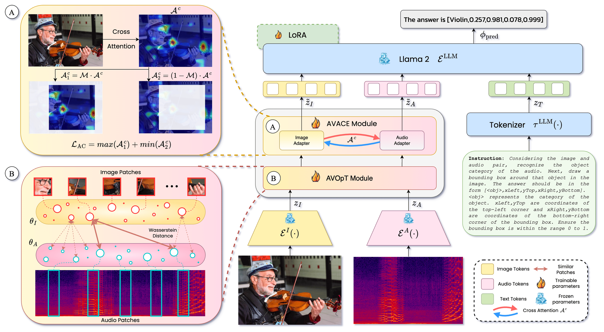

*Figure 2 · [Source](https://arxiv.org/abs/2407.01851)*

Details

**Input → output:** T, I, V, A → T, X · **Interaction:** text-output

Audio-visual grounding in space and time.

### Megrez-Omni

Compact multimodal understanding model.

[Paper](https://arxiv.org/abs/2502.15803)

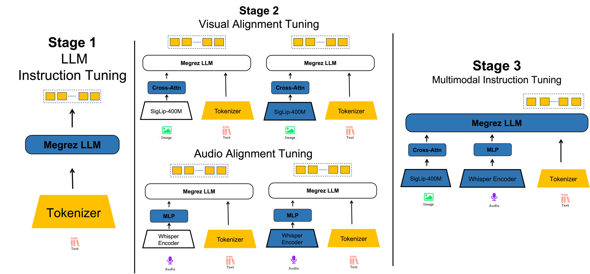

*Figure 2 · [Source](https://arxiv.org/abs/2502.15803)*

Details

**Input → output:** T, I, A → T · **Interaction:** text-output

Megrez-3B-Omni is the multimodal member; Megrez-3B-Instruct is text-only.

**Variants:** Megrez-3B-Omni.

### MiMo-V2-Omni

Shared backbone and dedicated multimodal encoders.

[Project](https://mimo.xiaomi.com/mimo-v2-omni)

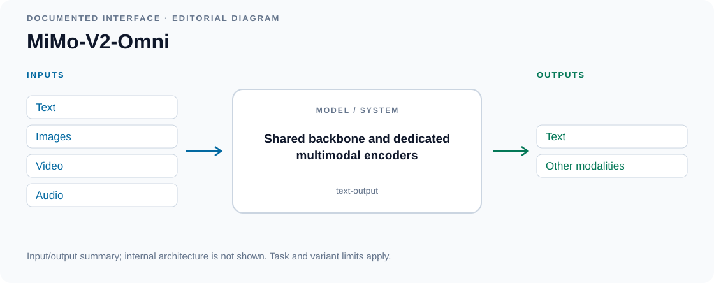

*Input/output diagram · [Source](https://mimo.xiaomi.com/mimo-v2-omni)*

Details

**Input → output:** T, I, V, A → T, X · **Interaction:** text-output

Omni perception with structured tool calls and UI grounding.

Editorial summary of documented inputs and outputs; internal architecture is not shown.

### MiMo-V2.5

Hybrid-attention MoE with vision/audio encoders.

[Model card](https://huggingface.co/XiaomiMiMo/MiMo-V2.5)

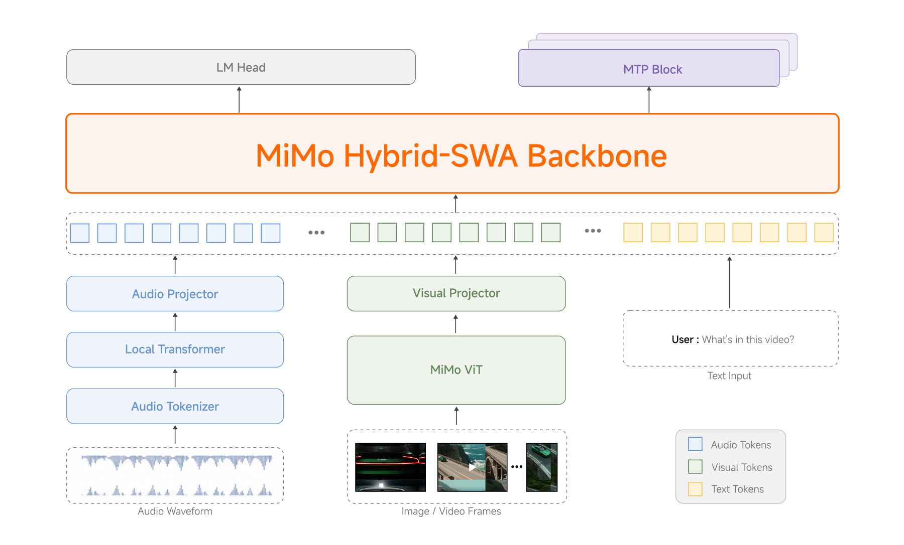

*Official architecture diagram · [Source](https://huggingface.co/XiaomiMiMo/MiMo-V2.5)*

Details

**Input → output:** T, I, V, A → T · **Interaction:** text-output

Native multimodal understanding on the MiMo-V2-Flash backbone.

**Variants:** Base; Instruct.

### Ming-Flash-Omni

Sparse MoE and generative heads.

[Paper](https://arxiv.org/abs/2510.24821)

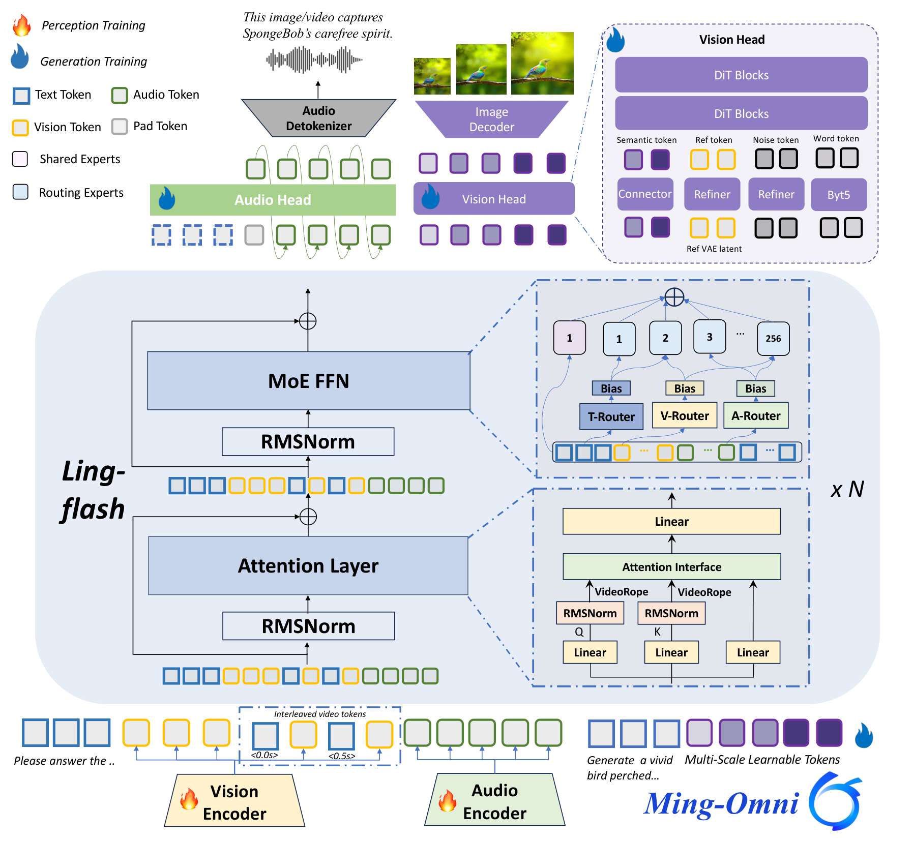

*Figure 2 · [Source](https://arxiv.org/abs/2510.24821)*

Details

**Input → output:** T, I, V, A → T, I, A · **Interaction:** generation

Extends the Ming family with image tasks and joint acoustic generation.

**Variants:** Preview.

### Ming-Flash-Omni 2.0

MoE with continuous autoregression.

[Repository](https://github.com/inclusionAI/Ming)

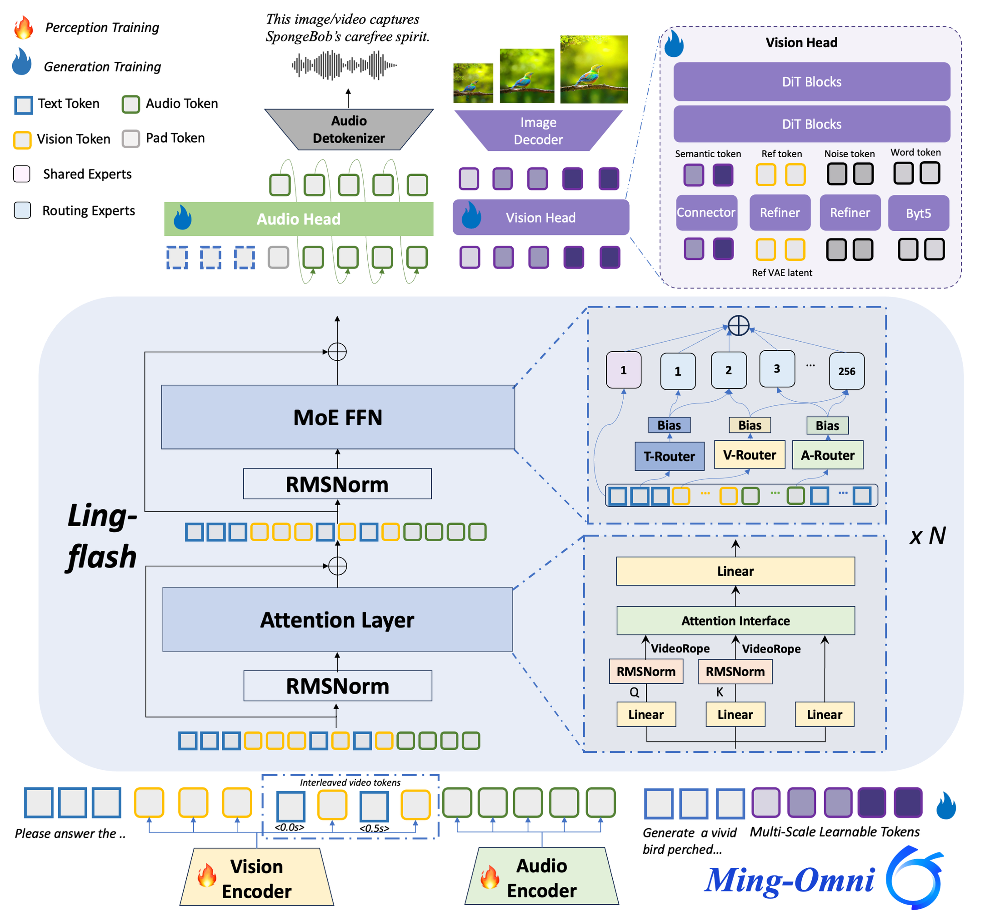

*Official architecture diagram · [Source](https://github.com/inclusionAI/Ming)*

Details

**Input → output:** T, I, V, A → T, I, A · **Interaction:** generation

Supports speech, sound and music synthesis alongside image generation and editing.

**Variants:** 2.0.

### Ming-Omni

Modality-routed MoE and output decoders.

[Paper](https://arxiv.org/abs/2506.09344)

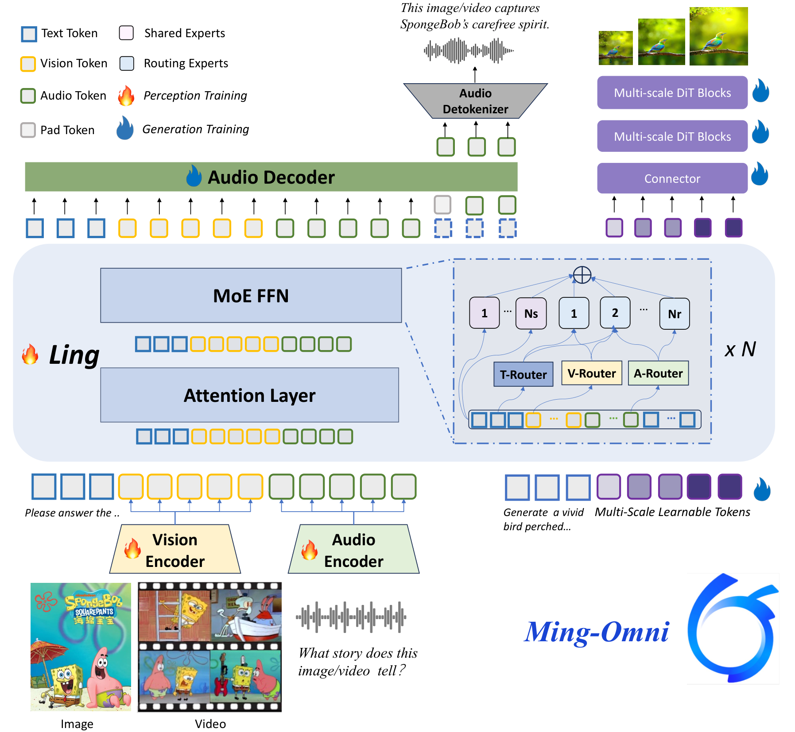

*Figure 2 · [Source](https://arxiv.org/abs/2506.09344)*

Details

**Input → output:** T, I, V, A → T, I, S · **Interaction:** generation

A family supporting perception, speech output and image generation.

**Variants:** Ming-Omni; Ming-lite-omni Preview; v1; v1.5.

### Mini-Omni2

Parallel text/audio generation.

[Paper](https://arxiv.org/abs/2410.11190)

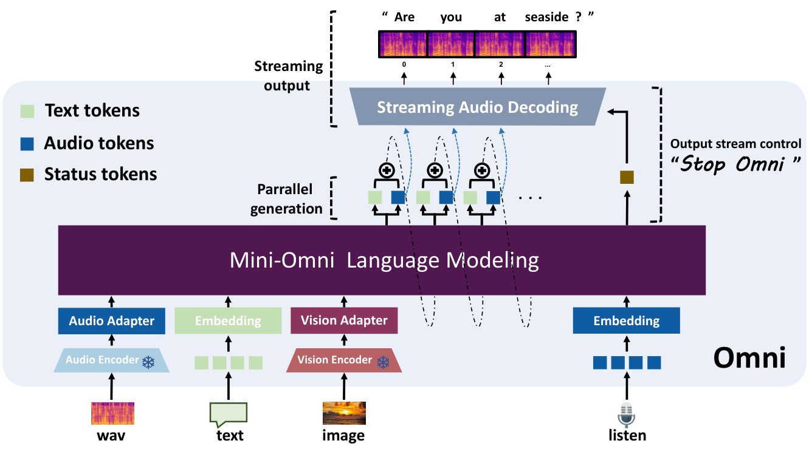

*Figure 1 · [Source](https://arxiv.org/abs/2410.11190)*

Details

**Input → output:** T, I, S → T, S · **Interaction:** full-duplex

Adds visual input and interruption-aware duplex interaction to Mini-Omni.

### MiniCPM-o 2.6

Vision-language backbone and audio modules.

[Repository](https://github.com/OpenBMB/MiniCPM-o)

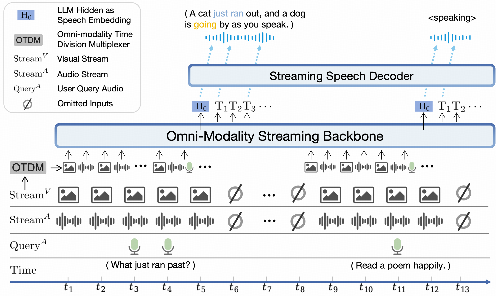

*Official architecture diagram · [Source](https://github.com/OpenBMB/MiniCPM-o)*

Details

**Input → output:** T, I, V, A → T, S · **Interaction:** streaming

The 2.6 omni release supports speech and audiovisual interaction.

**Variants:** 2.6.

### MiniCPM-o 4.5

Full-duplex multimodal interaction.

[Paper](https://arxiv.org/abs/2604.27393)

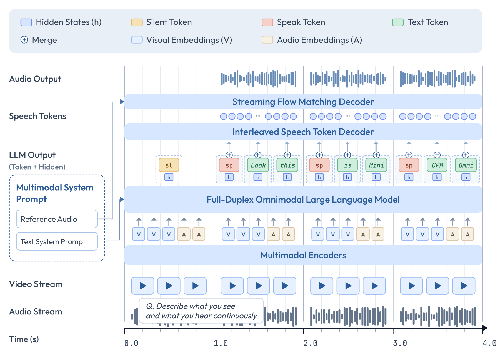

*Figure 4 · [Source](https://arxiv.org/abs/2604.27393)*

Details

**Input → output:** T, I, V, A → T, S · **Interaction:** full-duplex

Adds simultaneous seeing, listening and speaking with proactive behavior.

**Variants:** 4.5.

### MiniMind-O

Thinker–Talker.

[Paper](https://arxiv.org/abs/2605.03937) · [Repository](https://github.com/jingyaogong/minimind-o)

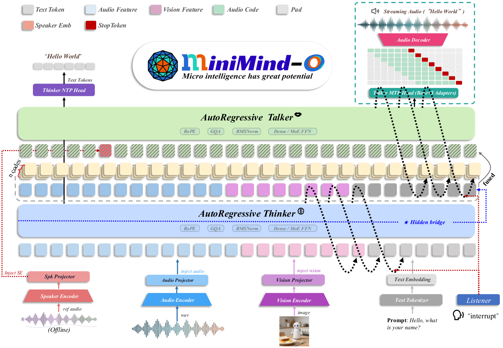

*Figure 1 · [Source](https://arxiv.org/abs/2605.03937)*

Details

**Input → output:** T, I, S → T, S · **Interaction:** streaming

Small speech-native model with frozen speech and vision encoders.

### MIO

Autoregressive multimodal tokens.

[Paper](https://arxiv.org/abs/2409.17692)

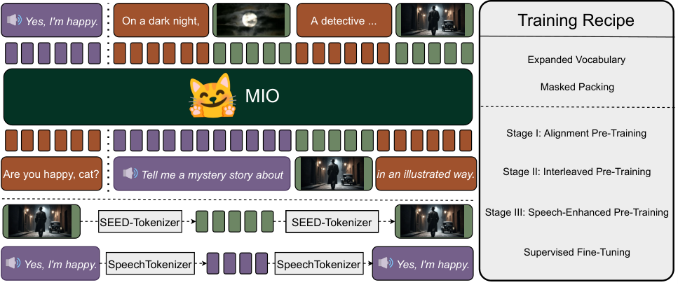

*Figure 1 · [Source](https://arxiv.org/abs/2409.17692)*

Details

**Input → output:** T, I, V, S → T, I, V, S · **Interaction:** generation

Models understanding and generation using discrete multimodal sequences.

### MLLM-Tool

Multimodal encoders and tool-selecting LLM.

[Paper](https://arxiv.org/abs/2401.10727)

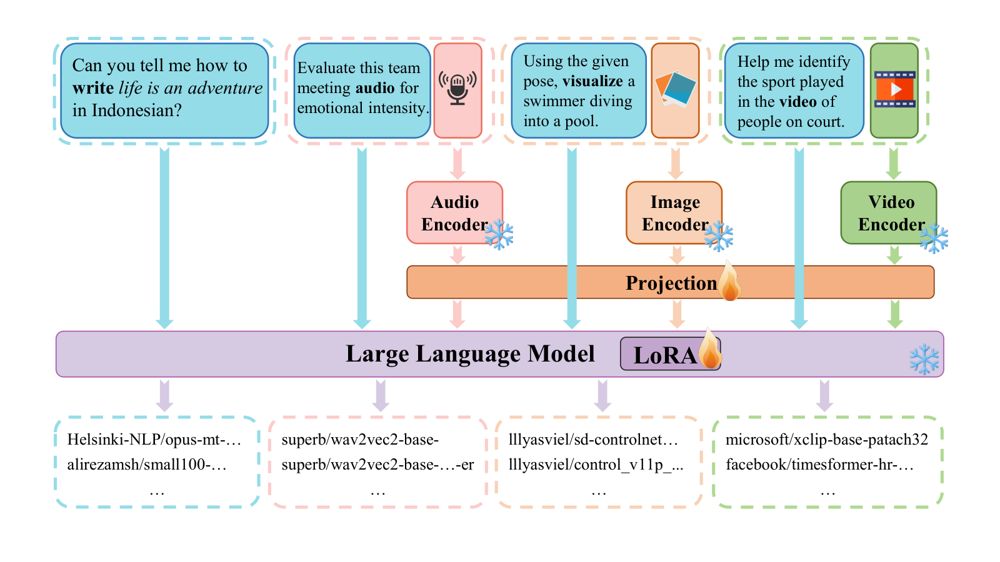

*Figure 4 · [Source](https://arxiv.org/abs/2401.10727)*

Details

**Input → output:** T, I, A → T, X · **Interaction:** system

Selects external tools from visual, auditory and textual instructions.

### ModaVerse

LLM-directed external generators.

[Paper](https://arxiv.org/abs/2401.06395)

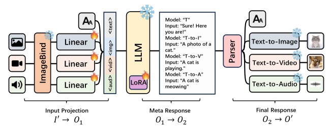

*Figure 3 · [Source](https://arxiv.org/abs/2401.06395)*

Details

**Input → output:** T, I, V, A → T, I, V, A · **Interaction:** system

The language model controls separate modality generators through natural-language instructions.

### ModelCompose

Composition of modality-specific models.

[Paper](https://arxiv.org/abs/2402.12750)

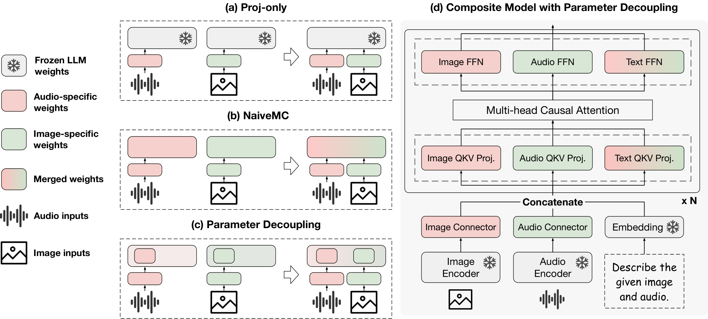

*Figure 2 · [Source](https://arxiv.org/abs/2402.12750)*

Details

**Input → output:** T, I, V, A, X → T · **Interaction:** text-output

Combines existing multimodal language models through parameter composition.

**Variants:** NaiveMC; DAMC.

### MoshiVis

Visual adapters on Moshi.

[Paper](https://arxiv.org/abs/2503.15633)

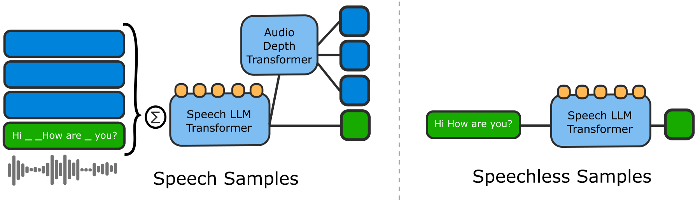

*Figure 3 · [Source](https://arxiv.org/abs/2503.15633)*

Details

**Input → output:** T, I, S → T, S · **Interaction:** full-duplex

Adds image-conditioned conversation to the Moshi speech model.

### MultiPLY

Multisensory embodied LLM.

[Paper](https://arxiv.org/abs/2401.08577)

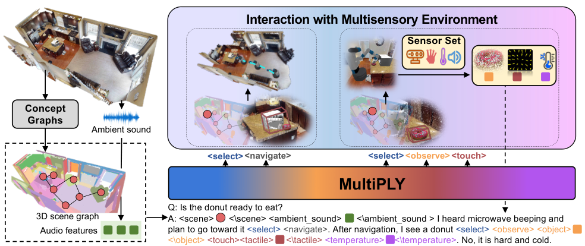

*Figure 3 · [Source](https://arxiv.org/abs/2401.08577)*

Details

**Input → output:** T, I, A, X → T, X · **Interaction:** system

Includes touch, temperature and interaction with objects in a 3D environment.

### MuMu-LLaMA

Multimodal LLM and music generators.

[Paper](https://arxiv.org/abs/2412.06660)

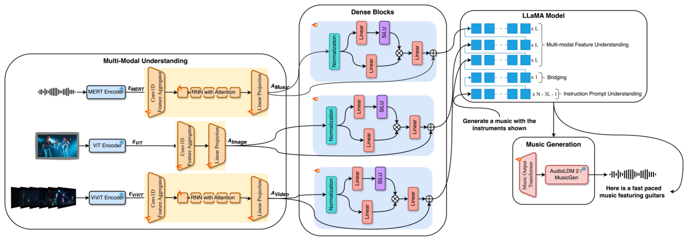

*Figure 2, PDF p. 3 · [Source](https://arxiv.org/abs/2412.06660)*

Details

**Input → output:** T, I, V, M → T, M · **Interaction:** system

Uses AudioLDM 2 and MusicGen for music generation and editing.

### NExT-GPT

Multimodal adapters and diffusion decoders.

[Paper](https://arxiv.org/abs/2309.05519)

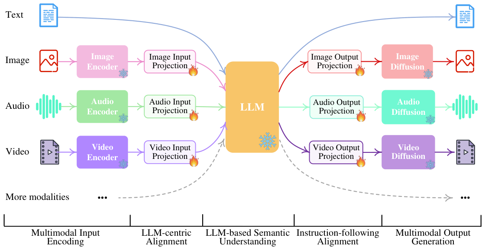

*Figure 1, PDF p. 2 · [Source](https://arxiv.org/abs/2309.05519)*

Details

**Input → output:** T, I, V, A → T, I, V, A · **Interaction:** system

Any-to-any system with pretrained modality-specific generators.

### NExT-OMNI

Discrete flow matching.

[Paper](https://arxiv.org/abs/2510.13721)

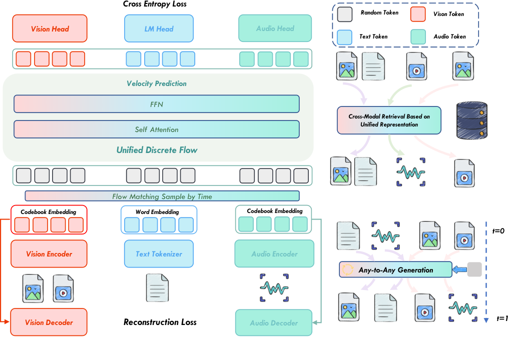

*Figure 2 · [Source](https://arxiv.org/abs/2510.13721)*

Details

**Input → output:** T, I, V, A → T, I, V, A · **Interaction:** generation

Unified understanding and generation with a non-autoregressive multimodal token model.

### Nexus

Configurable encoder–LLM–decoder.

[Paper](https://arxiv.org/abs/2503.01879)

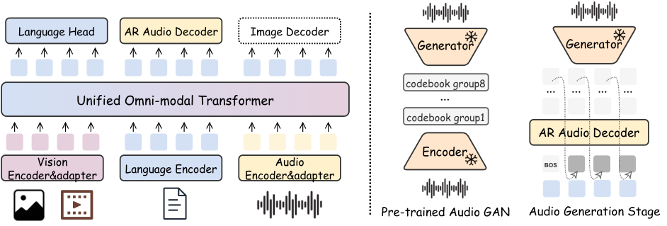

*Figure 1 · [Source](https://arxiv.org/abs/2503.01879)*

Details

**Input → output:** T, I, V, S → T, S · **Interaction:** not-specified

Audio alignment builds on an existing vision-language model; also called Nexus-O.

**Variants:** Nexus-O.

### OISA

Omnimodal instructed segmentation assistant.

[Paper](https://arxiv.org/abs/2507.22886)

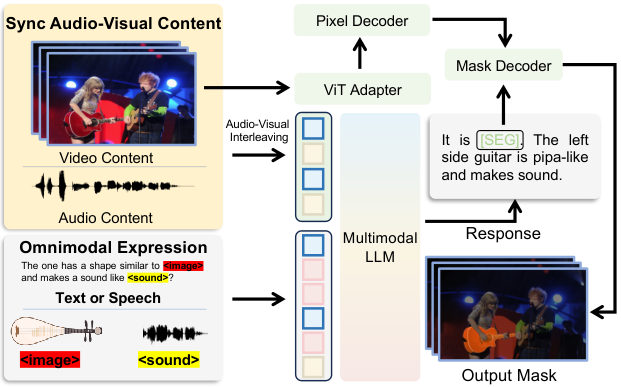

*Figure 4 · [Source](https://arxiv.org/abs/2507.22886)*

Details

**Input → output:** T, I, V, A → T, X · **Interaction:** text-output

The model accompanying OmniAVS; generates reasoning and fine-grained segmentation outputs.

### Ola

Progressive modality alignment.

[Paper](https://arxiv.org/abs/2502.04328)

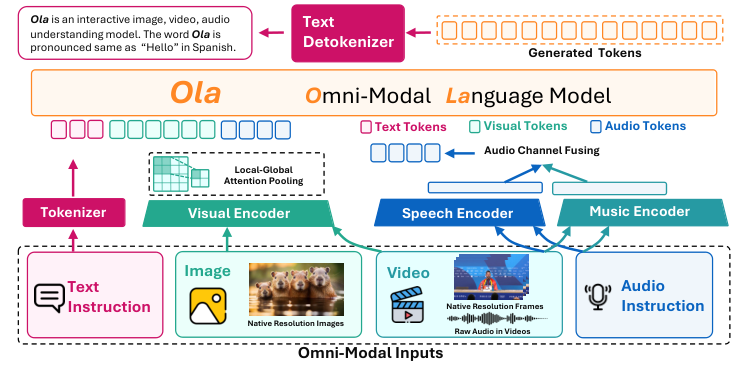

*Figure 3 · [Source](https://arxiv.org/abs/2502.04328)*

Details

**Input → output:** T, I, V, A → T · **Interaction:** text-output

Uses video as a bridge for joint image, video and audio understanding.

### OMCAT

Rotary time embeddings.

[Paper](https://arxiv.org/abs/2410.12109)

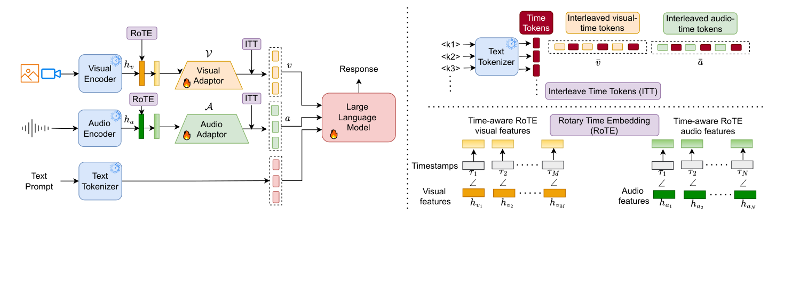

*Figure 2 · [Source](https://arxiv.org/abs/2410.12109)*

Details

**Input → output:** T, V, A → T · **Interaction:** text-output

Learns temporal relationships between events in audio and video.

### Omni-AutoThink

Adaptive SFT and reinforcement learning.

[Paper](https://arxiv.org/abs/2512.03783)

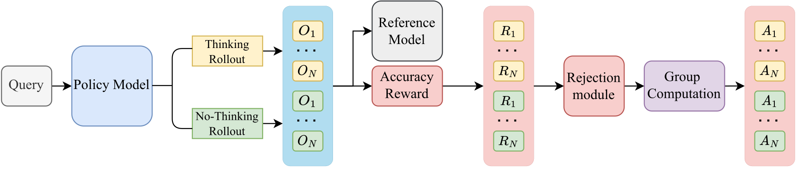

*Figure 1 · [Source](https://arxiv.org/abs/2512.03783)*

Details

**Input → output:** T, I, V, A → T · **Interaction:** text-output

Adjusts reasoning behavior across text, audio and visual tasks.

### Omni-R1 (two-system collaboration)

Global reasoning and detailed grounding.

[Paper](https://arxiv.org/abs/2505.20256)

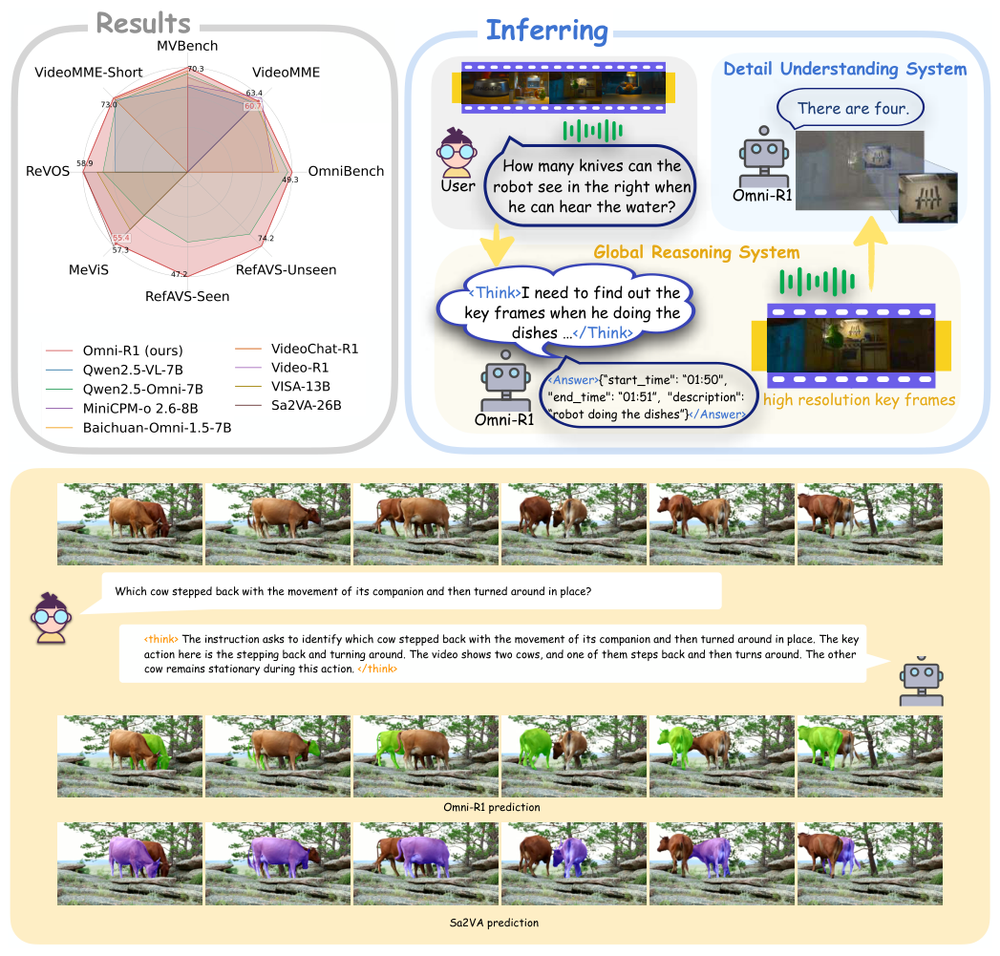

*Figure 1, PDF p. 2 · [Source](https://arxiv.org/abs/2505.20256)*

Details

**Input → output:** T, V, A → T, X · **Interaction:** system

Zhong et al.; couples keyframe selection with pixel-level understanding.

### Omni-RewardModel

Multimodal discriminative/generative reward models.

[Paper](https://arxiv.org/abs/2510.23451)

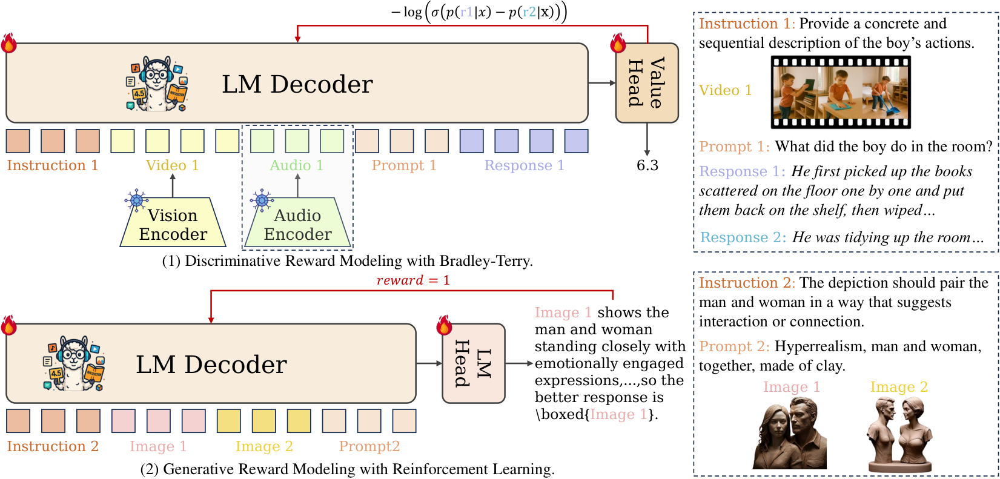

*Figure 2 · [Source](https://arxiv.org/abs/2510.23451)*

Details

**Input → output:** T, I, V, A, X → T, X · **Interaction:** text-output

Scores or explains preferences across modalities; this is an evaluator, not a spoken assistant.

**Variants:** Discriminative; Generative.

### OmniAtlas

Omni agent with tool-integrated reasoning.

[Paper](https://arxiv.org/abs/2602.22897)

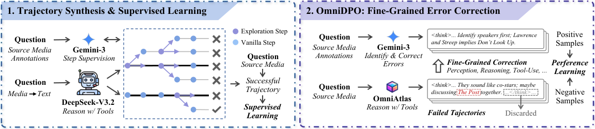

*Figure 4 · [Source](https://arxiv.org/abs/2602.22897)*

Details

**Input → output:** T, I, V, A → T, X · **Interaction:** system

The trained agent accompanying OmniGAIA; OmniGAIA itself is a benchmark.

### OmniVideo-R1

Grounding and modality-aware RL.

[Paper](https://arxiv.org/abs/2602.05847)

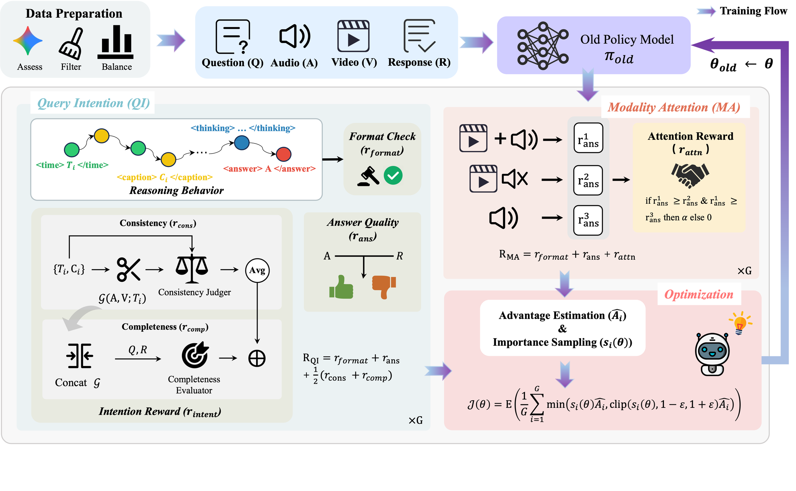

*Figure 2 · [Source](https://arxiv.org/abs/2602.05847)*

Details

**Input → output:** T, V, A → T · **Interaction:** text-output

A reasoning-trained audiovisual model, rather than a new base-model family.

### OmniVinci

OmniAlignNet and temporal embeddings.

[Paper](https://arxiv.org/abs/2510.15870)

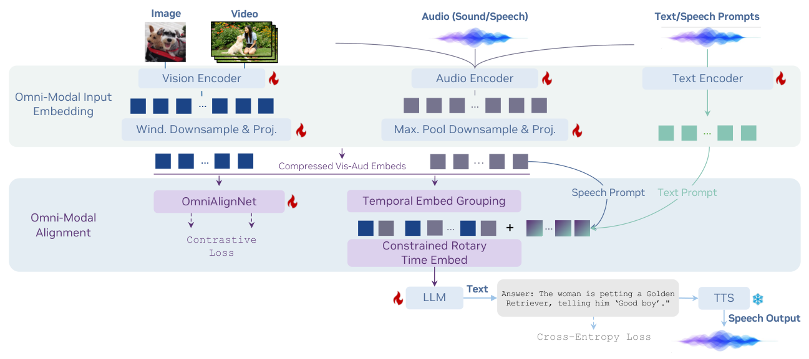

*Figure 2 · [Source](https://arxiv.org/abs/2510.15870)*

Details

**Input → output:** T, I, V, A → T · **Interaction:** text-output

The primary report centers on multimodal understanding; no speech output is asserted here.

### OneLLM

Unified encoder and universal projection.

[Paper](https://arxiv.org/abs/2312.03700)

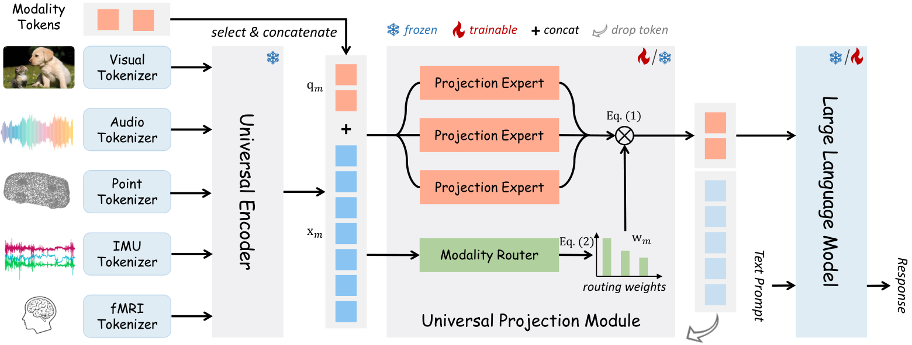

*Figure 2 · [Source](https://arxiv.org/abs/2312.03700)*

Details

**Input → output:** T, I, V, A, X → T · **Interaction:** text-output

Aligns eight modalities with a language model, including point clouds and sensor signals.

### OpenOmni

Progressive alignment and emotional speech decoder.

[Paper](https://arxiv.org/abs/2501.04561)

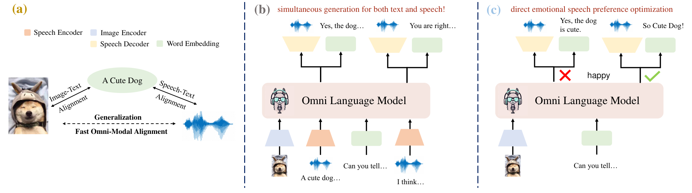

*Figure 1 · [Source](https://arxiv.org/abs/2501.04561)*

Details

**Input → output:** T, I, S → T, S · **Interaction:** streaming

Supports emotional speech output; unrelated to the Omni-Emotion paper.

### PandaGPT

ImageBind and language adapters.

[Paper](https://arxiv.org/abs/2305.16355)

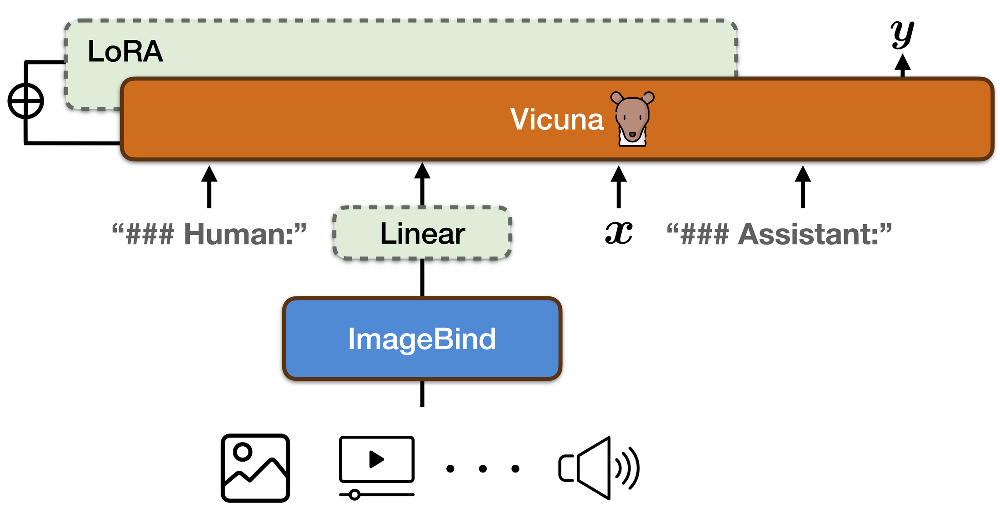

*Figure 1 · [Source](https://arxiv.org/abs/2305.16355)*

Details

**Input → output:** T, I, V, A, X → T · **Interaction:** text-output

Uses shared multimodal representations for instruction-following.

**Variants:** 7B; 13B.

### PathWeave

Continual modality adapters and routing.

[Paper](https://arxiv.org/abs/2410.20178)

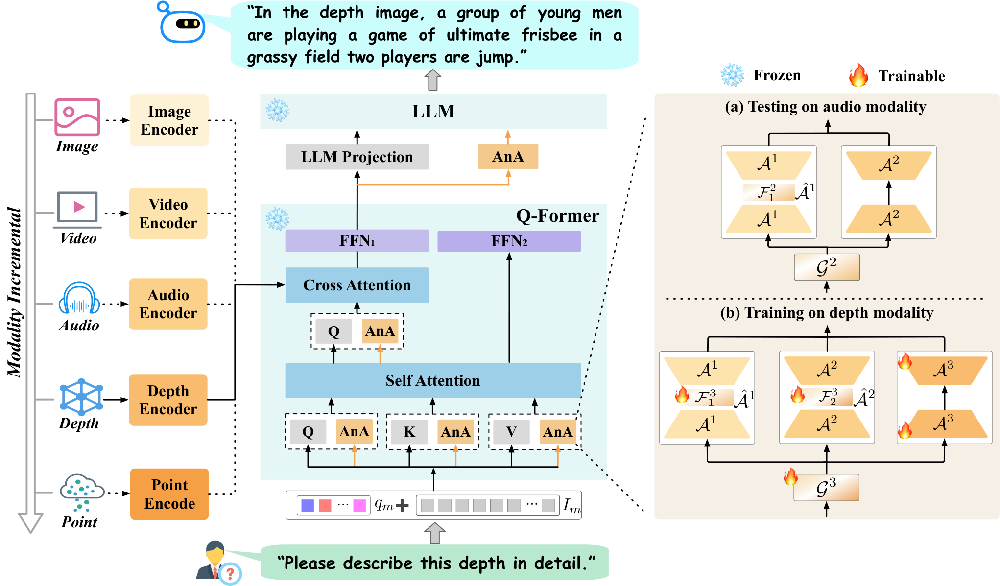

*Figure 2 · [Source](https://arxiv.org/abs/2410.20178)*

Details

**Input → output:** T, I, V, A, X → T · **Interaction:** text-output

Adds modalities incrementally instead of retraining all modalities jointly.

### Phi-4-multimodal

Mixture of LoRAs.

[Paper](https://arxiv.org/abs/2503.01743)

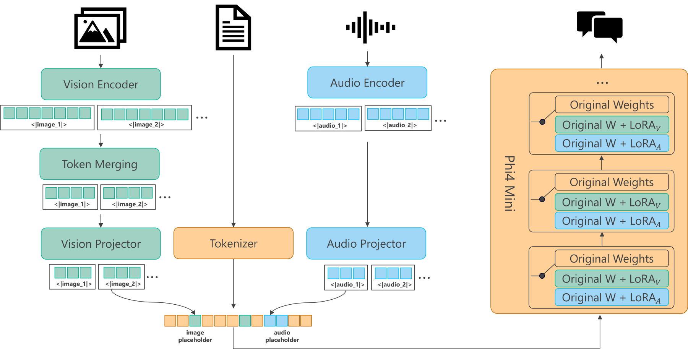

*Figure 1 · [Source](https://arxiv.org/abs/2503.01743)*

Details

**Input → output:** T, I, A → T · **Interaction:** text-output

The multimodal release accepts audio and vision; Phi-4-mini is a separate text model.

**Variants:** Phi-4-multimodal-instruct.

### Qwen2.5-Omni

Thinker–Talker and time-aligned RoPE.

[Paper](https://arxiv.org/abs/2503.20215)

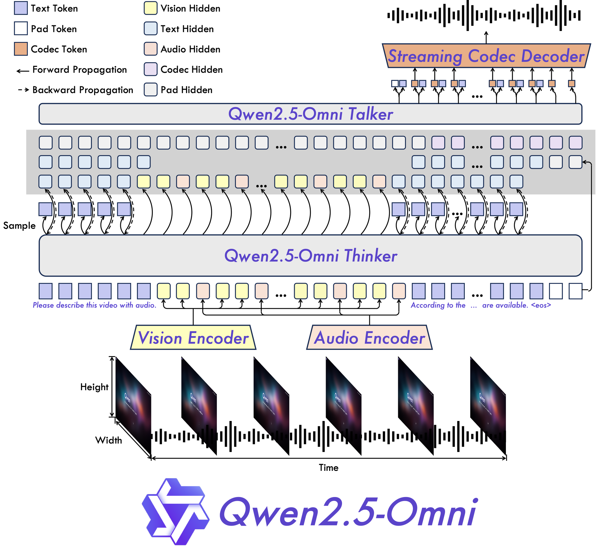

*Figure 2 · [Source](https://arxiv.org/abs/2503.20215)*

Details

**Input → output:** T, I, V, A → T, S · **Interaction:** streaming

Processes audiovisual inputs and produces streaming speech with text.

**Variants:** 3B; 7B.

### Qwen3-Omni

Thinker–Talker MoE.

[Paper](https://arxiv.org/abs/2509.17765)

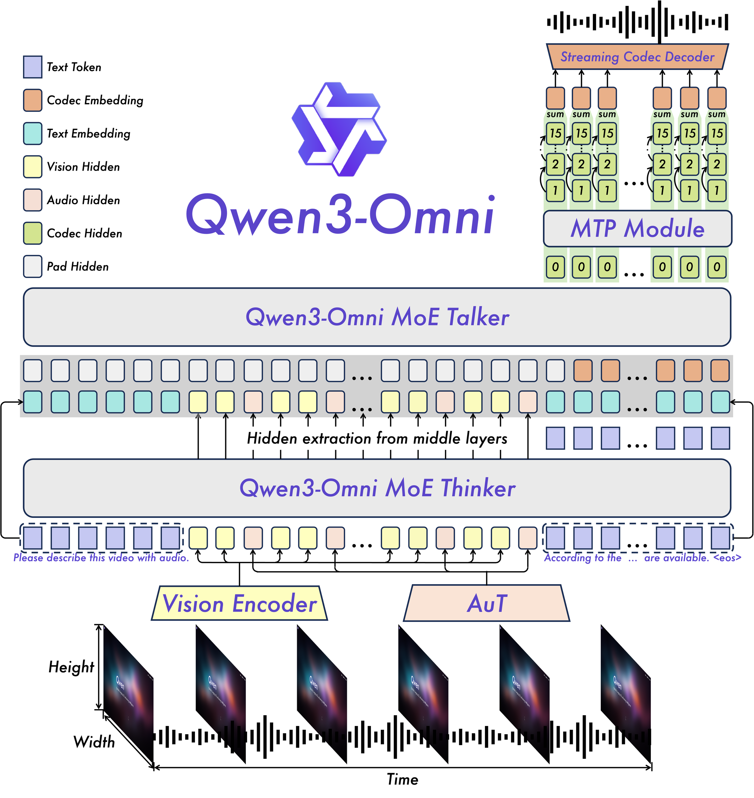

*Figure 2 · [Source](https://arxiv.org/abs/2509.17765)*

Details

**Input → output:** T, I, V, A → T, S · **Interaction:** streaming

Speech output depends on variant; the Captioner is an audio-to-text specialization.

**Variants:** 30B-A3B-Instruct; 30B-A3B-Thinking; 30B-A3B-Captioner.

### Qwen3.5-Omni

Hybrid-attention MoE and ARIA.

[Paper](https://arxiv.org/abs/2604.15804)

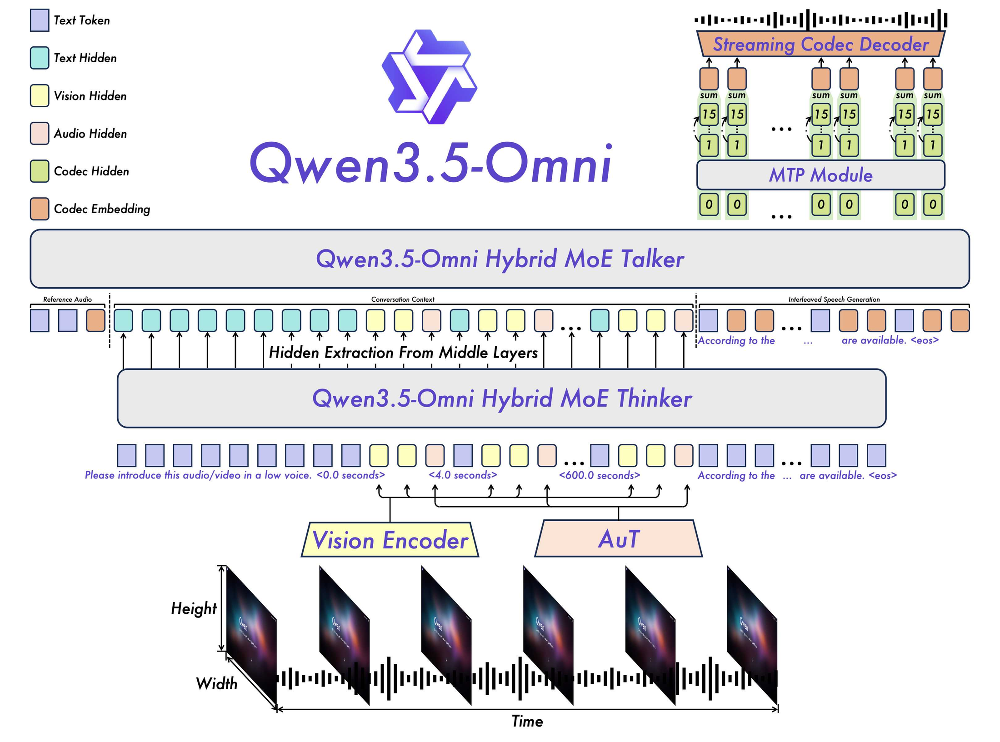

*Figure 2 · [Source](https://arxiv.org/abs/2604.15804)*

Details

**Input → output:** T, I, V, A → T, S · **Interaction:** streaming

Report describes the Plus model; a technical report does not establish open-weight availability.

**Variants:** Qwen3.5-Omni-Plus.

### R1-Omni

Reinforcement learning for emotion reasoning.

[Paper](https://arxiv.org/abs/2503.05379)

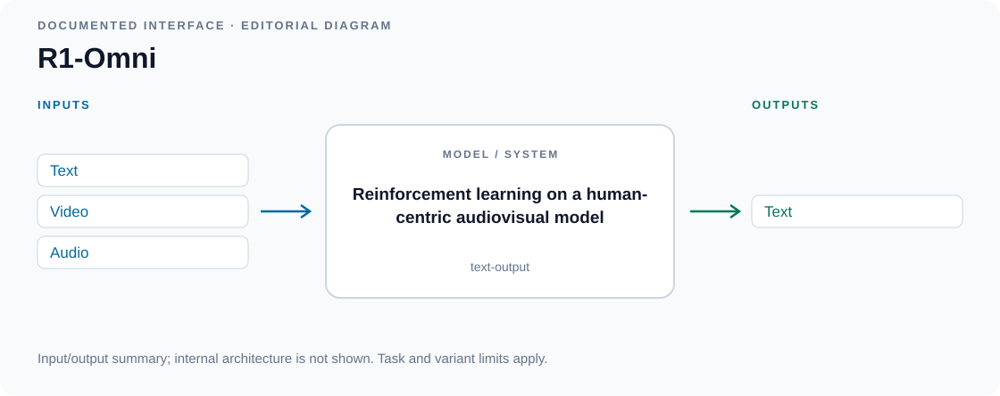

*Input/output diagram · [Source](https://arxiv.org/abs/2503.05379)*

Details

**Input → output:** T, V, A → T · **Interaction:** text-output

HumanOmni-based emotion reasoning; distinct from the papers named Omni-R1.

Editorial summary of documented inputs and outputs; internal architecture is not shown.

### Ref-Thinker / TGS-Agent

Think–Ground–Segment pipeline.

[Paper](https://arxiv.org/abs/2508.04418)

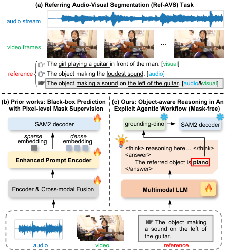

*Figure 1 · [Source](https://arxiv.org/abs/2508.04418)*

Details

**Input → output:** T, V, A → T, X · **Interaction:** system

Ref-Thinker reasons over the reference; Grounding-DINO and SAM2 localize and segment it.

**Variants:** Ref-Thinker; TGS-Agent system.

### RoboEgo

Streaming omnimodal interaction.

[Paper](https://arxiv.org/abs/2506.01934)

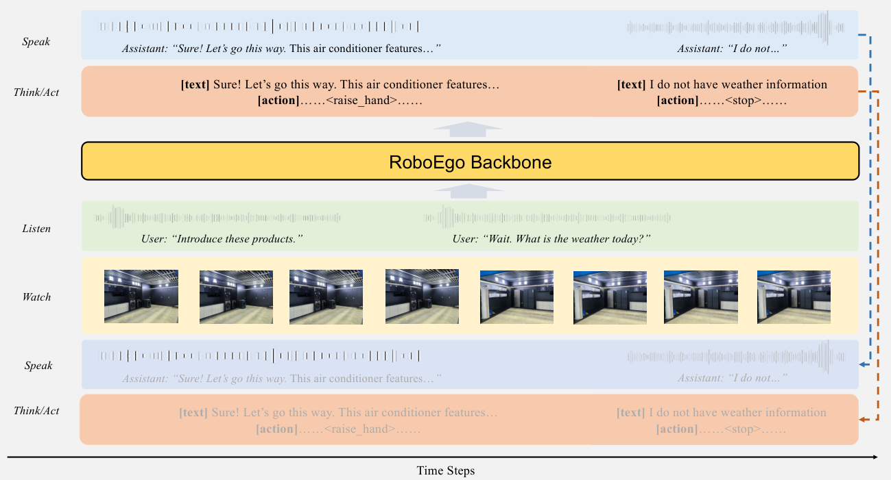

*Figure 2 · [Source](https://arxiv.org/abs/2506.01934)*

Details

**Input → output:** T, V, A → T, S · **Interaction:** full-duplex

System-card description of a native duplex model, also called FLM-Ego.

**Variants:** FLM-Ego.

### RoboOmni

Perceiver–Thinker–Talker–Executor.

[Paper](https://arxiv.org/abs/2510.23763)

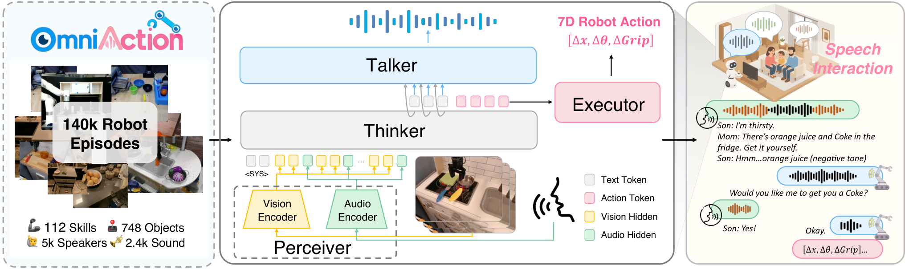

*Figure 4 · [Source](https://arxiv.org/abs/2510.23763)*

Details

**Input → output:** T, I, V, A → T, S, X · **Interaction:** system

Robot system combines multimodal intent recognition, spoken confirmation and actions.

### SAVEnVideo

Synergistic audio-visual integration.

[Paper](https://arxiv.org/abs/2411.16213)

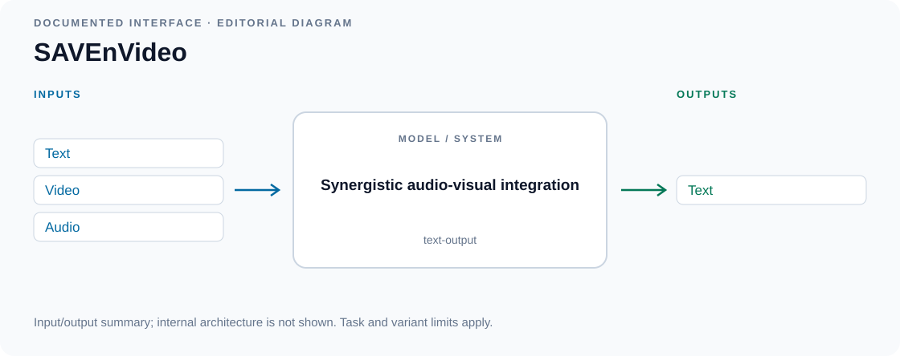

*Input/output diagram · [Source](https://arxiv.org/abs/2411.16213)*

Details

**Input → output:** T, V, A → T · **Interaction:** text-output

The video model introduced with SAVEn-Vid; the dataset is not counted separately.

Editorial summary of documented inputs and outputs; internal architecture is not shown.

### Seed2.0 Lite (audio update)

Omni understanding model.

[Project](https://seed.bytedance.com/en/seed2)

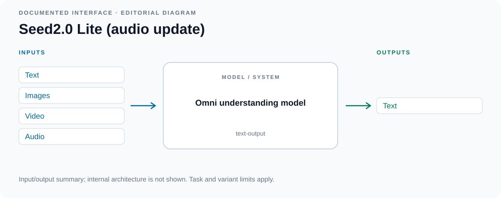

*Input/output diagram · [Source](https://seed.bytedance.com/en/seed2)*

Details

**Input → output:** T, I, V, A → T · **Interaction:** text-output

The late-April update adds audio to Lite; the same claim is not applied to every Seed2.0 size.

Editorial summary of documented inputs and outputs; internal architecture is not shown.

**Variants:** Seed2.0 Lite audio-capable update.

### SeedRealtime

Native synchronized audio-visual interaction.

[Announcement](https://seed.bytedance.com/en/blog/seedrealtime-audio-visual-full-duplex-llm-released-toward-omni-modal-natural-interaction)

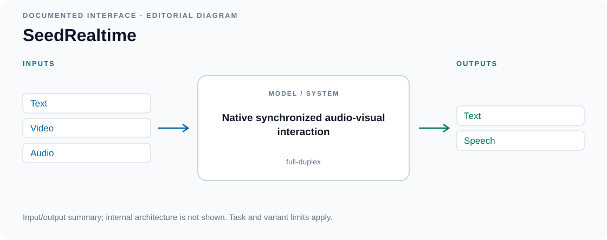

*Input/output diagram · [Source](https://seed.bytedance.com/en/blog/seedrealtime-audio-visual-full-duplex-llm-released-toward-omni-modal-natural-interaction)*

Details

**Input → output:** T, V, A → T, S · **Interaction:** full-duplex

Continuously combines watching, listening and spoken responses with proactive timing.

Editorial summary of documented inputs and outputs; internal architecture is not shown.

### ShizhenGPT

Domain-specific multimodal LLM.

[Paper](https://arxiv.org/abs/2508.14706)

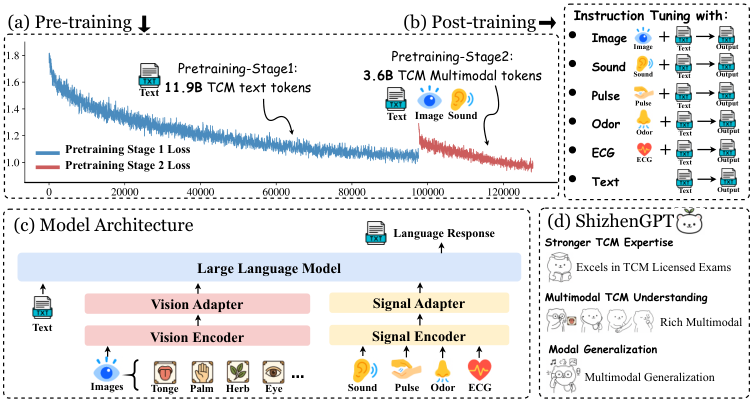

*Figure 2 · [Source](https://arxiv.org/abs/2508.14706)*

Details

**Input → output:** T, I, A, X → T · **Interaction:** text-output

Traditional Chinese medicine research model with images, audio and physiological signals.

### SOLAMI

Social vision-language-action modeling.

[Paper](https://arxiv.org/abs/2412.00174)

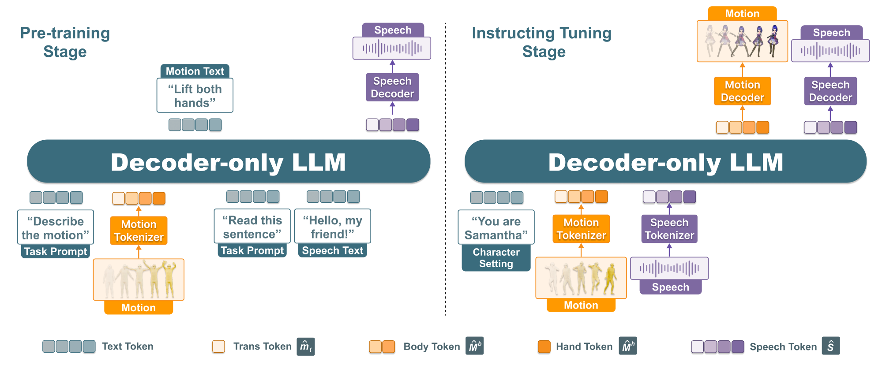

*Figure 2 · [Source](https://arxiv.org/abs/2412.00174)*

Details

**Input → output:** T, V, S, X → S, X · **Interaction:** system

Generates speech and motion for embodied social interaction.

### Spider

LLM and decoder controller.

[Paper](https://arxiv.org/abs/2411.09439)

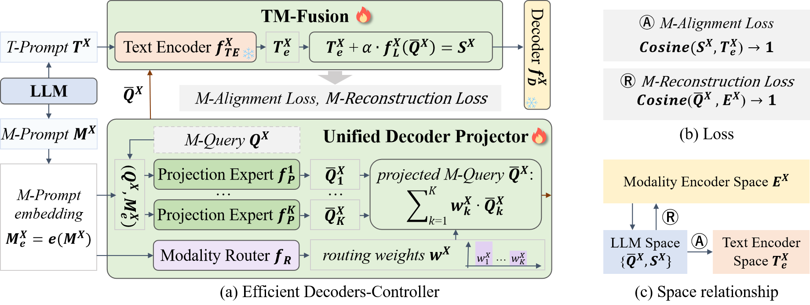

*Figure 2 · [Source](https://arxiv.org/abs/2411.09439)*

Details

**Input → output:** T, I, V, A → T, I, V, A · **Interaction:** system

Coordinates multiple output modalities within a single response.

### ST-Omni-R1

Spatial audio-visual reasoning and RL.

[Paper](https://arxiv.org/abs/2608.09435)

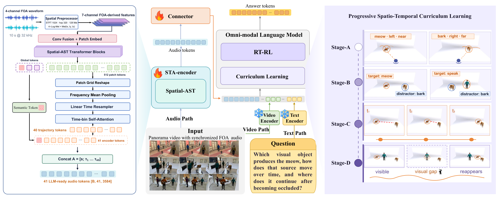

*Figure 2 · [Source](https://arxiv.org/abs/2608.09435)*

Details

**Input → output:** T, V, A → T, X · **Interaction:** text-output

Uses panoramic video and spatial audio for sound-source reasoning and localization.

### Stream-Omni

Modality-specific alignment.

[Paper](https://arxiv.org/abs/2506.13642)

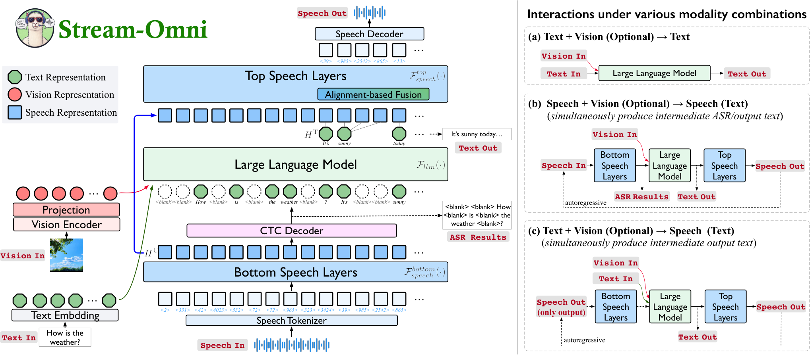

*Figure 2 · [Source](https://arxiv.org/abs/2506.13642)*

Details

**Input → output:** T, I, V, S → T, S · **Interaction:** streaming

Supports simultaneous multimodal interactions with text, vision and speech.

### TDC-Video

Temporal context compression.

[Paper](https://arxiv.org/abs/2504.10443)

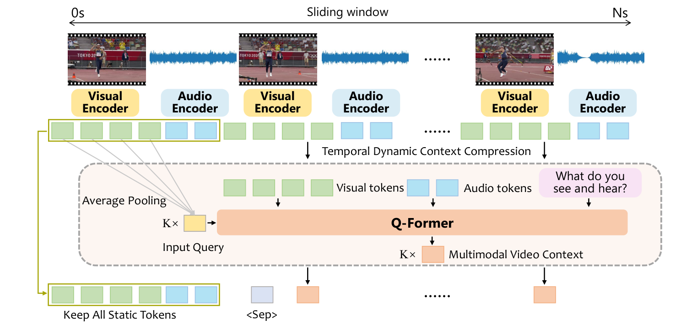

*Figure 2 · [Source](https://arxiv.org/abs/2504.10443)*

Details

**Input → output:** T, V, A → T · **Interaction:** text-output

Combines audio-visual tokens with compact temporal context for long videos.

### TEAL

Shared discrete token embeddings.

[Paper](https://arxiv.org/abs/2311.04589)

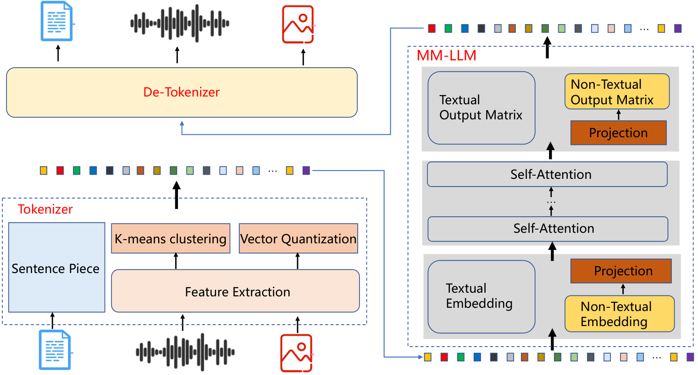

*Figure 1 · [Source](https://arxiv.org/abs/2311.04589)*

Details

**Input → output:** T, I, S → T, I, S · **Interaction:** generation

Treats multiple input and output modalities as token sequences.

### TriSense

Query-based multimodal connector.

[Paper](https://arxiv.org/abs/2505.18110)

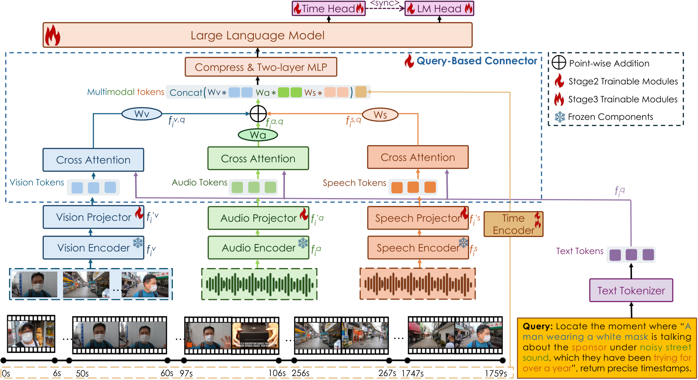

*Figure 4 · [Source](https://arxiv.org/abs/2505.18110)*

Details

**Input → output:** T, V, A → T, X · **Interaction:** text-output

Jointly models visual, sound and speech cues for temporal video understanding.

### Uni-MoE

Modality encoders and sparse MoE.

[Paper](https://arxiv.org/abs/2405.11273)

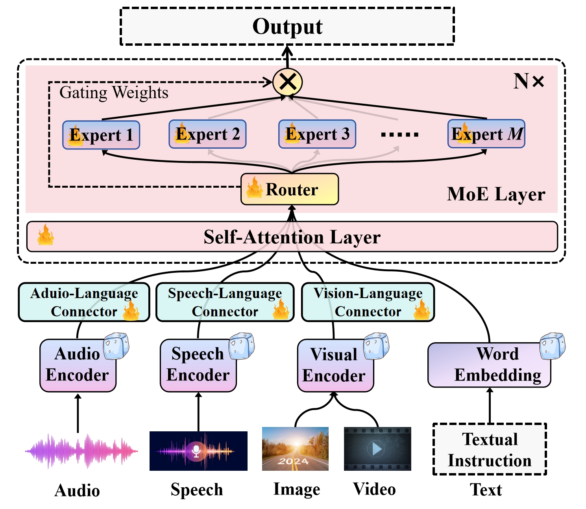

*Figure 1 · [Source](https://arxiv.org/abs/2405.11273)*

Details

**Input → output:** T, I, V, A → T · **Interaction:** text-output

Routes multimodal representations through specialized experts.

### Uni-MoE 2.0 Omni

Dynamic-capacity MoE and multimodal RoPE.

[Paper](https://arxiv.org/abs/2511.12609)

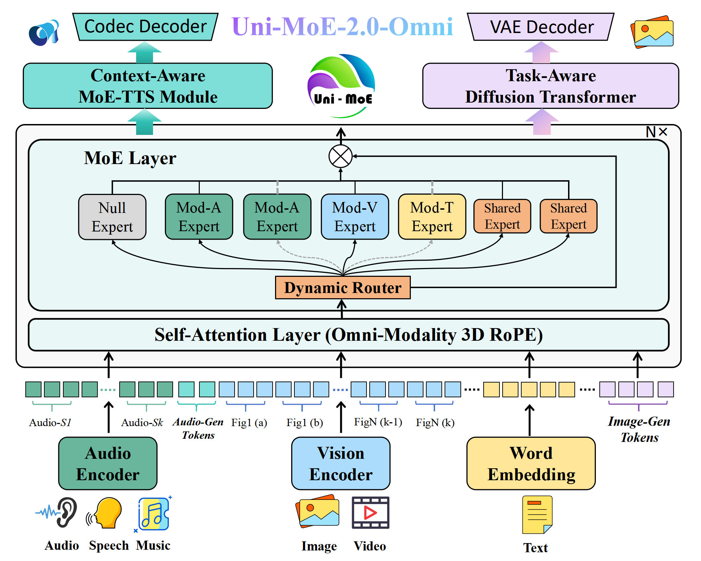

*Figure 2 · [Source](https://arxiv.org/abs/2511.12609)*

Details

**Input → output:** T, I, V, A, X → T, I, S · **Interaction:** generation

Adds image and speech generation to the Lychee/Uni-MoE line.

**Variants:** Uni-MoE-2.0-Omni.

### Unified-IO 2

Shared-token encoder–decoder.

[Paper](https://arxiv.org/abs/2312.17172)

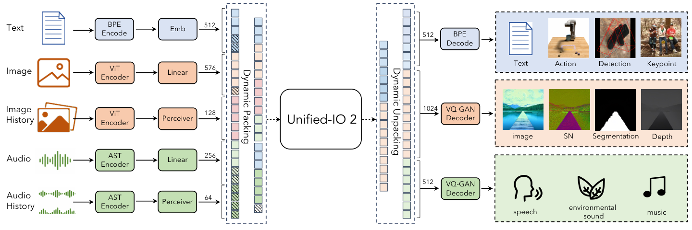

*Figure 2 · [Source](https://arxiv.org/abs/2312.17172)*

Details

**Input → output:** T, I, V, A, X → T, I, A, X · **Interaction:** generation

Supports text, images, audio, localization and actions in one autoregressive framework.

### UnifiedMLLM

Unified task representation.

[Paper](https://arxiv.org/abs/2408.02503)

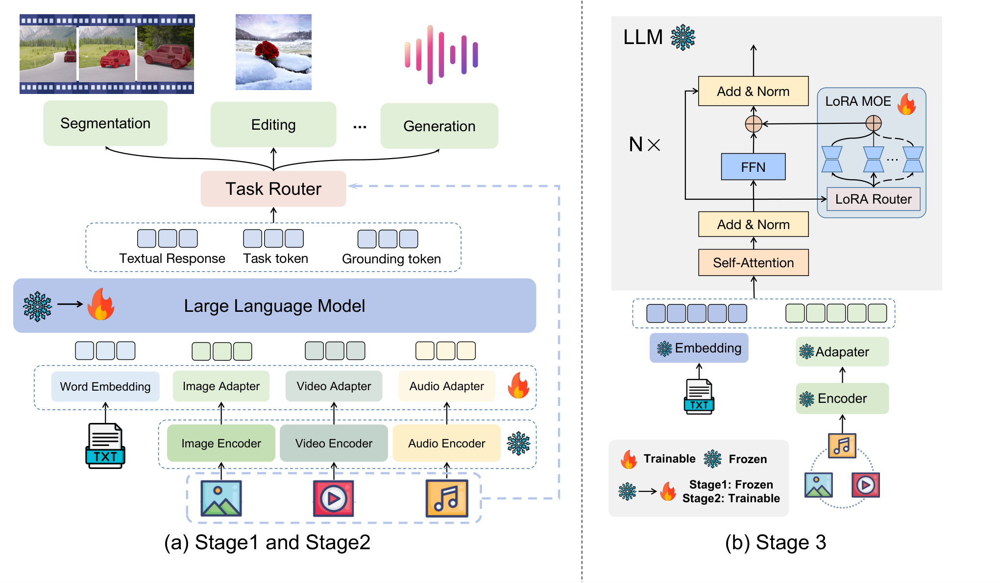

*Figure 2 · [Source](https://arxiv.org/abs/2408.02503)*

Details

**Input → output:** T, I, V, A → T, X · **Interaction:** system

Uses a language model to coordinate multimodal tasks and task-specific output modules.

### Video-LLaMA

Visual and audio Q-Formers.

[Paper](https://arxiv.org/abs/2306.02858)

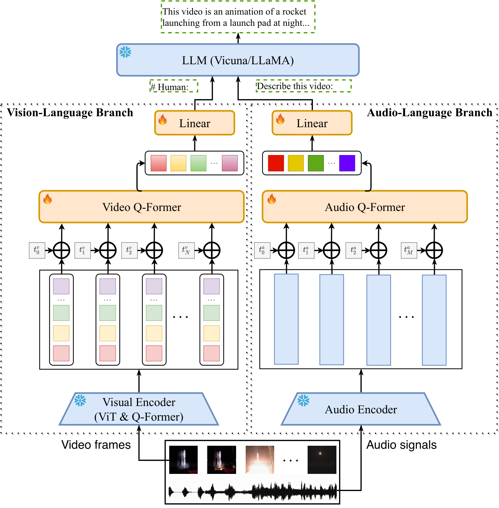

*Figure 1 · [Source](https://arxiv.org/abs/2306.02858)*

Details

**Input → output:** T, V, A → T · **Interaction:** text-output

The original audiovisual release; audio/video support varies across successor families.

### video-SALMONN

Multi-resolution causal Q-Former.

[Paper](https://arxiv.org/abs/2406.15704)

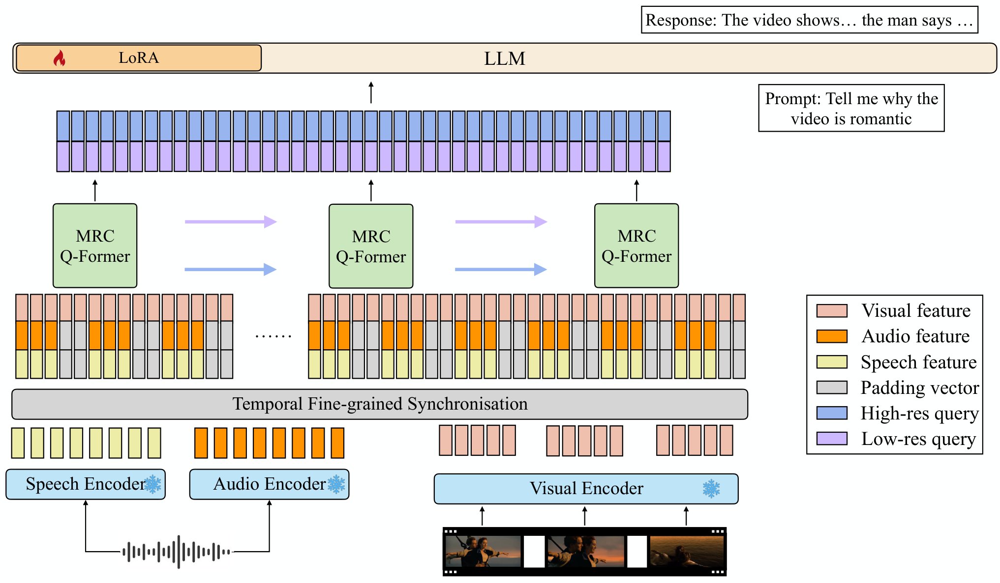

*Figure 1 · [Source](https://arxiv.org/abs/2406.15704)*

Details

**Input → output:** T, V, A → T · **Interaction:** text-output

Combines speech, audio events and visual frames for video understanding.

### video-SALMONN 2

Caption training and multi-round DPO.

[Paper](https://arxiv.org/abs/2506.15220)

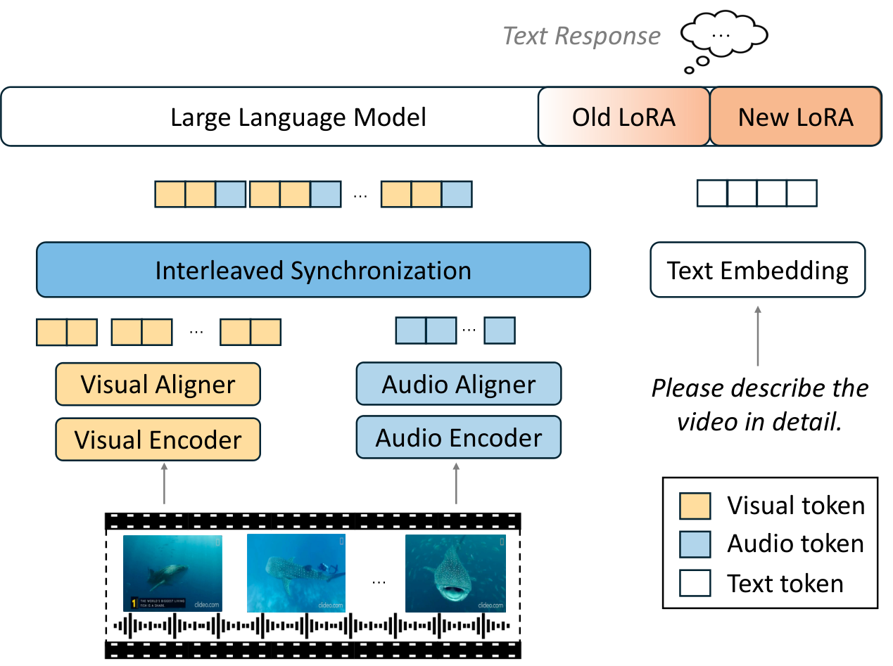

*Figure 1 · [Source](https://arxiv.org/abs/2506.15220)*

Details

**Input → output:** T, V, A → T · **Interaction:** text-output

Caption-enhanced family with audiovisual question answering.

**Variants:** 2; 2F; 2+ (3B/7B/72B).

### video-SALMONN-o1

Reasoning data and process DPO.

[Paper](https://arxiv.org/abs/2502.11775)

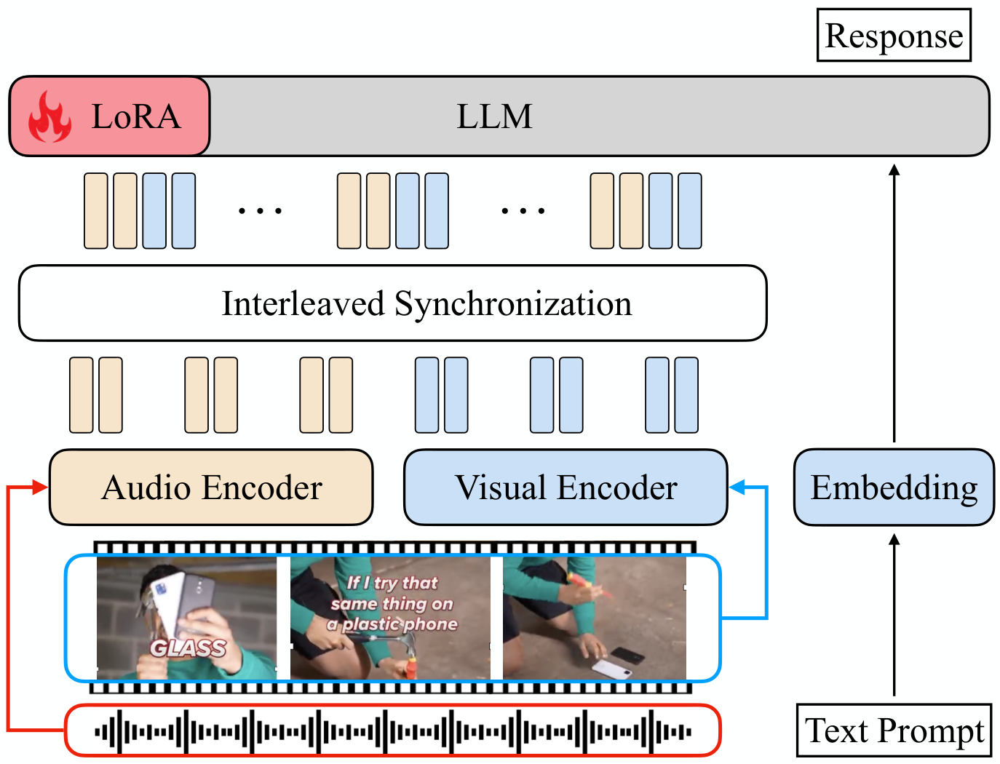

*Figure 1 · [Source](https://arxiv.org/abs/2502.11775)*

Details

**Input → output:** T, V, A → T · **Interaction:** text-output

Adds explicit reasoning to audiovisual understanding.

### VideoLLaMA 2

Spatial-temporal connector and audio branch.

[Paper](https://arxiv.org/abs/2406.07476)

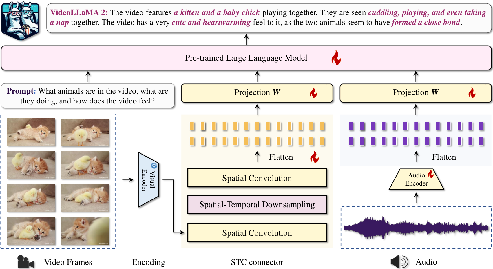

*Figure 1 · [Source](https://arxiv.org/abs/2406.07476)*

Details

**Input → output:** T, I, V, A → T · **Interaction:** text-output

Use the audiovisual checkpoints when audio input is required.

### VideoPoet

Decoder-only multimodal token language model.

[Paper](https://arxiv.org/abs/2312.14125)

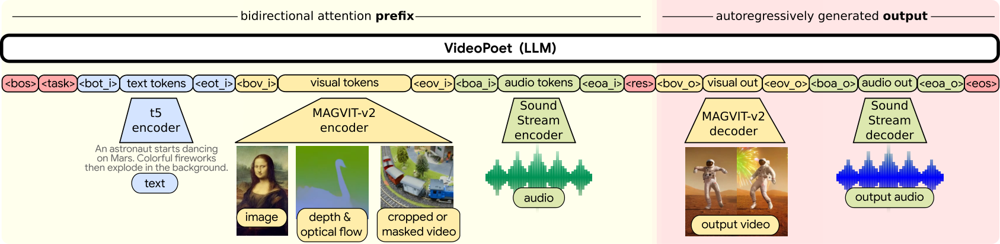

*Figure 2 · [Source](https://arxiv.org/abs/2312.14125)*

Details

**Input → output:** T, I, V, A → V, A · **Interaction:** generation

Autoregressively generates video and matching audio from multimodal conditioning.

### VITA

Omni understanding and external speech synthesis.

[Paper](https://arxiv.org/abs/2408.05211)

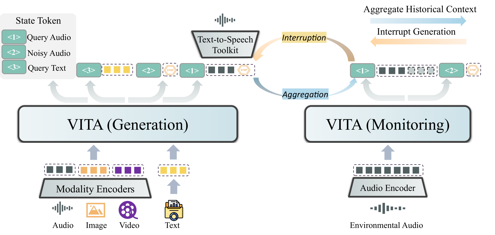

*Figure 2 · [Source](https://arxiv.org/abs/2408.05211)*

Details

**Input → output:** T, I, V, A → T · **Interaction:** system

The original system uses a separate speech synthesis component; model output is listed as text.

### VITA-1.5

Integrated vision and speech interaction.

[Paper](https://arxiv.org/abs/2501.01957)

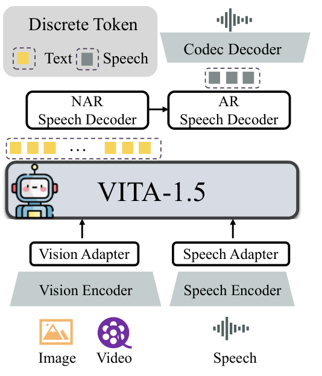

*Figure 2 · [Source](https://arxiv.org/abs/2501.01957)*

Details

**Input → output:** T, I, V, A → T, S · **Interaction:** streaming

Extends the VITA line toward real-time speech generation.

### WorldGPT

Multimodal LLM world modeling.

[Paper](https://arxiv.org/abs/2404.18202)

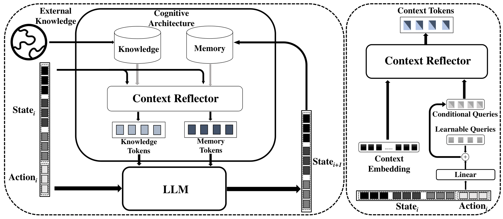

*Figure 4 · [Source](https://arxiv.org/abs/2404.18202)*

Details

**Input → output:** T, I, V, A → T, I, A · **Interaction:** system

Predicts multimodal state transitions with memory and retrieval components.

### X-InstructBLIP

Instruction-aware modality projections.

[Paper](https://arxiv.org/abs/2311.18799)

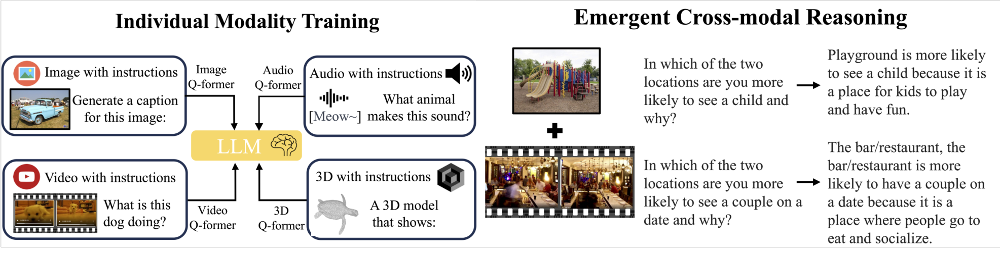

*Figure 1 · [Source](https://arxiv.org/abs/2311.18799)*

Details

**Input → output:** T, I, V, A, X → T · **Interaction:** text-output

Aligns image, video, audio and 3D encoders to a frozen language model.

### X-LLM

Modality-to-language interfaces.

[Paper](https://arxiv.org/abs/2305.04160)

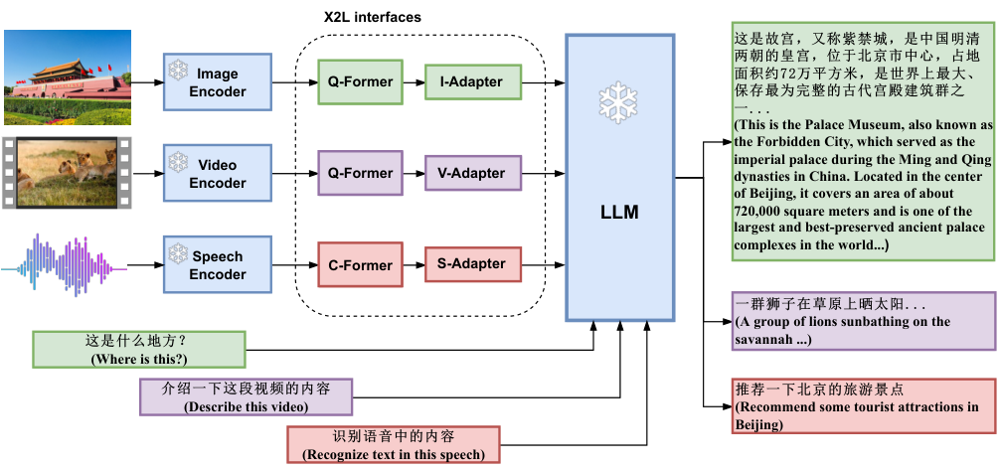

*Figure 1 · [Source](https://arxiv.org/abs/2305.04160)*

Details

**Input → output:** T, I, V, S → T · **Interaction:** text-output

Connects frozen encoders with ChatGLM for multimodal instruction-following.

### X-VILA

Encoders, LLM and diffusion decoders.

[Paper](https://arxiv.org/abs/2405.19335)

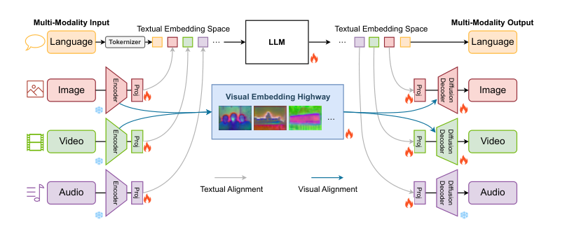

*Figure 2 · [Source](https://arxiv.org/abs/2405.19335)*

Details

**Input → output:** T, I, V, A → T, I, V, A · **Interaction:** system

Cross-modality alignment with a visual information pathway.

