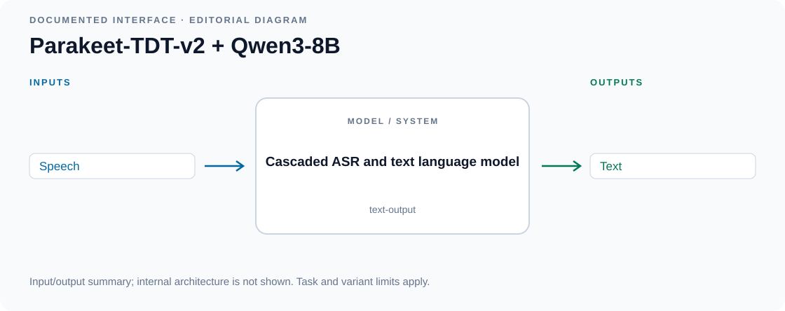
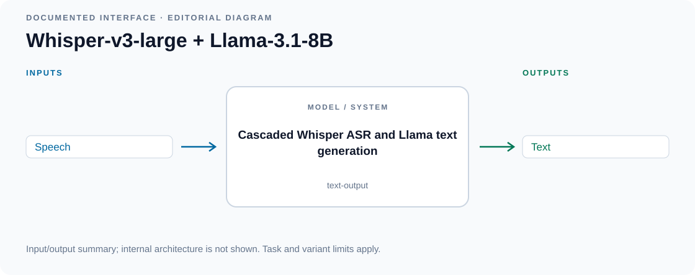
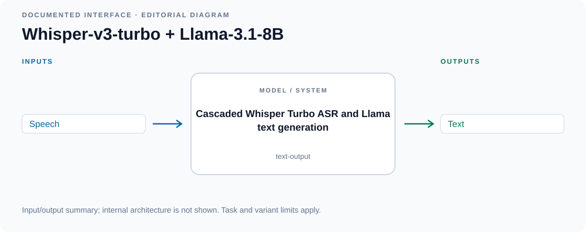
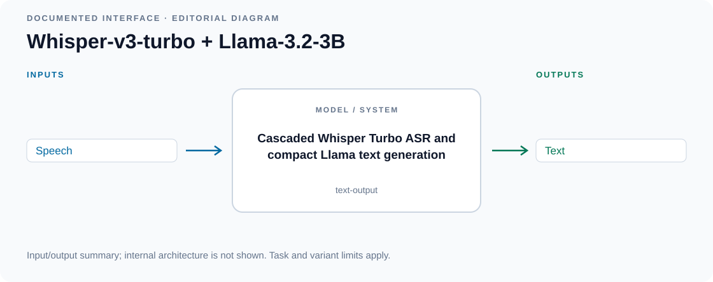

# VoiceBench cascaded systems

<!-- Generated by scripts/catalog.py from data/models.json and data/figures.json. Edit the JSON, then regenerate. -->

[← All models](../README.md#models)

**4 models · Reviewed 2026-09-13**

Primary-source figures and labeled input/output diagrams. [Figure credits](../assets/architectures/CREDITS.md).

Model index and modality key

**Modalities:** T = text, I = image, V = video, A = general audio, S = speech, M = music, X = other structured modalities. A is a broad label, not a guarantee of every audio task. See the [methodology](../docs/methodology.md) for interaction labels, variant scope and inclusion rules.

Dates refer to papers or announcements, not necessarily model releases.

| Model | Source date | Input → output | Interaction |
| --- | --- | --- | --- |
| [Parakeet-TDT-v2 + Qwen3-8B](#parakeet-qwen3) | — | S → T | text-output |
| [Whisper-v3-large + Llama-3.1-8B](#whisper-v3-llama31) | — | S → T | text-output |
| [Whisper-v3-turbo + Llama-3.1-8B](#whisper-turbo-llama31) | — | S → T | text-output |
| [Whisper-v3-turbo + Llama-3.2-3B](#whisper-turbo-llama32) | — | S → T | text-output |

## Architectures

### Parakeet-TDT-v2 + Qwen3-8B

Transcribes speech with Parakeet and sends the transcript to Qwen3 for a text response.

**Architecture:** Cascaded ASR and text language model.

[Code](https://github.com/NVIDIA-NeMo/Speech) · [Weights](https://huggingface.co/Qwen/Qwen3-8B) · [ASR weights](https://huggingface.co/nvidia/parakeet-tdt-0.6b-v2)

**Open license:** code [Apache-2.0](https://github.com/NVIDIA-NeMo/Speech/blob/main/LICENSE) · weights [Apache-2.0](https://huggingface.co/Qwen/Qwen3-8B/blob/b968826d9c46dd6066d109eabc6255188de91218/README.md) · ASR [CC-BY-4.0](https://huggingface.co/nvidia/parakeet-tdt-0.6b-v2/blob/ae9ad07059c7c739ffaf932226a8fe64ae2620b0/README.md)

*Input/output diagram · [Source](https://huggingface.co/Qwen/Qwen3-8B)*

Details

**Input → output:** S → T · **Interaction:** text-output

VoiceBench lists this ASR + LLM composition, but a matching evaluation wrapper was not located. The Code link provides the Parakeet implementation; Qwen3 uses its standard Transformers implementation. This is a composition of public components, not a separate trained checkpoint.

Editorial summary of documented inputs and outputs; internal architecture is not shown.

### Whisper-v3-large + Llama-3.1-8B

Uses Whisper to transcribe a spoken request and Llama 3.1 to answer it.

**Architecture:** Cascaded Whisper ASR and Llama text generation.

[Code](https://github.com/MatthewCYM/VoiceBench/blob/6992cf4fc51d0426c52c4805b5002e0aae49118a/src/models/naive.py) · [Weights](https://huggingface.co/meta-llama/Meta-Llama-3.1-8B-Instruct) · [ASR weights](https://huggingface.co/openai/whisper-large-v3)

**Custom / restricted:** code [Apache-2.0](https://github.com/MatthewCYM/VoiceBench/blob/6992cf4fc51d0426c52c4805b5002e0aae49118a/LICENSE) · weights [Llama community license](https://huggingface.co/meta-llama/Meta-Llama-3.1-8B-Instruct/blob/0e9e39f249a16976918f6564b8830bc894c89659/README.md) · ASR [Apache-2.0](https://huggingface.co/openai/whisper-large-v3/blob/06f233fe06e710322aca913c1bc4249a0d71fce1/README.md) — The text backbone uses the Llama community license.

*Input/output diagram · [Source](https://huggingface.co/meta-llama/Meta-Llama-3.1-8B-Instruct)*

Details

**Input → output:** S → T · **Interaction:** text-output

A benchmark composition of separately released models, not a separately trained speech-language checkpoint. The text LLM receives the ASR transcript.

Editorial summary of documented inputs and outputs; internal architecture is not shown.

### Whisper-v3-turbo + Llama-3.1-8B

Pairs faster Whisper transcription with Llama 3.1 text responses.

**Architecture:** Cascaded Whisper Turbo ASR and Llama text generation.

[Code](https://github.com/MatthewCYM/VoiceBench/blob/6992cf4fc51d0426c52c4805b5002e0aae49118a/src/models/naive3.py) · [Weights](https://huggingface.co/meta-llama/Meta-Llama-3.1-8B-Instruct) · [ASR weights](https://huggingface.co/openai/whisper-large-v3-turbo)

**Custom / restricted:** code [Apache-2.0](https://github.com/MatthewCYM/VoiceBench/blob/6992cf4fc51d0426c52c4805b5002e0aae49118a/LICENSE) · weights [Llama community license](https://huggingface.co/meta-llama/Meta-Llama-3.1-8B-Instruct/blob/0e9e39f249a16976918f6564b8830bc894c89659/README.md) · ASR [MIT](https://huggingface.co/openai/whisper-large-v3-turbo/blob/41f01f3fe87f28c78e2fbf8b568835947dd65ed9/README.md) — The text backbone uses the Llama community license.

*Input/output diagram · [Source](https://huggingface.co/meta-llama/Meta-Llama-3.1-8B-Instruct)*

Details

**Input → output:** S → T · **Interaction:** text-output

A benchmark composition of separately released models, not a separately trained speech-language checkpoint. The text LLM receives the ASR transcript.

Editorial summary of documented inputs and outputs; internal architecture is not shown.

### Whisper-v3-turbo + Llama-3.2-3B

Combines Whisper Turbo with a smaller Llama 3.2 model for spoken question answering.

**Architecture:** Cascaded Whisper Turbo ASR and compact Llama text generation.

[Code](https://github.com/MatthewCYM/VoiceBench/blob/6992cf4fc51d0426c52c4805b5002e0aae49118a/src/models/naive4.py) · [Weights](https://huggingface.co/meta-llama/Llama-3.2-3B-Instruct) · [ASR weights](https://huggingface.co/openai/whisper-large-v3-turbo)

**Custom / restricted:** code [Apache-2.0](https://github.com/MatthewCYM/VoiceBench/blob/6992cf4fc51d0426c52c4805b5002e0aae49118a/LICENSE) · weights [Llama community license](https://huggingface.co/meta-llama/Llama-3.2-3B-Instruct/blob/0cb88a4f764b7a12671c53f0838cd831a0843b95/README.md) · ASR [MIT](https://huggingface.co/openai/whisper-large-v3-turbo/blob/41f01f3fe87f28c78e2fbf8b568835947dd65ed9/README.md) — The text backbone uses the Llama community license.

*Input/output diagram · [Source](https://huggingface.co/meta-llama/Llama-3.2-3B-Instruct)*

Details

**Input → output:** S → T · **Interaction:** text-output

A benchmark composition of separately released models, not a separately trained speech-language checkpoint. The text LLM receives the ASR transcript.

Editorial summary of documented inputs and outputs; internal architecture is not shown.

