# Speech dialogue models

<!-- Generated by scripts/catalog.py from data/models.json and data/figures.json. Edit the JSON, then regenerate. -->

[← All models](../README.md#models)

**42 models · Reviewed 2026-09-13**

Primary-source figures and labeled input/output diagrams. [Figure credits](../assets/architectures/CREDITS.md).

Model index and modality key

**Modalities:** T = text, I = image, V = video, A = general audio, S = speech, M = music, X = other structured modalities. A is a broad label, not a guarantee of every audio task. See the [methodology](../docs/methodology.md) for interaction labels, variant scope and inclusion rules.

Dates refer to papers or announcements, not necessarily model releases.

| Model | Source date | Input → output | Interaction |
| --- | --- | --- | --- |
| [Audio Flamingo 3 Chat](#audio-flamingo-3) | 2025-07-10 | T, A → T, S | generation |
| [Baichuan-Audio](#baichuan-audio) | 2025-02-24 | T, A → T, S | generation |
| [Covo-Audio Chat](#covo-audio) | — | T, S → T, S | generation |
| [DialectS2S](#dialects2s) | — | T, S → T, S | generation |
| [DuplexCascade](#duplex-cascade) | — | T, S → T, S | full-duplex |
| [Freeze-Omni](#freeze-omni) | 2024-11-01 | T, S → T, S | streaming |
| [Fun-Audio-Chat](#fun-audio-chat) | 2025-12-23 | T, S → T, S | generation |
| [GLM-4-Voice](#glm-4-voice) | 2024-12-03 | T, S → T, S | generation |
| [Hibiki](#hibiki) | 2025-02-05 | T, S → T, S | streaming |
| [Kimi-Audio](#kimi-audio) | 2025-04-25 | T, A → T, S | generation |
| [LFM2-Audio-1.5B](#lfm2-audio) | 2025-11-28 | T, S → T, S | streaming |
| [LFM2.5-Audio-1.5B](#lfm2-5-audio) | — | T, S → T, S | streaming |
| [LFM2.5-Audio-1.5B-JP](#lfm2-5-audio-jp) | — | T, S → T, S | streaming |
| [LLaMA-Omni](#llama-omni) | 2024-09-10 | T, S → T, S | streaming |
| [LLaMA-Omni 2](#llama-omni-2) | 2025-05-05 | T, S → T, S | streaming |
| [Lychee-FD](#lychee-fd) | — | T, S → T, S | full-duplex |
| [Mair-hub-0.5B-Omni](#mair-hub-omni) | — | T, S → T, S | generation |
| [MiMo-Audio](#mimo-audio) | 2025-12-29 | T, A → T, S | generation |
| [Mini-Omni](#mini-omni) | 2024-08-29 | T, S → T, S | streaming |
| [Moshi](#moshi) | 2024-09-17 | T, S → T, S | full-duplex |
| [MOSS-Speech](#moss-speech) | 2025-10-01 | S → S | generation |
| [Nemotron-Labs-Audex 2B](#nemotron-audex-2b) | 2026-07-06 | T, A → T, A | generation |
| [Nemotron-Labs-Audex 30B-A3B](#nemotron-audex-30b) | 2026-07-06 | T, A → T, A | generation |
| [NemotronLabs VoiceChat 11B](#nemotronlabs-voicechat) | — | T, S → T, S | full-duplex |
| [OpenS2S](#opens2s) | 2025-07-07 | T, S → T, S | streaming |
| [OpenS2S 1.5](#opens2s-1-5) | — | T, S → T, S | streaming |
| [OSUM-EChat](#osum-echat) | 2025-08-13 | T, S → T, S | generation |
| [PersonaPlex](#personaplex) | 2026-01-14 | T, S → T, S | full-duplex |
| [SLAM-Omni](#slam-omni) | 2024-12-20 | T, S → T, S | generation |
| [SpeechGPT](#speechgpt) | 2023-05-18 | T, S → T, S | generation |
| [SpeechGPT 2.0 Preview](#speechgpt-2-0-preview) | — | T, S → T, S | generation |
| [Step-Audio](#step-audio) | 2025-02-17 | T, A → T, S | generation |
| [Step-Audio 2 Mini](#step-audio-2) | 2025-07-22 | T, A → T, S | generation |
| [Step-Audio-AQAA](#step-audio-aqaa) | 2025-06-10 | T, A → T, S | generation |
| [Step-Audio-R1.1](#step-audio-r1-1) | — | T, A → T, S | streaming |
| [Sympatheia](#sympatheia) | 2026-05-30 | T, S → T, S | generation |
| [TurnGuide](#turnguide) | — | T, S → T, S | full-duplex |
| [VITA-Audio](#vita-audio) | 2025-05-06 | T, S → T, S | streaming |
| [VITA-Audio Plus](#vita-audio-plus) | — | T, S → T, S | streaming |
| [Voila Autonomous](#voila-autonomous) | — | T, S → T, S | full-duplex |
| [Voila Chat](#voila) | 2025-05-05 | T, S → T, S | generation |
| [VoxMind](#voxmind) | 2026-04-17 | T, S → T, S | generation |

## Architectures

### Audio Flamingo 3 Chat

Discusses speech, sounds and music across multiple recordings and can reply with streaming speech.

**Architecture:** AF-Whisper encoder, language model and streaming speech module.

[Paper](https://arxiv.org/abs/2507.08128) · [Code](https://github.com/NVIDIA/audio-flamingo/tree/audio_flamingo_3) · [Weights](https://huggingface.co/nvidia/audio-flamingo-3-chat)

**Custom / restricted:** code [MIT](https://github.com/NVIDIA/audio-flamingo/tree/audio_flamingo_3) · weights [NVIDIA OneWay Noncommercial](https://huggingface.co/nvidia/audio-flamingo-3-chat/blob/f5101f44de138aed8527791212be2e070224fb86/README.md) — Noncommercial terms apply to model weights and relevant bundled components.

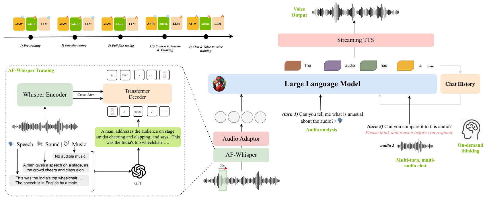

*Figure 2 · [Source](https://arxiv.org/abs/2507.08128)*

Details

**Input → output:** T, A → T, S · **Interaction:** generation

Capabilities refer to the linked checkpoint; consult its model card for task prompts and deployment requirements.

**Variants:** audio-flamingo-3-chat.

### Baichuan-Audio

Follows spoken instructions and generates text and expressive speech responses.

**Architecture:** Audio-text language model with aligned semantic and acoustic tokens.

[Paper](https://arxiv.org/abs/2502.17239) · [Code](https://github.com/baichuan-inc/Baichuan-Audio) · [Weights](https://huggingface.co/baichuan-inc/Baichuan-Audio-Instruct)

**Open license:** code [Apache-2.0](https://github.com/baichuan-inc/Baichuan-Audio/blob/main/LICENSE) · weights [Apache-2.0](https://huggingface.co/baichuan-inc/Baichuan-Audio-Instruct/blob/6761be848f9bd91847cc647ef70a47b3266ffc36/README.md)

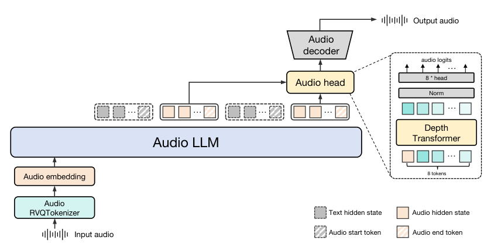

*Figure 1 · [Source](https://arxiv.org/abs/2502.17239)*

Details

**Input → output:** T, A → T, S · **Interaction:** generation

Capabilities refer to the linked checkpoint; consult its model card for task prompts and deployment requirements.

**Variants:** Baichuan-Audio-Instruct.

### Covo-Audio Chat

Understands spoken requests and generates context-aware, expressive voice responses.

**Architecture:** Continuous-audio encoder and unified speech-language decoder.

[Paper](https://arxiv.org/abs/2602.09823) · [Code](https://github.com/Tencent/Covo-Audio) · [Weights](https://huggingface.co/tencent/Covo-Audio-Chat)

**Custom / restricted:** code [Tencent research license](https://github.com/Tencent/Covo-Audio/blob/main/LICENSE) · weights [Tencent research license](https://github.com/Tencent/Covo-Audio/blob/main/LICENSE) — Academic/research use only; commercial and production use are excluded.

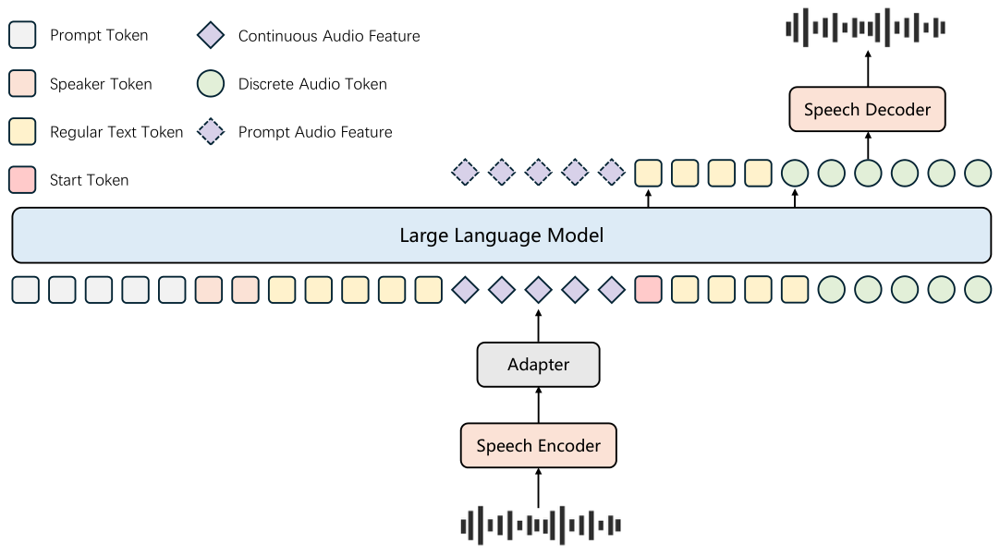

*Figure 2, PDF p. 4 · [Source](https://arxiv.org/abs/2602.09823)*

Details

**Input → output:** T, S → T, S · **Interaction:** generation

The selected checkpoint is Covo-Audio-Chat. The paper also describes a distinct Chat-FD full-duplex variant, whose behavior is not assumed for this checkpoint.

**Variants:** Covo-Audio-Chat.

### DialectS2S

Understands and speaks low-resource Chinese dialects in end-to-end voice conversations.

**Architecture:** Dialect-adapted OpenS2S speech-language model.

[Paper](https://arxiv.org/abs/2507.05177) · [Code](https://github.com/CASIA-LM/OpenS2S) · [Weights](https://huggingface.co/CASIA-LM/DialectS2S)

**Open license:** code [Apache-2.0](https://github.com/CASIA-LM/OpenS2S/blob/main/README.md) · weights [MIT](https://huggingface.co/CASIA-LM/DialectS2S/blob/938dc520d99941b9cf8634b8161823adf1a5694e/README.md)

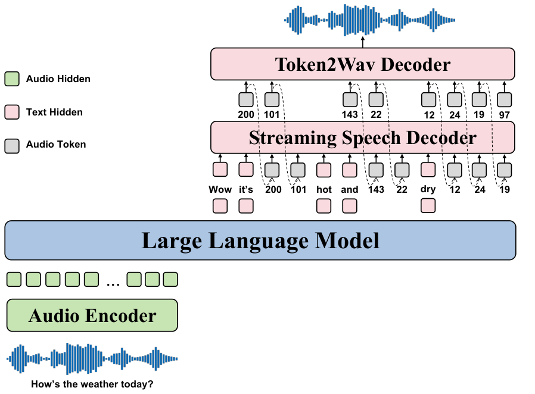

*Family figure — Figure 1 · [Source](https://arxiv.org/abs/2507.05177)*

Details

**Input → output:** T, S → T, S · **Interaction:** generation

Uses the separately released GLM-4-Voice decoder for speech generation; consult that component’s terms as well. The image illustrates the shared model family; checkpoint-specific changes are described in the model card.

**Variants:** DialectS2S.

### DuplexCascade

Coordinates streaming transcription, language generation and speech synthesis for interruptible voice conversations.

**Architecture:** Micro-turn language modeling with streaming ASR and TTS modules.

[Paper](https://arxiv.org/abs/2603.09180) · [Code](https://github.com/sbintuitions/DuplexCascade) · [Weights](https://huggingface.co/sbintuitions/DuplexCascade)

**Open license:** code [MIT](https://github.com/sbintuitions/DuplexCascade/blob/main/LICENSE) · weights [MIT](https://huggingface.co/sbintuitions/DuplexCascade/blob/31c038ece2f006a28722dd60d1df3868fbb2cc42/README.md)

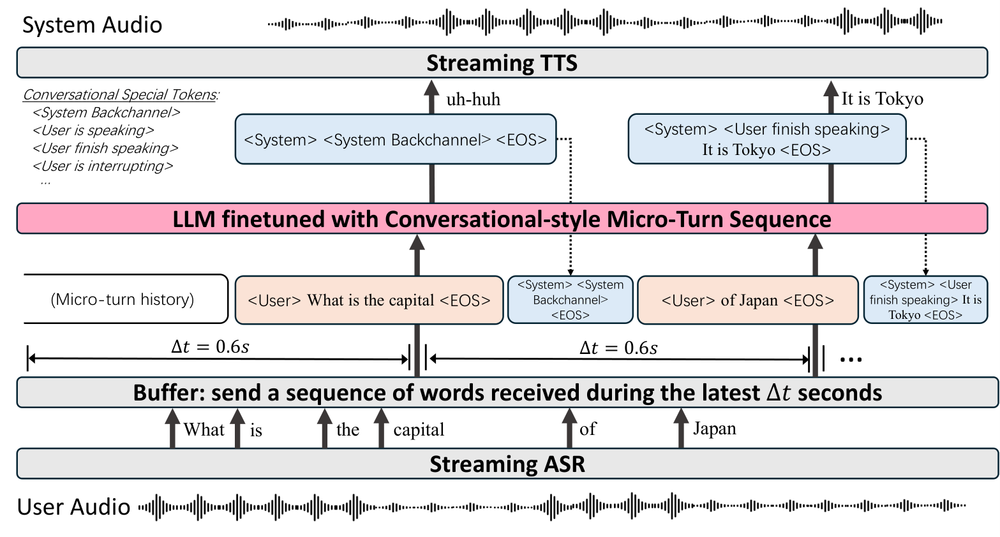

*Figure 1 · [Source](https://arxiv.org/abs/2603.09180)*

Details

**Input → output:** T, S → T, S · **Interaction:** full-duplex

A fine-tuned Qwen2 dialogue controller plus separately deployed Kyutai ASR and TTS modules. The public checkpoint has an access gate requiring acceptance of publisher terms.

**Variants:** DuplexCascade.

### Freeze-Omni

Enables streaming spoken dialogue while retaining a frozen text model's language abilities.

**Architecture:** Streaming speech encoder and decoder around a frozen Qwen backbone.

[Paper](https://arxiv.org/abs/2411.00774) · [Code](https://github.com/VITA-MLLM/Freeze-Omni) · [Weights](https://huggingface.co/VITA-MLLM/Freeze-Omni)

**Custom / restricted:** code [Tencent research license](https://github.com/VITA-MLLM/Freeze-Omni/blob/main/License.txt) · weights [Tencent research license](https://github.com/VITA-MLLM/Freeze-Omni/blob/main/License.txt) — Academic/research use only; commercial and production use are excluded.

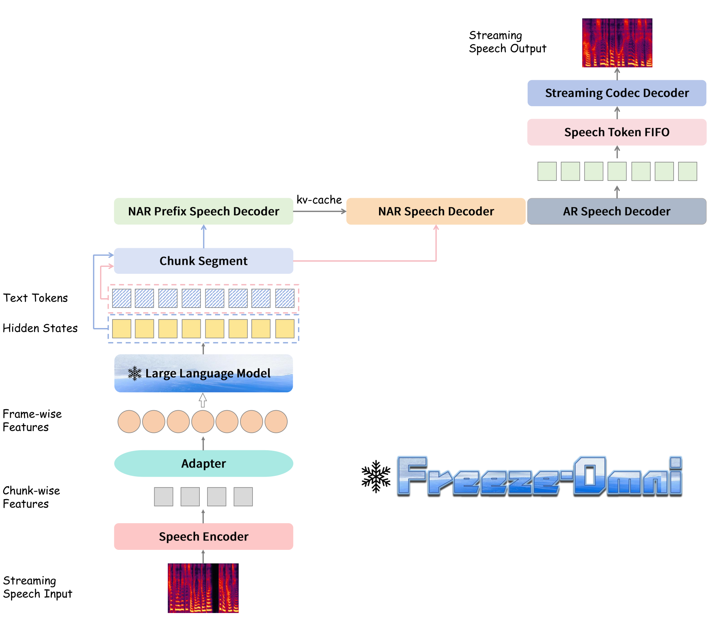

*Figure 1 · [Source](https://arxiv.org/abs/2411.00774)*

Details

**Input → output:** T, S → T, S · **Interaction:** streaming

Capabilities refer to the linked checkpoint; consult its model card for task prompts and deployment requirements.

**Variants:** Freeze-Omni.

### Fun-Audio-Chat

Holds low-latency spoken conversations while responding to vocal style and emotion.

**Architecture:** Dual-resolution speech representations with a core-code prediction head.

[Paper](https://arxiv.org/abs/2512.20156) · [Code](https://github.com/QwenAudio/Fun-Audio-Chat) · [Weights](https://huggingface.co/FunAudioLLM/Fun-Audio-Chat-8B)

**Open license:** code [Apache-2.0](https://github.com/QwenAudio/Fun-Audio-Chat/blob/main/LICENSE) · weights [Apache-2.0](https://huggingface.co/FunAudioLLM/Fun-Audio-Chat-8B/blob/7bf72dc7c705493f817178a0859efff91e9cf73c/README.md)

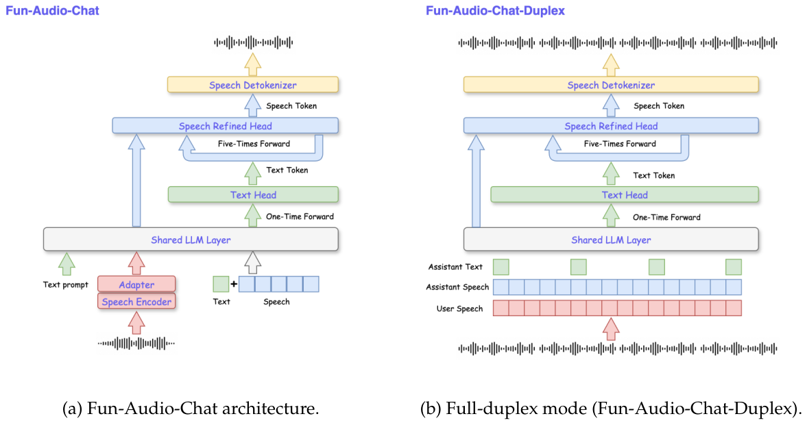

*Figure 2, PDF p. 4 · [Source](https://arxiv.org/abs/2512.20156)*

Details

**Input → output:** T, S → T, S · **Interaction:** generation

Capabilities refer to the linked checkpoint; consult its model card for task prompts and deployment requirements.

**Variants:** Fun-Audio-Chat-8B.

### GLM-4-Voice

Converses in Chinese and English with controllable emotion, speaking rate and vocal style.

**Architecture:** GLM backbone with low-rate speech tokens and interleaved decoding.

[Paper](https://arxiv.org/abs/2412.02612) · [Code](https://github.com/zai-org/GLM-4-Voice) · [Weights](https://huggingface.co/THUDM/glm-4-voice-9b)

**Custom / restricted:** code [Apache-2.0](https://github.com/zai-org/GLM-4-Voice/blob/main/LICENSE) · weights [GLM-4 model license](https://huggingface.co/THUDM/glm-4-voice-9b/blob/352e5a64063448d5e46394753fb65bf1dbab975b/LICENSE) — Custom GLM model terms apply to the speech checkpoint.

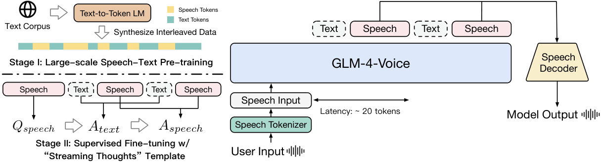

*Figure 2 · [Source](https://arxiv.org/abs/2412.02612)*

Details

**Input → output:** T, S → T, S · **Interaction:** generation

Capabilities refer to the linked checkpoint; consult its model card for task prompts and deployment requirements.

**Variants:** glm-4-voice-9b.

### Hibiki

Translates French speech into English as it arrives while preserving the speaker's voice.

**Architecture:** Simultaneous speech translation with delayed multi-stream modeling.

[Paper](https://arxiv.org/abs/2502.03382) · [Code](https://github.com/kyutai-labs/hibiki) · [Weights](https://huggingface.co/kyutai/hibiki-2b-pytorch-bf16)

**Open license:** code [Apache-2.0](https://github.com/kyutai-labs/hibiki/blob/main/LICENSE-APACHE) · weights [CC-BY-4.0](https://huggingface.co/kyutai/hibiki-2b-pytorch-bf16/blob/bd71144c96f26040612f6414716f5f48ee4fce69/README.md)

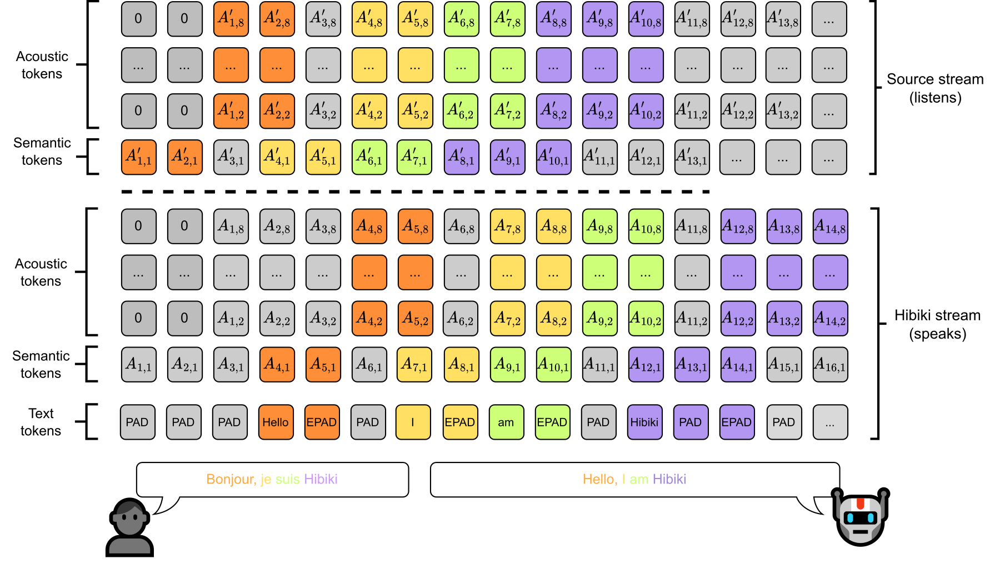

*Figure 2 · [Source](https://arxiv.org/abs/2502.03382)*

Details

**Input → output:** T, S → T, S · **Interaction:** streaming

Capabilities refer to the linked checkpoint; consult its model card for task prompts and deployment requirements.

**Variants:** hibiki-2b-pytorch-bf16.

### Kimi-Audio

Understands speech, sound and music and supports natural voice conversations.

**Architecture:** Continuous audio features, parallel text-audio heads and flow-matching detokenizer.

[Paper](https://arxiv.org/abs/2504.18425) · [Code](https://github.com/MoonshotAI/Kimi-Audio) · [Weights](https://huggingface.co/moonshotai/Kimi-Audio-7B-Instruct)

**Open license:** code [MIT / Apache-2.0](https://github.com/MoonshotAI/Kimi-Audio/blob/master/README.md) · weights [MIT](https://huggingface.co/moonshotai/Kimi-Audio-7B-Instruct/blob/9a82a84c37ad9eb1307fb6ed8d7b397862ef9e6b/README.md)

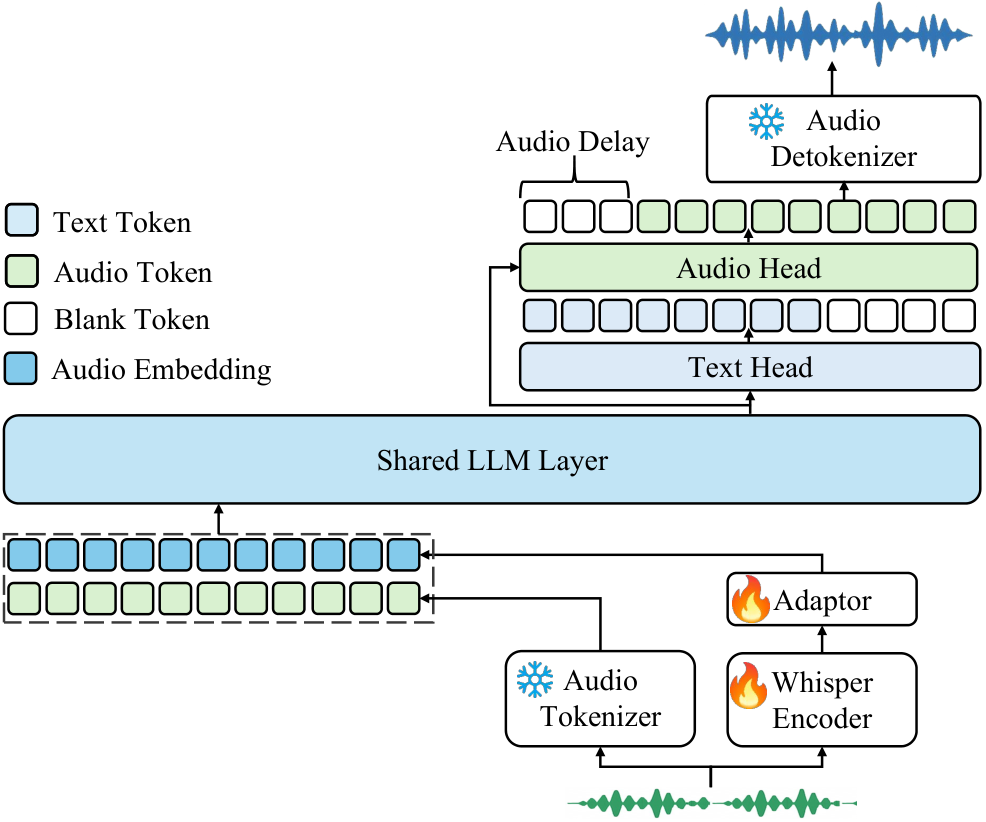

*Figure 2 · [Source](https://arxiv.org/abs/2504.18425)*

Details

**Input → output:** T, A → T, S · **Interaction:** generation

Capabilities refer to the linked checkpoint; consult its model card for task prompts and deployment requirements.

**Variants:** Kimi-Audio-7B-Instruct.

### LFM2-Audio-1.5B

Transcribes speech, synthesizes speech and supports interleaved voice conversations on local devices.

**Architecture:** LFM2 hybrid backbone with separate audio input and output pathways.

[Paper](https://arxiv.org/abs/2511.23404) · [Code](https://github.com/Liquid4All/liquid-audio) · [Weights](https://huggingface.co/LiquidAI/LFM2-Audio-1.5B)

**Custom / restricted:** code [LFM Open License v1.0](https://github.com/Liquid4All/liquid-audio/blob/main/LICENSE) · weights [LFM Open License v1.0](https://huggingface.co/LiquidAI/LFM2-Audio-1.5B/blob/c798aad30dc3cd72e72970beab51326b8443bd94/README.md) — Revenue-based commercial-use limit; see the LFM license.

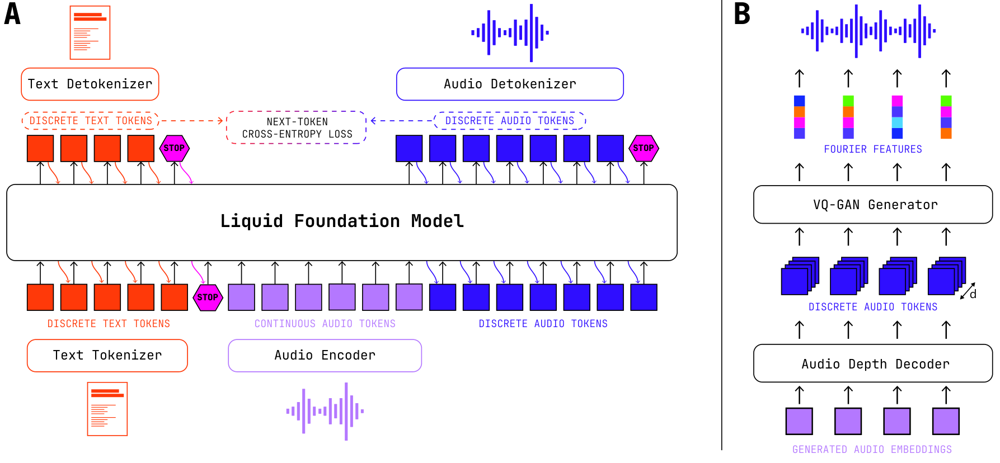

*Figure 7 · [Source](https://arxiv.org/abs/2511.23404)*

Details

**Input → output:** T, S → T, S · **Interaction:** streaming

Runs with the public liquid-audio implementation. The LFM2 paper describes the family; the linked checkpoint card documents this version.

**Variants:** LFM2-Audio-1.5B.

### LFM2.5-Audio-1.5B

Handles transcription, speech synthesis and voice chat with a faster audio decoder for local inference.

**Architecture:** LFM2 backbone with a lightweight LFM audio detokenizer.

[Paper](https://arxiv.org/abs/2511.23404) · [Code](https://github.com/Liquid4All/liquid-audio) · [Weights](https://huggingface.co/LiquidAI/LFM2.5-Audio-1.5B)

**Custom / restricted:** code [LFM Open License v1.0](https://github.com/Liquid4All/liquid-audio/blob/main/LICENSE) · weights [LFM Open License v1.0](https://huggingface.co/LiquidAI/LFM2.5-Audio-1.5B/blob/c362a0625dfe45aa588dce5f0ada28a7e5707628/README.md) — Revenue-based commercial-use limit; see the LFM license.

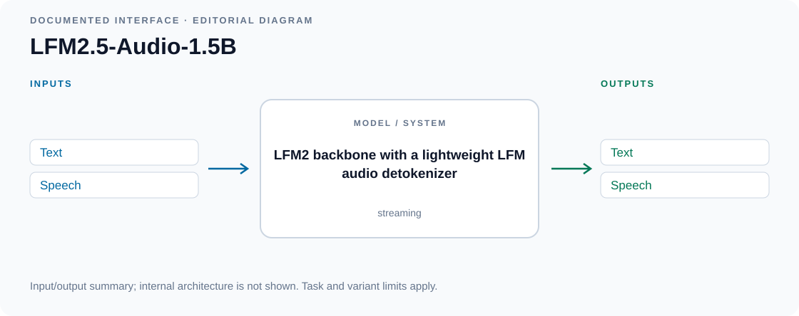

*Input/output diagram · [Source](https://huggingface.co/LiquidAI/LFM2.5-Audio-1.5B)*

Details

**Input → output:** T, S → T, S · **Interaction:** streaming

Runs with the public liquid-audio implementation. The LFM2 paper describes the family; the linked checkpoint card documents this version.

Editorial summary of documented inputs and outputs; internal architecture is not shown.

**Variants:** LFM2.5-Audio-1.5B.

### LFM2.5-Audio-1.5B-JP

Brings Japanese transcription, speech synthesis and spoken conversation to the LFM2.5 audio family.

**Architecture:** Japanese-adapted LFM2.5 audio model.

[Paper](https://arxiv.org/abs/2511.23404) · [Code](https://github.com/Liquid4All/liquid-audio) · [Weights](https://huggingface.co/LiquidAI/LFM2.5-Audio-1.5B-JP)

**Custom / restricted:** code [LFM Open License v1.0](https://github.com/Liquid4All/liquid-audio/blob/main/LICENSE) · weights [LFM Open License v1.0](https://huggingface.co/LiquidAI/LFM2.5-Audio-1.5B-JP/blob/6c34b4d590f80563f8cb2939c2ebd7686d952394/README.md) — Revenue-based commercial-use limit; see the LFM license.

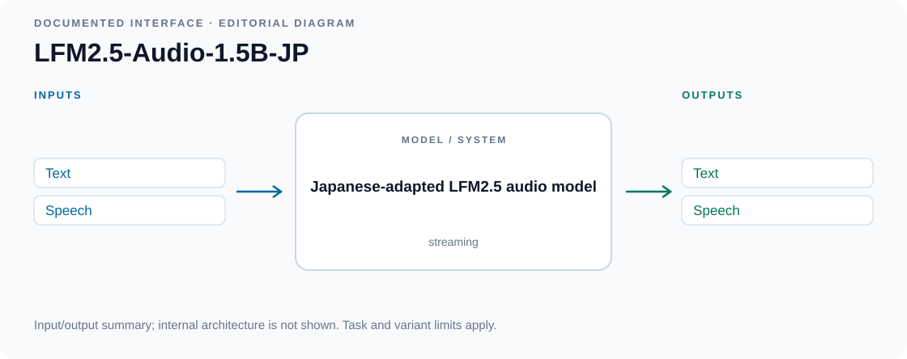

*Input/output diagram · [Source](https://huggingface.co/LiquidAI/LFM2.5-Audio-1.5B-JP)*

Details

**Input → output:** T, S → T, S · **Interaction:** streaming

Runs with the public liquid-audio implementation. The LFM2 paper describes the family; the linked checkpoint card documents this version.

Editorial summary of documented inputs and outputs; internal architecture is not shown.

**Variants:** LFM2.5-Audio-1.5B-JP.

### LLaMA-Omni

Answers spoken requests with synchronized text and streaming speech.

**Architecture:** Whisper encoder, Llama backbone and non-autoregressive speech decoder.

[Paper](https://arxiv.org/abs/2409.06666) · [Code](https://github.com/ictnlp/LLaMA-Omni) · [Weights](https://huggingface.co/ICTNLP/Llama-3.1-8B-Omni)

**Custom / restricted:** code [Apache-2.0](https://huggingface.co/ICTNLP/Llama-3.1-8B-Omni/blob/4844429b4f81bc9cd93dcf5b1f0c66b8925fbab8/README.md) · weights [Research-only](https://huggingface.co/ICTNLP/Llama-3.1-8B-Omni/blob/4844429b4f81bc9cd93dcf5b1f0c66b8925fbab8/README.md) — The model card excludes commercial use of the weights.

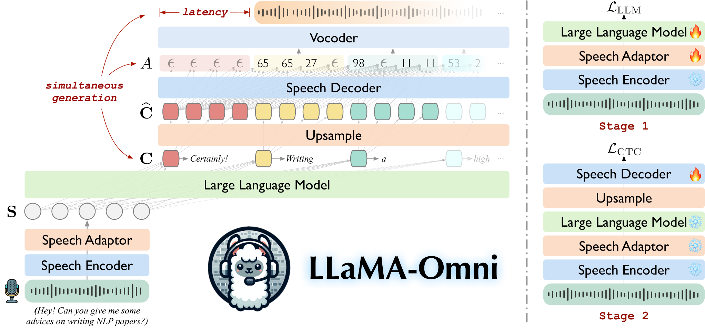

*Figure 2 · [Source](https://arxiv.org/abs/2409.06666)*

Details

**Input → output:** T, S → T, S · **Interaction:** streaming

Capabilities refer to the linked checkpoint; consult its model card for task prompts and deployment requirements.

**Variants:** Llama-3.1-8B-Omni.

### LLaMA-Omni 2

Supports multi-turn spoken chat with streaming speech generation.

**Architecture:** Qwen2.5 backbone with an autoregressive streaming speech decoder.

[Paper](https://arxiv.org/abs/2505.02625) · [Code](https://github.com/ictnlp/LLaMA-Omni2) · [Weights](https://huggingface.co/ICTNLP/LLaMA-Omni2-7B)

**Custom / restricted:** code [Apache-2.0](https://huggingface.co/ICTNLP/LLaMA-Omni2-7B/blob/50291b44553960219adb145846e13b023dfc1e7e/README.md) · weights [Research-only](https://huggingface.co/ICTNLP/LLaMA-Omni2-7B/blob/50291b44553960219adb145846e13b023dfc1e7e/README.md) — The model card excludes commercial use of the weights.

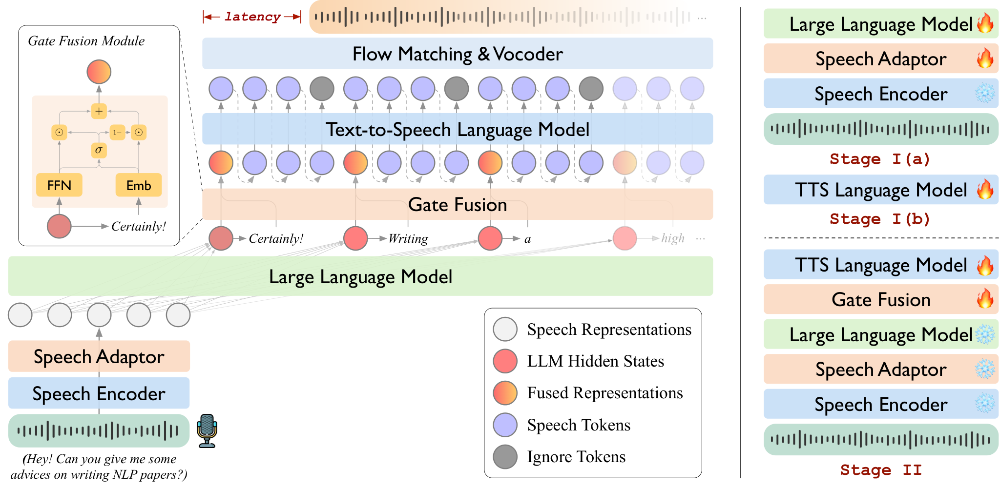

*Figure 1 · [Source](https://arxiv.org/abs/2505.02625)*

Details

**Input → output:** T, S → T, S · **Interaction:** streaming

Capabilities refer to the linked checkpoint; consult its model card for task prompts and deployment requirements.

**Variants:** LLaMA-Omni2-7B.

### Lychee-FD

Listens and speaks continuously while deciding when to respond, stop or handle interruptions.

**Architecture:** Shared lower layers with separate semantic, acoustic and control streams.

[Paper](https://arxiv.org/abs/2607.06540) · [Code](https://github.com/HITsz-TMG/Lychee-FD) · [Weights](https://huggingface.co/HIT-TMG/Lychee-FD)

**Open license:** code [Apache-2.0](https://github.com/HITsz-TMG/Lychee-FD/blob/main/LICENSE) · weights [Apache-2.0](https://huggingface.co/HIT-TMG/Lychee-FD/blob/ac06087bef70b33d4dfebf63a3eadadb4e024f33/README.md)

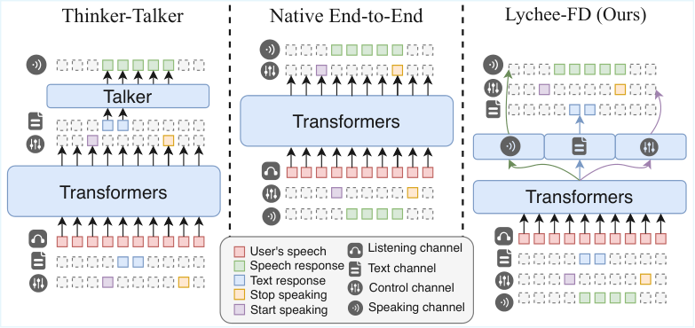

*Figure 3 · [Source](https://arxiv.org/abs/2607.06540)*

Details

**Input → output:** T, S → T, S · **Interaction:** full-duplex

Capabilities refer to the linked checkpoint; consult its model card for task prompts and deployment requirements.

**Variants:** Lychee-FD.

### Mair-hub-0.5B-Omni

Provides a small speech-to-speech assistant trained with a reproducible Qwen-Omni-like recipe.

**Architecture:** Whisper encoder, Thinker, Talker and CosyVoice decoder.

[Code](https://github.com/nvidia-china-sae/mair-hub/tree/main/speech-llm/qwen_omni_like) · [Weights](https://huggingface.co/yuekai/qwen-omni-like-0.5B-speech2speech-en)

**License unclear:** code [Apache-2.0](https://github.com/nvidia-china-sae/mair-hub/blob/main/LICENSE) · weights [Not stated](https://huggingface.co/yuekai/qwen-omni-like-0.5B-speech2speech-en/tree/04e54c0d1cb7263c69fe33445c575264166bb045) — The training recipe is Apache-2.0; the published checkpoint does not state a weight license.

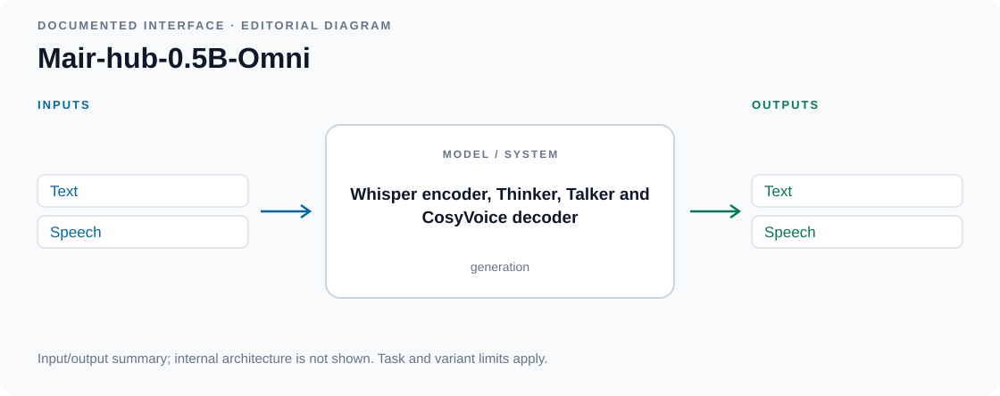

*Input/output diagram · [Source](https://huggingface.co/yuekai/qwen-omni-like-0.5B-speech2speech-en)*

Details

**Input → output:** T, S → T, S · **Interaction:** generation

Capabilities refer to the linked checkpoint; consult its model card for task prompts and deployment requirements.

Editorial summary of documented inputs and outputs; internal architecture is not shown.

**Variants:** qwen-omni-like-0.5B-speech2speech-en.

### MiMo-Audio

Understands recordings and conducts spoken conversations using instructions and audio examples.

**Architecture:** Semantic-acoustic audio tokenizer and a speech-text language model.

[Paper](https://arxiv.org/abs/2512.23808) · [Code](https://github.com/XiaomiMiMo/MiMo-Audio) · [Weights](https://huggingface.co/XiaomiMiMo/MiMo-Audio-7B-Instruct)

**Open license:** code [Apache-2.0](https://github.com/XiaomiMiMo/MiMo-Audio/blob/main/LICENSE) · weights [MIT](https://huggingface.co/XiaomiMiMo/MiMo-Audio-7B-Instruct/blob/c359441c22c2a1c74be5f99a91e83392680e9cc8/README.md)

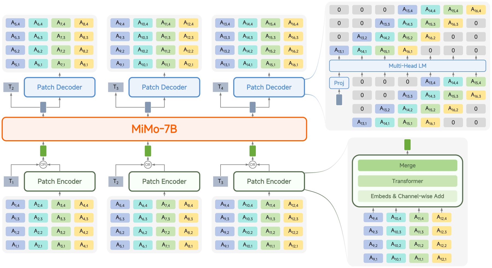

*Figure 3 · [Source](https://arxiv.org/abs/2512.23808)*

Details

**Input → output:** T, A → T, S · **Interaction:** generation

Capabilities refer to the linked checkpoint; consult its model card for task prompts and deployment requirements.

**Variants:** MiMo-Audio-7B-Instruct.

### Mini-Omni

Listens to spoken questions and streams text and speech answers together.

**Architecture:** Parallel text-audio token generation on a small language model.

[Paper](https://arxiv.org/abs/2408.16725) · [Code](https://github.com/gpt-omni/mini-omni) · [Weights](https://huggingface.co/gpt-omni/mini-omni)

**Open license:** code [MIT](https://github.com/gpt-omni/mini-omni/blob/main/LICENSE) · weights [MIT](https://huggingface.co/gpt-omni/mini-omni/blob/ed19d73eb13401dcd2c9de6fa36c69f74f15ae37/README.md)

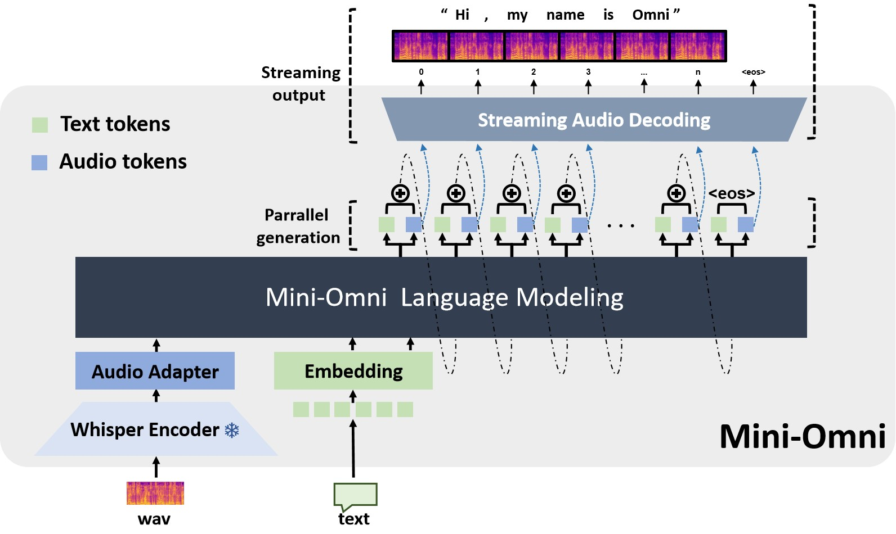

*Figure 1 · [Source](https://arxiv.org/abs/2408.16725)*

Details

**Input → output:** T, S → T, S · **Interaction:** streaming

Capabilities refer to the linked checkpoint; consult its model card for task prompts and deployment requirements.

**Variants:** mini-omni.

### Moshi

Listens and speaks simultaneously, handling conversational overlap and interruptions.

**Architecture:** Multi-stream Helium Transformer with Mimi codec and inner-monologue text.

[Paper](https://arxiv.org/abs/2410.00037) · [Code](https://github.com/kyutai-labs/moshi) · [Weights](https://huggingface.co/kyutai/moshiko-pytorch-bf16)

**Open license:** code [Apache-2.0](https://github.com/kyutai-labs/moshi/blob/main/LICENSE-APACHE) · weights [CC-BY-4.0](https://huggingface.co/kyutai/moshiko-pytorch-bf16/blob/2bfc9ae6e89079a5cc7ed2a68436010d91a3d289/README.md)

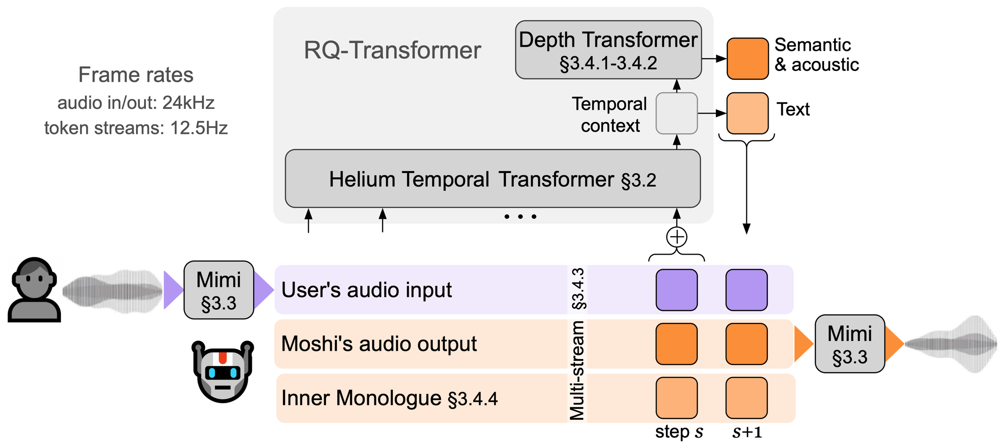

*Figure 1 · [Source](https://arxiv.org/abs/2410.00037)*

Details

**Input → output:** T, S → T, S · **Interaction:** full-duplex

Capabilities refer to the linked checkpoint; consult its model card for task prompts and deployment requirements.

**Variants:** moshiko-pytorch-bf16.

### MOSS-Speech

Converses directly in Chinese and English speech without first generating a text response.

**Architecture:** Modality-based layer splitting on a frozen-pretrained language backbone.

[Paper](https://arxiv.org/abs/2510.00499) · [Code](https://github.com/OpenMOSS/MOSS-Speech) · [Weights](https://huggingface.co/OpenMOSS-Team/MOSS-Speech)

**License unclear:** code [Apache-2.0](https://github.com/OpenMOSS/MOSS-Speech/blob/main/LICENSE) · weights [Not stated](https://huggingface.co/OpenMOSS-Team/MOSS-Speech/blob/cff025bb41d8459d59abac0b5e44aba7f659ec9e/README.md) — The repository licenses code, but a release-specific weight license was not located.

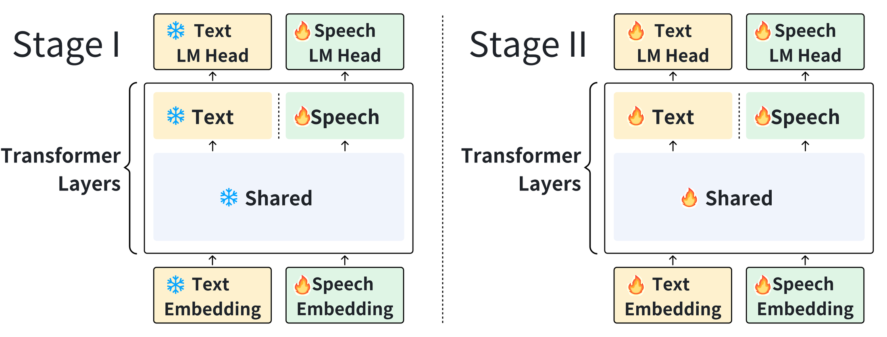

*Figure 3 · [Source](https://arxiv.org/abs/2510.00499)*

Details

**Input → output:** S → S · **Interaction:** generation

Capabilities refer to the linked checkpoint; consult its model card for task prompts and deployment requirements.

**Variants:** MOSS-Speech.

### Nemotron-Labs-Audex 2B

Performs audio understanding, speech tasks and sound generation with a smaller dense backbone.

**Architecture:** Dense decoder with audio adapters and speech and sound token outputs.

[Paper](https://arxiv.org/abs/2607.05196) · [Code](https://huggingface.co/nvidia/Nemotron-Labs-Audex-2B/tree/77b7e1a4de899769f22c1bc074db666601c28907) · [Weights](https://huggingface.co/nvidia/Nemotron-Labs-Audex-2B)

**License unclear:** code [Not stated](https://huggingface.co/nvidia/Nemotron-Labs-Audex-2B/blob/77b7e1a4de899769f22c1bc074db666601c28907/README.md) · weights [NVIDIA OneWay Noncommercial](https://huggingface.co/nvidia/Nemotron-Labs-Audex-2B/blob/77b7e1a4de899769f22c1bc074db666601c28907/README.md) — Noncommercial weight license; inspect the included code files for component-specific terms.

*Family figure — 30B variant · [Source](https://huggingface.co/nvidia/Nemotron-Labs-Audex-2B)*

Details

**Input → output:** T, A → T, A · **Interaction:** generation

The selected checkpoint uses a dense 2B backbone. The shared author figure depicts the 30B MoE variant, not the exact 2B layer layout.

**Variants:** Nemotron-Labs-Audex-2B.

### Nemotron-Labs-Audex 30B-A3B

Understands recordings, transcribes and translates speech, and generates speech or general sounds.

**Architecture:** Hybrid mixture-of-experts decoder with audio adapters and extended token vocabulary.

[Paper](https://arxiv.org/abs/2607.05196) · [Code](https://huggingface.co/nvidia/Nemotron-Labs-Audex-30B-A3B/tree/4e7e342045736382ddf3e2952c313847a08642b8) · [Weights](https://huggingface.co/nvidia/Nemotron-Labs-Audex-30B-A3B)

**License unclear:** code [Not stated](https://huggingface.co/nvidia/Nemotron-Labs-Audex-30B-A3B/blob/4e7e342045736382ddf3e2952c313847a08642b8/README.md) · weights [NVIDIA OneWay Noncommercial](https://huggingface.co/nvidia/Nemotron-Labs-Audex-30B-A3B/blob/4e7e342045736382ddf3e2952c313847a08642b8/README.md) — Noncommercial weight license; inspect the included code files for component-specific terms.

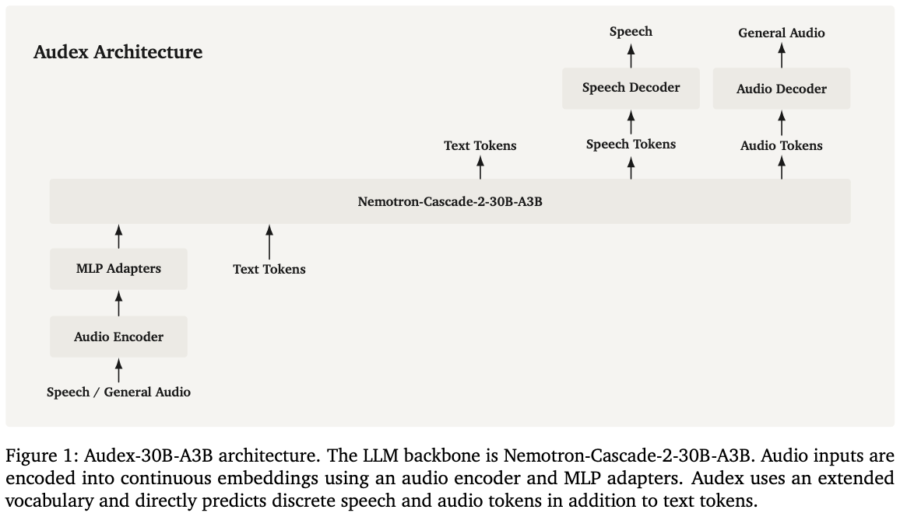

*Official family architecture diagram · [Source](https://huggingface.co/nvidia/Nemotron-Labs-Audex-30B-A3B)*

Details

**Input → output:** T, A → T, A · **Interaction:** generation

The selected checkpoint uses the 30B-A3B mixture-of-experts backbone depicted in the author figure. Speech and general-audio generation use separate decoder components.

**Variants:** Nemotron-Labs-Audex-30B-A3B.

### NemotronLabs VoiceChat 11B

Holds interruptible, full-duplex voice conversations and can call tools while maintaining the dialogue.

**Architecture:** FastConformer, Nemotron backbone and streaming speech decoder.

[Code](https://github.com/NVIDIA-NeMo/Speech/tree/nemotron-labs-voicechat) · [Weights](https://huggingface.co/nvidia/NVIDIA-NemotronLabs-VoiceChat-11B)

**Open license:** code [Apache-2.0](https://github.com/NVIDIA-NeMo/Speech/blob/nemotron-labs-voicechat/LICENSE) · weights [OpenMDW-1.1](https://huggingface.co/nvidia/NVIDIA-NemotronLabs-VoiceChat-11B/blob/a4c40ca5b4fe77db13e9840ca4a2b91becf030c8/README.md)

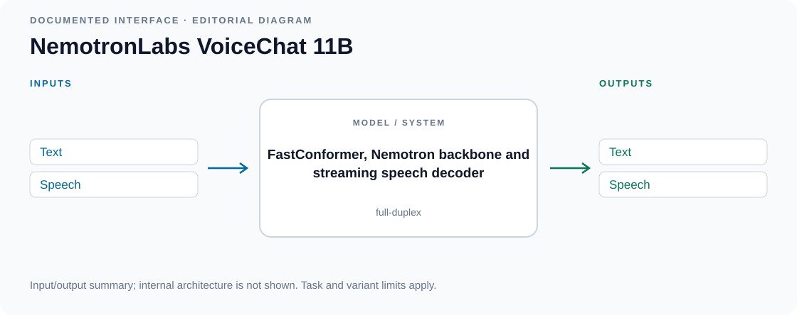

*Input/output diagram · [Source](https://huggingface.co/nvidia/NVIDIA-NemotronLabs-VoiceChat-11B)*

Details

**Input → output:** T, S → T, S · **Interaction:** full-duplex

This public 11B release is distinct from the earlier 12B VoiceBench VoiceChat V1 early-access submission.

Editorial summary of documented inputs and outputs; internal architecture is not shown.

**Variants:** NVIDIA-NemotronLabs-VoiceChat-11B.

### OpenS2S

Recognizes emotional cues in speech and generates empathetic, streaming spoken replies.

**Architecture:** Audio-language backbone with interleaved streaming speech decoding.

[Paper](https://arxiv.org/abs/2507.05177) · [Code](https://github.com/CASIA-LM/OpenS2S) · [Weights](https://huggingface.co/CASIA-LM/OpenS2S)

**Open license:** code [Apache-2.0](https://github.com/CASIA-LM/OpenS2S/blob/main/README.md) · weights [Apache-2.0](https://huggingface.co/CASIA-LM/OpenS2S/blob/ebea6b542b82759115ac7c9596b9bc60ee045aed/README.md)

*Figure 1 · [Source](https://arxiv.org/abs/2507.05177)*

Details

**Input → output:** T, S → T, S · **Interaction:** streaming

Uses the separately released GLM-4-Voice decoder for speech generation; consult that component’s terms as well.

**Variants:** OpenS2S.

### OpenS2S 1.5

Provides the updated OpenS2S checkpoint for expressive, empathetic spoken dialogue.

**Architecture:** Updated OpenS2S speech understanding and streaming generation.

[Paper](https://arxiv.org/abs/2507.05177) · [Code](https://github.com/CASIA-LM/OpenS2S) · [Weights](https://huggingface.co/CASIA-LM/OpenS2S_V1.5)

**Open license:** code [Apache-2.0](https://github.com/CASIA-LM/OpenS2S/blob/main/README.md) · weights [Apache-2.0](https://huggingface.co/CASIA-LM/OpenS2S_V1.5/blob/5dc1a8a49994ddfcc95d4b6480ffadfa60c33423/README.md)

*Family figure — Figure 1 · [Source](https://arxiv.org/abs/2507.05177)*

Details

**Input → output:** T, S → T, S · **Interaction:** streaming

Uses the separately released GLM-4-Voice decoder for speech generation; consult that component’s terms as well. The image illustrates the shared model family; checkpoint-specific changes are described in the model card.

**Variants:** OpenS2S_V1.5.

### OSUM-EChat

Uses speech understanding to produce empathetic text and voice responses.

**Architecture:** OSUM speech understanding connected to expressive speech generation.

[Paper](https://arxiv.org/abs/2508.09600) · [Code](https://github.com/ASLP-lab/OSUM) · [Weights](https://huggingface.co/ASLP-lab/OSUM-EChat)

**Open license:** code [Apache-2.0](https://github.com/ASLP-lab/OSUM/blob/main/LICENSE.txt) · weights [Apache-2.0](https://huggingface.co/ASLP-lab/OSUM-EChat/blob/974b3d37cc774acd00c097c07961d23674a35186/README.md)

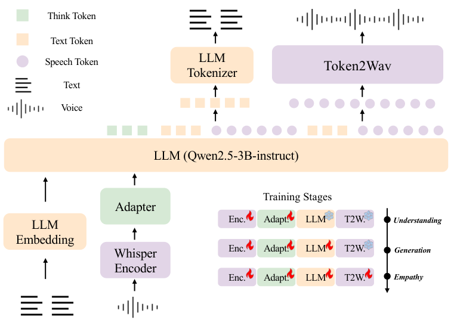

*Figure 2 · [Source](https://arxiv.org/abs/2508.09600)*

Details

**Input → output:** T, S → T, S · **Interaction:** generation

Capabilities refer to the linked checkpoint; consult its model card for task prompts and deployment requirements.

**Variants:** OSUM-EChat.

### PersonaPlex

Holds full-duplex conversations with a role set by text and a voice set by an audio prompt.

**Architecture:** Moshi-based speech model conditioned on role and voice prompts.

[Paper](https://arxiv.org/abs/2602.06053) · [Code](https://github.com/NVIDIA/personaplex) · [Weights](https://huggingface.co/nvidia/personaplex-7b-v1)

**Custom / restricted:** code [MIT](https://github.com/NVIDIA/personaplex/blob/main/LICENSE-MIT) · weights [NVIDIA Open Model License](https://huggingface.co/nvidia/personaplex-7b-v1/blob/fdaf4090a61cb315c138a1faee287ffd6c716309/README.md) — Custom NVIDIA weight terms; access requires accepting the model agreement.

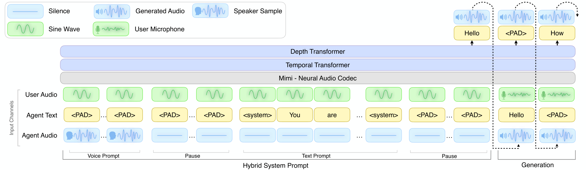

*Figure 1 · [Source](https://arxiv.org/abs/2602.06053)*

Details

**Input → output:** T, S → T, S · **Interaction:** full-duplex

Capabilities refer to the linked checkpoint; consult its model card for task prompts and deployment requirements.

**Variants:** personaplex-7b-v1.

### SLAM-Omni

Conducts multi-turn voice conversations while allowing the output speaker's timbre to be changed.

**Architecture:** Grouped semantic speech tokens with speaker-conditioned vocoding.

[Paper](https://arxiv.org/abs/2412.15649) · [Code](https://github.com/X-LANCE/SLAM-LLM) · [Weights](https://huggingface.co/xcczach/SLAM-Omni)

**Open license:** code [MIT](https://github.com/X-LANCE/SLAM-LLM/blob/main/LICENSE) · weights [MIT](https://huggingface.co/xcczach/SLAM-Omni/blob/1b9e53858d45b340d41d23f538790c2095e286fb/README.md)

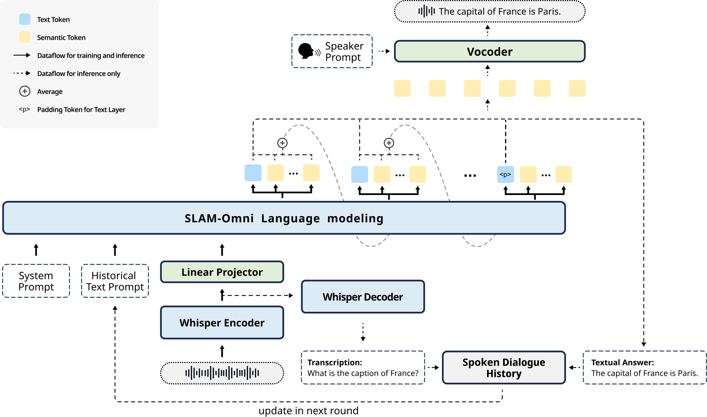

*Figure 2 · [Source](https://arxiv.org/abs/2412.15649)*

Details

**Input → output:** T, S → T, S · **Interaction:** generation

Capabilities refer to the linked checkpoint; consult its model card for task prompts and deployment requirements.

**Variants:** SLAM-Omni.

### SpeechGPT

Follows spoken instructions and generates speech using discrete speech units in a language model.

**Architecture:** Cross-modal instruction tuning of a Llama backbone.

[Paper](https://arxiv.org/abs/2305.11000) · [Code](https://github.com/0nutation/SpeechGPT) · [Weights](https://huggingface.co/OpenMOSS-Team/SpeechGPT-7B-cm)

**License unclear:** code [Apache-2.0](https://github.com/0nutation/SpeechGPT/blob/main/LICENSE) · weights [Not stated](https://huggingface.co/OpenMOSS-Team/SpeechGPT-7B-cm/blob/f6d3fc9cfd604e530c59905d1047463083b66cdc/README.md) — The repository licenses code, but a release-specific weight license was not located.

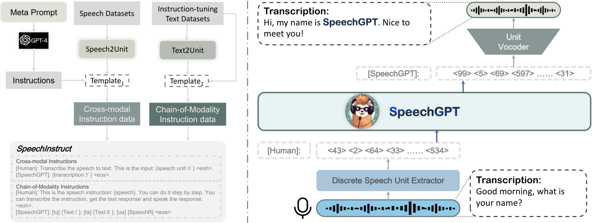

*Figure 2 · [Source](https://arxiv.org/abs/2305.11000)*

Details

**Input → output:** T, S → T, S · **Interaction:** generation

Capabilities refer to the linked checkpoint; consult its model card for task prompts and deployment requirements.

**Variants:** SpeechGPT-7B-cm.

### SpeechGPT 2.0 Preview

Understands spoken requests and produces natural spoken responses through a speech-native language model.

**Architecture:** Language modeling with a dedicated semantic-acoustic speech codec.

[Code](https://github.com/OpenMOSS/SpeechGPT-2.0-preview) · [Weights](https://huggingface.co/OpenMOSS-Team/SpeechGPT-2.0-preview-7B)

**License unclear:** code [Apache-2.0](https://github.com/OpenMOSS/SpeechGPT-2.0-preview/blob/main/LICENSE) · weights [Not stated](https://huggingface.co/OpenMOSS-Team/SpeechGPT-2.0-preview-7B/blob/bced655764e7aac2a9cbc15f93d392de46cd6af9/README.md) — The repository licenses code, but a release-specific weight license was not located.

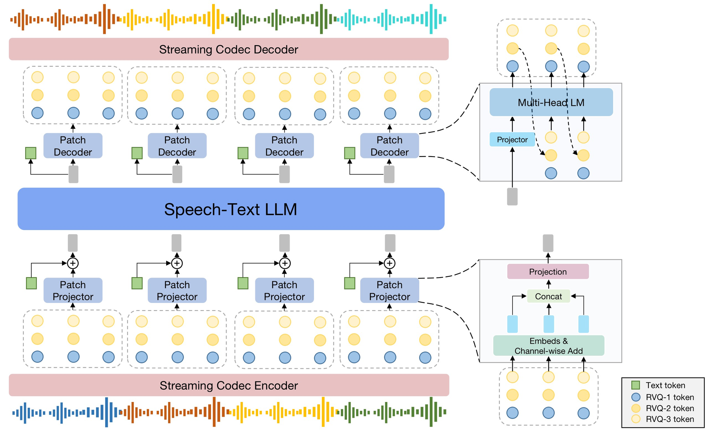

*Official architecture diagram · [Source](https://github.com/OpenMOSS/SpeechGPT-2.0-preview)*

Details

**Input → output:** T, S → T, S · **Interaction:** generation

Capabilities refer to the linked checkpoint; consult its model card for task prompts and deployment requirements.

**Variants:** SpeechGPT-2.0-preview-7B.

### Step-Audio

Supports voice conversations with expressive speech, role-play and spoken tool requests.

**Architecture:** Joint speech-text language modeling with audio tokenization.

[Paper](https://arxiv.org/abs/2502.11946) · [Code](https://github.com/stepfun-ai/Step-Audio) · [Weights](https://huggingface.co/stepfun-ai/Step-Audio-Chat)

**Open license:** code [Apache-2.0](https://github.com/stepfun-ai/Step-Audio/blob/main/LICENSE) · weights [Apache-2.0](https://huggingface.co/stepfun-ai/Step-Audio-Chat/blob/e0335e2510b20d8b10e0ac1e07b159ef86681f14/README.md)

*Figure 2 · [Source](https://arxiv.org/abs/2502.11946)*

Details

**Input → output:** T, A → T, S · **Interaction:** generation

Capabilities refer to the linked checkpoint; consult its model card for task prompts and deployment requirements.

**Variants:** Step-Audio-Chat.

### Step-Audio 2 Mini

Understands audio and produces expressive spoken replies, with support for tool-assisted conversations.

**Architecture:** Latent audio encoder and interleaved text-speech decoder.

[Paper](https://arxiv.org/abs/2507.16632) · [Code](https://github.com/stepfun-ai/Step-Audio2) · [Weights](https://huggingface.co/stepfun-ai/Step-Audio-2-mini)

**Open license:** code [Apache-2.0](https://github.com/stepfun-ai/Step-Audio2/blob/main/LICENSE) · weights [Apache-2.0](https://huggingface.co/stepfun-ai/Step-Audio-2-mini/blob/e36fdd5d71e0ea22f09dd94bbab9bfc544ca1e36/README.md)

*Figure 3 · [Source](https://arxiv.org/abs/2507.16632)*

Details

**Input → output:** T, A → T, S · **Interaction:** generation

Capabilities refer to the linked checkpoint; consult its model card for task prompts and deployment requirements.

**Variants:** Step-Audio-2-mini.

### Step-Audio-AQAA

Produces expressive spoken answers directly from audio questions.

**Architecture:** End-to-end interleaved text and audio token generation.

[Paper](https://arxiv.org/abs/2506.08967) · [Code](https://github.com/stepfun-ai/Step-Audio) · [Weights](https://huggingface.co/stepfun-ai/Step-Audio-AQAA)

**Open license:** code [Apache-2.0](https://github.com/stepfun-ai/Step-Audio/blob/main/LICENSE) · weights [Apache-2.0](https://huggingface.co/stepfun-ai/Step-Audio-AQAA/blob/34a727e86410053580e40f3c5ffab4fd36a46dd6/README.md)

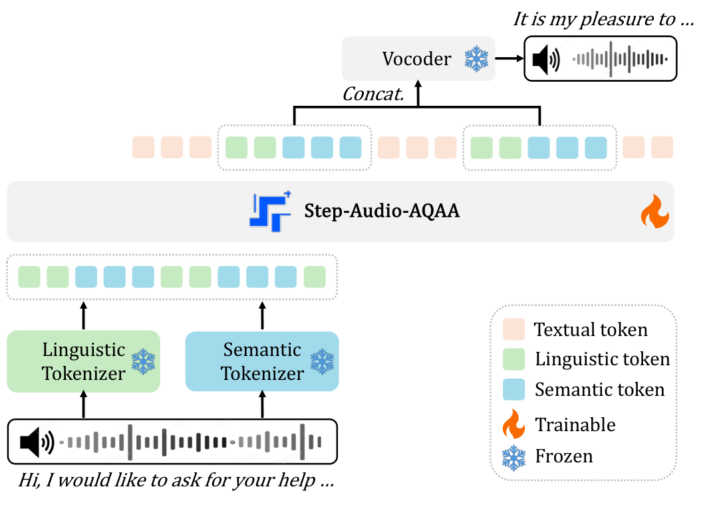

*Figure 1 · [Source](https://arxiv.org/abs/2506.08967)*

Details

**Input → output:** T, A → T, S · **Interaction:** generation

Capabilities refer to the linked checkpoint; consult its model card for task prompts and deployment requirements.

**Variants:** Step-Audio-AQAA.

### Step-Audio-R1.1

Extends audio reasoning into responsive spoken dialogue and voice interaction.

**Architecture:** Dual-brain reasoning and speech articulation with acoustic-grounded reasoning.

[Paper](https://arxiv.org/abs/2510.09592) · [Code](https://github.com/stepfun-ai/Step-Audio-R1) · [Weights](https://huggingface.co/stepfun-ai/Step-Audio-R1.1)

**Open license:** code [Apache-2.0](https://github.com/stepfun-ai/Step-Audio-R1/blob/main/LICENSE) · weights [Apache-2.0](https://huggingface.co/stepfun-ai/Step-Audio-R1.1/blob/8abb296c09123345b09de57dbc2830b6a12134b1/README.md)

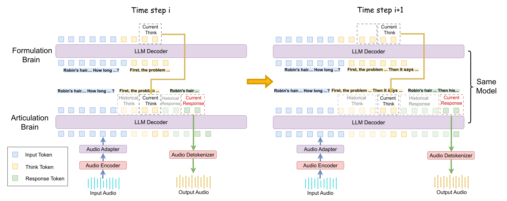

*Related method — Mind-Paced Speaking, Figure 3 · [Source](https://arxiv.org/abs/2510.09592)*

Details

**Input → output:** T, A → T, S · **Interaction:** streaming

The model card connects the Realtime variant to the Mind-Paced Speaking method shown in the figure; the published serving recipe should be consulted for the supported output mode.

**Variants:** Step-Audio-R1.1.

### Sympatheia

Adjusts spoken replies to a speaker's changing emotional state.

**Architecture:** Continuous affect conditioning of a GLM-4-Voice backbone.

[Paper](https://arxiv.org/abs/2606.00851) · [Code](https://github.com/susameddin/sympatheia) · [Weights](https://huggingface.co/susameddin/Sympatheia)

**License unclear:** code [Not stated](https://github.com/susameddin/sympatheia/blob/master/README.md) · weights [Apache-2.0 + GLM-4 terms](https://huggingface.co/susameddin/Sympatheia/blob/6fbd7205be95147cd5dec4463500ffee4e2e428d/README.md) — GLM-4-Voice base-model conditions also apply; repository code licensing is not stated.

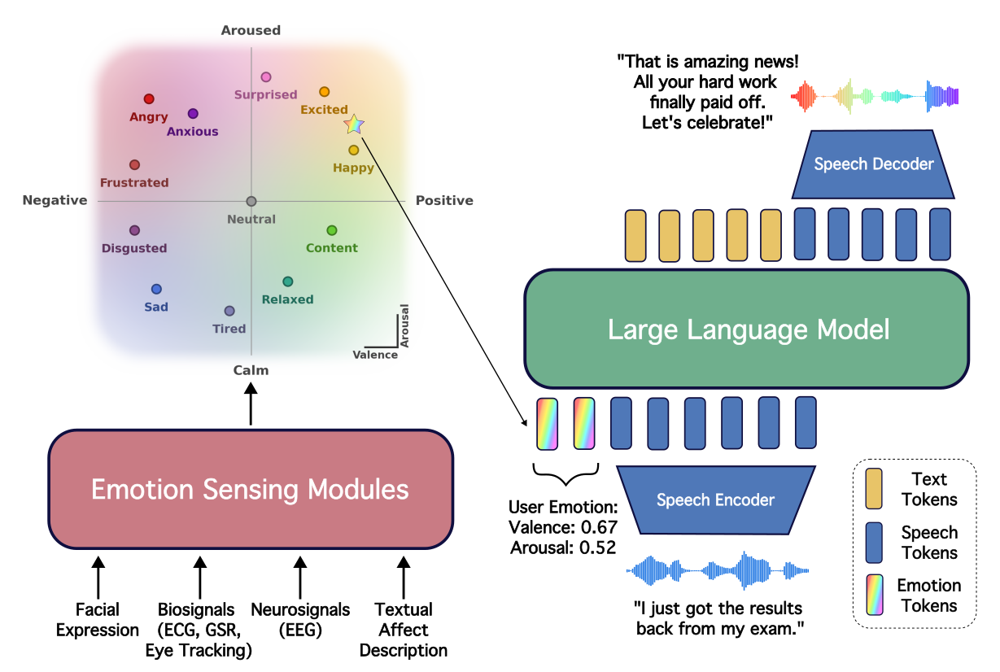

*Figure 3 · [Source](https://arxiv.org/abs/2606.00851)*

Details

**Input → output:** T, S → T, S · **Interaction:** generation

Capabilities refer to the linked checkpoint; consult its model card for task prompts and deployment requirements.

**Variants:** Sympatheia.

### TurnGuide

Maintains coherent spoken conversations while managing overlaps and turn changes.

**Architecture:** Dynamic turn-level text-speech interleaving.

[Paper](https://arxiv.org/abs/2508.07375) · [Code](https://github.com/dreamtheater123/TurnGuide) · [Weights](https://huggingface.co/qqjz/turnguide_loss_2_1)

**License unclear:** code [Apache-2.0](https://github.com/dreamtheater123/TurnGuide/blob/main/LICENSE) · weights [Not stated](https://huggingface.co/qqjz/turnguide_loss_2_1/blob/37b5b8517353513e9e36935fdc4f7a156c1e87ca/README.md) — No release-specific weight license is stated; the GLM-4-Voice base has custom terms.

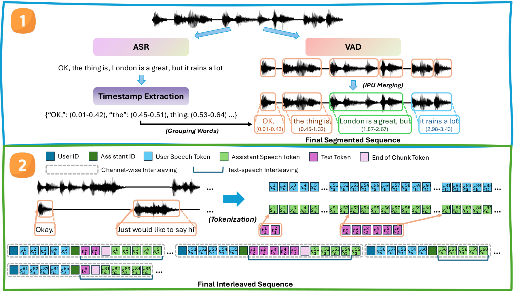

*Figure 2 · [Source](https://arxiv.org/abs/2508.07375)*

Details

**Input → output:** T, S → T, S · **Interaction:** full-duplex

Capabilities refer to the linked checkpoint; consult its model card for task prompts and deployment requirements.

**Variants:** turnguide_loss_2_1.

### VITA-Audio

Streams spoken responses quickly by generating multiple audio tokens per language-model step.

**Architecture:** Lightweight multiple cross-modal token prediction modules.

[Paper](https://arxiv.org/abs/2505.03739) · [Code](https://github.com/VITA-MLLM/VITA-Audio) · [Weights](https://huggingface.co/VITA-MLLM/VITA-Audio-Boost)

**Custom / restricted:** code [Tencent research license](https://github.com/VITA-MLLM/VITA-Audio/blob/main/LICENSE) · weights [Tencent research license](https://github.com/VITA-MLLM/VITA-Audio/blob/main/LICENSE) — Academic/research use only; commercial and production use are excluded.

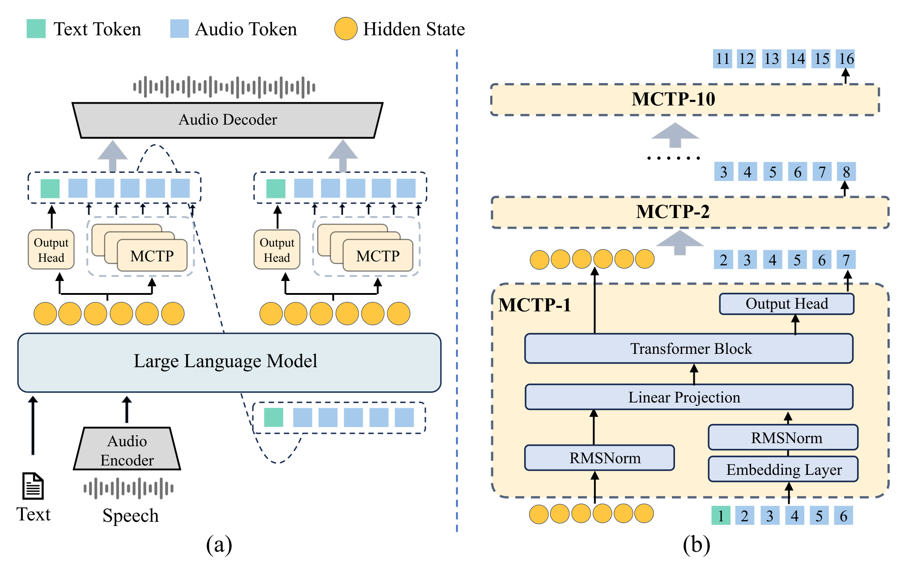

*Figure 2 · [Source](https://arxiv.org/abs/2505.03739)*

Details

**Input → output:** T, S → T, S · **Interaction:** streaming

Capabilities refer to the linked checkpoint; consult its model card for task prompts and deployment requirements.

**Variants:** VITA-Audio-Boost.

### VITA-Audio Plus

Provides the later VITA-Audio release with accelerated interleaved speech and text generation.

**Architecture:** Extended multiple cross-modal token prediction architecture.

[Paper](https://arxiv.org/abs/2505.03739) · [Code](https://github.com/VITA-MLLM/VITA-Audio) · [Weights](https://huggingface.co/VITA-MLLM/VITA-Audio-Plus-Boost)

**Custom / restricted:** code [Tencent research license](https://github.com/VITA-MLLM/VITA-Audio/blob/main/LICENSE) · weights [Tencent research license](https://github.com/VITA-MLLM/VITA-Audio/blob/main/LICENSE) — Academic/research use only; commercial and production use are excluded.

*Family figure — Figure 2 · [Source](https://arxiv.org/abs/2505.03739)*

Details

**Input → output:** T, S → T, S · **Interaction:** streaming

Capabilities refer to the linked checkpoint; consult its model card for task prompts and deployment requirements. The image illustrates the shared model family; checkpoint-specific changes are described in the model card.

**Variants:** VITA-Audio-Plus-Boost.

### Voila Autonomous

Supports autonomous voice interaction with simultaneous listening and speaking.

**Architecture:** Full-duplex extension of the hierarchical Voila model.

[Paper](https://arxiv.org/abs/2505.02707) · [Code](https://github.com/maitrix-org/Voila) · [Weights](https://huggingface.co/maitrix-org/Voila-autonomous-preview)

**Open license:** code [MIT](https://github.com/maitrix-org/Voila/blob/main/LICENSE) · weights [MIT](https://huggingface.co/maitrix-org/Voila-autonomous-preview/blob/be9ffe8da05094a17178a11ba19332c463e29406/README.md)

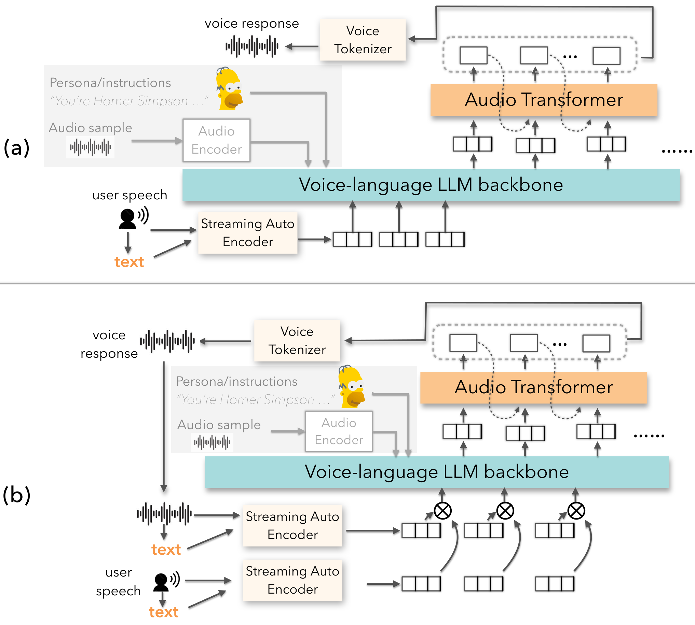

*Family figure — Figure 2 · [Source](https://arxiv.org/abs/2505.02707)*

Details

**Input → output:** T, S → T, S · **Interaction:** full-duplex

Capabilities refer to the linked checkpoint; consult its model card for task prompts and deployment requirements. The image illustrates the shared model family; checkpoint-specific changes are described in the model card.

**Variants:** Voila-autonomous-preview.

### Voila Chat

Holds voice conversations with speaker identity and speaking style controlled by prompts.

**Architecture:** Hierarchical voice-language backbone and acoustic Transformer.

[Paper](https://arxiv.org/abs/2505.02707) · [Code](https://github.com/maitrix-org/Voila) · [Weights](https://huggingface.co/maitrix-org/Voila-chat)

**Open license:** code [MIT](https://github.com/maitrix-org/Voila/blob/main/LICENSE) · weights [MIT](https://huggingface.co/maitrix-org/Voila-chat/blob/ad4ee33219a02808841b575cbdbd439e0100848c/README.md)

*Figure 2 · [Source](https://arxiv.org/abs/2505.02707)*

Details

**Input → output:** T, S → T, S · **Interaction:** generation

Capabilities refer to the linked checkpoint; consult its model card for task prompts and deployment requirements.

**Variants:** Voila-chat.

### VoxMind

Handles spoken requests that require reasoning, planning and external tool use.

**Architecture:** Think-before-speak dialogue model with dynamic tool management.

[Paper](https://arxiv.org/abs/2604.15710) · [Code](https://github.com/MM-Speech/VoxMind) · [Weights](https://huggingface.co/leungtianle/VoxMind)

**License unclear:** code [Not stated](https://github.com/MM-Speech/VoxMind/blob/main/README.md) · weights [Not stated](https://huggingface.co/leungtianle/VoxMind/blob/0d5d1df306ff78da40058f5aee2c74a4a33dda20/README.md) — Public code and weights were located, but a complete release license was not stated.

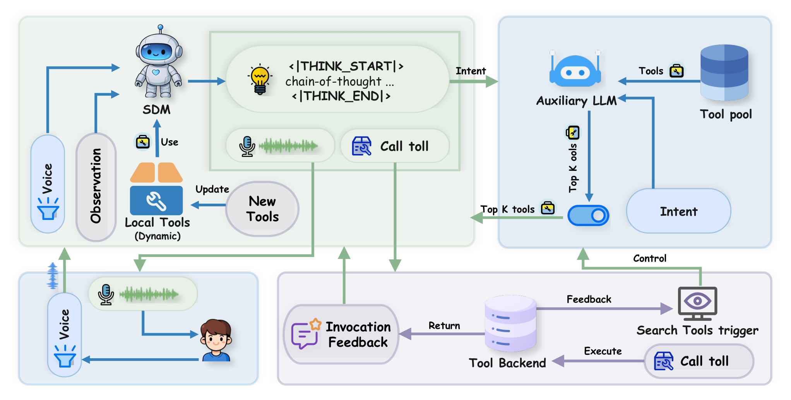

*Figure 2 · [Source](https://arxiv.org/abs/2604.15710)*

Details

**Input → output:** T, S → T, S · **Interaction:** generation

Capabilities refer to the linked checkpoint; consult its model card for task prompts and deployment requirements.

**Variants:** VoxMind.

